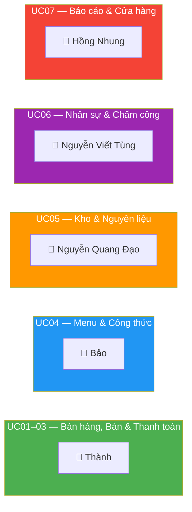
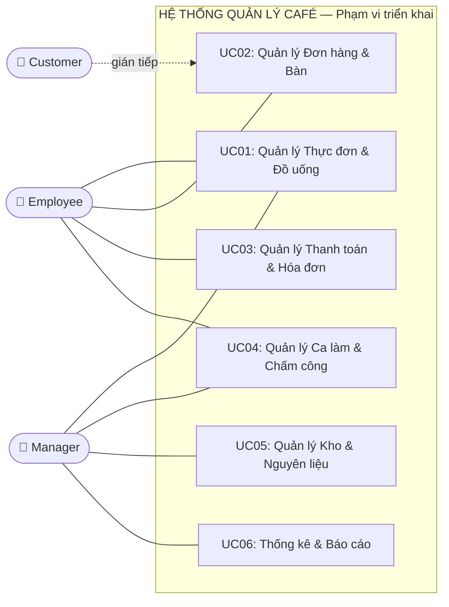
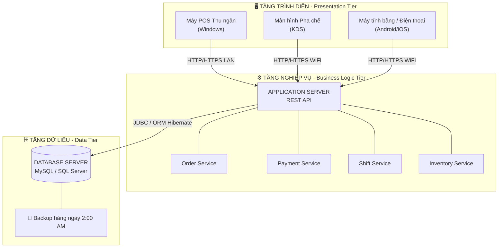
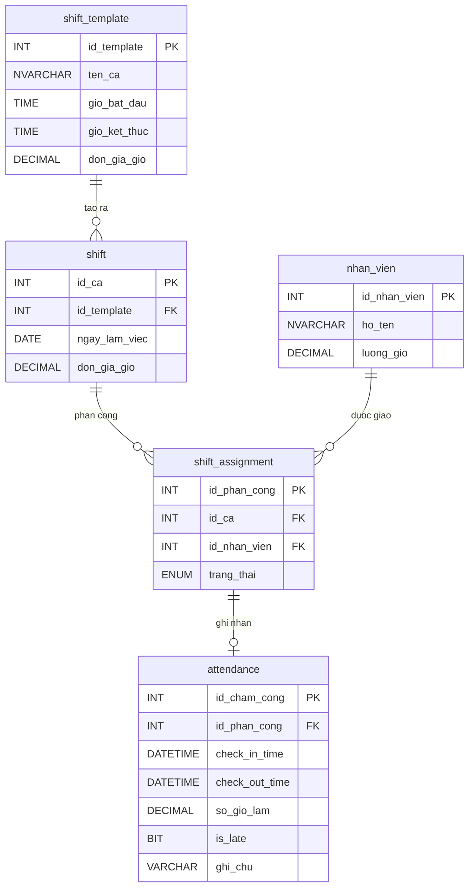
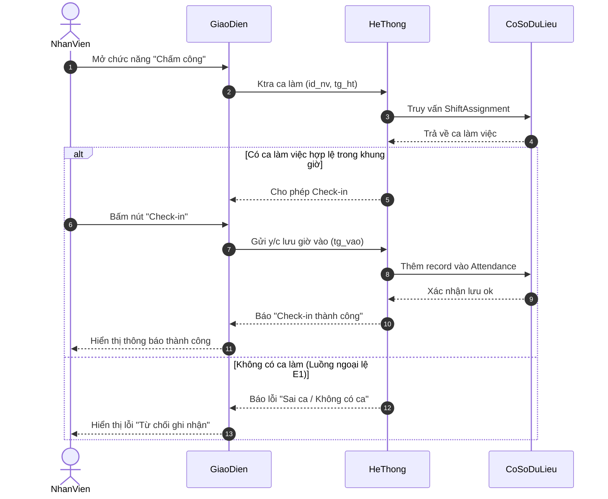
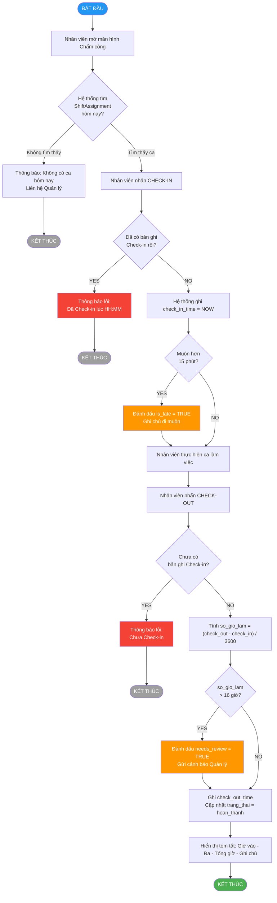
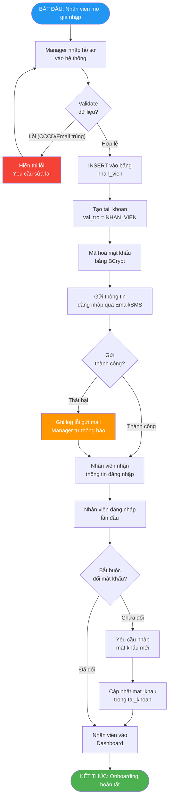
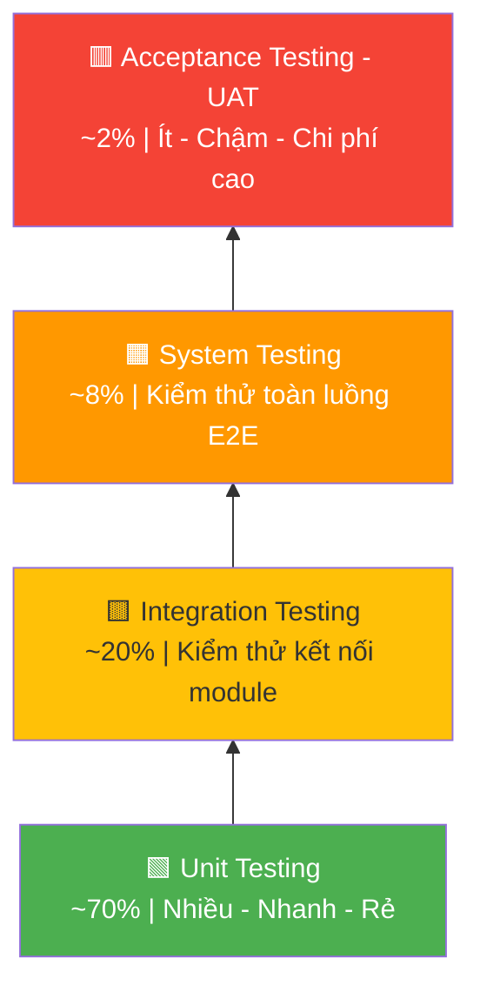

# TIỂU LUẬN: KHẢO SÁT, PHÂN TÍCH VÀ THIẾT KẾ HỆ THỐNG QUẢN LÝ QUÁN CAFÉ

**Môn học:** Nhập môn Công nghệ phần mềm  
**Phạm vi nghiên cứu chuyên sâu:** Quản lý Ca làm việc và Chấm công (UC04)  
**Thành viên phụ trách UC04:** Nguyễn Viết Tùng  
**Chiến lược báo cáo:** T-shaped — Bao quát toàn hệ thống, đào sâu UC04

---

## LỜI MỞ ĐẦU

Trong bối cảnh chuyển đổi số ngày càng diễn ra mạnh mẽ, việc ứng dụng công nghệ thông tin vào quản lý nghiệp vụ không chỉ là một xu hướng tất yếu mà còn là yếu tố sống còn đối với các doanh nghiệp, đặc biệt là trong lĩnh vực dịch vụ ăn uống (F&B). Quản lý một quán café đòi hỏi sự phối hợp nhịp nhàng giữa nhiều bộ phận: từ khâu tiếp nhận đơn hàng, pha chế, thanh toán cho đến quản trị nhân sự và kiểm soát kho bãi. Dựa trên nền tảng kiến thức của học phần "Nhập môn Công nghệ phần mềm", bài tiểu luận này trình bày toàn bộ quy trình vòng đời phát triển phần mềm (SDLC) nhằm xây dựng một Hệ thống Quản lý Quán Café toàn diện. Nghiên cứu không chỉ dừng lại ở việc đặc tả yêu cầu mà còn đi sâu vào phân tích, thiết kế kiến trúc và đề xuất các biện pháp đảm bảo chất lượng phần mềm, với trọng tâm phân tích sâu ca sử dụng (Use Case) Quản lý ca làm việc và chấm công.


---

## MỞ ĐẦU: KẾ HOẠCH QUẢN LÝ DỰ ÁN (SPMP TÓM TẮT)

### 0.3. Phân Bổ Nhiệm Vụ Nhóm

Nhằm đảm bảo tiến độ và chất lượng, nhóm thực hiện phân chia trách nhiệm theo nguyên tắc **phân công theo phân hệ (module-based assignment)** — mỗi thành viên chịu trách nhiệm toàn diện (từ đặc tả đến thiết kế, cài đặt và kiểm thử) một phân hệ Use Case tương ứng:

| **Thành viên**       | **Phân hệ phụ trách**                                          | **Các bảng CSDL liên quan**                                                           | **Use Case** |
| -------------------- | -------------------------------------------------------------- | ------------------------------------------------------------------------------------- | ------------ |
| **Thành**            | Bán hàng, Đơn hàng, Thanh toán & Hóa đơn, Quản lý bàn phục vụ | `hoa_don`, `hoa_don_chi_tiet`, `ban`, `khu_vuc`, `order_item_topping`                 | UC01, UC02, UC03 |
| **Bảo**              | Quản lý menu (sản phẩm) và công thức pha chế                   | `do_uong`, `nhom_do_uong`, `topping`, `cong_thuc`, `nguyen_lieu`                      | UC04         |
| **Nguyễn Quang Đạo** | Quản lý nguyên liệu và tồn kho                                 | `nguyen_lieu`, `nhap_kho`, `cong_thuc`, `canh_bao_kho`                                | UC05         |
| **Nguyễn Viết Tùng** | Quản lý nhân viên, ca làm việc và chấm công                    | `nhan_vien`, `tai_khoan`, `shift_template`, `shift`, `shift_assignment`, `attendance` | UC06         |
| **Hồng Nhung**       | Báo cáo doanh thu / chi phí và quản lý danh sách cửa hàng     | `bao_cao_doanh_thu`, `chi_phi`, `danh_sach_cua_hang`, `hoa_don`                       | UC07         |

> **Lưu ý:** Mỗi phân hệ UC liên quan đến **3–4 bảng dữ liệu**, do đó mức độ phức tạp kỹ thuật của từng phần là tương đương nhau. Việc phân công theo phân hệ giúp tránh xung đột mã nguồn (code conflict) khi làm việc song song trên hệ thống quản lý phiên bản (Git).

**Sơ đồ tổng quan phân công:**



---

---

## CHƯƠNG 1: TỔNG QUAN HỆ THỐNG VÀ PHÂN CÔNG NHÓM

> **Mục tiêu chương:** Trình bày bức tranh toàn cảnh của hệ thống — 5 phân hệ Use Case, kiến trúc tổng thể và phân công nhóm. Phần này chiếm ~10% báo cáo.

### 1.1. Bối cảnh và Tầm nhìn Dự án

### 0.1. Mục đích, Phạm vi và Tầm nhìn Chiến lược

Dự án hướng tới xây dựng một nền tảng quản lý chuỗi café ứng dụng công nghệ **điện toán đám mây (Cloud-native)** và **Trí tuệ nhân tạo (AI)**. Hệ thống không chỉ giải quyết bài toán vận hành cơ bản (POS, thu ngân, kho bãi) mà còn tối ưu hóa nguồn lực nhân sự thông qua phân hệ quản trị ca làm việc thông minh. Bộ sản phẩm bao gồm ba nền tảng tích hợp:

| **Nền tảng**               | **Đối tượng**   | **Công nghệ**                     |
| -------------------------- | --------------- | --------------------------------- |
| Ứng dụng Web Dashboard     | Quản lý cấp cao | React / Next.js, Cloud-hosted     |
| Phần mềm POS máy tính bảng | Thu ngân        | Android tablet, giao thức ESC/POS |
| Ứng dụng di động nhân viên | Nhân viên       | Flutter, GPS + FaceID             |


### 1.2. Biểu đồ Use Case Tổng quát — Phạm vi 5 Phân hệ

#### 1.2.2. Biểu đồ Use Case tổng quát (mô tả văn bản)

Biểu đồ Use Case tổng quát thể hiện phạm vi hệ thống (System Boundary) và các tương tác giữa tác nhân với các ca sử dụng:



> **Lưu ý phạm vi:** UC về **Quản lý Tài khoản & Phân quyền** (RBAC) được xác định là tính năng nền tảng, nhưng do giới hạn nhân lực nhóm, phân hệ này **được đưa vào hạng mục Kiến nghị mở rộng** (xem Chương 5) thay vì triển khai trong phiên bản hiện tại. Quyền hạn tối thiểu vẫn được kiểm soát gián tiếp thông qua phân hệ `tai_khoan` trong UC06.

---

### 1.3. Đặc tả Yêu cầu Chức năng (Functional Requirements)

Yêu cầu chức năng được thu thập, phân loại và đánh mã theo chuẩn IEEE 830, đảm bảo tính truy vết (traceability) từ yêu cầu đến thiết kế:

| **Mã YC** | **Phân hệ**  | **Mô tả yêu cầu**                                                                                                                               | **Mức độ ưu tiên** |
| --------- | ------------ | ----------------------------------------------------------------------------------------------------------------------------------------------- | ------------------ |
| FR-01     | Đơn hàng     | Nhân viên có thể tạo mới, sửa đổi và hủy đơn hàng trên bàn đang hoạt động                                                                       | Cao                |
| FR-02     | Đơn hàng     | Hệ thống tự động gửi thông báo cho khu vực pha chế khi có đơn mới                                                                               | Cao                |
| FR-03     | Bàn          | Trạng thái bàn cập nhật theo thời gian thực, không cần làm mới trang                                                                            | Cao                |
| FR-04     | Thanh toán   | Hỗ trợ tối thiểu 3 hình thức thanh toán: tiền mặt, thẻ và QR Pay                                                                                | Trung bình         |
| FR-05     | Thanh toán   | Hóa đơn có thể xuất ra máy in nhiệt theo định dạng chuẩn                                                                                        | Cao                |
| FR-06     | Kho          | Tự động cập nhật tồn kho khi đơn hàng được xác nhận, theo công thức Recipe                                                                      | Cao                |
| FR-07     | Kho          | Cảnh báo khi tồn kho nguyên liệu xuống dưới ngưỡng tối thiểu định trước                                                                         | Trung bình         |
| FR-08     | Nhân sự      | Quản lý tạo và phân công ca làm cho từng nhân viên theo ngày/tuần                                                                               | Cao                |
| FR-09     | Nhân sự      | Nhân viên thực hiện Check-in/Check-out, hệ thống ghi nhận giờ làm thực tế                                                                       | Cao                |

### 1.3. Bảng Tóm tắt Chức năng Toàn Hệ thống

| **UC** | **Phân hệ** | **Chức năng cốt lõi** | **Người phụ trách** | **Mức độ chi tiết trong báo cáo này** |
|--------|-------------|----------------------|---------------------|---------------------------------------|
| UC01 | Thực đơn & Đồ uống | CRUD sản phẩm, nhóm, topping, công thức pha chế | Bảo | Tóm tắt |
| UC02 | Đơn hàng & Bàn | Tạo/sửa đơn, quản lý trạng thái bàn theo thời gian thực | Thành | Tóm tắt |
| UC03 | Thanh toán & Hóa đơn | Xử lý thanh toán đa kênh, in hóa đơn nhiệt | Thành | Tóm tắt |
| UC05 | Kho & Nguyên liệu | Nhập kho, trừ tồn theo công thức, cảnh báo ngưỡng | Nguyễn Quang Đạo | Tóm tắt |
| UC07 | Báo cáo & Cửa hàng | Thống kê doanh thu, top sản phẩm, quản lý chi nhánh | Hồng Nhung | Tóm tắt |
| **UC06** | **Nhân sự & Chấm công** | **Hồ sơ NV, phân ca, GPS check-in/out, tính lương NĐ38** | **Nguyễn Viết Tùng** | **⭐ Phân tích chuyên sâu (Chương 3)** |

### 1.4. Yêu cầu Chức năng và Phi chức năng (Tóm tắt)

### 1.3. Đặc tả Yêu cầu Chức năng (Functional Requirements)

Yêu cầu chức năng được thu thập, phân loại và đánh mã theo chuẩn IEEE 830, đảm bảo tính truy vết (traceability) từ yêu cầu đến thiết kế:

| **Mã YC** | **Phân hệ**  | **Mô tả yêu cầu**                                                                                                                               | **Mức độ ưu tiên** |
| --------- | ------------ | ----------------------------------------------------------------------------------------------------------------------------------------------- | ------------------ |
| FR-01     | Đơn hàng     | Nhân viên có thể tạo mới, sửa đổi và hủy đơn hàng trên bàn đang hoạt động                                                                       | Cao                |
| FR-02     | Đơn hàng     | Hệ thống tự động gửi thông báo cho khu vực pha chế khi có đơn mới                                                                               | Cao                |
| FR-03     | Bàn          | Trạng thái bàn cập nhật theo thời gian thực, không cần làm mới trang                                                                            | Cao                |
| FR-04     | Thanh toán   | Hỗ trợ tối thiểu 3 hình thức thanh toán: tiền mặt, thẻ và QR Pay                                                                                | Trung bình         |
| FR-05     | Thanh toán   | Hóa đơn có thể xuất ra máy in nhiệt theo định dạng chuẩn                                                                                        | Cao                |
| FR-06     | Kho          | Tự động cập nhật tồn kho khi đơn hàng được xác nhận, theo công thức Recipe                                                                      | Cao                |
| FR-07     | Kho          | Cảnh báo khi tồn kho nguyên liệu xuống dưới ngưỡng tối thiểu định trước                                                                         | Trung bình         |
| FR-08     | Nhân sự      | Quản lý tạo và phân công ca làm cho từng nhân viên theo ngày/tuần                                                                               | Cao                |
| FR-09     | Nhân sự      | Nhân viên thực hiện Check-in/Check-out, hệ thống ghi nhận giờ làm thực tế                                                                       | Cao                |
| FR-10     | Nhân sự      | Hệ thống tính lương đa biến theo Nghị định 38/2022/NĐ-CP: giờ hành chính, tăng ca (hệ số 1.5/2.0/3.0), ca đêm (hệ số +30%), phụ cấp và khấu trừ | Cao                |
| FR-11     | Báo cáo      | Tổng hợp và trực quan hóa doanh thu theo ngày, tuần, tháng                                                                                      | Trung bình         |
| FR-12     | Báo cáo      | Thống kê top 10 mặt hàng bán chạy nhất trong kỳ được chọn                                                                                       | Thấp               |
| FR-13     | AI — Kho     | Module AI dự báo nhu cầu nguyên liệu dựa trên lịch sử bán hàng và yếu tố thời tiết, tự động tạo đề xuất phiếu nhập                              | **Kiến nghị**      |
| FR-14     | AI — Nhân sự | Module AI tự động đề xuất lịch phân ca dựa trên dự báo lưu lượng khách hàng theo ngày/giờ                                                       | **Kiến nghị**      |
| FR-15     | Chấm công    | Ứng dụng di động hỗ trợ chấm công bằng Geofencing (GPS) kết hợp xác thực khuôn mặt/selfie, ngăn chặn chấm công hộ                               | Cao                |
| FR-16     | Khách hàng   | Hệ thống quản lý khách hàng thân thiết; AI phân cụm hành vi để cá nhân hóa khuyến mãi và gợi ý up-selling                                       | **Kiến nghị**      |

---

### 1.4. Đặc tả Yêu cầu Phi chức năng (Non-functional Requirements)

Yêu cầu phi chức năng là các ràng buộc chất lượng hệ thống, không trực tiếp mô tả hành vi mà quy định **cách** hệ thống thực hiện. Chúng được phân tích theo mô hình chất lượng ISO/IEC 25010:

| **Thuộc tính**                         | **Yêu cầu cụ thể**                                                                                                      | **Cách đo lường**                                                       |
| -------------------------------------- | ----------------------------------------------------------------------------------------------------------------------- | ----------------------------------------------------------------------- |
| **Hiệu năng (Performance)**            | Thời gian phản hồi mọi thao tác nghiệp vụ < 3 giây trong điều kiện mạng LAN bình thường                                 | Đo bằng công cụ profiling khi tải 20 người dùng đồng thời               |
| **Tính sẵn sàng (Availability)**       | Hệ thống hoạt động 24/7; RTO (Recovery Time Objective) < 30 phút khi có sự cố                                           | Theo dõi uptime log; kịch bản drill phục hồi dữ liệu                    |
| **Bảo mật (Security)**                 | Phân quyền RBAC nghiêm ngặt; mật khẩu được băm (hashed) bằng BCrypt; nhật ký thao tác (Audit Log) lưu tối thiểu 90 ngày | Kiểm tra thâm nhập (Penetration Test) mức cơ bản                        |
| **Tính khả dụng (Usability)**          | Nhân viên mới (không có kỹ năng CNTT) có thể thành thạo các chức năng cơ bản sau ≤ 2 giờ đào tạo                        | Kiểm thử người dùng (User Testing) với mẫu 5 nhân viên mới              |
| **Tính tương thích (Compatibility)**   | Chạy ổn định trên Windows 7 SP1 trở lên; tương thích với máy in nhiệt chuẩn ESC/POS                                     | Kiểm thử trên 3 cấu hình phần cứng POS phổ biến tại thị trường Việt Nam |
| **Khả năng bảo trì (Maintainability)** | Mã nguồn đạt độ bao phủ kiểm thử (Code Coverage) ≥ 70%; tài liệu hóa đầy đủ tại mọi module                              | Đo bằng JaCoCo hoặc công cụ tương đương                                 |

---

### 1.5. Phân tích rủi ro dự án (Preliminary Risk Analysis)

Nhằm chủ động kiểm soát các nguy cơ có thể ảnh hưởng đến tiến độ và chất lượng, nhóm thực hiện một phân tích rủi ro sơ bộ theo ma trận Xác suất × Tác động:

| **Rủi ro**                                | **Xác suất** | **Tác động** | **Biện pháp giảm thiểu**                                                              |
| ----------------------------------------- | ------------ | ------------ | ------------------------------------------------------------------------------------- |
| Yêu cầu thay đổi giữa chừng (Scope Creep) | Cao          | Cao          | Sử dụng Use Case Specification làm tài liệu ký kết; áp dụng Change Management Process |
| Thiếu dữ liệu thực tế để kiểm thử         | Trung bình   | Trung bình   | Sinh dữ liệu mẫu (Seed Data) mô phỏng hoạt động thực tế                               |
| Thành viên nhóm vắng giữa sprint          | Thấp         | Cao          | Phân công chéo nghiệp vụ; tài liệu hóa handover                                       |
| Lỗi tích hợp phần cứng POS                | Trung bình   | Cao          | Kiểm thử thiết bị từ sớm; chuẩn bị driver dự phòng                                    |

---

---

## CHƯƠNG 2: THIẾT KẾ KIẾN TRÚC VÀ CƠ SỞ DỮ LIỆU

> **Mục tiêu chương:** Trình bày kiến trúc triển khai 3 tầng và ERD tập trung vào nhóm bảng UC04 (Nhân sự). Chiếm ~15% báo cáo.

### 2.1. Kiến trúc Triển khai 3 Tầng (Three-Tier Architecture)

### 2.3. Kiến trúc Triển khai (Deployment Architecture)

#### 2.3.1. Tổng quan kiến trúc phân lớp (N-Tier Architecture)

Hệ thống áp dụng kiến trúc **3 lớp (Three-Tier Architecture)** nhằm tách biệt hoàn toàn ba mối quan tâm: Hiển thị, Xử lý nghiệp vụ và Lưu trữ dữ liệu. Điều này tăng cường khả năng bảo trì và mở rộng (Maintainability & Scalability):



#### 2.3.2. Lý do lựa chọn kiến trúc và các đánh đổi (Trade-offs)

| **Quyết định kiến trúc**                | **Lý do lựa chọn**                                               | **Đánh đổi chấp nhận**                             |
| --------------------------------------- | ---------------------------------------------------------------- | -------------------------------------------------- |
| REST API thay vì kết nối CSDL trực tiếp | Bảo mật cao hơn; tách biệt logic; dễ thay đổi CSDL phía sau      | Thêm một tầng mạng, tăng độ trễ nhỏ                |
| MySQL/SQL Server thay vì NoSQL          | Tính toàn vẹn ACID quan trọng với nghiệp vụ tài chính và kho     | Kém linh hoạt hơn với schema thay đổi thường xuyên |
| Triển khai LAN nội bộ (On-premise)      | Chi phí thấp; không phụ thuộc internet; bảo mật dữ liệu nội bộ   | Không truy cập từ xa nếu không có VPN              |
| Windows Client (Desktop App)            | Tương thích tốt với thiết bị POS phổ biến; driver máy in ổn định | Khó triển khai multi-platform (iOS, Android)       |

#### 2.3.3. Chiến lược bảo mật tầng triển khai

- **Mạng nội bộ:** Tất cả Client nodes giao tiếp trong mạng LAN được cô lập khỏi internet công cộng.
- **TLS/HTTPS:** Mọi giao tiếp giữa Client và API Server đều được mã hóa bằng TLS 1.2+.
- **Database Firewall:** Chỉ Application Server mới có quyền kết nối vào Database Server, Client không bao giờ truy cập CSDL trực tiếp.
- **Audit Log:** Mọi thao tác tạo/sửa/xóa dữ liệu đều được ghi vào bảng `audit_log` với timestamp và mã nhân viên.

---

### 2.2. Tổng quan Lược đồ CSDL — Nhóm Bảng Toàn Hệ thống

Hệ thống gồm **5 nhóm bảng** tương ứng với 5 phân hệ UC, đều chuẩn hóa 3NF:

| **Nhóm bảng** | **Bảng chính** | **UC sử dụng** |
|---|---|---|
| Thực đơn | `do_uong`, `nhom_do_uong`, `topping`, `cong_thuc` | UC01 |
| Giao dịch | `hoa_don`, `hoa_don_chi_tiet`, `ban`, `khu_vuc` | UC02, UC03 |
| Kho | `nguyen_lieu`, `nhap_kho`, `canh_bao_kho` | UC05 |
| Báo cáo | `bao_cao_doanh_thu`, `chi_phi`, `danh_sach_cua_hang` | UC07 |
| **Nhân sự** *(trọng tâm)* | **`nhan_vien`, `tai_khoan`, `shift_template`, `shift`, `shift_assignment`, `attendance`** | **UC06** |

> **Snapshot nguyên tắc:** Trường `luong_gio_tai_thoi_diem` trong bảng `bang_luong_chi_tiet` được lưu cứng tại kỳ tính lương — đảm bảo lịch sử tài chính không bị ảnh hưởng khi mức lương thay đổi.

### 2.3. ERD Chi tiết — Nhóm Bảng Nhân sự (UC06)

Nguyên tắc thiết kế cốt lõi của UC04 là **tách biệt hoàn toàn** dữ liệu kế hoạch (Planning) khỏi dữ liệu thực tế (Actual), tương tự mô hình Planning vs. Actuals phổ biến trong kế toán quản trị:



> **Ghi chú thiết kế:** 2 nhóm bảng trên tách biệt hoàn toàn **Kế hoạch** (shift_template, shift, shift_assignment) khỏi **Thực tế** (attendance), giúp dễ đối soát và kiểm toán.

#### 4.3.2. Các Quy tắc Nghiệp vụ (Business Rules) cho UC04

| **Mã BR** | **Quy tắc**                                                          | **Cơ chế kiểm soát**                                                    |
| --------- | -------------------------------------------------------------------- | ----------------------------------------------------------------------- |
| BR-01     | Một nhân viên không thể có 2 ca chồng chéo thời gian trong cùng ngày | Trigger kiểm tra overlap khi INSERT vào `shift_assignment`              |
| BR-02     | Chỉ có thể Check-out sau khi đã Check-in                             | `check_out_time` chỉ được UPDATE khi `check_in_time IS NOT NULL`        |
| BR-03     | `so_gio_lam` không được tính nếu `check_out_time IS NULL`            | Dùng `CASE WHEN` trong câu truy vấn tính lương                          |
| BR-04     | Giờ làm tối đa 16 giờ/ca; nếu vượt → đánh dấu cần xem xét thủ công   | Constraint: `CHECK(so_gio_lam <= 16)` hoặc cờ `needs_review = 1`        |
| BR-05     | Ca cuối tuần (Thứ 7, Chủ nhật) được nhân hệ số 1.5                   | Hàm tính lương kiểm tra `DAYOFWEEK(ngay_lam_viec)` trước khi áp đơn giá |


---

## CHƯƠNG 3: NGHIÊN CỨU CHUYÊN SÂU — UC06: QUẢN LÝ NHÂN SỰ, PHÂN QUYỀN & CHẤM CÔNG

> **Trái tim của báo cáo — Chiếm ~50%.** Chương này trình bày toàn bộ phân tích nghiệp vụ, thiết kế hành vi, quy tắc kinh doanh và cơ chế bảo mật của phân hệ Nhân sự do Nguyễn Viết Tùng phụ trách. Nội dung hợp nhất cả chấm công (UC04 cũ) và quản lý tài khoản/RBAC (UC07 cũ) thành một phân hệ nhất quán.


### 3.1. Biểu đồ Use Case Chi tiết UC06

### 4.1. Biểu đồ Use Case chi tiết UC04

#### 4.1.1. Phân định các ca sử dụng con (Sub-Use Cases)

UC04 được phân rã thành các ca sử dụng con độc lập, có thể được phân công cho các thành viên nhóm khác nhau:

```
┌──────────────────────────────── UC04: QUẢN LÝ CA LÀM & CHẤM CÔNG ────────────────┐
│                                                                                    │
│  ┌─────────────────────────┐     ┌────────────────────────────┐                   │
│  │ UC04.1: Tạo mẫu ca làm  │     │ UC04.2: Phân công ca làm   │                   │
│  │  (Create Shift Template) │     │  (Assign Shift to Employee)│                   │
│  └─────────────────────────┘     └────────────────────────────┘                   │
│            ▲                                   ▲                                   │
│            │«include»                          │«include»                          │
│            │                                   │                                   │
│  ┌─────────────────────────┐     ┌────────────────────────────┐                   │
│  │ UC04.3: Check-in Ca làm │     │ UC04.4: Check-out Ca làm   │                   │
│  │  (Employee Check-in)    │     │  (Employee Check-out)      │                   │
│  └─────────────────────────┘     └────────────────────────────┘                   │
│            │                                   │                                   │
│            └──────────────────┬────────────────┘                                   │
│                               │«extends»                                           │
│                     ┌─────────────────────┐                                        │
│                     │ UC04.5: Tính lương  │                                        │
│                     │  (Calculate Salary) │                                        │
│                     └─────────────────────┘                                        │
│                               │«extends»                                           │
│                     ┌─────────────────────┐                                        │
│                     │ UC04.6: Xem báo cáo │                                        │
│                     │  chấm công          │                                        │
│                     └─────────────────────┘                                        │
│                                                                                    │
└────────────────────────────────────────────────────────────────────────────────────┘
         ▲                              ▲
         │                              │
    [Manager]                      [Employee]
  UC04.1, 04.2, 04.5, 04.6         UC04.3, UC04.4
```

### 3.2. Quản lý Tài khoản và Phân quyền RBAC

> Quyền truy cập hệ thống là tiền điều kiện của mọi luồng nghiệp vụ trong UC06. Phân hệ RBAC được tích hợp trực tiếp vào đây thay vì để riêng.

### 5.2. Đặc tả Use Case (Use Case Specification)

#### 5.2.1. Đặc tả UC07.1 — Thêm hồ sơ nhân viên mới

| **Trường**                          | **Nội dung**                                                                                                   |
| ----------------------------------- | -------------------------------------------------------------------------------------------------------------- |
| **Mã Use Case**                     | UC07.1                                                                                                         |
| **Tên Use Case**                    | Thêm hồ sơ nhân viên mới (Onboarding)                                                                          |
| **Tác nhân chính**                  | Manager                                                                                                         |
| **Tác nhân thứ cấp**                | Hệ thống (System), Nhân viên mới (người nhận tài khoản)                                                        |
| **Điều kiện tiên quyết**            | Manager đã đăng nhập; có quyền `MANAGE_EMPLOYEE`                                                               |
| **Điều kiện kết thúc (thành công)** | Bản ghi `nhan_vien` và `tai_khoan` được tạo; tài khoản ở trạng thái `kich_hoat`; email thông báo được gửi đi  |
| **Điều kiện kết thúc (thất bại)**   | Không có bản ghi nào được tạo; hệ thống hiển thị lỗi cụ thể                                                   |
| **Mức độ ưu tiên**                  | Cao                                                                                                             |

**Luồng sự kiện chính (Main Flow):**

| **Bước** | **Tác nhân** | **Hành động**                                                                                           |
| -------- | ------------ | ------------------------------------------------------------------------------------------------------- |
| 1        | Manager      | Truy cập menu **Nhân sự → Thêm nhân viên**                                                              |
| 2        | Hệ thống     | Hiển thị form nhập: Họ tên, CCCD, SĐT, Email, Ngày sinh, Vị trí công việc, Lương theo giờ              |
| 3        | Manager      | Điền đầy đủ thông tin và nhấn **Lưu**                                                                   |
| 4        | Hệ thống     | Validate dữ liệu đầu vào (kiểm tra CCCD trùng, SĐT định dạng, email hợp lệ)                            |
| 5        | Hệ thống     | `INSERT` bản ghi vào bảng `nhan_vien`                                                                   |
| 6        | Hệ thống     | Tự động tạo `tai_khoan` với `mat_khau` ngẫu nhiên (8 ký tự); gán `vai_tro` mặc định = `NHAN_VIEN`      |
| 7        | Hệ thống     | Gửi email/SMS thông báo thông tin đăng nhập đến nhân viên mới                                           |
| 8        | Hệ thống     | Hiển thị thông báo: _"Thêm nhân viên thành công. Thông tin đăng nhập đã được gửi."_                    |

**Luồng ngoại lệ (Exception Flows):**

| **Mã** | **Điều kiện kích hoạt**                    | **Xử lý**                                                                         |
| ------ | ------------------------------------------ | --------------------------------------------------------------------------------- |
| E1     | CCCD đã tồn tại trong hệ thống             | Hiển thị: _"Nhân viên với CCCD này đã được đăng ký."_ Không INSERT.              |
| E2     | Email không đúng định dạng                 | Highlight trường lỗi, thông báo: _"Email không hợp lệ."_                         |
| E3     | Lương theo giờ < mức lương tối thiểu vùng | Cảnh báo: _"Mức lương thấp hơn quy định (22.500đ/giờ). Xác nhận tiếp tục?"_     |
| E4     | Gửi email thất bại                         | Vẫn tạo tài khoản thành công; ghi log lỗi gửi mail; Manager tự thông báo thủ công |

---

#### 5.2.2. Đặc tả UC07.2 — Cấp và Quản lý tài khoản đăng nhập

| **Trường**               | **Nội dung**                                                                                 |
| ------------------------ | -------------------------------------------------------------------------------------------- |
| **Mã Use Case**          | UC07.2                                                                                       |
| **Tác nhân**             | Manager                                                                                      |
| **Điều kiện tiên quyết** | Nhân viên đã có hồ sơ trong hệ thống (UC07.1 đã thực hiện)                                  |
| **Kết quả**              | Tài khoản được cấp phát, cập nhật hoặc thu hồi đúng với trạng thái thực tế của nhân viên   |

**Luồng sự kiện — Đặt lại mật khẩu:**

| **Bước** | **Hành động**                                                                  |
| -------- | ------------------------------------------------------------------------------ |
| 1        | Manager chọn nhân viên → **Đặt lại mật khẩu**                                 |
| 2        | Hệ thống tạo mật khẩu ngẫu nhiên mới và hash bằng **BCrypt (salt 12 rounds)** |
| 3        | Gửi mật khẩu tạm thời qua SMS/Email                                           |
| 4        | Lần đăng nhập đầu, hệ thống **bắt buộc** nhân viên đổi mật khẩu mới           |

---

#### 5.2.3. Đặc tả UC07.3 — Phân quyền RBAC

Hệ thống phân quyền theo mô hình **Role-Based Access Control (RBAC)**, quản lý 3 cấp độ vai trò:

| **Vai trò (Role)**   | **Mã vai trò**  | **Quyền hạn chính**                                                                  |
| -------------------- | --------------- | ------------------------------------------------------------------------------------ |
| **Quản lý**          | `MANAGER`       | Toàn quyền: CRUD nhân viên, phê duyệt lương, xem báo cáo, cấu hình hệ thống        |
| **Thu ngân**         | `CASHIER`       | Tạo/đóng đơn hàng, xử lý thanh toán, in hóa đơn; xem lịch ca của bản thân          |
| **Nhân viên phục vụ**| `WAITER`        | Cập nhật trạng thái bàn, thêm món vào đơn; chấm công cá nhân                        |

**Ma trận phân quyền chi tiết:**

| **Chức năng**             | MANAGER | CASHIER | WAITER |
| ------------------------- | :-----: | :-----: | :----: |
| Xem danh sách nhân viên   | ✔       | ✘       | ✘      |
| Thêm/Sửa nhân viên        | ✔       | ✘       | ✘      |
| Phân công ca làm          | ✔       | ✘       | ✘      |
| Check-in/Check-out        | ✔       | ✔       | ✔      |
| Xem lịch sử chấm công     | ✔       | ✔ (bản thân) | ✔ (bản thân) |
| Duyệt điều chỉnh chấm công| ✔       | ✘       | ✘      |
| Tạo đơn hàng              | ✔       | ✔       | ✔      |
| Xử lý thanh toán          | ✔       | ✔       | ✘      |
| Xem báo cáo doanh thu     | ✔       | ✘       | ✘      |
| Cấu hình thực đơn         | ✔       | ✘       | ✘      |

---

### 5.3. Biểu đồ Tuần tự (Sequence Diagram) — Luồng Check-in Nhân viên

Biểu đồ này mô tả chi tiết giao tiếp giữa các lớp trong kiến trúc phân lớp khi nhân viên thực hiện Check-in, tập trung vào việc **xác thực danh tính** và **kiểm tra phân công ca** trước khi ghi nhận:

```mermaid
sequenceDiagram
    autonumber
    actor NV as NhanVien
    participant GD as GiaoDien
    participant HT as HeThong
    participant DB as CoSoDuLieu

    NV->>GD: Mở chức năng "Chấm công"
    GD->>HT: Ktra ca làm (id_nv, tg_ht)

### 3.3. Đặc tả Use Case Chi tiết — Check-in và Check-out

### 4.2. Đặc tả Use Case (Use Case Specification)

#### 4.2.1. Đặc tả UC04.3 — Nhân viên Check-in Ca làm

| **Trường**                          | **Nội dung**                                                                                                                             |
| ----------------------------------- | ---------------------------------------------------------------------------------------------------------------------------------------- |
| **Mã Use Case**                     | UC04.3                                                                                                                                   |
| **Tên Use Case**                    | Check-in Ca làm việc                                                                                                                     |
| **Tác nhân chính**                  | Nhân viên (Employee)                                                                                                                     |
| **Tác nhân thứ cấp**                | Hệ thống chấm công                                                                                                                       |
| **Điều kiện tiên quyết**            | Nhân viên đã đăng nhập; tồn tại bản phân công ca (ShiftAssignment) cho nhân viên này trong ngày hôm nay; trạng thái ca là "chưa bắt đầu" |
| **Điều kiện kết thúc (thành công)** | Bản ghi Attendance được tạo với `check_in_time` = thời gian hiện tại; trạng thái phân công chuyển sang "đang làm việc"                   |
| **Điều kiện kết thúc (thất bại)**   | Hệ thống hiển thị thông báo lỗi; trạng thái Attendance không thay đổi                                                                    |

**Luồng sự kiện chính (Main Flow):**

| **Bước** | **Tác nhân** | **Hành động**                                                                      |
| -------- | ------------ | ---------------------------------------------------------------------------------- |
| 1        | Nhân viên    | Mở màn hình Chấm công, chọn "Check-in"                                             |
| 2        | Hệ thống     | Truy vấn `ShiftAssignment` theo `id_nhan_vien` và ngày hiện tại                    |
| 3        | Hệ thống     | Xác nhận tồn tại ca được phân công và ca chưa bắt đầu                              |
| 4        | Hệ thống     | Tạo bản ghi `Attendance` với `check_in_time = NOW()`                               |
| 5        | Hệ thống     | Cập nhật `ShiftAssignment.trang_thai = 'dang_lam'`                                 |
| 6        | Hệ thống     | Hiển thị thông báo: _"Check-in thành công lúc HH:MM. Chúc bạn làm việc hiệu quả!"_ |

**Luồng ngoại lệ (Alternative / Exception Flows):**

| **Mã** | **Điều kiện kích hoạt**                         | **Xử lý**                                                                              |
| ------ | ----------------------------------------------- | -------------------------------------------------------------------------------------- |
| E1     | Không tồn tại ShiftAssignment cho ngày hôm nay  | Hiển thị: _"Bạn không có ca làm việc hôm nay. Liên hệ Quản lý."_                       |
| E2     | Nhân viên đã Check-in trong ca này rồi          | Hiển thị: _"Bạn đã Check-in lúc [giờ]. Không thể Check-in hai lần."_                   |
| E3     | Check-in sớm hơn 30 phút so với giờ bắt đầu ca  | Hiển thị cảnh báo: _"Bạn Check-in sớm. Xác nhận ghi nhận?"_ → Nhân viên xác nhận       |
| E4     | Check-in muộn hơn 15 phút so với giờ bắt đầu ca | Ghi nhận Check-in bình thường nhưng đánh dấu `is_late = TRUE` trong bản ghi Attendance |
| E5     | Mất kết nối CSDL khi lưu                        | Thông báo lỗi kỹ thuật; ghi log; không tạo bản ghi Attendance                          |

#### 4.2.2. Đặc tả UC04.5 — Tính lương tự động

| **Trường**               | **Nội dung**                                                                            |
| ------------------------ | --------------------------------------------------------------------------------------- |
| **Tác nhân**             | Manager (khởi tạo) / Hệ thống (thực thi)                                                |
| **Điều kiện tiên quyết** | Tồn tại ít nhất một bản ghi Attendance có đủ cặp check-in/check-out trong kỳ tính lương |
| **Kết quả**              | Hệ thống tổng hợp bảng lương cho từng nhân viên theo kỳ                                 |

**Công thức tính lương:**

$$L_{nv} = \sum_{i=1}^{n} \left[ (t_{checkout_i} - t_{checkin_i}) \times r_{ca_i} \right] - P_{tre} + B_{bonus}$$

Trong đó:

- $L_{nv}$: Tổng lương của nhân viên trong kỳ
- $t_{checkout_i} - t_{checkin_i}$: Số giờ làm thực tế của ca $i$ (tính bằng giờ, làm tròn 2 chữ số thập phân)
- $r_{ca_i}$: Đơn giá giờ của ca $i$ (có thể khác nhau giữa ca thường và ca cuối tuần/lễ)
- $P_{tre}$: Khoản khấu trừ do đi muộn (nếu có, theo chính sách)
- $B_{bonus}$: Thưởng thêm (nếu Quản lý nhập thủ công)

### 3.4. Xử lý Ngoại lệ Thông minh

### 4.2.3. Xử lý Ngoại lệ Thông minh — Shift Swapping và Quên Check-out

Khác với các quy tắc cứng nhắc, hệ thống được thiết kế để xử lý **linh hoạt** các tình huống thực tế của nghiệp vụ ngành dịch vụ:

**a. Đổi ca đột xuất (Shift Swapping & Ad-hoc Check-in):**

Khi nhân viên đổi ca mà chưa có lịch trên hệ thống, hệ thống **không từ chối** chấm công. Thay vào đó:

1. Cho phép Check-in bình thường dựa trên xác thực GPS + khuôn mặt
2. Xếp bản ghi `attendance` vào trạng thái `trang_thai = 'cho_phe_duyet'` (Unscheduled Shift)
3. Gửi thông báo tới Quản lý để phê duyệt retroactively
4. Sau khi phê duyệt → tạo `shift_assignment` tương ứng và liên kết lại

> **Nguyên tắc thiết kế:** Hệ thống không được cản trở hoạt động vận hành; mọi ngoại lệ được thu thập để quản lý xử lý sau, không phải từ chối trước.

**b. Xử lý "Quên Check-out":**

Trường hợp nhân viên quên bấm giờ ra, hệ thống **không được phép** gán giờ làm = 0 (vi phạm quyền lợi người lao động theo Bộ Luật Lao động):

```mermaid
flowchart TD
    A([Ca làm việc kết thúc]) --> B{Nhân viên\nđã Check-out?}
    B -- "Có" --> Z([Kết thúc bình thường])
    B -- "Không" --> C["Hệ thống chờ:\nGio_ket_thuc_du_kien + 60 phút"]
    C --> D["Tự động đóng phiên\ncheck_out = gio_ket_thuc_du_kien\nstatus = 'cho_xac_nhan'"]
    D --> E["Gửi thông báo:\nNhân viên + Quản lý"]
    E --> F{Đối soát\nvà xác nhận}
    F -- "Xác nhận đúng" --> G([Chốt lương])
    F -- "Điều chỉnh" --> H([Cập nhật thủ công → Chốt lương])

    style D fill:#FF9800,color:#fff
    style G fill:#4CAF50,color:#fff
```

### 4.2.4. Cơ chế Chấm công Sinh trắc học — Triệt tiêu Chấm công Hộ

Để ngăn chặn tình trạng **chấm công hộ (Buddy Punching)** — một vấn đề phổ biến trong ngành dịch vụ, ứng dụng di động tích hợp hai lớp bảo vệ:

| **Lớp**              | **Công nghệ**      | **Cơ chế hoạt động**                                                                         |
| -------------------- | ------------------ | -------------------------------------------------------------------------------------------- |
| **Lớp 1: Vị trí**    | GPS Geofencing     | Chỉ cho phép Check-in khi thiết bị nằm trong bán kính ≤ 100m từ tọa độ quán                  |
| **Lớp 2: Danh tính** | FaceID / Selfie AI | Chụp ảnh tại thời điểm Check-in, so sánh với ảnh đăng ký bằng thuật toán nhận diện khuôn mặt |

**Luồng xác thực:**

```
[Nhân viên mở app] → [GPS check: trong vùng?]
    → Không: từ chối, ghi log cảnh báo
    → Có: [FaceID / Chụp selfie]
        → Không khớp (< 90%): từ chối, thông báo Quản lý
        → Khớp (≥ 90%): Ghi nhận Check-in thành công + lưu ảnh bằng chứng
```

### 3.5. Cơ chế Chấm công Sinh trắc học — Triệt tiêu Chấm công Hộ

```

### 4.2.4. Cơ chế Chấm công Sinh trắc học — Triệt tiêu Chấm công Hộ

Để ngăn chặn tình trạng **chấm công hộ (Buddy Punching)** — một vấn đề phổ biến trong ngành dịch vụ, ứng dụng di động tích hợp hai lớp bảo vệ:

| **Lớp**              | **Công nghệ**      | **Cơ chế hoạt động**                                                                         |
| -------------------- | ------------------ | -------------------------------------------------------------------------------------------- |
| **Lớp 1: Vị trí**    | GPS Geofencing     | Chỉ cho phép Check-in khi thiết bị nằm trong bán kính ≤ 100m từ tọa độ quán                  |
| **Lớp 2: Danh tính** | FaceID / Selfie AI | Chụp ảnh tại thời điểm Check-in, so sánh với ảnh đăng ký bằng thuật toán nhận diện khuôn mặt |

**Luồng xác thực:**

```
[Nhân viên mở app] → [GPS check: trong vùng?]
    → Không: từ chối, ghi log cảnh báo
    → Có: [FaceID / Chụp selfie]
        → Không khớp (< 90%): từ chối, thông báo Quản lý
        → Khớp (≥ 90%): Ghi nhận Check-in thành công + lưu ảnh bằng chứng
```

> **Lưu trữ:** Ảnh selfie được mã hóa và lưu kèm bản ghi `attendance`, giữ tối thiểu 90 ngày để phục vụ kiểm toán nội bộ.

### 4.2.5. Payroll Engine Đa biến — Tuân thủ NĐ 38/2022/NĐ-CP

Hệ thống loại bỏ công thức tính lương đơn giản và triển khai **động cơ tính lương đa biến** tuân thủ đầy đủ pháp luật lao động Việt Nam:

$$S_{total} = \sum_{i=1}^{n} \left( H_{basic,i} \times R \right) + \sum_{j=1}^{m} \left( H_{OT,j} \times R \times M_j \right) + \sum_{k=1}^{p} \left( H_{night,k} \times R \times N_k \right) + A_{total} - D_{total}$$

**Giải thích các biến số:**

| **Biến**      | **Ý nghĩa**                      | **Giá trị theo luật**                                           |
| ------------- | -------------------------------- | --------------------------------------------------------------- |
| $H_{basic,i}$ | Giờ hành chính tiêu chuẩn        | ≤ 8h/ngày, ≤ 48h/tuần                                           |
| $R$           | Lương cơ bản theo giờ            | ≥ 22.500 đ/giờ (Vùng I, 2024)                                   |
| $H_{OT,j}$    | Giờ làm thêm (tăng ca)           | ≤ 40h/tháng, ≤ 200h/năm                                         |
| $M_j$         | Hệ số tăng ca                    | **1.5** (ngày thường) / **2.0** (ngày nghỉ) / **3.0** (Lễ, Tết) |
| $H_{night,k}$ | Giờ làm ca đêm (22:00–06:00)     | Theo lịch thực tế                                               |
| $N_k$         | Hệ số phụ cấp đêm                | **+30%** (≥ 1.3); nếu vừa tăng ca vừa đêm → cộng thêm **+20%**  |
| $A_{total}$   | Tổng phụ cấp (ăn ca, xăng xe...) | Theo chính sách quán                                            |
| $D_{total}$   | Tổng khấu trừ (BHXH, đi muộn...) | Theo chính sách + pháp luật                                     |

**Kiến trúc tách biệt hệ số khỏi mã nguồn:**

> Mọi hệ số $M_j$ và $N_k$ được lưu trong **Bảng ma trận cấu hình (Compliance Matrix)** riêng biệt trong CSDL, không hardcode vào logic code. Khi Chính phủ ban hành quy định mới, Nhân sự chỉ cần cập nhật bảng cấu hình mà **không cần phát hành phiên bản phần mềm mới**.

| **Bảng**          | `compliance_matrix`                                  |
| ----------------- | ---------------------------------------------------- |
| `loai_ca`         | ENUM: 'ngay_thuong', 'ngay_nghi', 'le_tet', 'ca_dem' |
| `he_so`           | DECIMAL(4,2) — hệ số áp dụng                         |
| `hieu_luc_tu`     | DATE — ngày bắt đầu hiệu lực                         |
| `van_ban_phap_ly` | VARCHAR — số nghị định tham chiếu                    |

### 3.6. Payroll Engine Đa biến — Tuân thủ NĐ 38/2022/NĐ-CP

### 4.2.5. Payroll Engine Đa biến — Tuân thủ NĐ 38/2022/NĐ-CP

Hệ thống loại bỏ công thức tính lương đơn giản và triển khai **động cơ tính lương đa biến** tuân thủ đầy đủ pháp luật lao động Việt Nam:

$$S_{total} = \sum_{i=1}^{n} \left( H_{basic,i} \times R \right) + \sum_{j=1}^{m} \left( H_{OT,j} \times R \times M_j \right) + \sum_{k=1}^{p} \left( H_{night,k} \times R \times N_k \right) + A_{total} - D_{total}$$

**Giải thích các biến số:**

| **Biến**      | **Ý nghĩa**                      | **Giá trị theo luật**                                           |
| ------------- | -------------------------------- | --------------------------------------------------------------- |
| $H_{basic,i}$ | Giờ hành chính tiêu chuẩn        | ≤ 8h/ngày, ≤ 48h/tuần                                           |
| $R$           | Lương cơ bản theo giờ            | ≥ 22.500 đ/giờ (Vùng I, 2024)                                   |
| $H_{OT,j}$    | Giờ làm thêm (tăng ca)           | ≤ 40h/tháng, ≤ 200h/năm                                         |
| $M_j$         | Hệ số tăng ca                    | **1.5** (ngày thường) / **2.0** (ngày nghỉ) / **3.0** (Lễ, Tết) |
| $H_{night,k}$ | Giờ làm ca đêm (22:00–06:00)     | Theo lịch thực tế                                               |
| $N_k$         | Hệ số phụ cấp đêm                | **+30%** (≥ 1.3); nếu vừa tăng ca vừa đêm → cộng thêm **+20%**  |
| $A_{total}$   | Tổng phụ cấp (ăn ca, xăng xe...) | Theo chính sách quán                                            |
| $D_{total}$   | Tổng khấu trừ (BHXH, đi muộn...) | Theo chính sách + pháp luật                                     |

**Kiến trúc tách biệt hệ số khỏi mã nguồn:**

> Mọi hệ số $M_j$ và $N_k$ được lưu trong **Bảng ma trận cấu hình (Compliance Matrix)** riêng biệt trong CSDL, không hardcode vào logic code. Khi Chính phủ ban hành quy định mới, Nhân sự chỉ cần cập nhật bảng cấu hình mà **không cần phát hành phiên bản phần mềm mới**.

| **Bảng**          | `compliance_matrix`                                  |
| ----------------- | ---------------------------------------------------- |
| `loai_ca`         | ENUM: 'ngay_thuong', 'ngay_nghi', 'le_tet', 'ca_dem' |
| `he_so`           | DECIMAL(4,2) — hệ số áp dụng                         |
| `hieu_luc_tu`     | DATE — ngày bắt đầu hiệu lực                         |
| `van_ban_phap_ly` | VARCHAR — số nghị định tham chiếu                    |

---

#### 4.3.1. Lược đồ 4 bảng — Tách biệt Kế hoạch và Thực tế

Nguyên tắc thiết kế cốt lõi của UC04 là **tách biệt hoàn toàn** dữ liệu kế hoạch (Planning) khỏi dữ liệu thực tế (Actual), tương tự mô hình Planning vs. Actuals phổ biến trong kế toán quản trị:


> **Ghi chú thiết kế:** 2 nhóm bảng trên tách biệt hoàn toàn **Kế hoạch** (shift_template, shift, shift_assignment) khỏi **Thực tế** (attendance), giúp dễ đối soát và kiểm toán.

#### 4.3.2. Các Quy tắc Nghiệp vụ (Business Rules) cho UC04

| **Mã BR** | **Quy tắc**                                                          | **Cơ chế kiểm soát**                                                    |
| --------- | -------------------------------------------------------------------- | ----------------------------------------------------------------------- |
| BR-01     | Một nhân viên không thể có 2 ca chồng chéo thời gian trong cùng ngày | Trigger kiểm tra overlap khi INSERT vào `shift_assignment`              |
| BR-02     | Chỉ có thể Check-out sau khi đã Check-in                             | `check_out_time` chỉ được UPDATE khi `check_in_time IS NOT NULL`        |
| BR-03     | `so_gio_lam` không được tính nếu `check_out_time IS NULL`            | Dùng `CASE WHEN` trong câu truy vấn tính lương                          |
| BR-04     | Giờ làm tối đa 16 giờ/ca; nếu vượt → đánh dấu cần xem xét thủ công   | Constraint: `CHECK(so_gio_lam <= 16)` hoặc cờ `needs_review = 1`        |
| BR-05     | Ca cuối tuần (Thứ 7, Chủ nhật) được nhân hệ số 1.5                   | Hàm tính lương kiểm tra `DAYOFWEEK(ngay_lam_viec)` trước khi áp đơn giá |


### 3.7. Business Rules và Ràng buộc Nghiệp vụ

#### 4.3.2. Các Quy tắc Nghiệp vụ (Business Rules) cho UC04

| **Mã BR** | **Quy tắc**                                                          | **Cơ chế kiểm soát**                                                    |
| --------- | -------------------------------------------------------------------- | ----------------------------------------------------------------------- |
| BR-01     | Một nhân viên không thể có 2 ca chồng chéo thời gian trong cùng ngày | Trigger kiểm tra overlap khi INSERT vào `shift_assignment`              |
| BR-02     | Chỉ có thể Check-out sau khi đã Check-in                             | `check_out_time` chỉ được UPDATE khi `check_in_time IS NOT NULL`        |
| BR-03     | `so_gio_lam` không được tính nếu `check_out_time IS NULL`            | Dùng `CASE WHEN` trong câu truy vấn tính lương                          |
| BR-04     | Giờ làm tối đa 16 giờ/ca; nếu vượt → đánh dấu cần xem xét thủ công   | Constraint: `CHECK(so_gio_lam <= 16)` hoặc cờ `needs_review = 1`        |
| BR-05     | Ca cuối tuần (Thứ 7, Chủ nhật) được nhân hệ số 1.5                   | Hàm tính lương kiểm tra `DAYOFWEEK(ngay_lam_viec)` trước khi áp đơn giá |


**Business Rules bổ sung — Quản lý Tài khoản:**

### 5.6. Ràng buộc Nghiệp vụ (Business Rules)

| **Mã BR** | **Quy tắc**                                                              | **Cơ chế kiểm soát**                                                                |
| --------- | ------------------------------------------------------------------------ | ----------------------------------------------------------------------------------- |
| BR-NS-01  | Mỗi nhân viên chỉ có đúng một tài khoản đăng nhập (quan hệ 1-1)         | Unique Constraint trên `tai_khoan.id_nhan_vien`                                     |
| BR-NS-02  | Mật khẩu phải được băm bằng BCrypt trước khi lưu; không lưu plain text  | Xử lý tại tầng Service; không bao giờ lưu chuỗi gốc                                |
| BR-NS-03  | Lần đăng nhập đầu tiên bắt buộc đổi mật khẩu                            | Cờ `buoc_doi_mat_khau = 1`; middleware chặn mọi request trừ endpoint đổi mật khẩu  |
| BR-NS-04  | Không được xóa vật lý (hard delete) bản ghi nhân viên                   | Chỉ đặt `trang_thai = 'da_nghi_viec'` và `kich_hoat = 0` (Soft Delete)             |
| BR-NS-05  | Mọi thao tác thêm/sửa/xoá nhân viên phải được ghi vào `audit_log`       | Database Trigger `AFTER INSERT/UPDATE/DELETE` trên bảng `nhan_vien` và `tai_khoan` |
| BR-NS-06  | Không thể phân công ca cho nhân viên có tài khoản bị khóa               | Trigger kiểm tra `tai_khoan.kich_hoat = 1` trước khi INSERT vào `shift_assignment` |

---


### 3.8. Biểu đồ Tuần tự (Sequence Diagram) — Luồng Check-in

### 5.3. Biểu đồ Tuần tự (Sequence Diagram) — Luồng Check-in Nhân viên

Biểu đồ này mô tả chi tiết giao tiếp giữa các lớp trong kiến trúc phân lớp khi nhân viên thực hiện Check-in, tập trung vào việc **xác thực danh tính** và **kiểm tra phân công ca** trước khi ghi nhận:



**Giải thích các biến số:**

- `id_nv` — Mã nhân viên (ID Nhân viên), lấy từ session đăng nhập.
- `tg_ht` — Thời gian hiện tại, dùng để đối chiếu với bảng `shift_assignment`.
- `tg_vao` — Thời gian Check-in thực tế, tương đương `check_in_time` trong bảng `attendance`.

---


### 3.9. Biểu đồ Hoạt động (Activity Diagram) — Quy trình Chấm công Toàn luồng

### 4.4. Biểu đồ Hoạt động (Activity Diagram) — Quy trình Chấm công toàn luồng



### 3.10. Biểu đồ Hoạt động — Quy trình Onboarding Nhân viên Mới

### 5.4. Biểu đồ Hoạt động (Activity Diagram) — Quy trình Onboarding nhân viên mới



---

### 5.5. Mô hình Dữ liệu (ERD) — Phân hệ Nhân sự

---

## CHƯƠNG 4: HIỆN THỰC HÓA VÀ ĐẢM BẢO CHẤT LƯỢNG (SQA)

> **Mục tiêu chương:** Chứng minh hệ thống chạy được và không có bug. Tập trung vào giao diện và test case của phân hệ Nhân sự/Chấm công. Chiếm ~25%.

### 4.1. Ngăn xếp Công nghệ và Tiêu chuẩn Lập trình

### 3.2. Hiện thực hóa (Implementation)

#### 3.2.1. Ngăn xếp công nghệ (Technology Stack)

| **Tầng**              | **Công nghệ**       | **Lý do lựa chọn**                                                |
| --------------------- | ------------------- | ----------------------------------------------------------------- |
| **Giao diện Desktop** | Java Swing / JavaFX | Cross-platform trên Windows; dễ tích hợp máy in nhiệt ESC/POS     |
| **Backend API**       | Java Spring Boot    | Hệ sinh thái trưởng thành; dễ viết REST API; tích hợp tốt với ORM |
| **ORM**               | Hibernate / JPA     | Giảm boilerplate SQL; dễ chuyển đổi CSDL khi cần                  |
| **Cơ sở dữ liệu**     | MySQL 8.0           | Miễn phí; hiệu năng tốt với quy mô nhỏ-vừa; hỗ trợ ACID đầy đủ    |
| **Build Tool**        | Maven               | Quản lý phụ thuộc chuẩn hóa; dễ tích hợp CI/CD                    |

#### 3.2.2. Tiêu chuẩn Lập trình và Kiểm soát chất lượng mã nguồn

Toàn bộ mã nguồn tuân thủ **Google Java Style Guide**, được kiểm soát qua các công cụ tự động:

```
Quy trình kiểm soát mã nguồn (Code Quality Pipeline):
─────────────────────────────────────────────────────
  Viết code  →  [Checkstyle] → [SpotBugs] → [SonarLint] → [Code Review] → Merge
                 Style check    Bug detect    Code smell      Peer review
```

**Các quy tắc Clean Code được áp dụng:**

- **Đặt tên có ý nghĩa:** Không dùng tên biến đơn lẻ (`x`, `temp`); tên phương thức phải là động từ mô tả hành động (`tinhTongTien()`, `layDanhSachBanTrong()`).
- **Hàm làm một việc (Single Responsibility):** Mỗi phương thức không dài hơn 20 dòng và chỉ giải quyết một vấn đề duy nhất.
- **Không có mã chết (No Dead Code):** Xóa toàn bộ code comment-out và hàm không được gọi trước khi merge.
- **Xử lý ngoại lệ rõ ràng:** Bắt `Exception` cụ thể, không dùng `catch(Exception e) {}` rỗng.

#### 3.2.3. Quy trình Review Code chéo (Peer Code Review)

Mỗi tính năng được phát triển trên một nhánh `feature/` riêng biệt và phải trải qua ít nhất **1 lượt review** từ thành viên khác trước khi merge vào nhánh `develop`. Checklist review bao gồm:

- [ ] Logic nghiệp vụ đúng với đặc tả Use Case
- [ ] Không có lỗ hổng SQL Injection (dùng PreparedStatement)
- [ ] Có xử lý trường hợp null/empty đầu vào
- [ ] Có unit test cho logic phức tạp (tính tiền, tính lương)
- [ ] Tuân thủ coding convention

---


### 4.2. Thiết kế Giao diện — Màn hình Nhân sự và Chấm công

#### 4.2.1. Màn hình Đăng nhập

```
┌──────────────────────────────────────────────┐
│          🍵  CAFÉ MANAGEMENT SYSTEM          │
│                                              │
│   Tên đăng nhập: [_________________________]│
│   Mật khẩu:      [_________________________]│
│                                              │
│              [  ĐĂNG NHẬP  ]                 │
│                                              │
│   Phiên bản 1.0.0   |  © 2025 CaféSoft     │
└──────────────────────────────────────────────┘
```

_Sau 3 lần đăng nhập sai: tài khoản bị khoá tạm 5 phút. Lần đầu đăng nhập bắt buộc đổi mật khẩu._

#### 4.2.2. Màn hình Dashboard Nhân viên — Chấm công

```
┌──────────── DASHBOARD NHÂN VIÊN ───────────────────┐
│  👤 Nguyễn Viết Tùng  |  Ca: 08:00 – 17:00         │
│  📍 Vị trí: Trong vùng cho phép (GPS ✅)            │
│                                                     │
│  ┌──────────────────────────────────────────────┐   │
│  │   🟢  [   CHECK-IN   ]   ⏰ 07:58            │   │
│  │   ⬜  [   CHECK-OUT  ]   (chưa kích hoạt)   │   │
│  └──────────────────────────────────────────────┘   │
│                                                     │
│  📅 LỊCH LÀM VIỆC TUẦN NÀY:                         │
│  ┌───────┬──────────────┬────────────┬──────────┐   │
│  │ Ngày  │ Ca           │ Trạng thái │ Giờ công │   │
│  ├───────┼──────────────┼────────────┼──────────┤   │
│  │ T2    │ 08:00–17:00  │ ✅ Đúng giờ│ 8.0h     │   │
│  │ T3    │ 08:00–17:00  │ ⚠️ Đến muộn│ 7.8h     │   │
│  │ T4    │ 12:00–21:00  │ ⏳ Hôm nay │ —        │   │
│  └───────┴──────────────┴────────────┴──────────┘   │
│                                                     │
│  💰 Tổng giờ tháng: 142.5h  |  Ước lương: 3.56M   │
└─────────────────────────────────────────────────────┘
```

#### 4.2.3. Màn hình Quản lý Nhân viên (dành cho Manager)

```
┌──────────────── QUẢN LÝ NHÂN VIÊN ────────────────────────┐
│  [+ Thêm NV]  [🔍 Tìm kiếm]  [📊 Báo cáo chuyên cần]      │
├──────┬────────────────┬──────────┬──────────┬─────────────┤
│  ID  │ Họ tên         │ Vai trò  │ Trạng thái│ Hành động  │
├──────┼────────────────┼──────────┼──────────┼─────────────┤
│  001 │ Nguyễn V. Tùng │ CASHIER  │ 🟢 Đang làm│ [Sửa][Khoá]│
│  002 │ Trần Thị B     │ WAITER   │ ⏸ Nghỉ phép│ [Sửa][Khoá]│
│  003 │ Lê Văn C       │ MANAGER  │ 🟢 Đang làm│ [Sửa]      │
└──────┴────────────────┴──────────┴──────────┴─────────────┘
```

### 4.3. Mô hình Tháp Kiểm thử (Testing Pyramid)

#### 3.3.1. Mô hình Tháp kiểm thử (Testing Pyramid)




### 4.4. Test Case — UC06: Check-in / Check-out

### 4.5. Kiểm thử Use Case UC04

#### 4.5.1. Test Case cho UC04.3 (Check-in)

| **Mã TC**  | **Kịch bản**                   | **Điều kiện đầu vào**                               | **Kết quả mong đợi**                                        | **Trạng thái** |
| ---------- | ------------------------------ | --------------------------------------------------- | ----------------------------------------------------------- | -------------- |
| TC-UC04-01 | Check-in thành công (đúng giờ) | Có ShiftAssignment hôm nay; chưa check-in; đúng giờ | Tạo Attendance; thông báo thành công                        | Chờ test       |
| TC-UC04-02 | Check-in thành công (đến sớm)  | Sớm hơn 30 phút                                     | Hỏi xác nhận → Tạo Attendance sau khi xác nhận              | Chờ test       |
| TC-UC04-03 | Check-in muộn                  | Muộn hơn 15 phút                                    | Tạo Attendance; `is_late = TRUE`; thông báo có ghi chú muộn | Chờ test       |
| TC-UC04-04 | Check-in khi không có ca       | Không có ShiftAssignment hôm nay                    | Thông báo lỗi E1; không tạo Attendance                      | Chờ test       |
| TC-UC04-05 | Check-in lần 2 trong cùng ca   | Đã có Attendance với check_in_time                  | Thông báo lỗi E2; không ghi đè                              | Chờ test       |

#### 4.5.2. Test Case cho UC04.5 (Tính lương)

| **Mã TC**  | **Kịch bản**            | **Dữ liệu đầu vào**                       | **Kết quả mong đợi**                                            |
| ---------- | ----------------------- | ----------------------------------------- | --------------------------------------------------------------- |
| TC-UC04-06 | Tính lương ca thường    | 8 giờ làm, đơn giá 25.000đ/giờ            | Lương = 8 × 25.000 = 200.000đ                                   |
| TC-UC04-07 | Tính lương ca cuối tuần | 8 giờ làm, đơn giá 25.000đ/giờ, hệ số 1.5 | Lương = 8 × 25.000 × 1.5 = 300.000đ                             |
| TC-UC04-08 | Ca chưa check-out       | check_out_time = NULL                     | so_gio_lam = 0; không tính vào lương                            |
| TC-UC04-09 | Tổng hợp cả tháng       | 22 ca thường (8h) + 4 ca cuối tuần (8h)   | L = 22×8×25k + 4×8×25k×1.5 = 4.400.000 + 1.200.000 = 5.600.000đ |

### 4.5. Test Case — Tính lương và Phân quyền

#### 4.5.2. Test Case cho UC04.5 (Tính lương)

| **Mã TC**  | **Kịch bản**            | **Dữ liệu đầu vào**                       | **Kết quả mong đợi**                                            |
| ---------- | ----------------------- | ----------------------------------------- | --------------------------------------------------------------- |
| TC-UC04-06 | Tính lương ca thường    | 8 giờ làm, đơn giá 25.000đ/giờ            | Lương = 8 × 25.000 = 200.000đ                                   |
| TC-UC04-07 | Tính lương ca cuối tuần | 8 giờ làm, đơn giá 25.000đ/giờ, hệ số 1.5 | Lương = 8 × 25.000 × 1.5 = 300.000đ                             |
| TC-UC04-08 | Ca chưa check-out       | check_out_time = NULL                     | so_gio_lam = 0; không tính vào lương                            |
| TC-UC04-09 | Tổng hợp cả tháng       | 22 ca thường (8h) + 4 ca cuối tuần (8h)   | L = 22×8×25k + 4×8×25k×1.5 = 4.400.000 + 1.200.000 = 5.600.000đ |

**Test Case — Phân quyền RBAC:**

| TC-UC07-03 | Email sai định dạng                 | `email = "khong_hop_le"`                   | Highlight lỗi, thông báo E2; không cho phép submit           | Chờ test       |
| TC-UC07-04 | Lương thấp hơn tối thiểu vùng       | `luong_gio = 15000` (< 22.500đ)            | Hiển thị cảnh báo E3; Manager xác nhận mới lưu               | Chờ test       |
| TC-UC07-05 | Gửi email thất bại sau khi tạo xong | SMTP server down                           | Nhân viên vẫn được tạo; ghi log lỗi; không rollback          | Chờ test       |

#### 5.7.2. Test Case cho UC07.3 (Phân quyền RBAC)

| **Mã TC**  | **Kịch bản**                                | **Điều kiện đầu vào**                  | **Kết quả mong đợi**                                    | **Trạng thái** |
| ---------- | ------------------------------------------- | -------------------------------------- | ------------------------------------------------------- | -------------- |
| TC-UC07-06 | CASHIER truy cập chức năng quản lý nhân viên | Vai trò `CASHIER` gọi API `/employees` | HTTP 403 Forbidden; ghi `audit_log`                     | Chờ test       |
| TC-UC07-07 | MANAGER phân quyền nâng cấp WAITER → CASHIER| `vai_tro = 'CASHIER'` cho `id_nv = 5`  | Cập nhật `tai_khoan.vai_tro`; quyền hạn thay đổi ngay  | Chờ test       |
| TC-UC07-08 | Đăng nhập sau khi tài khoản bị khoá         | `kich_hoat = 0`                         | HTTP 401; thông báo: _"Tài khoản bị tạm khoá."_        | Chờ test       |
| TC-UC07-09 | Xem lịch sử chấm công của người khác (WAITER)| WAITER gọi API chấm công `id_nv = 10` | HTTP 403 Forbidden; chỉ được xem bản ghi của chính mình | Chờ test       |

---


### 4.6. Kế hoạch SQA và Bảo trì

### 3.4. Đảm bảo Chất lượng Phần mềm (SQA) và Vòng đời Bảo trì

#### 3.4.1. Kế hoạch SQA (Software Quality Assurance Plan)

SQA không chỉ là kiểm thử — đây là một **quy trình xuyên suốt** toàn bộ SDLC nhằm phòng ngừa lỗi từ sớm. Các hoạt động SQA chính:

| **Hoạt động SQA**                   | **Thời điểm**                 | **Công cụ/Phương pháp**    |
| ----------------------------------- | ----------------------------- | -------------------------- |
| Review Use Case Specification       | Cuối giai đoạn Đặc tả         | Walkthrough với giảng viên |
| Review Thiết kế ERD & Class Diagram | Cuối giai đoạn Thiết kế       | Peer review nội bộ         |
| Static Code Analysis                | Liên tục trong quá trình code | SonarLint, Checkstyle      |
| Unit Testing                        | Song song với Implementation  | JUnit 5, Mockito           |
| Integration Testing                 | Sau khi ghép module           | Postman (API), JUnit       |
| System Testing                      | Trước khi bàn giao            | Kiểm thử tay theo kịch bản |
| User Acceptance Testing (UAT)       | Giai đoạn bàn giao            | Người dùng cuối thực hiện  |

#### 3.4.2. Vòng đời Bảo trì Phần mềm (Software Maintenance Lifecycle)

Sau khi hệ thống được triển khai, giai đoạn bảo trì chiếm đến **~60-70% tổng chi phí vòng đời** của phần mềm (theo nghiên cứu của Pigoski, 1996). Do đó, kế hoạch bảo trì được lập chi tiết theo bốn loại hình:

| **Loại bảo trì**            | **Mục tiêu**                                          | **Ví dụ cụ thể trong dự án**                               | **Tần suất**               |
| --------------------------- | ----------------------------------------------------- | ---------------------------------------------------------- | -------------------------- |
| **Corrective** (Sửa lỗi)    | Khắc phục các lỗi (bug) được phát hiện sau triển khai | Sửa lỗi tính sai tiền thừa khi thanh toán bằng tiền mặt    | Ngay khi phát hiện         |
| **Perfective** (Hoàn thiện) | Nâng cấp, thêm tính năng mới theo nhu cầu             | Thêm phương thức thanh toán Momo/ZaloPay                   | Theo sprint (2-4 tuần/lần) |
| **Adaptive** (Thích nghi)   | Cập nhật để tương thích với môi trường mới            | Nâng cấp lên Windows 11; cập nhật MySQL từ 8.0 lên 8.4     | Khi môi trường thay đổi    |
| **Preventive** (Phòng ngừa) | Tái cấu trúc (refactor) để giảm nợ kỹ thuật           | Tách lớp `HoaDonService` quá lớn thành các service nhỏ hơn | Mỗi quý                    |

**Quy trình xử lý lỗi sau triển khai (Bug Tracking Workflow):**

```
Phát hiện lỗi → Ghi nhận vào Issue Tracker (GitHub Issues)
     → Phân loại mức độ (Critical / Major / Minor)
     → Phân công xử lý → Fix trên nhánh hotfix/
     → Review & Test lại → Merge & Deploy → Đóng Issue
```


---

## KẾT LUẬN

Báo cáo đã trình bày hệ thống Quản lý Quán Café theo chiến lược **T-shaped**: bao quát toàn bộ 5 phân hệ UC ở mức tổng quan, đồng thời đào sâu chuyên sâu vào **UC06 — Nhân sự & Chấm công**.

**Tóm tắt thành quả chính:**

| **Chương** | **Nội dung** | **Thành quả** |
|---|---|---|
| Chương 1 | Tổng quan hệ thống | Biểu đồ UC 6 phân hệ, bảng FR/NFR, phân công nhóm |
| Chương 2 | Kiến trúc & CSDL | Kiến trúc 3-Tier, ERD 5 nhóm bảng, trọng tâm nhân sự |
| Chương 3 | Chuyên sâu UC06 | Đặc tả 5+ luồng ngoại lệ, RBAC, Payroll Engine NĐ38, Sinh trắc học, 5 BR |
| Chương 4 | Hiện thực & SQA | UI mockup nhân sự, 9+ Test Case chấm công/lương/RBAC, kế hoạch bảo trì |

**Bài học cốt lõi:** Tách biệt `ShiftAssignment` (kế hoạch) khỏi `Attendance` (thực tế) là quyết định thiết kế then chốt — cho phép đối soát, phát hiện sai lệch và kiểm toán lao động minh bạch. Kết hợp GPS Geofencing + FaceID tạo thành hai lớp chống chấm công hộ hiệu quả mà không xâm phạm quyền lợi người lao động.

---

## TÀI LIỆU THAM KHẢO

## TÀI LIỆU THAM KHẢO

1. Pressman, R. S., & Maxim, B. R. (2020). _Software Engineering: A Practitioner's Approach_ (9th ed.). McGraw-Hill Education.
2. Sommerville, I. (2016). _Software Engineering_ (10th ed.). Pearson Education.
3. Shneiderman, B., Plaisant, C., Cohen, M., Jacobs, S., & Elmqvist, N. (2016). _Designing the User Interface_ (6th ed.). Pearson.
4. Pigoski, T. M. (1996). _Practical Software Maintenance_. Wiley Computer Publishing.
5. ISO/IEC 25010:2011. _Systems and Software Engineering — Systems and Software Quality Requirements and Evaluation (SQuaRE)_.
6. IEEE Std 830-1998. _Recommended Practice for Software Requirements Specifications_. IEEE Computer Society.
