<center>**HỌC VIỆN CÔNG NGHỆ BƯU CHÍNH VIỄN THÔNG**</center>

<center>**KHOA CÔNG NGHỆ THÔNG TIN 1**</center>


<center>**BÁO CÁO BÀI TẬP LỚN**</center>

<center>**MÔN: NHẬP MÔN CÔNG NGHỆ PHẦN MỀM**</center>

<center>**Đề tài: Khảo Sát, Phân Tích Và Thiết Kế**</center>

<center>**Hệ Thống Quản Lý Quán Café**</center>


**Nhóm học phần:**

**Nhóm bài tập lớn:**

**Giảng viên: Ths. Mai Ngọc Lương**


<center>*Hà Nội, Tháng 04/2026*</center>

[[PAGEBREAK]]

## MỤC LỤC

[[TOC]]

[[PAGEBREAK]]

## LỜI MỞ ĐẦU

Trong bối cảnh chuyển đổi số ngày càng diễn ra mạnh mẽ, việc ứng dụng công nghệ thông tin vào quản lý nghiệp vụ không chỉ là một xu hướng tất yếu mà còn là yếu tố sống còn đối với các doanh nghiệp, đặc biệt là trong lĩnh vực dịch vụ ăn uống (F&B). Quản lý một quán café đòi hỏi sự phối hợp nhịp nhàng giữa nhiều bộ phận: từ khâu tiếp nhận đơn hàng, pha chế, thanh toán cho đến quản trị nhân sự và kiểm soát kho bãi. Dựa trên nền tảng kiến thức của học phần "Nhập môn Công nghệ phần mềm", bài tiểu luận này trình bày toàn bộ quy trình vòng đời phát triển phần mềm (SDLC) nhằm xây dựng một Hệ thống Quản lý Quán Café toàn diện. Nghiên cứu không chỉ dừng lại ở việc đặc tả yêu cầu mà còn đi sâu vào phân tích, thiết kế kiến trúc và đề xuất các biện pháp đảm bảo chất lượng phần mềm, với trọng tâm phân tích sâu ca sử dụng (Use Case) Quản lý ca làm việc và chấm công.

## MỞ ĐẦU: KẾ HOẠCH QUẢN LÝ DỰ ÁN (SPMP TÓM TẮT)

### Phân Bổ Nhiệm Vụ Nhóm

Nhóm thực hiện phân chia trách nhiệm theo nguyên tắc **phân công theo phân hệ (module-based assignment)** — mỗi thành viên chịu trách nhiệm toàn diện một phân hệ Use Case từ đặc tả đến thiết kế, cài đặt và kiểm thử:

| **Thành viên**       | **Phân hệ phụ trách**                                     | **Các bảng CSDL liên quan**                                                           | **Use Case** |
| -------------------- | --------------------------------------------------------- | ------------------------------------------------------------------------------------- | :----------: |
| **Thành**            | Bán hàng, Đơn hàng, Thanh toán & Hóa đơn, Quản lý bàn     | `hoa_don`, `hoa_don_chi_tiet`, `ban`, `khu_vuc`, `order_item_topping`                 |  UC02, UC03  |
| **Bảo**              | Quản lý menu (sản phẩm) và công thức pha chế              | `do_uong`, `nhom_do_uong`, `topping`, `cong_thuc`, `nguyen_lieu`                      |     UC01     |
| **Nguyễn Quang Đạo** | Quản lý nguyên liệu và tồn kho                            | `nguyen_lieu`, `nhap_kho`, `cong_thuc`, `canh_bao_kho`                                |     UC05     |
| **Nguyễn Viết Tùng** | Quản lý nhân viên, ca làm việc và chấm công               | `nhan_vien`, `tai_khoan`, `shift_template`, `shift`, `shift_assignment`, `attendance` |   **UC04**   |
| **Hồng Nhung**       | Báo cáo doanh thu / chi phí và quản lý danh sách cửa hàng | `bao_cao_doanh_thu`, `chi_phi`, `danh_sach_cua_hang`, `hoa_don`                       |     UC06     |

---

## MỞ ĐẦU: KẾ HOẠCH QUẢN LÝ DỰ ÁN PHẦN MỀM (SPMP)

### 0.1. Mục đích, Phạm vi và Tầm nhìn Chiến lược

Dự án hướng tới xây dựng một nền tảng quản lý chuỗi café ứng dụng công nghệ **điện toán đám mây (Cloud-native)** và **Trí tuệ nhân tạo (AI)**. Hệ thống không chỉ giải quyết bài toán vận hành cơ bản (POS, thu ngân, kho bãi) mà còn tối ưu hóa nguồn lực nhân sự thông qua phân hệ quản trị ca làm việc thông minh. Bộ sản phẩm bao gồm ba nền tảng tích hợp:

| **Nền tảng** | **Đối tượng** | **Công nghệ** |
| --- | --- | --- |
| Ứng dụng Web Dashboard | Quản lý cấp cao | React / Next.js, Cloud-hosted |
| Phần mềm POS máy tính bảng | Thu ngân | Android tablet, giao thức ESC/POS |
| Ứng dụng di động nhân viên | Nhân viên | Flutter, GPS + FaceID |

### 0.2. Kế hoạch Phát triển — Agile CI/CD

Dự án được tổ chức theo mô hình **Agile (Scrum)** kết hợp quy trình **Tích hợp và Triển khai liên tục (CI/CD)**:

**Tích hợp liên tục (CI):** Mã nguồn được hợp nhất tự động sau mỗi Pull Request, kích hoạt bộ Unit Test và kiểm tra chất lượng mã lệnh (SonarQube). Hệ thống từ chối merge nếu code coverage module tính lương dưới 80%.

**Triển khai liên tục (CD):** Hệ thống được đóng gói dưới dạng **Container (Docker)** và triển khai lên môi trường Đám mây với khả năng **Auto-scaling** trong giờ cao điểm — đảm bảo hiệu năng không suy giảm khi lưu lượng tăng đột biến.


*Biểu đồ** 1*

### 0.3. Phân Bổ Nhiệm Vụ Nhóm

Nhằm đảm bảo tiến độ và chất lượng, nhóm thực hiện phân chia trách nhiệm theo nguyên tắc **phân công theo phân hệ (module-based assignment)** — mỗi thành viên chịu trách nhiệm toàn diện (từ đặc tả đến thiết kế, cài đặt và kiểm thử) một phân hệ Use Case tương ứng:

| **Thành viên** | **Phân hệ phụ trách** | **Các bảng CSDL liên quan** | **Use Case** |
| --- | --- | --- | --- |
| Thành | Bán hàng, Quản lý khách hàng, Quản lý bàn phục vụ | hoa_don, hoa_don_chi_tiet, ban, khu_vuc, order_item_topping | UC1 |
| Tạ Bảo Anh Ngọc | Quản lý menu (sản phẩm) và công thức pha chế | do_uong, nhom_do_uong, topping, cong_thuc, nguyen_lieu | UC2 |
| Nguyễn Quang Đạo | Quản lý nguyên liệu và tồn kho | Store, Inventory, Order, Product, Recipe, Ingredient, RecipeItem , InventoryTransaction, InventoryTransactionItem | UC3 |
| Nguyễn Viết Tùng | Quản lý nhân viên, ca làm việc và chấm công | nhan_vien, tai_khoan, shift_template, shift, shift_assignment, attendance | UC4 |
| Ngô Thị Hồng Nhung | Báo cáo doanh thu / chi phí và quản lý danh sách cửa hàng | bao_cao_doanh_thu, chi_phi, danh_sach_cua_hang, hoa_don | UC5 + UC6 |

***Lưu ý****: Mỗi phân hệ UC liên quan đến 3–4 bảng dữ liệu, do đó mức độ phức tạp kỹ thuật của từng phần là tương đương nhau. Việc phân công theo phân hệ giúp tránh xung đột mã nguồn (code conflict) khi làm việc song song trên hệ thống quản lý phiên bản (Git).*

**Sơ đồ tổng quan phân công:**


*Biểu đồ** 2*

## CHƯƠNG 1: TỔNG QUAN, KHẢO SÁT VÀ ĐẶC TẢ YÊU CẦU

### 1.1. Khảo sát và Định hình bài toán hiện trạng

#### 1.1.1. Phương pháp và Phạm vi khảo sát

Để thu thập dữ liệu đầu vào cho giai đoạn đặc tả, nhóm nghiên cứu đã triển khai quy trình khảo sát theo chuẩn kỹ nghệ phần mềm (Software Engineering elicitation), kết hợp đồng thời ba kỹ thuật thu thập yêu cầu:

**Phỏng vấn có cấu trúc (Structured Interview):** Tiến hành phỏng vấn sâu với chủ quán và trưởng ca nhằm khai thác các quy trình nghiệp vụ cốt lõi và các điểm đau (pain points) đang tồn tại.

**Quan sát thực địa (Direct Observation):** Theo dõi quy trình xử lý đơn hàng trong ca bận (giờ cao điểm) để ghi nhận các thao tác thủ công dễ phát sinh lỗi.

**Phân tích tài liệu hiện tại (Document Analysis):** Nghiên cứu sổ ghi tay chấm công, phiếu thu và danh sách thực đơn để hiểu cách dữ liệu đang được lưu trữ phi số hóa.

#### 1.1.2. Mô tả hiện trạng và các vấn đề tồn tại

Kết quả khảo sát phác họa bức tranh một hệ thống vận hành hoàn toàn thủ công với nhiều khâu dễ phát sinh sai sót. Cụ thể, quy trình từ lúc khách gọi món đến khi hóa đơn được in ra phải qua ít nhất bốn lần truyền đạt thông tin bằng miệng hoặc phiếu viết tay, dẫn đến tỷ lệ sai lệch đơn hàng cao. Bên cạnh đó, việc quản lý ca làm và chấm công được thực hiện bằng sổ nhật ký thủ công khiến quá trình đối soát lương cuối tháng tốn nhiều thời gian và thiếu tính khách quan.

Dưới góc độ phân tích SWOT của hệ thống hiện tại:

|  | **Điểm mạnh (S)** | **Điểm yếu (W)** |
| --- | --- | --- |
| Nội tại | Chi phí vận hành ban đầu thấp; nhân viên quen với quy trình | Dễ sai sót; không có dữ liệu lịch sử để phân tích; khó mở rộng |
|  | Cơ hội (O) | Thách thức (T) |
| Ngoại cảnh | Nhu cầu số hóa F&B ngày càng tăng; chi phí phần cứng POS giảm | Sức cạnh tranh từ các chuỗi café đã có hệ thống số; kỳ vọng trải nghiệm từ khách hàng Gen Z |

#### 1.1.3. Tầm nhìn và Phạm vi dự án (Vision & Scope)

Từ những bất cập được nhận diện, tầm nhìn của dự án được phát biểu như sau: _"Xây dựng một nền tảng quản lý café tập trung, tự động hóa toàn bộ các quy trình vận hành cốt lõi — từ tiếp nhận đơn hàng, quản trị kho bãi đến chấm công nhân sự — nhằm loại bỏ sai sót thủ công, tối ưu hóa nguồn lực và nâng cao trải nghiệm thực khách."_

Phạm vi hệ thống được khoanh vùng rõ ràng: hệ thống phục vụ tối đa cho một chi nhánh café đơn lẻ với quy mô không quá 50 bàn và 20 nhân viên, chạy trên nền tảng Windows 7 trở lên và tích hợp với thiết bị POS chuẩn thị trường.

### 1.2. Xác định Tác nhân (Actors) và Biểu đồ Use Case tổng quát

#### 1.2.1. Phân định và Đặc tả chi tiết từng Tác nhân

Hệ thống được thiết kế với cơ chế phân quyền người dùng theo mô hình RBAC (Role-Based Access Control), phân cấp thành ba nhóm tác nhân chính:

**a. Cấp Quản lý — Manager**

*Đây là tác nhân nắm quyền cao nhất trong hệ thống, chịu trách nhiệm toàn diện về cấu hình và giám sát.*

Các chức năng chính của Manager bao gồm: thiết lập danh mục thực đơn và giá bán, quản trị tài khoản người dùng, lập kế hoạch ca làm việc (Shift Planning), phê duyệt điều chỉnh lương, giám sát tồn kho theo ngưỡng cảnh báo, và truy xuất báo cáo doanh thu theo ngày/tháng.

**b. Nhân viên nghiệp vụ — Employee**

*Tác nhân trực tiếp tạo ra giá trị dịch vụ, tương tác với hệ thống thường xuyên nhất.*

Nhóm nhân viên được phân vai chuyên biệt:

**Thu ngân (Cashier):** Tạo, sửa, tính tiền và đóng hóa đơn; tiếp nhận thanh toán đa hình thức (tiền mặt, thẻ, QR).

**Phục vụ (Waiter):** Cập nhật trạng thái bàn, thêm món vào đơn đang mở, phản hồi yêu cầu của thực khách.

**Pha chế (Barista):** Nhận thông báo đơn hàng qua màn hình pha chế (KDS), cập nhật trạng thái sẵn sàng của từng đồ uống.

**c. Khách hàng — Customer**

*Tác nhân thụ hưởng kết quả của hệ thống, tương tác gián tiếp.*

Khách hàng không đăng nhập vào hệ thống nhưng là đối tượng trung tâm của toàn bộ nghiệp vụ. Trong các mô hình café hiện đại, khách hàng có thể tương tác trực tiếp thông qua giao diện tự order (Self-Service Kiosk) hoặc mã QR đặt bàn — đây là hướng mở rộng tiềm năng của hệ thống.

**d. Tác nhân AI — AI Service Agent** _(tác nhân phi người dùng)_

*Tác nhân tự động chạy ngầm (background agent), không tương tác người dùng trực tiếp.*

Đây là thành phần trí tuệ nhân tạo của hệ thống, bao gồm ba module:

**Demand Forecasting Engine:** Phân tích lịch sử bán hàng kết hợp dữ liệu thời tiết để dự báo nhu cầu nguyên liệu, tự động đề xuất phiếu nhập kho — giảm thiểu lãng phí thực phẩm.

**Staff Scheduling Optimizer:** Đề xuất lịch làm việc tối ưu dựa trên dự báo lưu lượng khách hàng theo ngày/khung giờ.

**Customer Behavior Analyzer:** Phân cụm hành vi mua hàng (K-Means) để cá nhân hóa chương trình khuyến mãi và gợi ý Up-selling cho từng nhóm khách hàng thân thiết.

#### 1.2.2. Biểu đồ Use Case tổng quát (mô tả văn bản)

Biểu đồ Use Case tổng quát thể hiện phạm vi hệ thống (System Boundary) và các tương tác giữa tác nhân với các ca sử dụng:


*Biểu đồ** 3*

### 1.3. Đặc tả Yêu cầu Chức năng (Functional Requirements)

Yêu cầu chức năng được thu thập, phân loại và đánh mã theo chuẩn IEEE 830, đảm bảo tính truy vết (traceability) từ yêu cầu đến thiết kế:

| **Mã YC** | **Phân hệ** | **Mô tả yêu cầu** | **Mức độ ưu tiên** |
| --- | --- | --- | --- |
| FR-01 | Đơn hàng | Nhân viên có thể tạo mới, sửa đổi và hủy đơn hàng trên bàn đang hoạt động | Cao |
| FR-02 | Đơn hàng | Hệ thống tự động gửi thông báo cho khu vực pha chế khi có đơn mới | Cao |
| FR-03 | Bàn | Trạng thái bàn cập nhật theo thời gian thực, không cần làm mới trang | Cao |
| FR-04 | Thanh toán | Hỗ trợ tối thiểu 3 hình thức thanh toán: tiền mặt, thẻ và QR Pay | Trung bình |
| FR-05 | Thanh toán | Hóa đơn có thể xuất ra máy in nhiệt theo định dạng chuẩn | Cao |
| FR-06 | Kho | Tự động cập nhật tồn kho khi đơn hàng được xác nhận, theo công thức Recipe | Cao |
| FR-07 | Kho | Cảnh báo khi tồn kho nguyên liệu xuống dưới ngưỡng tối thiểu định trước | Trung bình |
| FR-08 | Nhân sự | Quản lý tạo và phân công ca làm cho từng nhân viên theo ngày/tuần | Cao |
| FR-09 | Nhân sự | Nhân viên thực hiện Check-in/Check-out, hệ thống ghi nhận giờ làm thực tế | Cao |
| FR-10 | Nhân sự | Hệ thống tính lương đa biến theo Nghị định 38/2022/NĐ-CP: giờ hành chính, tăng ca (hệ số 1.5/2.0/3.0), ca đêm (hệ số +30%), phụ cấp và khấu trừ | Cao |
| FR-11 | Báo cáo | Tổng hợp và trực quan hóa doanh thu theo ngày, tuần, tháng | Trung bình |
| FR-12 | Báo cáo | Thống kê top 10 mặt hàng bán chạy nhất trong kỳ được chọn | Thấp |
| FR-13 | AI — Kho | Module AI dự báo nhu cầu nguyên liệu dựa trên lịch sử bán hàng và yếu tố thời tiết, tự động tạo đề xuất phiếu nhập | Trung bình |
| FR-14 | AI — Nhân sự | Module AI tự động đề xuất lịch phân ca dựa trên dự báo lưu lượng khách hàng theo ngày/giờ | Trung bình |
| FR-15 | Chấm công | Ứng dụng di động hỗ trợ chấm công bằng Geofencing (GPS) kết hợp xác thực khuôn mặt/selfie, ngăn chặn chấm công hộ | Cao |
| FR-16 | Khách hàng | Hệ thống quản lý khách hàng thân thiết; AI phân cụm hành vi để cá nhân hóa khuyến mãi và gợi ý up-selling | Thấp |

### 1.4. Đặc tả Yêu cầu Phi chức năng (Non-functional Requirements)

Yêu cầu phi chức năng là các ràng buộc chất lượng hệ thống, không trực tiếp mô tả hành vi mà quy định **cách** hệ thống thực hiện. Chúng được phân tích theo mô hình chất lượng ISO/IEC 25010:

| **Thuộc tính** | **Yêu cầu cụ thể** | **Cách đo lường** |
| --- | --- | --- |
| Hiệu năng (Performance) | Thời gian phản hồi mọi thao tác nghiệp vụ < 3 giây trong điều kiện mạng LAN bình thường | Đo bằng công cụ profiling khi tải 20 người dùng đồng thời |
| Tính sẵn sàng (Availability) | Hệ thống hoạt động 24/7; RTO (Recovery Time Objective) < 30 phút khi có sự cố | Theo dõi uptime log; kịch bản drill phục hồi dữ liệu |
| Bảo mật (Security) | Phân quyền RBAC nghiêm ngặt; mật khẩu được băm (hashed) bằng BCrypt; nhật ký thao tác (Audit Log) lưu tối thiểu 90 ngày | Kiểm tra thâm nhập (Penetration Test) mức cơ bản |
| Tính khả dụng (Usability) | Nhân viên mới (không có kỹ năng CNTT) có thể thành thạo các chức năng cơ bản sau ≤ 2 giờ đào tạo | Kiểm thử người dùng (User Testing) với mẫu 5 nhân viên mới |
| Tính tương thích (Compatibility) | Chạy ổn định trên Windows 7 SP1 trở lên; tương thích với máy in nhiệt chuẩn ESC/POS | Kiểm thử trên 3 cấu hình phần cứng POS phổ biến tại thị trường Việt Nam |
| Khả năng bảo trì (Maintainability) | Mã nguồn đạt độ bao phủ kiểm thử (Code Coverage) ≥ 70%; tài liệu hóa đầy đủ tại mọi module | Đo bằng JaCoCo hoặc công cụ tương đương |

### 1.5. Phân tích rủi ro dự án (Preliminary Risk Analysis)

Nhằm chủ động kiểm soát các nguy cơ có thể ảnh hưởng đến tiến độ và chất lượng, nhóm thực hiện một phân tích rủi ro sơ bộ theo ma trận Xác suất × Tác động:

| **Rủi ro** | **Xác suất** | **Tác động** | **Biện pháp giảm thiểu** |
| --- | --- | --- | --- |
| Yêu cầu thay đổi giữa chừng (Scope Creep) | Cao | Cao | Sử dụng Use Case Specification làm tài liệu ký kết; áp dụng Change Management Process |
| Thiếu dữ liệu thực tế để kiểm thử | Trung bình | Trung bình | Sinh dữ liệu mẫu (Seed Data) mô phỏng hoạt động thực tế |
| Thành viên nhóm vắng giữa sprint | Thấp | Cao | Phân công chéo nghiệp vụ; tài liệu hóa handover |
| Lỗi tích hợp phần cứng POS | Trung bình | Cao | Kiểm thử thiết bị từ sớm; chuẩn bị driver dự phòng |

## CHƯƠNG 1: TỔNG QUAN HỆ THỐNG VÀ PHÂN CÔNG NHÓM

> **Mục tiêu chương:** Trình bày bức tranh toàn cảnh — 6 phân hệ Use Case, tác nhân, yêu cầu chức năng và phi chức năng. Phần này chiếm ~10% báo cáo.

### 1.1. Bối cảnh và Tầm nhìn Dự án

Dự án xây dựng nền tảng quản lý café tích hợp, giải quyết đồng thời bài toán vận hành (POS, thu ngân, kho bãi) và quản trị nhân sự. Bộ sản phẩm gồm ba nền tảng:

| **Nền tảng**               | **Đối tượng**   | **Công nghệ**                     |
| -------------------------- | --------------- | --------------------------------- |
| Ứng dụng Web Dashboard     | Quản lý cấp cao | React / Next.js, Cloud-hosted     |
| Phần mềm POS máy tính bảng | Thu ngân        | Android tablet, giao thức ESC/POS |
| Ứng dụng di động nhân viên | Nhân viên       | Flutter, GPS + FaceID             |

---

### 1.2. Biểu đồ Use Case Tổng quát

Biểu đồ thể hiện phạm vi hệ thống và tương tác giữa tác nhân với 6 ca sử dụng. **UC04 (tô màu tím)** là trọng tâm phân tích chuyên sâu của báo cáo này.

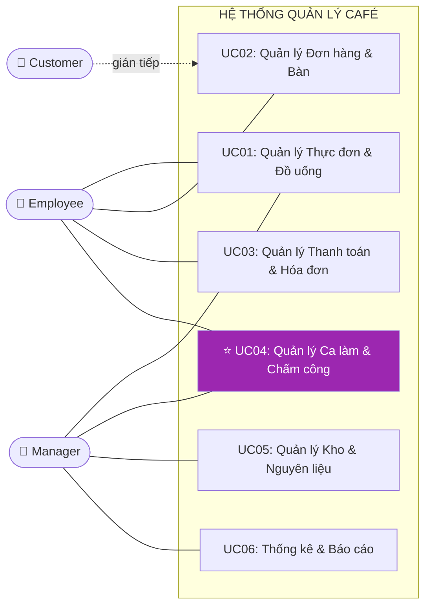

---

### 1.3. Bảng Tóm tắt Chức năng Toàn Hệ thống

| **UC** | **Phân hệ** | **Chức năng cốt lõi** | **Người phụ trách** | **Mức chi tiết** |
|:------:|-------------|----------------------|---------------------|:----------------:|
| UC01 | Thực đơn & Đồ uống | CRUD sản phẩm, nhóm, topping, công thức pha chế | Bảo | Tóm tắt |
| UC02 | Đơn hàng & Bàn | Tạo/sửa đơn, quản lý trạng thái bàn real-time | Thành | Tóm tắt |
| UC03 | Thanh toán & Hóa đơn | Xử lý thanh toán đa kênh (tiền mặt/thẻ/QR), in hóa đơn | Thành | Tóm tắt |
| UC05 | Kho & Nguyên liệu | Nhập kho, trừ tồn theo công thức Recipe, cảnh báo ngưỡng | Nguyễn Quang Đạo | Tóm tắt |
| UC06 | Báo cáo & Cửa hàng | Thống kê doanh thu, top sản phẩm, quản lý chi nhánh | Hồng Nhung | Tóm tắt |
| **UC04** | **Nhân sự & Chấm công** | **Hồ sơ NV, phân ca, GPS check-in/out, tính lương NĐ38, RBAC** | **Nguyễn Viết Tùng** | **⭐ Chuyên sâu (Chương 3)** |

---

### 1.4. Yêu cầu Chức năng (Functional Requirements)

Yêu cầu chức năng được phân loại theo chuẩn **IEEE 830**, đảm bảo tính truy vết từ yêu cầu đến thiết kế:

| **Mã** | **Phân hệ** | **Mô tả yêu cầu** | **Ưu tiên** |
| ------ | ----------- | ----------------- | :---------: |
| FR-01 | Đơn hàng | Nhân viên tạo mới, sửa đổi và hủy đơn hàng trên bàn đang hoạt động | Cao |
| FR-02 | Đơn hàng | Hệ thống tự động thông báo khu vực pha chế khi có đơn mới | Cao |
| FR-03 | Bàn | Trạng thái bàn cập nhật theo thời gian thực, không cần làm mới trang | Cao |
| FR-04 | Thanh toán | Hỗ trợ tối thiểu 3 hình thức: tiền mặt, thẻ và QR Pay | Trung bình |
| FR-05 | Thanh toán | Hóa đơn xuất ra máy in nhiệt theo định dạng chuẩn ESC/POS | Cao |
| FR-06 | Kho | Tự động cập nhật tồn kho khi đơn xác nhận, theo công thức Recipe | Cao |
| FR-07 | Kho | Cảnh báo khi tồn kho xuống dưới ngưỡng tối thiểu | Trung bình |
| **FR-08** | **Nhân sự** | **Quản lý tạo và phân công ca làm cho từng nhân viên theo ngày/tuần** | **Cao** |
| **FR-09** | **Nhân sự** | **Nhân viên Check-in/Check-out, hệ thống ghi nhận giờ làm thực tế** | **Cao** |
| **FR-10** | **Nhân sự** | **Tính lương đa biến theo NĐ 38/2022: giờ hành chính, tăng ca (×1.5/2.0/3.0), ca đêm (+30%)** | **Cao** |
| **FR-15** | **Chấm công** | **Chấm công bằng GPS Geofencing + xác thực khuôn mặt, ngăn chấm công hộ** | **Cao** |
| FR-11 | Báo cáo | Tổng hợp và trực quan hóa doanh thu theo ngày/tuần/tháng | Trung bình |
| FR-12 | Báo cáo | Thống kê top 10 mặt hàng bán chạy nhất trong kỳ | Thấp |
| FR-13 | AI — Kho | Module AI dự báo nhu cầu nguyên liệu, tự động tạo đề xuất phiếu nhập | Kiến nghị |
| FR-14 | AI — Nhân sự | Module AI tự động đề xuất lịch phân ca theo dự báo lưu lượng khách | Kiến nghị |
| FR-16 | Khách hàng | Quản lý khách hàng thân thiết; AI cá nhân hóa khuyến mãi | Kiến nghị |

> **Lưu ý:** FR-08, FR-09, FR-10, FR-15 (in đậm) là trọng tâm phân tích của báo cáo, được đặc tả đầy đủ tại Chương 3.

---

### 1.5. Yêu cầu Phi chức năng (Non-Functional Requirements)

Phân tích theo mô hình chất lượng **ISO/IEC 25010**:

| **Thuộc tính** | **Yêu cầu cụ thể** | **Cách đo lường** |
| -------------- | ------------------ | ----------------- |
| **Hiệu năng** | Phản hồi < 3 giây trong điều kiện LAN, 20 người dùng đồng thời | Profiling tool |
| **Tính sẵn sàng** | 24/7; RTO < 30 phút khi có sự cố | Uptime log |
| **Bảo mật** | RBAC nghiêm ngặt; BCrypt hash; Audit Log ≥ 90 ngày | Penetration Test cơ bản |
| **Tính khả dụng** | Nhân viên mới thành thạo chức năng cơ bản sau ≤ 2 giờ đào tạo | User Testing 5 người |
| **Tương thích** | Windows 7 SP1+; máy in nhiệt chuẩn ESC/POS | Kiểm thử 3 cấu hình POS |
| **Bảo trì** | Code Coverage ≥ 70%; tài liệu hóa đầy đủ | JaCoCo |

---

### 1.6. Phân tích Rủi ro Dự án

| **Rủi ro** | **Xác suất** | **Tác động** | **Biện pháp giảm thiểu** |
| ---------- | :----------: | :----------: | ------------------------ |
| Yêu cầu thay đổi giữa chừng (Scope Creep) | Cao | Cao | Use Case Specification làm tài liệu ký kết; Change Management |
| Thiếu dữ liệu thực tế để kiểm thử | Trung bình | Trung bình | Sinh Seed Data mô phỏng thực tế |
| Thành viên nhóm vắng giữa sprint | Thấp | Cao | Phân công chéo; tài liệu handover |
| Lỗi tích hợp phần cứng POS | Trung bình | Cao | Kiểm thử thiết bị sớm; driver dự phòng |

---

## CHƯƠNG 2: THIẾT KẾ KIẾN TRÚC VÀ CƠ SỞ DỮ LIỆU

> **Mục tiêu chương:** Trình bày kiến trúc triển khai 3 tầng và ERD chi tiết nhóm bảng UC04 (Nhân sự). Chiếm ~15% báo cáo.

### 2.1. Kiến trúc Triển khai 3 Tầng (Three-Tier Architecture)

Hệ thống áp dụng kiến trúc **3 lớp (Three-Tier Architecture)** nhằm tách biệt ba mối quan tâm: Hiển thị, Xử lý nghiệp vụ và Lưu trữ dữ liệu:

```mermaid
graph TD
    subgraph 🖥️ TẦNG TRÌNH DIỄN - Presentation Tier
        POS["Máy POS Thu ngân\n(Windows)"]
        KDS["Màn hình Pha chế\n(KDS)"]
        MOB["Máy tính bảng / Điện thoại\n(Android/iOS)"]
    end

    subgraph ⚙️ TẦNG NGHIỆP VỤ - Business Logic Tier
        API["APPLICATION SERVER\nREST API"]
        OS["Order Service"]
        PS["Payment Service"]
        SS["Shift Service"]
        IS["Inventory Service"]
        API --- OS
        API --- PS
        API --- SS
        API --- IS
    end

    subgraph 🗄️ TẦNG DỮ LIỆU - Data Tier
        DB[("DATABASE SERVER\nMySQL / SQL Server")]
        BK["📅 Backup hàng ngày 2:00 AM"]
        DB --- BK
    end

    POS -- "HTTP/HTTPS LAN" --> API
    KDS -- "HTTP/HTTPS WiFi" --> API
    MOB -- "HTTP/HTTPS WiFi" --> API
    API -- "JDBC / ORM Hibernate" --> DB
```


### 2.2. Quyết định Kiến trúc và Đánh đổi (Trade-offs)

| **Quyết định** | **Lý do lựa chọn** | **Đánh đổi** |
| -------------- | ------------------ | ------------ |
| REST API thay vì kết nối CSDL trực tiếp | Bảo mật cao hơn; tách biệt logic | Tăng độ trễ nhỏ |
| MySQL/SQL Server thay vì NoSQL | ACID cho nghiệp vụ tài chính | Kém linh hoạt khi schema đổi thường xuyên |
| LAN nội bộ (On-premise) | Chi phí thấp; bảo mật dữ liệu | Không truy cập từ xa nếu không có VPN |
| Windows Desktop App | Tương thích POS; driver máy in ổn định | Khó multi-platform |

**Bảo mật tầng triển khai:**
- **TLS 1.2+:** Mã hóa toàn bộ giao tiếp Client ↔ API Server.
- **Database Firewall:** Chỉ Application Server kết nối được Database; Client không truy cập trực tiếp.
- **Audit Log:** Mọi thao tác thêm/sửa/xóa ghi vào `audit_log` với timestamp và mã nhân viên.

---

### 2.3. Tổng quan Lược đồ CSDL — Nhóm Bảng Toàn Hệ thống

Hệ thống gồm **5 nhóm bảng** tương ứng với 5 phân hệ UC, đều chuẩn hóa 3NF:

| **Nhóm bảng** | **Bảng chính** | **UC** |
|---|---|:---:|
| Thực đơn | `do_uong`, `nhom_do_uong`, `topping`, `cong_thuc` | UC01 |
| Giao dịch | `hoa_don`, `hoa_don_chi_tiet`, `ban`, `khu_vuc` | UC02, UC03 |
| Kho | `nguyen_lieu`, `nhap_kho`, `canh_bao_kho` | UC05 |
| Báo cáo | `bao_cao_doanh_thu`, `chi_phi`, `danh_sach_cua_hang` | UC06 |
| **Nhân sự** *(trọng tâm)* | **`nhan_vien`, `tai_khoan`, `shift_template`, `shift`, `shift_assignment`, `attendance`** | **UC04** |

> **Nguyên tắc Snapshot:** `luong_gio_tai_thoi_diem` được lưu cứng tại kỳ tính lương — đảm bảo lịch sử tài chính không đổi khi mức lương điều chỉnh.

### 2.4. ERD Chi tiết — Nhóm Bảng Nhân sự (UC04)

Nguyên tắc thiết kế cốt lõi của UC04 là **tách biệt hoàn toàn** dữ liệu kế hoạch (Planning) khỏi dữ liệu thực tế (Actual), tương tự mô hình Planning vs. Actuals phổ biến trong kế toán quản trị:

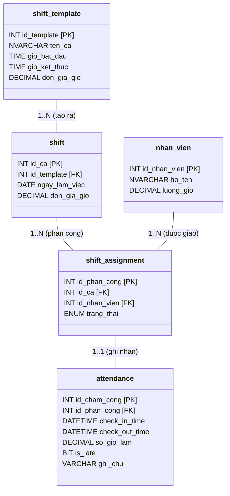

> **Ghi chú thiết kế:** Tách biệt **Kế hoạch** (`shift_template`, `shift`, `shift_assignment`) khỏi **Thực tế** (`attendance`) — cho phép đối soát chênh lệch (đi muộn/về sớm) và kiểm toán lao động minh bạch.

### 2.5. Business Rules tầng CSDL — UC04

| **Mã BR** | **Quy tắc** | **Cơ chế kiểm soát** |
| --------- | ----------- | -------------------- |
| BR-01 | Không thể có 2 ca chồng chéo giờ trong cùng ngày | Trigger kiểm tra overlap khi INSERT vào `shift_assignment` |
| BR-02 | Chỉ Check-out sau khi đã Check-in | `check_out_time` chỉ UPDATE khi `check_in_time IS NOT NULL` |
| BR-03 | `so_gio_lam` = 0 nếu `check_out_time IS NULL` | `CASE WHEN` trong câu truy vấn tính lương |
| BR-04 | Giờ làm tối đa 16h/ca; nếu vượt → đánh dấu xem xét thủ công | `CHECK(so_gio_lam <= 16)` hoặc cờ `needs_review = 1` |
| BR-05 | Ca cuối tuần (T7, CN) nhân hệ số 1.5 | Hàm tính lương kiểm tra `DAYOFWEEK(ngay_lam_viec)` |

---

## CHƯƠNG 2: Xây dựng Biểu đồ lớp thực thể

Biểu đồ Lớp là công cụ mô hình hóa cấu trúc tĩnh (static structure) của hệ thống, thể hiện các lớp đối tượng, thuộc tính, phương thức và mối quan hệ giữa chúng. Các lớp cốt lõi của hệ thống được thiết kế theo nguyên tắc **Separation of Concerns** (Phân tách mối quan tâm):

### 2.1. Phân tích

### 2.2. Đặc tả

| **Tên thực thể** |  | **Mô tả** |
| --- | --- | --- |
| Store |  |  |
| Order |  |  |
| OrderItem |  |  |
| CafeTable |  |  |
| TableSession |  |  |
| Revenue |  |  |
| CostOfGoodSold |  |  |
| Product |  |  |
| Category |  |  |
| ProductVariant |  |  |
| Topping |  |  |
| Ingredient |  |  |
| Recipe |  |  |
| Inventory |  |  |
| InventoryTransaction |  |  |
| Employee |  |  |
| Shift |  |  |
| ShiftTemplate |  |  |
| Attendance |  |  |

**Các mối quan hệ đáng chú ý:**

HoaDon — Ban: Quan hệ **Liên kết (Association)** 1–1 tại một thời điểm (một bàn có tối đa một hóa đơn đang mở).

HoaDon — HoaDonChiTiet — DoUong: Quan hệ **Tổng hợp (Aggregation)** và **Liên kết N-N** được giải quyết qua bảng trung gian.

DoUong — CongThuc — NguyenLieu: Quan hệ **Phụ thuộc (Dependency)** thể hiện công thức pha chế.

TaiKhoan — NhanVien: Quan hệ **Kết hợp (Composition)** — một tài khoản gắn với đúng một nhân viên.

### 2.3. Vẽ Biểu đồ


## CHƯƠNG 3: NGHIÊN CỨU CHUYÊN SÂU — UC04: QUẢN LÝ CA LÀM VIỆC, CHẤM CÔNG & PHÂN QUYỀN

> **Trái tim của báo cáo — Chiếm ~50%.** Đặc tả đầy đủ nghiệp vụ UC04 do **Nguyễn Viết Tùng** phụ trách: phân công ca, check-in/out sinh trắc học, tính lương đa biến NĐ38 và phân quyền RBAC.

### 3.1. Biểu đồ Use Case Chi tiết UC04


UC04 được phân rã thành các ca sử dụng con độc lập, có thể được phân công cho các thành viên nhóm khác nhau:

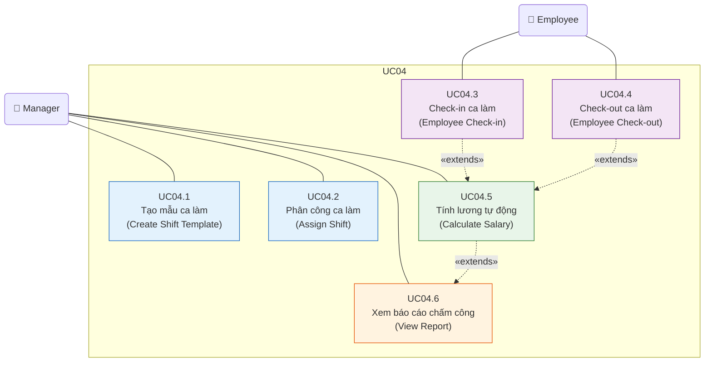

### 3.2. Quản lý Tài khoản, Phân quyền RBAC và Onboarding

> Quyền truy cập hệ thống là tiền điều kiện của mọi luồng nghiệp vụ trong UC06. Phân hệ RBAC được tích hợp trực tiếp vào đây thay vì để riêng.


| **Trường**                          | **Nội dung**                                                                                                   |
| ----------------------------------- | -------------------------------------------------------------------------------------------------------------- |
| **Mã Use Case**                     | UC07.1                                                                                                         |
| **Tên Use Case**                    | Thêm hồ sơ nhân viên mới (Onboarding)                                                                          |
| **Tác nhân chính**                  | Manager                                                                                                         |
| **Tác nhân thứ cấp**                | Hệ thống (System), Nhân viên mới (người nhận tài khoản)                                                        |
| **Điều kiện tiên quyết**            | Manager đã đăng nhập; có quyền `MANAGE_EMPLOYEE`                                                               |
| **Điều kiện kết thúc (thành công)** | Bản ghi `nhan_vien` và `tai_khoan` được tạo; tài khoản ở trạng thái `kich_hoat`; email thông báo được gửi đi  |
| **Điều kiện kết thúc (thất bại)**   | Không có bản ghi nào được tạo; hệ thống hiển thị lỗi cụ thể                                                   |
| **Mức độ ưu tiên**                  | Cao                                                                                                             |

**Luồng sự kiện chính (Main Flow):**

| **Bước** | **Tác nhân** | **Hành động**                                                                                           |
| -------- | ------------ | ------------------------------------------------------------------------------------------------------- |
| 1        | Manager      | Truy cập menu **Nhân sự → Thêm nhân viên**                                                              |
| 2        | Hệ thống     | Hiển thị form nhập: Họ tên, CCCD, SĐT, Email, Ngày sinh, Vị trí công việc, Lương theo giờ              |
| 3        | Manager      | Điền đầy đủ thông tin và nhấn **Lưu**                                                                   |
| 4        | Hệ thống     | Validate dữ liệu đầu vào (kiểm tra CCCD trùng, SĐT định dạng, email hợp lệ)                            |
| 5        | Hệ thống     | `INSERT` bản ghi vào bảng `nhan_vien`                                                                   |
| 6        | Hệ thống     | Tự động tạo `tai_khoan` với `mat_khau` ngẫu nhiên (8 ký tự); gán `vai_tro` mặc định = `NHAN_VIEN`      |
| 7        | Hệ thống     | Gửi email/SMS thông báo thông tin đăng nhập đến nhân viên mới                                           |
| 8        | Hệ thống     | Hiển thị thông báo: _"Thêm nhân viên thành công. Thông tin đăng nhập đã được gửi."_                    |

**Luồng ngoại lệ (Exception Flows):**

| **Mã** | **Điều kiện kích hoạt**                    | **Xử lý**                                                                         |
| ------ | ------------------------------------------ | --------------------------------------------------------------------------------- |
| E1     | CCCD đã tồn tại trong hệ thống             | Hiển thị: _"Nhân viên với CCCD này đã được đăng ký."_ Không INSERT.              |
| E2     | Email không đúng định dạng                 | Highlight trường lỗi, thông báo: _"Email không hợp lệ."_                         |
| E3     | Lương theo giờ < mức lương tối thiểu vùng | Cảnh báo: _"Mức lương thấp hơn quy định (22.500đ/giờ). Xác nhận tiếp tục?"_     |
| E4     | Gửi email thất bại                         | Vẫn tạo tài khoản thành công; ghi log lỗi gửi mail; Manager tự thông báo thủ công |

---


| **Trường**               | **Nội dung**                                                                                 |
| ------------------------ | -------------------------------------------------------------------------------------------- |
| **Mã Use Case**          | UC07.2                                                                                       |
| **Tác nhân**             | Manager                                                                                      |
| **Điều kiện tiên quyết** | Nhân viên đã có hồ sơ trong hệ thống (UC07.1 đã thực hiện)                                  |
| **Kết quả**              | Tài khoản được cấp phát, cập nhật hoặc thu hồi đúng với trạng thái thực tế của nhân viên   |

**Luồng sự kiện — Đặt lại mật khẩu:**

| **Bước** | **Hành động**                                                                  |
| -------- | ------------------------------------------------------------------------------ |
| 1        | Manager chọn nhân viên → **Đặt lại mật khẩu**                                 |
| 2        | Hệ thống tạo mật khẩu ngẫu nhiên mới và hash bằng **BCrypt (salt 12 rounds)** |
| 3        | Gửi mật khẩu tạm thời qua SMS/Email                                           |
| 4        | Lần đăng nhập đầu, hệ thống **bắt buộc** nhân viên đổi mật khẩu mới           |

---


Hệ thống phân quyền theo mô hình **Role-Based Access Control (RBAC)**, quản lý 3 cấp độ vai trò:

| **Vai trò (Role)**   | **Mã vai trò**  | **Quyền hạn chính**                                                                  |
| -------------------- | --------------- | ------------------------------------------------------------------------------------ |
| **Quản lý**          | `MANAGER`       | Toàn quyền: CRUD nhân viên, phê duyệt lương, xem báo cáo, cấu hình hệ thống        |
| **Thu ngân**         | `CASHIER`       | Tạo/đóng đơn hàng, xử lý thanh toán, in hóa đơn; xem lịch ca của bản thân          |
| **Nhân viên phục vụ**| `WAITER`        | Cập nhật trạng thái bàn, thêm món vào đơn; chấm công cá nhân                        |

**Ma trận phân quyền chi tiết:**

| **Chức năng**             | MANAGER | CASHIER | WAITER |
| ------------------------- | :-----: | :-----: | :----: |
| Xem danh sách nhân viên   | ✔       | ✘       | ✘      |
| Thêm/Sửa nhân viên        | ✔       | ✘       | ✘      |
| Phân công ca làm          | ✔       | ✘       | ✘      |
| Check-in/Check-out        | ✔       | ✔       | ✔      |
| Xem lịch sử chấm công     | ✔       | ✔ (bản thân) | ✔ (bản thân) |
| Duyệt điều chỉnh chấm công| ✔       | ✘       | ✘      |
| Tạo đơn hàng              | ✔       | ✔       | ✔      |
| Xử lý thanh toán          | ✔       | ✔       | ✘      |
| Xem báo cáo doanh thu     | ✔       | ✘       | ✘      |
| Cấu hình thực đơn         | ✔       | ✘       | ✘      |

---


Biểu đồ này mô tả chi tiết giao tiếp giữa các lớp trong kiến trúc phân lớp khi nhân viên thực hiện Check-in, tập trung vào việc **xác thực danh tính** và **kiểm tra phân công ca** trước khi ghi nhận:

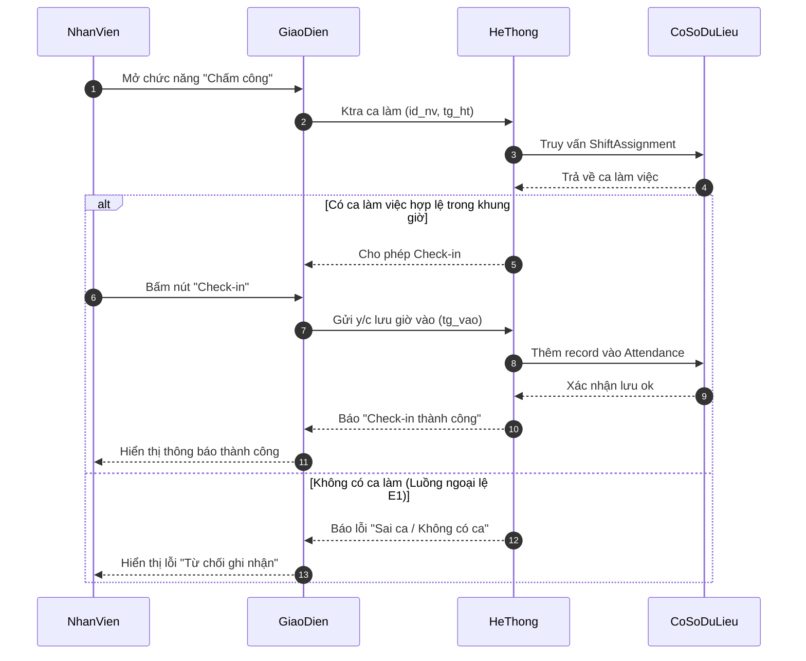

### 3.3. Đặc tả Use Case — Check-in, Check-out và Tính lương


| **Trường**                          | **Nội dung**                                                                                                                             |
| ----------------------------------- | ---------------------------------------------------------------------------------------------------------------------------------------- |
| **Mã Use Case**                     | UC04.3                                                                                                                                   |
| **Tên Use Case**                    | Check-in Ca làm việc                                                                                                                     |
| **Tác nhân chính**                  | Nhân viên (Employee)                                                                                                                     |
| **Tác nhân thứ cấp**                | Hệ thống chấm công                                                                                                                       |
| **Điều kiện tiên quyết**            | Nhân viên đã đăng nhập; tồn tại bản phân công ca (ShiftAssignment) cho nhân viên này trong ngày hôm nay; trạng thái ca là "chưa bắt đầu" |
| **Điều kiện kết thúc (thành công)** | Bản ghi Attendance được tạo với `check_in_time` = thời gian hiện tại; trạng thái phân công chuyển sang "đang làm việc"                   |
| **Điều kiện kết thúc (thất bại)**   | Hệ thống hiển thị thông báo lỗi; trạng thái Attendance không thay đổi                                                                    |

**Luồng sự kiện chính (Main Flow):**

| **Bước** | **Tác nhân** | **Hành động**                                                                      |
| -------- | ------------ | ---------------------------------------------------------------------------------- |
| 1        | Nhân viên    | Mở màn hình Chấm công, chọn "Check-in"                                             |
| 2        | Hệ thống     | Truy vấn `ShiftAssignment` theo `id_nhan_vien` và ngày hiện tại                    |
| 3        | Hệ thống     | Xác nhận tồn tại ca được phân công và ca chưa bắt đầu                              |
| 4        | Hệ thống     | Tạo bản ghi `Attendance` với `check_in_time = NOW()`                               |
| 5        | Hệ thống     | Cập nhật `ShiftAssignment.trang_thai = 'dang_lam'`                                 |
| 6        | Hệ thống     | Hiển thị thông báo: _"Check-in thành công lúc HH:MM. Chúc bạn làm việc hiệu quả!"_ |

**Luồng ngoại lệ (Alternative / Exception Flows):**

| **Mã** | **Điều kiện kích hoạt**                         | **Xử lý**                                                                              |
| ------ | ----------------------------------------------- | -------------------------------------------------------------------------------------- |
| E1     | Không tồn tại ShiftAssignment cho ngày hôm nay  | Hiển thị: _"Bạn không có ca làm việc hôm nay. Liên hệ Quản lý."_                       |
| E2     | Nhân viên đã Check-in trong ca này rồi          | Hiển thị: _"Bạn đã Check-in lúc [giờ]. Không thể Check-in hai lần."_                   |
| E3     | Check-in sớm hơn 30 phút so với giờ bắt đầu ca  | Hiển thị cảnh báo: _"Bạn Check-in sớm. Xác nhận ghi nhận?"_ → Nhân viên xác nhận       |
| E4     | Check-in muộn hơn 15 phút so với giờ bắt đầu ca | Ghi nhận Check-in bình thường nhưng đánh dấu `is_late = TRUE` trong bản ghi Attendance |
| E5     | Mất kết nối CSDL khi lưu                        | Thông báo lỗi kỹ thuật; ghi log; không tạo bản ghi Attendance                          |


| **Trường**               | **Nội dung**                                                                            |
| ------------------------ | --------------------------------------------------------------------------------------- |
| **Tác nhân**             | Manager (khởi tạo) / Hệ thống (thực thi)                                                |
| **Điều kiện tiên quyết** | Tồn tại ít nhất một bản ghi Attendance có đủ cặp check-in/check-out trong kỳ tính lương |
| **Kết quả**              | Hệ thống tổng hợp bảng lương cho từng nhân viên theo kỳ                                 |

**Công thức tính lương:**

$$L_{nv} = \sum_{i=1}^{n} \left[ (t_{checkout_i} - t_{checkin_i}) \times r_{ca_i} \right] - P_{tre} + B_{bonus}$$

Trong đó:

- $L_{nv}$: Tổng lương của nhân viên trong kỳ
- $t_{checkout_i} - t_{checkin_i}$: Số giờ làm thực tế của ca $i$ (tính bằng giờ, làm tròn 2 chữ số thập phân)
- $r_{ca_i}$: Đơn giá giờ của ca $i$ (có thể khác nhau giữa ca thường và ca cuối tuần/lễ)
- $P_{tre}$: Khoản khấu trừ do đi muộn (nếu có, theo chính sách)
- $B_{bonus}$: Thưởng thêm (nếu Quản lý nhập thủ công)

### 3.4. Xử lý Ngoại lệ Thông minh


Khác với các quy tắc cứng nhắc, hệ thống được thiết kế để xử lý **linh hoạt** các tình huống thực tế của nghiệp vụ ngành dịch vụ:

**a. Đổi ca đột xuất (Shift Swapping & Ad-hoc Check-in):**

Khi nhân viên đổi ca mà chưa có lịch trên hệ thống, hệ thống **không từ chối** chấm công. Thay vào đó:

1. Cho phép Check-in bình thường dựa trên xác thực GPS + khuôn mặt
2. Xếp bản ghi `attendance` vào trạng thái `trang_thai = 'cho_phe_duyet'` (Unscheduled Shift)
3. Gửi thông báo tới Quản lý để phê duyệt retroactively
4. Sau khi phê duyệt → tạo `shift_assignment` tương ứng và liên kết lại

> **Nguyên tắc thiết kế:** Hệ thống không được cản trở hoạt động vận hành; mọi ngoại lệ được thu thập để quản lý xử lý sau, không phải từ chối trước.

**b. Xử lý "Quên Check-out":**

Trường hợp nhân viên quên bấm giờ ra, hệ thống **không được phép** gán giờ làm = 0 (vi phạm quyền lợi người lao động theo Bộ Luật Lao động):

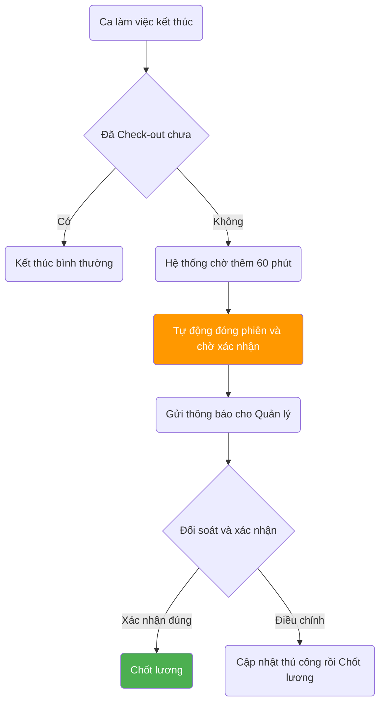


Để ngăn chặn tình trạng **chấm công hộ (Buddy Punching)** — một vấn đề phổ biến trong ngành dịch vụ, ứng dụng di động tích hợp hai lớp bảo vệ:

| **Lớp**              | **Công nghệ**      | **Cơ chế hoạt động**                                                                         |
| -------------------- | ------------------ | -------------------------------------------------------------------------------------------- |
| **Lớp 1: Vị trí**    | GPS Geofencing     | Chỉ cho phép Check-in khi thiết bị nằm trong bán kính ≤ 100m từ tọa độ quán                  |
| **Lớp 2: Danh tính** | FaceID / Selfie AI | Chụp ảnh tại thời điểm Check-in, so sánh với ảnh đăng ký bằng thuật toán nhận diện khuôn mặt |

**Luồng xác thực hai lớp (Two-Factor Authentication Flow):**

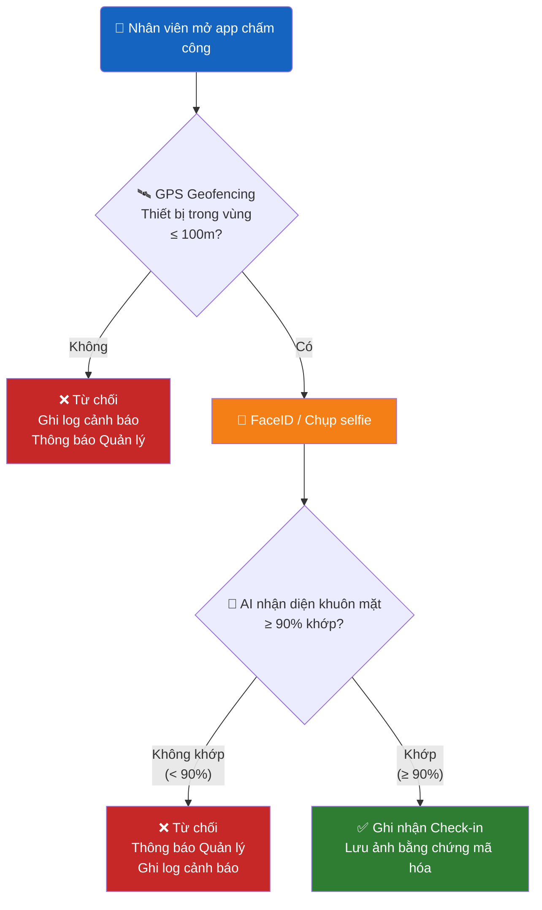

### 3.5. Cơ chế Chấm công Sinh trắc học — Triệt tiêu Chấm công Hộ


Để ngăn chặn tình trạng **chấm công hộ (Buddy Punching)** — một vấn đề phổ biến trong ngành dịch vụ, ứng dụng di động tích hợp hai lớp bảo vệ:

| **Lớp**              | **Công nghệ**      | **Cơ chế hoạt động**                                                                         |
| -------------------- | ------------------ | -------------------------------------------------------------------------------------------- |
| **Lớp 1: Vị trí**    | GPS Geofencing     | Chỉ cho phép Check-in khi thiết bị nằm trong bán kính ≤ 100m từ tọa độ quán                  |
| **Lớp 2: Danh tính** | FaceID / Selfie AI | Chụp ảnh tại thời điểm Check-in, so sánh với ảnh đăng ký bằng thuật toán nhận diện khuôn mặt |

**Luồng xác thực:**

```
[Nhân viên mở app] → [GPS check: trong vùng?]
    → Không: từ chối, ghi log cảnh báo
    → Có: [FaceID / Chụp selfie]
        → Không khớp (< 90%): từ chối, thông báo Quản lý
        → Khớp (≥ 90%): Ghi nhận Check-in thành công + lưu ảnh bằng chứng
```

> **Lưu trữ:** Ảnh selfie được mã hóa và lưu kèm bản ghi `attendance`, giữ tối thiểu 90 ngày để phục vụ kiểm toán nội bộ.


Hệ thống loại bỏ công thức tính lương đơn giản và triển khai **động cơ tính lương đa biến** tuân thủ đầy đủ pháp luật lao động Việt Nam:

$$S_{total} = \sum_{i=1}^{n} \left( H_{basic,i} \times R \right) + \sum_{j=1}^{m} \left( H_{OT,j} \times R \times M_j \right) + \sum_{k=1}^{p} \left( H_{night,k} \times R \times N_k \right) + A_{total} - D_{total}$$

**Giải thích các biến số:**

| **Biến**      | **Ý nghĩa**                      | **Giá trị theo luật**                                           |
| ------------- | -------------------------------- | --------------------------------------------------------------- |
| $H_{basic,i}$ | Giờ hành chính tiêu chuẩn        | ≤ 8h/ngày, ≤ 48h/tuần                                           |
| $R$           | Lương cơ bản theo giờ            | ≥ 22.500 đ/giờ (Vùng I, 2024)                                   |
| $H_{OT,j}$    | Giờ làm thêm (tăng ca)           | ≤ 40h/tháng, ≤ 200h/năm                                         |
| $M_j$         | Hệ số tăng ca                    | **1.5** (ngày thường) / **2.0** (ngày nghỉ) / **3.0** (Lễ, Tết) |
| $H_{night,k}$ | Giờ làm ca đêm (22:00–06:00)     | Theo lịch thực tế                                               |
| $N_k$         | Hệ số phụ cấp đêm                | **+30%** (≥ 1.3); nếu vừa tăng ca vừa đêm → cộng thêm **+20%**  |
| $A_{total}$   | Tổng phụ cấp (ăn ca, xăng xe...) | Theo chính sách quán                                            |
| $D_{total}$   | Tổng khấu trừ (BHXH, đi muộn...) | Theo chính sách + pháp luật                                     |

**Kiến trúc tách biệt hệ số khỏi mã nguồn:**

> Mọi hệ số $M_j$ và $N_k$ được lưu trong **Bảng ma trận cấu hình (Compliance Matrix)** riêng biệt trong CSDL, không hardcode vào logic code. Khi Chính phủ ban hành quy định mới, Nhân sự chỉ cần cập nhật bảng cấu hình mà **không cần phát hành phiên bản phần mềm mới**.

| **Bảng**          | `compliance_matrix`                                  |
| ----------------- | ---------------------------------------------------- |
| `loai_ca`         | ENUM: 'ngay_thuong', 'ngay_nghi', 'le_tet', 'ca_dem' |
| `he_so`           | DECIMAL(4,2) — hệ số áp dụng                         |
| `hieu_luc_tu`     | DATE — ngày bắt đầu hiệu lực                         |
| `van_ban_phap_ly` | VARCHAR — số nghị định tham chiếu                    |

### 3.6. Payroll Engine Đa biến — Tuân thủ NĐ 38/2022/NĐ-CP


Hệ thống loại bỏ công thức tính lương đơn giản và triển khai **động cơ tính lương đa biến** tuân thủ đầy đủ pháp luật lao động Việt Nam:

$$S_{total} = \sum_{i=1}^{n} \left( H_{basic,i} \times R \right) + \sum_{j=1}^{m} \left( H_{OT,j} \times R \times M_j \right) + \sum_{k=1}^{p} \left( H_{night,k} \times R \times N_k \right) + A_{total} - D_{total}$$

**Giải thích các biến số:**

| **Biến**      | **Ý nghĩa**                      | **Giá trị theo luật**                                           |
| ------------- | -------------------------------- | --------------------------------------------------------------- |
| $H_{basic,i}$ | Giờ hành chính tiêu chuẩn        | ≤ 8h/ngày, ≤ 48h/tuần                                           |
| $R$           | Lương cơ bản theo giờ            | ≥ 22.500 đ/giờ (Vùng I, 2024)                                   |
| $H_{OT,j}$    | Giờ làm thêm (tăng ca)           | ≤ 40h/tháng, ≤ 200h/năm                                         |
| $M_j$         | Hệ số tăng ca                    | **1.5** (ngày thường) / **2.0** (ngày nghỉ) / **3.0** (Lễ, Tết) |
| $H_{night,k}$ | Giờ làm ca đêm (22:00–06:00)     | Theo lịch thực tế                                               |
| $N_k$         | Hệ số phụ cấp đêm                | **+30%** (≥ 1.3); nếu vừa tăng ca vừa đêm → cộng thêm **+20%**  |
| $A_{total}$   | Tổng phụ cấp (ăn ca, xăng xe...) | Theo chính sách quán                                            |
| $D_{total}$   | Tổng khấu trừ (BHXH, đi muộn...) | Theo chính sách + pháp luật                                     |

**Kiến trúc tách biệt hệ số khỏi mã nguồn:**

> Mọi hệ số $M_j$ và $N_k$ được lưu trong **Bảng ma trận cấu hình (Compliance Matrix)** riêng biệt trong CSDL, không hardcode vào logic code. Khi Chính phủ ban hành quy định mới, Nhân sự chỉ cần cập nhật bảng cấu hình mà **không cần phát hành phiên bản phần mềm mới**.

| **Bảng**          | `compliance_matrix`                                  |
| ----------------- | ---------------------------------------------------- |
| `loai_ca`         | ENUM: 'ngay_thuong', 'ngay_nghi', 'le_tet', 'ca_dem' |
| `he_so`           | DECIMAL(4,2) — hệ số áp dụng                         |
| `hieu_luc_tu`     | DATE — ngày bắt đầu hiệu lực                         |
| `van_ban_phap_ly` | VARCHAR — số nghị định tham chiếu                    |

---


Nguyên tắc thiết kế cốt lõi của UC04 là **tách biệt hoàn toàn** dữ liệu kế hoạch (Planning) khỏi dữ liệu thực tế (Actual), tương tự mô hình Planning vs. Actuals phổ biến trong kế toán quản trị:


> **Ghi chú thiết kế:** 2 nhóm bảng trên tách biệt hoàn toàn **Kế hoạch** (shift_template, shift, shift_assignment) khỏi **Thực tế** (attendance), giúp dễ đối soát và kiểm toán.


| **Mã BR** | **Quy tắc**                                                          | **Cơ chế kiểm soát**                                                    |
| --------- | -------------------------------------------------------------------- | ----------------------------------------------------------------------- |
| BR-01     | Một nhân viên không thể có 2 ca chồng chéo thời gian trong cùng ngày | Trigger kiểm tra overlap khi INSERT vào `shift_assignment`              |
| BR-02     | Chỉ có thể Check-out sau khi đã Check-in                             | `check_out_time` chỉ được UPDATE khi `check_in_time IS NOT NULL`        |
| BR-03     | `so_gio_lam` không được tính nếu `check_out_time IS NULL`            | Dùng `CASE WHEN` trong câu truy vấn tính lương                          |
| BR-04     | Giờ làm tối đa 16 giờ/ca; nếu vượt → đánh dấu cần xem xét thủ công   | Constraint: `CHECK(so_gio_lam <= 16)` hoặc cờ `needs_review = 1`        |
| BR-05     | Ca cuối tuần (Thứ 7, Chủ nhật) được nhân hệ số 1.5                   | Hàm tính lương kiểm tra `DAYOFWEEK(ngay_lam_viec)` trước khi áp đơn giá |


### 3.7. Business Rules và Ràng buộc Nghiệp vụ


| **Mã BR** | **Quy tắc**                                                          | **Cơ chế kiểm soát**                                                    |
| --------- | -------------------------------------------------------------------- | ----------------------------------------------------------------------- |
| BR-01     | Một nhân viên không thể có 2 ca chồng chéo thời gian trong cùng ngày | Trigger kiểm tra overlap khi INSERT vào `shift_assignment`              |
| BR-02     | Chỉ có thể Check-out sau khi đã Check-in                             | `check_out_time` chỉ được UPDATE khi `check_in_time IS NOT NULL`        |
| BR-03     | `so_gio_lam` không được tính nếu `check_out_time IS NULL`            | Dùng `CASE WHEN` trong câu truy vấn tính lương                          |
| BR-04     | Giờ làm tối đa 16 giờ/ca; nếu vượt → đánh dấu cần xem xét thủ công   | Constraint: `CHECK(so_gio_lam <= 16)` hoặc cờ `needs_review = 1`        |
| BR-05     | Ca cuối tuần (Thứ 7, Chủ nhật) được nhân hệ số 1.5                   | Hàm tính lương kiểm tra `DAYOFWEEK(ngay_lam_viec)` trước khi áp đơn giá |


**Business Rules bổ sung — Quản lý Tài khoản:**


| **Mã BR** | **Quy tắc**                                                              | **Cơ chế kiểm soát**                                                                |
| --------- | ------------------------------------------------------------------------ | ----------------------------------------------------------------------------------- |
| BR-NS-01  | Mỗi nhân viên chỉ có đúng một tài khoản đăng nhập (quan hệ 1-1)         | Unique Constraint trên `tai_khoan.id_nhan_vien`                                     |
| BR-NS-02  | Mật khẩu phải được băm bằng BCrypt trước khi lưu; không lưu plain text  | Xử lý tại tầng Service; không bao giờ lưu chuỗi gốc                                |
| BR-NS-03  | Lần đăng nhập đầu tiên bắt buộc đổi mật khẩu                            | Cờ `buoc_doi_mat_khau = 1`; middleware chặn mọi request trừ endpoint đổi mật khẩu  |
| BR-NS-04  | Không được xóa vật lý (hard delete) bản ghi nhân viên                   | Chỉ đặt `trang_thai = 'da_nghi_viec'` và `kich_hoat = 0` (Soft Delete)             |
| BR-NS-05  | Mọi thao tác thêm/sửa/xoá nhân viên phải được ghi vào `audit_log`       | Database Trigger `AFTER INSERT/UPDATE/DELETE` trên bảng `nhan_vien` và `tai_khoan` |
| BR-NS-06  | Không thể phân công ca cho nhân viên có tài khoản bị khóa               | Trigger kiểm tra `tai_khoan.kich_hoat = 1` trước khi INSERT vào `shift_assignment` |

---


### 3.8. Biểu đồ Tuần tự — Luồng Check-in (Sequence Diagram)


Biểu đồ này mô tả chi tiết giao tiếp giữa các lớp trong kiến trúc phân lớp khi nhân viên thực hiện Check-in, tập trung vào việc **xác thực danh tính** và **kiểm tra phân công ca** trước khi ghi nhận:


**Giải thích các biến số:**

- `id_nv` — Mã nhân viên (ID Nhân viên), lấy từ session đăng nhập.
- `tg_ht` — Thời gian hiện tại, dùng để đối chiếu với bảng `shift_assignment`.
- `tg_vao` — Thời gian Check-in thực tế, tương đương `check_in_time` trong bảng `attendance`.

---


### 3.9. Biểu đồ Hoạt động — Quy trình Chấm công (Activity Diagram)


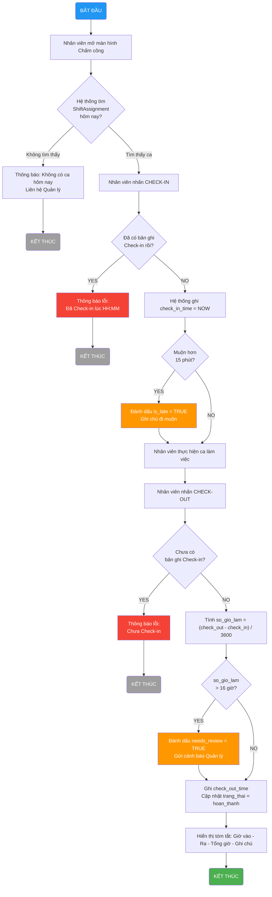

### 3.10. Biểu đồ Hoạt động — Quy trình Onboarding Nhân viên Mới (Activity Diagram)


```mermaid
graph TD
    A(BẮT ĐẦU: Nhân viên mới gia nhập) --> B[Manager nhập hồ sơ\nvào hệ thống]
    B --> C{Validate\ndữ liệu?}

    C -->|Lỗi (CCCD/Email trùng)| D[Hiển thị lỗi\nYêu cầu sửa lại]
    D --> B

    C -->|Hợp lệ| E[INSERT vào bảng\nnhan_vien]
    E --> F[Tạo tai_khoan\nvai_tro = NHAN_VIEN]
    F --> G[Mã hoá mật khẩu\nbằng BCrypt]
    G --> H[Gửi thông tin\nđăng nhập qua Email/SMS]

    H --> I{Gửi\nthành công?}
    I -->|Thất bại| J[Ghi log lỗi gửi mail\nManager tự thông báo]
    I -->|Thành công| K

    J --> K[Nhân viên nhận\nthông tin đăng nhập]
    K --> L[Nhân viên đăng nhập\nlần đầu]
    L --> M{Bắt buộc\nđổi mật khẩu?}

    M -->|Chưa đổi| N[Yêu cầu nhập\nmật khẩu mới]
    N --> O[Cập nhật mat_khau\ntrong tai_khoan]
    O --> P

    M -->|Đã đổi| P[Nhân viên vào\nDashboard]
    P --> Q(KẾT THÚC: Onboarding hoàn tất)

    style A fill:#2196F3,color:#fff
    style Q fill:#4CAF50,color:#fff
    style D fill:#F44336,color:#fff
    style J fill:#FF9800,color:#fff
```

---


---

## CHƯƠNG 3: NGHIÊN CỨU CHUYÊN SÂU — UC04: QUẢN LÝ CA LÀM VIỆC, CHẤM CÔNG & PHÂN QUYỀN

> **Trái tim của báo cáo — Chiếm ~50%.** Đặc tả đầy đủ nghiệp vụ UC04 do **Nguyễn Viết Tùng** phụ trách: phân công ca, check-in/out sinh trắc học, tính lương đa biến NĐ38 và phân quyền RBAC.

### 3.1. Biểu đồ Use Case Chi tiết UC04


UC04 được phân rã thành các ca sử dụng con độc lập, có thể được phân công cho các thành viên nhóm khác nhau:


### 3.2. Quản lý Tài khoản, Phân quyền RBAC và Onboarding

> Quyền truy cập hệ thống là tiền điều kiện của mọi luồng nghiệp vụ trong UC06. Phân hệ RBAC được tích hợp trực tiếp vào đây thay vì để riêng.


| **Trường**                          | **Nội dung**                                                                                                   |
| ----------------------------------- | -------------------------------------------------------------------------------------------------------------- |
| **Mã Use Case**                     | UC07.1                                                                                                         |
| **Tên Use Case**                    | Thêm hồ sơ nhân viên mới (Onboarding)                                                                          |
| **Tác nhân chính**                  | Manager                                                                                                         |
| **Tác nhân thứ cấp**                | Hệ thống (System), Nhân viên mới (người nhận tài khoản)                                                        |
| **Điều kiện tiên quyết**            | Manager đã đăng nhập; có quyền `MANAGE_EMPLOYEE`                                                               |
| **Điều kiện kết thúc (thành công)** | Bản ghi `nhan_vien` và `tai_khoan` được tạo; tài khoản ở trạng thái `kich_hoat`; email thông báo được gửi đi  |
| **Điều kiện kết thúc (thất bại)**   | Không có bản ghi nào được tạo; hệ thống hiển thị lỗi cụ thể                                                   |
| **Mức độ ưu tiên**                  | Cao                                                                                                             |

**Luồng sự kiện chính (Main Flow):**

| **Bước** | **Tác nhân** | **Hành động**                                                                                           |
| -------- | ------------ | ------------------------------------------------------------------------------------------------------- |
| 1        | Manager      | Truy cập menu **Nhân sự → Thêm nhân viên**                                                              |
| 2        | Hệ thống     | Hiển thị form nhập: Họ tên, CCCD, SĐT, Email, Ngày sinh, Vị trí công việc, Lương theo giờ              |
| 3        | Manager      | Điền đầy đủ thông tin và nhấn **Lưu**                                                                   |
| 4        | Hệ thống     | Validate dữ liệu đầu vào (kiểm tra CCCD trùng, SĐT định dạng, email hợp lệ)                            |
| 5        | Hệ thống     | `INSERT` bản ghi vào bảng `nhan_vien`                                                                   |
| 6        | Hệ thống     | Tự động tạo `tai_khoan` với `mat_khau` ngẫu nhiên (8 ký tự); gán `vai_tro` mặc định = `NHAN_VIEN`      |
| 7        | Hệ thống     | Gửi email/SMS thông báo thông tin đăng nhập đến nhân viên mới                                           |
| 8        | Hệ thống     | Hiển thị thông báo: _"Thêm nhân viên thành công. Thông tin đăng nhập đã được gửi."_                    |

**Luồng ngoại lệ (Exception Flows):**

| **Mã** | **Điều kiện kích hoạt**                    | **Xử lý**                                                                         |
| ------ | ------------------------------------------ | --------------------------------------------------------------------------------- |
| E1     | CCCD đã tồn tại trong hệ thống             | Hiển thị: _"Nhân viên với CCCD này đã được đăng ký."_ Không INSERT.              |
| E2     | Email không đúng định dạng                 | Highlight trường lỗi, thông báo: _"Email không hợp lệ."_                         |
| E3     | Lương theo giờ < mức lương tối thiểu vùng | Cảnh báo: _"Mức lương thấp hơn quy định (22.500đ/giờ). Xác nhận tiếp tục?"_     |
| E4     | Gửi email thất bại                         | Vẫn tạo tài khoản thành công; ghi log lỗi gửi mail; Manager tự thông báo thủ công |

---


| **Trường**               | **Nội dung**                                                                                 |
| ------------------------ | -------------------------------------------------------------------------------------------- |
| **Mã Use Case**          | UC07.2                                                                                       |
| **Tác nhân**             | Manager                                                                                      |
| **Điều kiện tiên quyết** | Nhân viên đã có hồ sơ trong hệ thống (UC07.1 đã thực hiện)                                  |
| **Kết quả**              | Tài khoản được cấp phát, cập nhật hoặc thu hồi đúng với trạng thái thực tế của nhân viên   |

**Luồng sự kiện — Đặt lại mật khẩu:**

| **Bước** | **Hành động**                                                                  |
| -------- | ------------------------------------------------------------------------------ |
| 1        | Manager chọn nhân viên → **Đặt lại mật khẩu**                                 |
| 2        | Hệ thống tạo mật khẩu ngẫu nhiên mới và hash bằng **BCrypt (salt 12 rounds)** |
| 3        | Gửi mật khẩu tạm thời qua SMS/Email                                           |
| 4        | Lần đăng nhập đầu, hệ thống **bắt buộc** nhân viên đổi mật khẩu mới           |

---


Hệ thống phân quyền theo mô hình **Role-Based Access Control (RBAC)**, quản lý 3 cấp độ vai trò:

| **Vai trò (Role)**   | **Mã vai trò**  | **Quyền hạn chính**                                                                  |
| -------------------- | --------------- | ------------------------------------------------------------------------------------ |
| **Quản lý**          | `MANAGER`       | Toàn quyền: CRUD nhân viên, phê duyệt lương, xem báo cáo, cấu hình hệ thống        |
| **Thu ngân**         | `CASHIER`       | Tạo/đóng đơn hàng, xử lý thanh toán, in hóa đơn; xem lịch ca của bản thân          |
| **Nhân viên phục vụ**| `WAITER`        | Cập nhật trạng thái bàn, thêm món vào đơn; chấm công cá nhân                        |

**Ma trận phân quyền chi tiết:**

| **Chức năng**             | MANAGER | CASHIER | WAITER |
| ------------------------- | :-----: | :-----: | :----: |
| Xem danh sách nhân viên   | ✔       | ✘       | ✘      |
| Thêm/Sửa nhân viên        | ✔       | ✘       | ✘      |
| Phân công ca làm          | ✔       | ✘       | ✘      |
| Check-in/Check-out        | ✔       | ✔       | ✔      |
| Xem lịch sử chấm công     | ✔       | ✔ (bản thân) | ✔ (bản thân) |
| Duyệt điều chỉnh chấm công| ✔       | ✘       | ✘      |
| Tạo đơn hàng              | ✔       | ✔       | ✔      |
| Xử lý thanh toán          | ✔       | ✔       | ✘      |
| Xem báo cáo doanh thu     | ✔       | ✘       | ✘      |
| Cấu hình thực đơn         | ✔       | ✘       | ✘      |

---


Biểu đồ này mô tả chi tiết giao tiếp giữa các lớp trong kiến trúc phân lớp khi nhân viên thực hiện Check-in, tập trung vào việc **xác thực danh tính** và **kiểm tra phân công ca** trước khi ghi nhận:


### 3.3. Đặc tả Use Case — Check-in, Check-out và Tính lương


| **Trường**                          | **Nội dung**                                                                                                                             |
| ----------------------------------- | ---------------------------------------------------------------------------------------------------------------------------------------- |
| **Mã Use Case**                     | UC04.3                                                                                                                                   |
| **Tên Use Case**                    | Check-in Ca làm việc                                                                                                                     |
| **Tác nhân chính**                  | Nhân viên (Employee)                                                                                                                     |
| **Tác nhân thứ cấp**                | Hệ thống chấm công                                                                                                                       |
| **Điều kiện tiên quyết**            | Nhân viên đã đăng nhập; tồn tại bản phân công ca (ShiftAssignment) cho nhân viên này trong ngày hôm nay; trạng thái ca là "chưa bắt đầu" |
| **Điều kiện kết thúc (thành công)** | Bản ghi Attendance được tạo với `check_in_time` = thời gian hiện tại; trạng thái phân công chuyển sang "đang làm việc"                   |
| **Điều kiện kết thúc (thất bại)**   | Hệ thống hiển thị thông báo lỗi; trạng thái Attendance không thay đổi                                                                    |

**Luồng sự kiện chính (Main Flow):**

| **Bước** | **Tác nhân** | **Hành động**                                                                      |
| -------- | ------------ | ---------------------------------------------------------------------------------- |
| 1        | Nhân viên    | Mở màn hình Chấm công, chọn "Check-in"                                             |
| 2        | Hệ thống     | Truy vấn `ShiftAssignment` theo `id_nhan_vien` và ngày hiện tại                    |
| 3        | Hệ thống     | Xác nhận tồn tại ca được phân công và ca chưa bắt đầu                              |
| 4        | Hệ thống     | Tạo bản ghi `Attendance` với `check_in_time = NOW()`                               |
| 5        | Hệ thống     | Cập nhật `ShiftAssignment.trang_thai = 'dang_lam'`                                 |
| 6        | Hệ thống     | Hiển thị thông báo: _"Check-in thành công lúc HH:MM. Chúc bạn làm việc hiệu quả!"_ |

**Luồng ngoại lệ (Alternative / Exception Flows):**

| **Mã** | **Điều kiện kích hoạt**                         | **Xử lý**                                                                              |
| ------ | ----------------------------------------------- | -------------------------------------------------------------------------------------- |
| E1     | Không tồn tại ShiftAssignment cho ngày hôm nay  | Hiển thị: _"Bạn không có ca làm việc hôm nay. Liên hệ Quản lý."_                       |
| E2     | Nhân viên đã Check-in trong ca này rồi          | Hiển thị: _"Bạn đã Check-in lúc [giờ]. Không thể Check-in hai lần."_                   |
| E3     | Check-in sớm hơn 30 phút so với giờ bắt đầu ca  | Hiển thị cảnh báo: _"Bạn Check-in sớm. Xác nhận ghi nhận?"_ → Nhân viên xác nhận       |
| E4     | Check-in muộn hơn 15 phút so với giờ bắt đầu ca | Ghi nhận Check-in bình thường nhưng đánh dấu `is_late = TRUE` trong bản ghi Attendance |
| E5     | Mất kết nối CSDL khi lưu                        | Thông báo lỗi kỹ thuật; ghi log; không tạo bản ghi Attendance                          |


| **Trường**               | **Nội dung**                                                                            |
| ------------------------ | --------------------------------------------------------------------------------------- |
| **Tác nhân**             | Manager (khởi tạo) / Hệ thống (thực thi)                                                |
| **Điều kiện tiên quyết** | Tồn tại ít nhất một bản ghi Attendance có đủ cặp check-in/check-out trong kỳ tính lương |
| **Kết quả**              | Hệ thống tổng hợp bảng lương cho từng nhân viên theo kỳ                                 |

**Công thức tính lương:**

$$L_{nv} = \sum_{i=1}^{n} \left[ (t_{checkout_i} - t_{checkin_i}) \times r_{ca_i} \right] - P_{tre} + B_{bonus}$$

Trong đó:

- $L_{nv}$: Tổng lương của nhân viên trong kỳ
- $t_{checkout_i} - t_{checkin_i}$: Số giờ làm thực tế của ca $i$ (tính bằng giờ, làm tròn 2 chữ số thập phân)
- $r_{ca_i}$: Đơn giá giờ của ca $i$ (có thể khác nhau giữa ca thường và ca cuối tuần/lễ)
- $P_{tre}$: Khoản khấu trừ do đi muộn (nếu có, theo chính sách)
- $B_{bonus}$: Thưởng thêm (nếu Quản lý nhập thủ công)

### 3.4. Xử lý Ngoại lệ Thông minh


Khác với các quy tắc cứng nhắc, hệ thống được thiết kế để xử lý **linh hoạt** các tình huống thực tế của nghiệp vụ ngành dịch vụ:

**a. Đổi ca đột xuất (Shift Swapping & Ad-hoc Check-in):**

Khi nhân viên đổi ca mà chưa có lịch trên hệ thống, hệ thống **không từ chối** chấm công. Thay vào đó:

1. Cho phép Check-in bình thường dựa trên xác thực GPS + khuôn mặt
2. Xếp bản ghi `attendance` vào trạng thái `trang_thai = 'cho_phe_duyet'` (Unscheduled Shift)
3. Gửi thông báo tới Quản lý để phê duyệt retroactively
4. Sau khi phê duyệt → tạo `shift_assignment` tương ứng và liên kết lại

> **Nguyên tắc thiết kế:** Hệ thống không được cản trở hoạt động vận hành; mọi ngoại lệ được thu thập để quản lý xử lý sau, không phải từ chối trước.

**b. Xử lý "Quên Check-out":**

Trường hợp nhân viên quên bấm giờ ra, hệ thống **không được phép** gán giờ làm = 0 (vi phạm quyền lợi người lao động theo Bộ Luật Lao động):


Để ngăn chặn tình trạng **chấm công hộ (Buddy Punching)** — một vấn đề phổ biến trong ngành dịch vụ, ứng dụng di động tích hợp hai lớp bảo vệ:

| **Lớp**              | **Công nghệ**      | **Cơ chế hoạt động**                                                                         |
| -------------------- | ------------------ | -------------------------------------------------------------------------------------------- |
| **Lớp 1: Vị trí**    | GPS Geofencing     | Chỉ cho phép Check-in khi thiết bị nằm trong bán kính ≤ 100m từ tọa độ quán                  |
| **Lớp 2: Danh tính** | FaceID / Selfie AI | Chụp ảnh tại thời điểm Check-in, so sánh với ảnh đăng ký bằng thuật toán nhận diện khuôn mặt |

**Luồng xác thực hai lớp (Two-Factor Authentication Flow):**


### 3.5. Cơ chế Chấm công Sinh trắc học — Triệt tiêu Chấm công Hộ


Để ngăn chặn tình trạng **chấm công hộ (Buddy Punching)** — một vấn đề phổ biến trong ngành dịch vụ, ứng dụng di động tích hợp hai lớp bảo vệ:

| **Lớp**              | **Công nghệ**      | **Cơ chế hoạt động**                                                                         |
| -------------------- | ------------------ | -------------------------------------------------------------------------------------------- |
| **Lớp 1: Vị trí**    | GPS Geofencing     | Chỉ cho phép Check-in khi thiết bị nằm trong bán kính ≤ 100m từ tọa độ quán                  |
| **Lớp 2: Danh tính** | FaceID / Selfie AI | Chụp ảnh tại thời điểm Check-in, so sánh với ảnh đăng ký bằng thuật toán nhận diện khuôn mặt |

**Luồng xác thực:**

```
[Nhân viên mở app] → [GPS check: trong vùng?]
    → Không: từ chối, ghi log cảnh báo
    → Có: [FaceID / Chụp selfie]
        → Không khớp (< 90%): từ chối, thông báo Quản lý
        → Khớp (≥ 90%): Ghi nhận Check-in thành công + lưu ảnh bằng chứng
```

> **Lưu trữ:** Ảnh selfie được mã hóa và lưu kèm bản ghi `attendance`, giữ tối thiểu 90 ngày để phục vụ kiểm toán nội bộ.


Hệ thống loại bỏ công thức tính lương đơn giản và triển khai **động cơ tính lương đa biến** tuân thủ đầy đủ pháp luật lao động Việt Nam:

$$S_{total} = \sum_{i=1}^{n} \left( H_{basic,i} \times R \right) + \sum_{j=1}^{m} \left( H_{OT,j} \times R \times M_j \right) + \sum_{k=1}^{p} \left( H_{night,k} \times R \times N_k \right) + A_{total} - D_{total}$$

**Giải thích các biến số:**

| **Biến**      | **Ý nghĩa**                      | **Giá trị theo luật**                                           |
| ------------- | -------------------------------- | --------------------------------------------------------------- |
| $H_{basic,i}$ | Giờ hành chính tiêu chuẩn        | ≤ 8h/ngày, ≤ 48h/tuần                                           |
| $R$           | Lương cơ bản theo giờ            | ≥ 22.500 đ/giờ (Vùng I, 2024)                                   |
| $H_{OT,j}$    | Giờ làm thêm (tăng ca)           | ≤ 40h/tháng, ≤ 200h/năm                                         |
| $M_j$         | Hệ số tăng ca                    | **1.5** (ngày thường) / **2.0** (ngày nghỉ) / **3.0** (Lễ, Tết) |
| $H_{night,k}$ | Giờ làm ca đêm (22:00–06:00)     | Theo lịch thực tế                                               |
| $N_k$         | Hệ số phụ cấp đêm                | **+30%** (≥ 1.3); nếu vừa tăng ca vừa đêm → cộng thêm **+20%**  |
| $A_{total}$   | Tổng phụ cấp (ăn ca, xăng xe...) | Theo chính sách quán                                            |
| $D_{total}$   | Tổng khấu trừ (BHXH, đi muộn...) | Theo chính sách + pháp luật                                     |

**Kiến trúc tách biệt hệ số khỏi mã nguồn:**

> Mọi hệ số $M_j$ và $N_k$ được lưu trong **Bảng ma trận cấu hình (Compliance Matrix)** riêng biệt trong CSDL, không hardcode vào logic code. Khi Chính phủ ban hành quy định mới, Nhân sự chỉ cần cập nhật bảng cấu hình mà **không cần phát hành phiên bản phần mềm mới**.

| **Bảng**          | `compliance_matrix`                                  |
| ----------------- | ---------------------------------------------------- |
| `loai_ca`         | ENUM: 'ngay_thuong', 'ngay_nghi', 'le_tet', 'ca_dem' |
| `he_so`           | DECIMAL(4,2) — hệ số áp dụng                         |
| `hieu_luc_tu`     | DATE — ngày bắt đầu hiệu lực                         |
| `van_ban_phap_ly` | VARCHAR — số nghị định tham chiếu                    |

### 3.6. Payroll Engine Đa biến — Tuân thủ NĐ 38/2022/NĐ-CP


Hệ thống loại bỏ công thức tính lương đơn giản và triển khai **động cơ tính lương đa biến** tuân thủ đầy đủ pháp luật lao động Việt Nam:

$$S_{total} = \sum_{i=1}^{n} \left( H_{basic,i} \times R \right) + \sum_{j=1}^{m} \left( H_{OT,j} \times R \times M_j \right) + \sum_{k=1}^{p} \left( H_{night,k} \times R \times N_k \right) + A_{total} - D_{total}$$

**Giải thích các biến số:**

| **Biến**      | **Ý nghĩa**                      | **Giá trị theo luật**                                           |
| ------------- | -------------------------------- | --------------------------------------------------------------- |
| $H_{basic,i}$ | Giờ hành chính tiêu chuẩn        | ≤ 8h/ngày, ≤ 48h/tuần                                           |
| $R$           | Lương cơ bản theo giờ            | ≥ 22.500 đ/giờ (Vùng I, 2024)                                   |
| $H_{OT,j}$    | Giờ làm thêm (tăng ca)           | ≤ 40h/tháng, ≤ 200h/năm                                         |
| $M_j$         | Hệ số tăng ca                    | **1.5** (ngày thường) / **2.0** (ngày nghỉ) / **3.0** (Lễ, Tết) |
| $H_{night,k}$ | Giờ làm ca đêm (22:00–06:00)     | Theo lịch thực tế                                               |
| $N_k$         | Hệ số phụ cấp đêm                | **+30%** (≥ 1.3); nếu vừa tăng ca vừa đêm → cộng thêm **+20%**  |
| $A_{total}$   | Tổng phụ cấp (ăn ca, xăng xe...) | Theo chính sách quán                                            |
| $D_{total}$   | Tổng khấu trừ (BHXH, đi muộn...) | Theo chính sách + pháp luật                                     |

**Kiến trúc tách biệt hệ số khỏi mã nguồn:**

> Mọi hệ số $M_j$ và $N_k$ được lưu trong **Bảng ma trận cấu hình (Compliance Matrix)** riêng biệt trong CSDL, không hardcode vào logic code. Khi Chính phủ ban hành quy định mới, Nhân sự chỉ cần cập nhật bảng cấu hình mà **không cần phát hành phiên bản phần mềm mới**.

| **Bảng**          | `compliance_matrix`                                  |
| ----------------- | ---------------------------------------------------- |
| `loai_ca`         | ENUM: 'ngay_thuong', 'ngay_nghi', 'le_tet', 'ca_dem' |
| `he_so`           | DECIMAL(4,2) — hệ số áp dụng                         |
| `hieu_luc_tu`     | DATE — ngày bắt đầu hiệu lực                         |
| `van_ban_phap_ly` | VARCHAR — số nghị định tham chiếu                    |

---


Nguyên tắc thiết kế cốt lõi của UC04 là **tách biệt hoàn toàn** dữ liệu kế hoạch (Planning) khỏi dữ liệu thực tế (Actual), tương tự mô hình Planning vs. Actuals phổ biến trong kế toán quản trị:


> **Ghi chú thiết kế:** 2 nhóm bảng trên tách biệt hoàn toàn **Kế hoạch** (shift_template, shift, shift_assignment) khỏi **Thực tế** (attendance), giúp dễ đối soát và kiểm toán.


| **Mã BR** | **Quy tắc**                                                          | **Cơ chế kiểm soát**                                                    |
| --------- | -------------------------------------------------------------------- | ----------------------------------------------------------------------- |
| BR-01     | Một nhân viên không thể có 2 ca chồng chéo thời gian trong cùng ngày | Trigger kiểm tra overlap khi INSERT vào `shift_assignment`              |
| BR-02     | Chỉ có thể Check-out sau khi đã Check-in                             | `check_out_time` chỉ được UPDATE khi `check_in_time IS NOT NULL`        |
| BR-03     | `so_gio_lam` không được tính nếu `check_out_time IS NULL`            | Dùng `CASE WHEN` trong câu truy vấn tính lương                          |
| BR-04     | Giờ làm tối đa 16 giờ/ca; nếu vượt → đánh dấu cần xem xét thủ công   | Constraint: `CHECK(so_gio_lam <= 16)` hoặc cờ `needs_review = 1`        |
| BR-05     | Ca cuối tuần (Thứ 7, Chủ nhật) được nhân hệ số 1.5                   | Hàm tính lương kiểm tra `DAYOFWEEK(ngay_lam_viec)` trước khi áp đơn giá |


### 3.7. Business Rules và Ràng buộc Nghiệp vụ


| **Mã BR** | **Quy tắc**                                                          | **Cơ chế kiểm soát**                                                    |
| --------- | -------------------------------------------------------------------- | ----------------------------------------------------------------------- |
| BR-01     | Một nhân viên không thể có 2 ca chồng chéo thời gian trong cùng ngày | Trigger kiểm tra overlap khi INSERT vào `shift_assignment`              |
| BR-02     | Chỉ có thể Check-out sau khi đã Check-in                             | `check_out_time` chỉ được UPDATE khi `check_in_time IS NOT NULL`        |
| BR-03     | `so_gio_lam` không được tính nếu `check_out_time IS NULL`            | Dùng `CASE WHEN` trong câu truy vấn tính lương                          |
| BR-04     | Giờ làm tối đa 16 giờ/ca; nếu vượt → đánh dấu cần xem xét thủ công   | Constraint: `CHECK(so_gio_lam <= 16)` hoặc cờ `needs_review = 1`        |
| BR-05     | Ca cuối tuần (Thứ 7, Chủ nhật) được nhân hệ số 1.5                   | Hàm tính lương kiểm tra `DAYOFWEEK(ngay_lam_viec)` trước khi áp đơn giá |


**Business Rules bổ sung — Quản lý Tài khoản:**


| **Mã BR** | **Quy tắc**                                                              | **Cơ chế kiểm soát**                                                                |
| --------- | ------------------------------------------------------------------------ | ----------------------------------------------------------------------------------- |
| BR-NS-01  | Mỗi nhân viên chỉ có đúng một tài khoản đăng nhập (quan hệ 1-1)         | Unique Constraint trên `tai_khoan.id_nhan_vien`                                     |
| BR-NS-02  | Mật khẩu phải được băm bằng BCrypt trước khi lưu; không lưu plain text  | Xử lý tại tầng Service; không bao giờ lưu chuỗi gốc                                |
| BR-NS-03  | Lần đăng nhập đầu tiên bắt buộc đổi mật khẩu                            | Cờ `buoc_doi_mat_khau = 1`; middleware chặn mọi request trừ endpoint đổi mật khẩu  |
| BR-NS-04  | Không được xóa vật lý (hard delete) bản ghi nhân viên                   | Chỉ đặt `trang_thai = 'da_nghi_viec'` và `kich_hoat = 0` (Soft Delete)             |
| BR-NS-05  | Mọi thao tác thêm/sửa/xoá nhân viên phải được ghi vào `audit_log`       | Database Trigger `AFTER INSERT/UPDATE/DELETE` trên bảng `nhan_vien` và `tai_khoan` |
| BR-NS-06  | Không thể phân công ca cho nhân viên có tài khoản bị khóa               | Trigger kiểm tra `tai_khoan.kich_hoat = 1` trước khi INSERT vào `shift_assignment` |

---


### 3.8. Biểu đồ Tuần tự — Luồng Check-in (Sequence Diagram)


Biểu đồ này mô tả chi tiết giao tiếp giữa các lớp trong kiến trúc phân lớp khi nhân viên thực hiện Check-in, tập trung vào việc **xác thực danh tính** và **kiểm tra phân công ca** trước khi ghi nhận:


**Giải thích các biến số:**

- `id_nv` — Mã nhân viên (ID Nhân viên), lấy từ session đăng nhập.
- `tg_ht` — Thời gian hiện tại, dùng để đối chiếu với bảng `shift_assignment`.
- `tg_vao` — Thời gian Check-in thực tế, tương đương `check_in_time` trong bảng `attendance`.

---


### 3.9. Biểu đồ Hoạt động — Quy trình Chấm công (Activity Diagram)


### 3.10. Biểu đồ Hoạt động — Quy trình Onboarding Nhân viên Mới (Activity Diagram)


```mermaid
graph TD
    A(BẮT ĐẦU: Nhân viên mới gia nhập) --> B[Manager nhập hồ sơ\nvào hệ thống]
    B --> C{Validate\ndữ liệu?}

    C -->|Lỗi (CCCD/Email trùng)| D[Hiển thị lỗi\nYêu cầu sửa lại]
    D --> B

    C -->|Hợp lệ| E[INSERT vào bảng\nnhan_vien]
    E --> F[Tạo tai_khoan\nvai_tro = NHAN_VIEN]
    F --> G[Mã hoá mật khẩu\nbằng BCrypt]
    G --> H[Gửi thông tin\nđăng nhập qua Email/SMS]

    H --> I{Gửi\nthành công?}
    I -->|Thất bại| J[Ghi log lỗi gửi mail\nManager tự thông báo]
    I -->|Thành công| K

    J --> K[Nhân viên nhận\nthông tin đăng nhập]
    K --> L[Nhân viên đăng nhập\nlần đầu]
    L --> M{Bắt buộc\nđổi mật khẩu?}

    M -->|Chưa đổi| N[Yêu cầu nhập\nmật khẩu mới]
    N --> O[Cập nhật mat_khau\ntrong tai_khoan]
    O --> P

    M -->|Đã đổi| P[Nhân viên vào\nDashboard]
    P --> Q(KẾT THÚC: Onboarding hoàn tất)

    style A fill:#2196F3,color:#fff
    style Q fill:#4CAF50,color:#fff
    style D fill:#F44336,color:#fff
    style J fill:#FF9800,color:#fff
```

---


---

## CHƯƠNG 3: NGHIÊN CỨU CHUYÊN SÂU — USE CASE BÁN HÀNG (UC01)

### 3.1. Biểu đồ UC chi tiết


### 3.2. Đặc tả UC

#### 3.2.1. Thông tin chung

#### 3.2.2. Tiền điều kiện

Hệ thống hoạt động bình thường

Nhân viên đã đăng nhập

Menu chức năng tạo đơn hàng đã được cấu hình

Tồn kho đã được cập nhật

#### 3.2.3. Hậu điều kiện

**Thành công:**

Đơn hàng được hoàn tất

Thanh toán thành công

Tồn kho bị khấu trừ

Doanh thu và chi phí được ghi nhận

**Thất bại:**

Đơn hàng bị hủy

Không thay đổi tồn kho

Không ghi nhận doanh thu và chi phí

#### 3.2.4. Luồng chính

Thu ngân (Cashier) hoặc bồi bàn (Waitor) tạo đơn hàng

Người lên đơn chọn loại đơn: đặt tại chỗ (dine-in) hoặc mang về (takeaway) hoặc delivery (giao hàng)

Nếu đặt giao hàng => lên đơn vận chuyển giao cho khách hàng, nếu đặt tại chỗ => chọn bàn

Người lên đơn thêm sản phẩm theo yêu cầu khách hàng

Người lên đơn chọn size / variant theo yêu cầu khách hàng

Người lên đơn thêm topping (nếu có) theo yêu cầu khách hàng

Lặp lại bước 4–6 cho đến khi hoàn tất

Người lên đơn chọn thanh toán (checkout)

Hệ thống tính toán nguyên liệu cần dùng

Hệ thống kiểm tra tồn kho

Nếu đủ tồn kho => tiếp tục

Hệ thống trừ tồn kho (deduct inventory)

Khách hàng thực hiện thanh toán, người lên đơn thực hiện kiểm tra

Nếu thanh toán thành công => tiếp tục

Hệ thống ghi nhận doanh thu và chi phí

Nhân viên thực hiện pha chế => chuyển trạng thái đơn hàng thành Đang xử lý

Nhân viên giao đồ uống cho khách (tại bàn/ giao hàng) => chuyển trạng thái đơn hàng thành Hoàn tất

#### 3.2.5. Luồng thay thế

**A1 - Hết hàng**

Tại bước 10

Nếu tồn kho không đủ:

Hệ thống thông báo "Không đủ nguyên liệu"

Kết thúc use case

**A2 - Thanh toán thất bại**

Tại bước 14

Nếu thanh toán thất bại:

Hệ thống hủy đơn hàng

Không trừ kho (hoặc rollback)

Kết thúc use case

**A3 - Khách không ngồi bàn**

Tại bước 2

Bỏ qua bước chọn bàn

**A4 - Khách chọn giao hàng**

Tại bước 2

Lên đơn vận chuyển giao cho khách

**A5 - Khách chọn giao hàng**

Tại bước 2

Khách yêu cầu đăng ký thành viên để tích điểm, đổi điểm => tạo thông tin khách hàng và gán vào đơn hàng

#### 3.2.6. Quy tắc nghiệp vụ

BR1: Không cho phép bán khi tồn kho không đủ

BR2: Kiểm tra tồn kho phải thực hiện trong 1 giao dịch

BR3: Doanh thu và chi phí chỉ ghi nhận khi thanh toán thành công

BR4: Đặt đồ uống tại chỗ phải gắn với bàn

BR5: Giá sản phẩm được snapshot tại thời điểm order

#### 3.2.7. Yêu cầu phi chức năng

Thời gian phản hồi của các thao tác < 2s

Hỗ trợ xử lý nhiều đơn hàng cùng lúc

### 3.3. Biểu đồ luồng hoạt động


## CHƯƠNG 4: HIỆN THỰC HÓA VÀ ĐẢM BẢO CHẤT LƯỢNG (SQA)

> **Mục tiêu chương:** Chứng minh hệ thống chạy được và không có bug. Tập trung vào giao diện và test case của phân hệ Nhân sự/Chấm công. Chiếm ~25%.

### 4.1. Ngăn xếp Công nghệ và Tiêu chuẩn Lập trình (Tech Stack)

| **Tầng**              | **Công nghệ**       | **Lý do lựa chọn**                                                |
| --------------------- | ------------------- | ----------------------------------------------------------------- |
| **Giao diện Desktop** | Java Swing / JavaFX | Cross-platform trên Windows; dễ tích hợp máy in nhiệt ESC/POS     |
| **Backend API**       | Java Spring Boot    | Hệ sinh thái trưởng thành; dễ viết REST API; tích hợp tốt với ORM |
| **ORM**               | Hibernate / JPA     | Giảm boilerplate SQL; dễ chuyển đổi CSDL khi cần                  |
| **Cơ sở dữ liệu**     | MySQL 8.0           | Miễn phí; hiệu năng tốt với quy mô nhỏ-vừa; hỗ trợ ACID đầy đủ    |
| **Build Tool**        | Maven               | Quản lý phụ thuộc chuẩn hóa; dễ tích hợp CI/CD                    |

Toàn bộ mã nguồn tuân thủ **Google Java Style Guide**, được kiểm soát qua các công cụ tự động:


**Các quy tắc Clean Code được áp dụng:**

- **Đặt tên có ý nghĩa:** Không dùng tên biến đơn lẻ (`x`, `temp`); tên phương thức phải là động từ mô tả hành động (`tinhTongTien()`, `layDanhSachBanTrong()`).
- **Hàm làm một việc (Single Responsibility):** Mỗi phương thức không dài hơn 20 dòng và chỉ giải quyết một vấn đề duy nhất.
- **Không có mã chết (No Dead Code):** Xóa toàn bộ code comment-out và hàm không được gọi trước khi merge.
- **Xử lý ngoại lệ rõ ràng:** Bắt `Exception` cụ thể, không dùng `catch(Exception e) {}` rỗng.

Mỗi tính năng được phát triển trên một nhánh `feature/` riêng biệt và phải trải qua ít nhất **1 lượt review** từ thành viên khác trước khi merge vào nhánh `develop`. Checklist review bao gồm:

- [ ] Logic nghiệp vụ đúng với đặc tả Use Case
- [ ] Không có lỗ hổng SQL Injection (dùng PreparedStatement)
- [ ] Có xử lý trường hợp null/empty đầu vào
- [ ] Có unit test cho logic phức tạp (tính tiền, tính lương)
- [ ] Tuân thủ coding convention

---

### 4.2. Thiết kế Giao diện — Màn hình Nhân sự và Chấm công

#### 4.2.1. Màn hình Đăng nhập

> **Màn hình Đăng nhập (Login Screen):** Giao diện tối giản gồm hai trường nhập liệu (_Tên đăng nhập_ và _Mật khẩu_) cùng nút _ĐĂNG NHẬP_. Hệ thống áp dụng cơ chế **khóa tài khoản tạm thời 5 phút** sau 3 lần sai liên tiếp và **bắt buộc đổi mật khẩu** ở lần đăng nhập đầu tiên.

_Sau 3 lần đăng nhập sai: tài khoản bị khoá tạm 5 phút. Lần đầu đăng nhập bắt buộc đổi mật khẩu._

#### 4.2.2. Màn hình Dashboard Nhân viên — Chấm công

> **Màn hình Dashboard Nhân viên:** Giao diện tập trung hiển thị thông tin ca làm việc hiện hành, trạng thái xác thực vị trí (GPS) và hai nút thao tác cốt lõi: **CHECK-IN** và **CHECK-OUT**. Phần nửa dưới màn hình hiển thị bảng thống kê lịch làm việc chi tiết trong tuần (ngày, ca, trạng thái đi muộn/đúng giờ) và tổng hợp số giờ công cùng lương ước tính của tháng, hỗ trợ nhân viên chủ động theo dõi hiệu suất cá nhân.

#### 4.2.3. Màn hình Quản lý Nhân viên (dành cho Manager)

> **Màn hình Quản lý Nhân viên:** Giao diện quản trị trung tâm phân quyền riêng cho Manager. Màn hình cung cấp thanh công cụ để thêm mới nhân viên, tìm kiếm và xuất báo cáo. Dữ liệu được trình bày dưới dạng bảng lưới (Data Grid) bao gồm mã ID, họ tên, vai trò RBAC, trạng thái nhân sự (đang làm/nghỉ phép), cùng cột thao tác (Action) cho phép Quản lý nhanh chóng cập nhật thông tin hoặc khóa tài khoản hệ thống khi cần thiết.

### 4.3. Mô hình Tháp Kiểm thử và Chiến lược SQA

**Chiến lược Tháp Kiểm thử (Test Automation Pyramid)** được dự án áp dụng thông qua việc phân lớp kiểm thử thành 4 cấp độ từ thấp lên cao. Mục tiêu cốt lõi là tối ưu hóa chi phí phát triển và tăng tốc độ phát hiện lỗi sớm trong chu kỳ (Shift-Left Testing):

1. **Kiểm thử Đơn vị (Unit Testing) — Tỷ trọng ~70%:** Tầng nền tảng chiếm tỷ lệ lớn nhất trong cấu trúc kiểm thử. Mục đích là cô lập và kiểm chứng tính đúng đắn của từng hàm, phương thức riêng lẻ. Ở cấp độ này, số lượng kịch bản (test cases) là nhiều nhất, tốc độ thực thi tự động nhanh nhất và chi phí sửa lỗi thấp nhất.
2. **Kiểm thử Tích hợp (Integration Testing) — Tỷ trọng ~20%:** Tập trung đánh giá sự tương tác và tính toàn vẹn của luồng truyền tải dữ liệu giữa các module độc lập (ví dụ: giữa Business Logic Layer và Data Access Layer, hoặc tích hợp API ngoại vi).
3. **Kiểm thử Hệ thống (System Testing) — Tỷ trọng ~8%:** Đánh giá toàn bộ luồng nghiệp vụ từ đầu đến cuối (End-to-End Testing). Các kịch bản được chạy trên môi trường giả lập (Staging) có cấu hình tương đương môi trường thực tế (Production) nhằm đảm bảo phần mềm đáp ứng đúng và đủ mọi đặc tả yêu cầu (SRS).
4. **Kiểm thử Chấp nhận (Acceptance Testing/UAT) — Tỷ trọng ~2%:** Cấp độ kiểm chứng cuối cùng do chính người dùng cuối (hoặc đại diện khách hàng) thực hiện để nghiệm thu sản phẩm. Do đòi hỏi nhiều nỗ lực thao tác thủ công, tốc độ phản hồi chậm và rủi ro chi phí cao, số lượng kịch bản ở tầng này được giới hạn chặt chẽ ở mức tối thiểu.

### 4.4. Test Case — UC04: Check-in / Check-out

#### 4.4.1. Test Case cho UC04.3 (Check-in)

| **Mã TC**  | **Kịch bản**                   | **Điều kiện đầu vào**                               | **Kết quả mong đợi**                                        | **Trạng thái** |
| ---------- | ------------------------------ | --------------------------------------------------- | ----------------------------------------------------------- | -------------- |
| TC-UC04-01 | Check-in thành công (đúng giờ) | Có ShiftAssignment hôm nay; chưa check-in; đúng giờ | Tạo Attendance; thông báo thành công                        | Chờ test       |
| TC-UC04-02 | Check-in thành công (đến sớm)  | Sớm hơn 30 phút                                     | Hỏi xác nhận → Tạo Attendance sau khi xác nhận              | Chờ test       |
| TC-UC04-03 | Check-in muộn                  | Muộn hơn 15 phút                                    | Tạo Attendance; `is_late = TRUE`; thông báo có ghi chú muộn | Chờ test       |
| TC-UC04-04 | Check-in khi không có ca       | Không có ShiftAssignment hôm nay                    | Thông báo lỗi E1; không tạo Attendance                      | Chờ test       |
| TC-UC04-05 | Check-in lần 2 trong cùng ca   | Đã có Attendance với check_in_time                  | Thông báo lỗi E2; không ghi đè                              | Chờ test       |

#### 4.4.2. Test Case cho UC04.5 (Tính lương)

| **Mã TC**  | **Kịch bản**            | **Dữ liệu đầu vào**                       | **Kết quả mong đợi**                                            |
| ---------- | ----------------------- | ----------------------------------------- | --------------------------------------------------------------- |
| TC-UC04-06 | Tính lương ca thường    | 8 giờ làm, đơn giá 25.000đ/giờ            | Lương = 8 × 25.000 = 200.000đ                                   |
| TC-UC04-07 | Tính lương ca cuối tuần | 8 giờ làm, đơn giá 25.000đ/giờ, hệ số 1.5 | Lương = 8 × 25.000 × 1.5 = 300.000đ                             |
| TC-UC04-08 | Ca chưa check-out       | check_out_time = NULL                     | so_gio_lam = 0; không tính vào lương                            |
| TC-UC04-09 | Tổng hợp cả tháng       | 22 ca thường (8h) + 4 ca cuối tuần (8h)   | L = 22×8×25k + 4×8×25k×1.5 = 4.400.000 + 1.200.000 = 5.600.000đ |

### 4.5. Test Case — Phân quyền RBAC

| **Mã TC**  | **Kịch bản**                        | **Điều kiện đầu vào**                 | **Kết quả mong đợi**                              | **Trạng thái** |
| ---------- | ----------------------------------- | ------------------------------------- | ------------------------------------------------- | -------------- |
| TC-RBAC-01 | Thêm NV — email sai định dạng       | `email = "khong_hop_le"`              | Highlight lỗi E2; không submit                    | Chờ test       |
| TC-RBAC-02 | Lương thấp hơn tối thiểu vùng       | `luong_gio = 15000` (< 22.500đ)       | Cảnh báo E3; Manager xác nhận mới lưu             | Chờ test       |
| TC-RBAC-03 | Gửi email thất bại sau khi tạo      | SMTP server down                      | NV vẫn được tạo; ghi log; không rollback          | Chờ test       |
| TC-RBAC-04 | CASHIER truy cập quản lý nhân viên  | `CASHIER` gọi API `/employees`        | HTTP 403 Forbidden; ghi `audit_log`               | Chờ test       |
| TC-RBAC-05 | MANAGER nâng quyền WAITER → CASHIER | `vai_tro = 'CASHIER'` cho `id_nv = 5` | Cập nhật `tai_khoan.vai_tro`; quyền thay đổi ngay | Chờ test       |
| TC-RBAC-06 | Đăng nhập khi tài khoản bị khoá     | `kich_hoat = 0`                       | HTTP 401; thông báo _"Tài khoản bị tạm khoá."_    | Chờ test       |
| TC-RBAC-07 | WAITER xem chấm công người khác     | WAITER gọi API `attendance?id_nv=10`  | HTTP 403 Forbidden; chỉ xem bản ghi của mình      | Chờ test       |

---

### 4.6. Kế hoạch SQA và Bảo trì (Maintenance Plan)

SQA không chỉ là kiểm thử — đây là một **quy trình xuyên suốt** toàn bộ SDLC nhằm phòng ngừa lỗi từ sớm. Các hoạt động SQA chính:

| **Hoạt động SQA**                   | **Thời điểm**                 | **Công cụ/Phương pháp**    |
| ----------------------------------- | ----------------------------- | -------------------------- |
| Review Use Case Specification       | Cuối giai đoạn Đặc tả         | Walkthrough với giảng viên |
| Review Thiết kế ERD & Class Diagram | Cuối giai đoạn Thiết kế       | Peer review nội bộ         |
| Static Code Analysis                | Liên tục trong quá trình code | SonarLint, Checkstyle      |
| Unit Testing                        | Song song với Implementation  | JUnit 5, Mockito           |
| Integration Testing                 | Sau khi ghép module           | Postman (API), JUnit       |
| System Testing                      | Trước khi bàn giao            | Kiểm thử tay theo kịch bản |
| User Acceptance Testing (UAT)       | Giai đoạn bàn giao            | Người dùng cuối thực hiện  |

Sau khi hệ thống được triển khai, giai đoạn bảo trì chiếm đến **~60-70% tổng chi phí vòng đời** của phần mềm (theo nghiên cứu của Pigoski, 1996). Do đó, kế hoạch bảo trì được lập chi tiết theo bốn loại hình:

| **Loại bảo trì**            | **Mục tiêu**                                          | **Ví dụ cụ thể trong dự án**                               | **Tần suất**               |
| --------------------------- | ----------------------------------------------------- | ---------------------------------------------------------- | -------------------------- |
| **Corrective** (Sửa lỗi)    | Khắc phục các lỗi (bug) được phát hiện sau triển khai | Sửa lỗi tính sai tiền thừa khi thanh toán bằng tiền mặt    | Ngay khi phát hiện         |
| **Perfective** (Hoàn thiện) | Nâng cấp, thêm tính năng mới theo nhu cầu             | Thêm phương thức thanh toán Momo/ZaloPay                   | Theo sprint (2-4 tuần/lần) |
| **Adaptive** (Thích nghi)   | Cập nhật để tương thích với môi trường mới            | Nâng cấp lên Windows 11; cập nhật MySQL từ 8.0 lên 8.4     | Khi môi trường thay đổi    |
| **Preventive** (Phòng ngừa) | Tái cấu trúc (refactor) để giảm nợ kỹ thuật           | Tách lớp `HoaDonService` quá lớn thành các service nhỏ hơn | Mỗi quý                    |

**Quy trình xử lý lỗi sau triển khai (Bug Tracking Workflow):**

Quy trình xử lý lỗi được thực hiện tuần tự qua **6 bước**:

1. **Phát hiện lỗi** — Người dùng hoặc tester ghi nhận lỗi
2. **Ghi nhận** — Tạo Issue trên GitHub Issues kèm mô tả, ảnh chụp màn hình
3. **Phân loại** — Đánh giá mức độ: _Critical_ (ảnh hưởng dữ liệu) / _Major_ / _Minor_
4. **Phân công xử lý** — Assign cho thành viên phụ trách, fix trên nhánh `hotfix/`
5. **Review & Test lại** — Peer review + chạy unit test trước khi merge
6. **Merge & Đóng Issue** — Deploy và đóng Issue trên GitHub

---

## CHƯƠNG 4: NGHIÊN CỨU CHUYÊN SÂU — USE CASE QUẢN LÝ MENU VÀ CÔNG THỨC (UC02)

## CHƯƠNG 5: NGHIÊN CỨU CHUYÊN SÂU — USE CASE QUẢN LÝ NGUYÊN LIỆU VÀ TỒN KHO (UC03)

Chương này đi sâu vào mô tả và phân tích thiết kế một use case sử dụng cụ thể: **UC03 — Quản lý Nguyên liệu và Tồn kho**. Use case này cho phép nhân viên theo dõi, nhập, xuất, điều chỉnh và xem lịch sử tồn kho nguyên liệu.

**5.1. Biểu đồ Use Case**


**5.2. Đặc tả Use Case**

#### 5.2.1. Xem tồn kho

| **Trường** | **Nội dung** |
| --- | --- |
| Mã Use Case | UC03.1 |
| Tên Use Case | Xem tồn kho |
| Tác nhân chính | Nhân viên |
| Tác nhân thứ cấp | Hệ thống |
| Điều kiện tiên quyết | - Nhân viên đã đăng nhập thành công <br> - Cửa hàng đã tồn tại trong hệ thống <br> - Nhân viên có quyền xem tồn kho |
| Điều kiện kết thúc | Danh sách tồn kho được hiển thị |
| Luồng chính | - Nhân viên truy cập màn hình tồn kho <br> - Hệ thống nhận mã cửa hàng (store_id) <br> - Hệ thống truy vấn danh sách nguyên liệu và số lượng tồn kho <br> - Hiển thị danh sách |
| Luồng thay thế |  |
| Luồng ngoại lệ | - |

#### 5.2.2. Nhập kho

#### 5.2.3. Xuất kho thủ công

#### 5.2.4. Xuất kho tự động

#### 5.2.5. Điều chỉnh tồn kho

#### 5.2.6. Xem lịch sử hoạt động

**5.3. Biểu đồ hoạt động Use Case**


## CHƯƠNG 6: NGHIÊN CỨU CHUYÊN SÂU — USE CASE QUẢN LÝ CA LÀM VIỆC VÀ CHẤM CÔNG (UC04)

Chương này đi sâu vào phân tích và thiết kế một ca sử dụng cụ thể: **UC04 — Quản lý Ca làm việc và Chấm công**. Đây là phân hệ hạt nhân trong quản trị nhân sự, có tính phức tạp cao do phải xử lý đồng thời nhiều ràng buộc thời gian, dữ liệu và quyền truy cập. Phân tích chuyên sâu UC04 minh họa cho toàn bộ vòng đời thiết kế Use Case từ đặc tả đến thiết kế dữ liệu và kiểm thử.

### 6.1. Biểu đồ Use Case chi tiết UC04

#### 6.1.1. Phân định các ca sử dụng con (Sub-Use Cases)

UC04 được phân rã thành các ca sử dụng con độc lập, có thể được phân công cho các thành viên nhóm khác nhau:

│ │

│ ┌─────────────────────────┐ ┌────────────────────────────┐ │

│ │ (Create Shift Template) │ │ (Assign Shift to Employee)│ │

│ └─────────────────────────┘ └────────────────────────────┘ │

│ ▲ ▲ │

│ │«include» │«include» │

│ │ │ │

│ ┌─────────────────────────┐ ┌────────────────────────────┐ │

│ │ UC04.3: Check-in Ca làm │ │ UC04.4: Check-out Ca làm │ │

│ │ (Employee Check-in) │ │ (Employee Check-out) │ │

│ └─────────────────────────┘ └────────────────────────────┘ │

│ │ │ │

│ └──────────────────┬────────────────┘ │

│ │«extends» │

│ ┌─────────────────────┐ │

│ │ (Calculate Salary) │ │

│ └─────────────────────┘ │

│ │«extends» │

│ ┌─────────────────────┐ │

│ │ UC04.6: Xem báo cáo │ │

│ └─────────────────────┘ │

│ │

└────────────────────────────────────────────────────────────────────────────────────┘

▲ ▲

│ │

[Manager] [Employee]

UC04.1, 04.2, 04.5, 04.6 UC04.3, UC04.4

### 6.2. Đặc tả Use Case (Use Case Specification)

#### 6.2.1. Đặc tả UC04.3 — Nhân viên Check-in Ca làm

| **Trường** | **Nội dung** |
| --- | --- |
| Mã Use Case | UC04.3 |
| Tên Use Case | Check-in Ca làm việc |
| Tác nhân chính | Nhân viên (Employee) |
| Tác nhân thứ cấp | Hệ thống chấm công |
| Điều kiện tiên quyết | Nhân viên đã đăng nhập; tồn tại bản phân công ca (ShiftAssignment) cho nhân viên này trong ngày hôm nay; trạng thái ca là "chưa bắt đầu" |
| Điều kiện kết thúc (thành công) | Bản ghi Attendance được tạo với check_in_time = thời gian hiện tại; trạng thái phân công chuyển sang "đang làm việc" |
| Điều kiện kết thúc (thất bại) | Hệ thống hiển thị thông báo lỗi; trạng thái Attendance không thay đổi |

**Luồng sự kiện chính (Main Flow):**

| **Bước** | **Tác nhân** | **Hành động** |
| --- | --- | --- |
| 1 | Nhân viên | Mở màn hình Chấm công, chọn "Check-in" |
| 2 | Hệ thống | Truy vấn ShiftAssignment theo id_nhan_vien và ngày hiện tại |
| 3 | Hệ thống | Xác nhận tồn tại ca được phân công và ca chưa bắt đầu |
| 4 | Hệ thống | Tạo bản ghi Attendance với check_in_time = NOW() |
| 5 | Hệ thống | Cập nhật ShiftAssignment.trang_thai = 'dang_lam' |
| 6 | Hệ thống | Hiển thị thông báo: _"Check-in thành công lúc HH:MM. Chúc bạn làm việc hiệu quả!"_ |

**Luồng ngoại lệ (Alternative / Exception Flows):**

| **Mã** | **Điều kiện kích hoạt** | **Xử lý** |
| --- | --- | --- |
| E1 | Không tồn tại ShiftAssignment cho ngày hôm nay | Hiển thị: _"Bạn không có ca làm việc hôm nay. Liên hệ Quản lý."_ |
| E2 | Nhân viên đã Check-in trong ca này rồi | Hiển thị: _"Bạn đã Check-in lúc [giờ]. Không thể Check-in hai lần."_ |
| E3 | Check-in sớm hơn 30 phút so với giờ bắt đầu ca |  |
| E4 | Check-in muộn hơn 15 phút so với giờ bắt đầu ca | Ghi nhận Check-in bình thường nhưng đánh dấu is_late = TRUE trong bản ghi Attendance |
| E5 | Mất kết nối CSDL khi lưu | Thông báo lỗi kỹ thuật; ghi log; không tạo bản ghi Attendance |

#### 6.2.2. Đặc tả UC04.5 — Tính lương tự động

| **Trường** | **Nội dung** |
| --- | --- |
| Tác nhân | Manager (khởi tạo) / Hệ thống (thực thi) |
| Điều kiện tiên quyết | Tồn tại ít nhất một bản ghi Attendance có đủ cặp check-in/check-out trong kỳ tính lương |
| Kết quả | Hệ thống tổng hợp bảng lương cho từng nhân viên theo kỳ |

**Công thức tính lương:**

$$L_{nv} = \sum_{i=1}^{n} \left[ (t_{checkout_i} - t_{checkin_i}) \times r_{ca_i} \right] - P_{tre} + B_{bonus}$$

Trong đó:

$L_{nv}$: Tổng lương của nhân viên trong kỳ

$t_{checkout_i} - t_{checkin_i}$: Số giờ làm thực tế của ca $i$ (tính bằng giờ, làm tròn 2 chữ số thập phân)

$r_{ca_i}$: Đơn giá giờ của ca $i$ (có thể khác nhau giữa ca thường và ca cuối tuần/lễ)

$P_{tre}$: Khoản khấu trừ do đi muộn (nếu có, theo chính sách)

$B_{bonus}$: Thưởng thêm (nếu Quản lý nhập thủ công)

### 6.2.3. Xử lý Ngoại lệ Thông minh — Shift Swapping và Quên Check-out

Khác với các quy tắc cứng nhắc, hệ thống được thiết kế để xử lý **linh hoạt** các tình huống thực tế của nghiệp vụ ngành dịch vụ:

**a. Đổi ca đột xuất (Shift Swapping & Ad-hoc Check-in):**

Khi nhân viên đổi ca mà chưa có lịch trên hệ thống, hệ thống **không từ chối** chấm công. Thay vào đó:

Cho phép Check-in bình thường dựa trên xác thực GPS + khuôn mặt

Xếp bản ghi attendance vào trạng thái trang_thai = 'cho_phe_duyet' (Unscheduled Shift)

Gửi thông báo tới Quản lý để phê duyệt retroactively

shift_assignment tương ứng và liên kết lại

***Nguyên tắc thiết kế:** Hệ thống không được cản trở hoạt động vận hành; mọi ngoại lệ được thu thập để quản lý xử lý sau, không phải từ chối trước.*

**b. Xử lý "Quên Check-out":**

Trường hợp nhân viên quên bấm giờ ra, hệ thống **không được phép** gán giờ làm = 0 (vi phạm quyền lợi người lao động theo Bộ Luật Lao động):

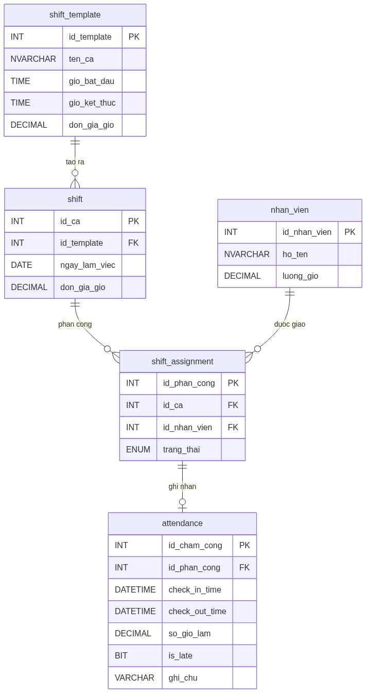

*Biểu đồ** 10*

### 6.2.4. Cơ chế Chấm công Sinh trắc học — Triệt tiêu Chấm công Hộ

Để ngăn chặn tình trạng **chấm công hộ (Buddy Punching)** — một vấn đề phổ biến trong ngành dịch vụ, ứng dụng di động tích hợp hai lớp bảo vệ:

| **Lớp** | **Công nghệ** | **Cơ chế hoạt động** |
| --- | --- | --- |
| Lớp 1: Vị trí | GPS Geofencing | Chỉ cho phép Check-in khi thiết bị nằm trong bán kính ≤ 100m từ tọa độ quán |
| Lớp 2: Danh tính | FaceID / Selfie AI | Chụp ảnh tại thời điểm Check-in, so sánh với ảnh đăng ký bằng thuật toán nhận diện khuôn mặt |

**Luồng xác thực:**

***Lưu trữ:** Ảnh selfie được mã hóa và lưu kèm bản ghi `attendance`, giữ tối thiểu 90 ngày để phục vụ kiểm toán nội bộ.*

### 6.2.5. Payroll Engine Đa biến — Tuân thủ NĐ 38/2022/NĐ-CP

Hệ thống loại bỏ công thức tính lương đơn giản và triển khai **động cơ tính lương đa biến** tuân thủ đầy đủ pháp luật lao động Việt Nam:

$$S_{total} = \sum_{i=1}^{n} \left( H_{basic,i} \times R \right) + \sum_{j=1}^{m} \left( H_{OT,j} \times R \times M_j \right) + \sum_{k=1}^{p} \left( H_{night,k} \times R \times N_k \right) + A_{total} - D_{total}$$

**Giải thích các biến số:**

| **Biến** | **Ý nghĩa** | **Giá trị theo luật** |
| --- | --- | --- |
| $H_{basic,i}$ | Giờ hành chính tiêu chuẩn |  |
| $R$ | Lương cơ bản theo giờ | ≥ 22.500 đ/giờ (Vùng I, 2024) |
| $H_{OT,j}$ | Giờ làm thêm (tăng ca) | ≤ 40h/tháng, ≤ 200h/năm |
| $M_j$ | Hệ số tăng ca | 1.5 (ngày thường) / 2.0 (ngày nghỉ) / 3.0 (Lễ, Tết) |
| $H_{night,k}$ | Giờ làm ca đêm (22:00–06:00) | Theo lịch thực tế |
| $N_k$ | Hệ số phụ cấp đêm | +30% (≥ 1.3); nếu vừa tăng ca vừa đêm → cộng thêm +20% |
| $A_{total}$ | Tổng phụ cấp (ăn ca, xăng xe...) | Theo chính sách quán |
| $D_{total}$ | Tổng khấu trừ (BHXH, đi muộn...) | Theo chính sách + pháp luật |

**Kiến trúc tách biệt hệ số khỏi mã nguồn:**

*Mọi hệ số $M_j$ và $N_k$ được lưu trong **Bảng ma trận cấu hình (Compliance Matrix)** riêng biệt trong CSDL, không hardcode vào logic code. Khi Chính phủ ban hành quy định mới, Nhân sự chỉ cần cập nhật bảng cấu hình mà **không cần phát hành phiên bản phần mềm mới**.*

| **Bảng** | **compliance_matrix** |
| --- | --- |
| loai_ca | ENUM: 'ngay_thuong', 'ngay_nghi', 'le_tet', 'ca_dem' |
| he_so | DECIMAL(4,2) — hệ số áp dụng |
| hieu_luc_tu | DATE — ngày bắt đầu hiệu lực |
| van_ban_phap_ly | VARCHAR — số nghị định tham chiếu |

#### 6.3.1. Lược đồ 4 bảng — Tách biệt Kế hoạch và Thực tế

Nguyên tắc thiết kế cốt lõi của UC04 là **tách biệt hoàn toàn** dữ liệu kế hoạch (Planning) khỏi dữ liệu thực tế (Actual), tương tự mô hình Planning vs. Actuals phổ biến trong kế toán quản trị:

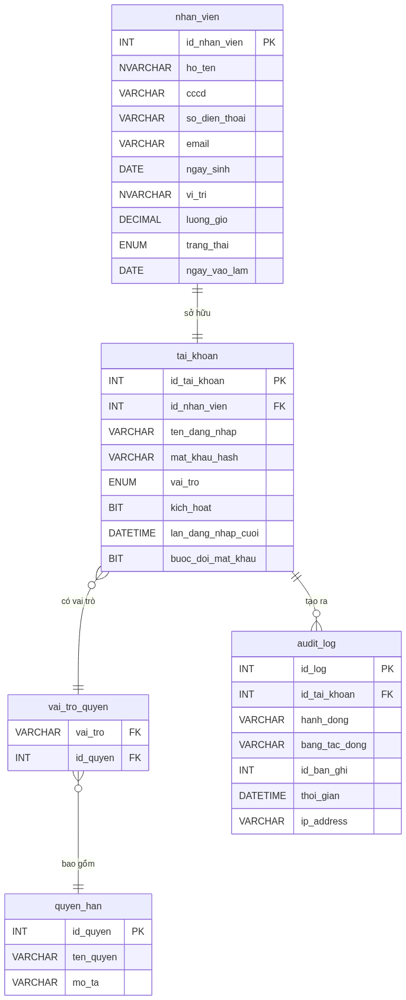

*Biểu đồ** 11*

***Ghi chú thiết kế:** 2 nhóm bảng trên tách biệt hoàn toàn **Kế hoạch** (shift_template, shift, shift_assignment) khỏi **Thực tế** (attendance), giúp dễ đối soát và kiểm toán.*

#### 6.3.2. Các Quy tắc Nghiệp vụ (Business Rules) cho UC04

| **Mã BR** | **Quy tắc** | **Cơ chế kiểm soát** |
| --- | --- | --- |
| BR-01 | Một nhân viên không thể có 2 ca chồng chéo thời gian trong cùng ngày | Trigger kiểm tra overlap khi INSERT vào shift_assignment |
| BR-02 | Chỉ có thể Check-out sau khi đã Check-in | check_out_time chỉ được UPDATE khi check_in_time IS NOT NULL |
| BR-03 | so_gio_lam không được tính nếu check_out_time IS NULL | Dùng CASE WHEN trong câu truy vấn tính lương |
| BR-04 | Giờ làm tối đa 16 giờ/ca; nếu vượt → đánh dấu cần xem xét thủ công | Constraint: CHECK(so_gio_lam <= 16) hoặc cờ needs_review = 1 |
| BR-05 | Ca cuối tuần (Thứ 7, Chủ nhật) được nhân hệ số 1.5 | Hàm tính lương kiểm tra DAYOFWEEK(ngay_lam_viec) trước khi áp đơn giá |

### 6.4. Biểu đồ Hoạt động (Activity Diagram) — Quy trình Chấm công toàn luồng


*Biểu đồ** 12*

### 6.5. Kiểm thử Use Case UC04

#### 6.5.1. Test Case cho UC04.3 (Check-in)

| **Mã TC** | **Kịch bản** | **Điều kiện đầu vào** | **Kết quả mong đợi** | **Trạng thái** |
| --- | --- | --- | --- | --- |
| TC-UC04-01 | Check-in thành công (đúng giờ) | Có ShiftAssignment hôm nay; chưa check-in; đúng giờ | Tạo Attendance; thông báo thành công | Chờ test |
| TC-UC04-02 | Check-in thành công (đến sớm) | Sớm hơn 30 phút |  | Chờ test |
| TC-UC04-03 | Check-in muộn | Muộn hơn 15 phút | Tạo Attendance; is_late = TRUE; thông báo có ghi chú muộn | Chờ test |
| TC-UC04-04 | Check-in khi không có ca | Không có ShiftAssignment hôm nay | Thông báo lỗi E1; không tạo Attendance | Chờ test |
| TC-UC04-05 | Check-in lần 2 trong cùng ca | Đã có Attendance với check_in_time | Thông báo lỗi E2; không ghi đè | Chờ test |

#### 6.5.2. Test Case cho UC04.5 (Tính lương)

| **Mã TC** | **Kịch bản** | **Dữ liệu đầu vào** | **Kết quả mong đợi** |
| --- | --- | --- | --- |
| TC-UC04-06 | Tính lương ca thường | 8 giờ làm, đơn giá 25.000đ/giờ | Lương = 8 × 25.000 = 200.000đ |
| TC-UC04-07 | Tính lương ca cuối tuần | 8 giờ làm, đơn giá 25.000đ/giờ, hệ số 1.5 | Lương = 8 × 25.000 × 1.5 = 300.000đ |
| TC-UC04-08 | Ca chưa check-out | check_out_time = NULL | so_gio_lam = 0; không tính vào lương |
| TC-UC04-09 | Tổng hợp cả tháng | 22 ca thường (8h) + 4 ca cuối tuần (8h) | L = 22×8×25k + 4×8×25k×1.5 = 4.400.000 + 1.200.000 = 5.600.000đ |

### 6.6. Đánh giá và Định hướng mở rộng UC04

**Những điểm mạnh của thiết kế hiện tại:**

Kiến trúc **4 bảng phân tách kế hoạch/thực tế** đảm bảo tính toàn vẹn dữ liệu và dễ đối soát.

Luồng ngoại lệ được xử lý tường minh, không để hệ thống ở trạng thái không xác định.

Business Rules được mã hóa thành Trigger và Constraint ở tầng CSDL, tránh phụ thuộc hoàn toàn vào tầng ứng dụng.

**Hướng mở rộng trong phiên bản tương lai:**

| **Tính năng** | **Mô tả** | **Độ phức tạp** |
| --- | --- | --- |
| Chấm công bằng QR Code | Nhân viên quét QR được tạo theo ca làm, giới hạn địa điểm | Trung bình |
| Tích hợp xử lý lương tự động | Xuất file Excel bảng lương và gửi email thông báo | Thấp |
| Phân tích chuyên cần | Dashboard thống kê tỷ lệ đi muộn, vắng mặt theo tháng | Cao |
| Phê duyệt tăng ca |  | Trung bình |

## CHƯƠNG 7: NGHIÊN CỨU CHUYÊN SÂU — USE CASE QUẢN LÝ NHÂN SỰ (UC07)

Chương này phân tích chuyên sâu **UC07 — Quản lý Tài khoản và Phân quyền Nhân sự**, bao gồm toàn bộ vòng đời quản lý hồ sơ nhân viên: từ tuyển dụng/onboarding, phân quyền hệ thống, đến chấm dứt hợp đồng. Đây là phân hệ nền tảng vì mọi UC khác đều phụ thuộc vào danh tính và quyền hạn được định nghĩa tại đây.

### 7.1. Biểu đồ Use Case chi tiết UC07

#### 7.1.1. Phân định các ca sử dụng con (Sub-Use Cases)

UC07 được phân rã thành các ca sử dụng con gắn với vòng đời nhân viên:

│ │

│ ┌──────────────────────┐ ┌────────────────────────┐ ┌──────────────────────────┐ │

│ │ nhân viên │ │ đăng nhập │ │ (Role-Based Access) │ │

│ └──────────────────────┘ └────────────────────────┘ └──────────────────────────┘ │

│ ▲ ▲ ▲ │

│ │«include» │«include» │«include» │

│ └──────────────────────────┴─────────────────────────────┘ │

│ │ │

│ ┌──────────────────────┐ │

│ └──────────────────────┘ │

│ │«extends» │

│ ┌──────────────────────┐ │

│ └──────────────────────┘ │

│ │«extends» │

│ ┌──────────────────────┐ │

│ │ UC07.6: Xem danh sách │ │

│ └──────────────────────┘ │

│ │

└────────────────────────────────────────────────────────────────────────────────────────┘

▲ ▲

│ │

[Manager] [Employee]

### 7.2. Đặc tả Use Case (Use Case Specification)

#### 7.2.1. Đặc tả UC07.1 — Thêm hồ sơ nhân viên mới

| **Trường** | **Nội dung** |
| --- | --- |
| Mã Use Case | UC07.1 |
| Tên Use Case | Thêm hồ sơ nhân viên mới (Onboarding) |
| Tác nhân chính | Manager |
| Tác nhân thứ cấp | Hệ thống (System), Nhân viên mới (người nhận tài khoản) |
| Điều kiện tiên quyết | Manager đã đăng nhập; có quyền MANAGE_EMPLOYEE |
| Điều kiện kết thúc (thành công) | Bản ghi nhan_vien và tai_khoan được tạo; tài khoản ở trạng thái kich_hoat; email thông báo được gửi đi |
| Điều kiện kết thúc (thất bại) | Không có bản ghi nào được tạo; hệ thống hiển thị lỗi cụ thể |
| Mức độ ưu tiên | Cao |

**Luồng sự kiện chính (Main Flow):**

| **Bước** | **Tác nhân** | **Hành động** |
| --- | --- | --- |
| 1 | Manager |  |
| 2 | Hệ thống | Hiển thị form nhập: Họ tên, CCCD, SĐT, Email, Ngày sinh, Vị trí công việc, Lương theo giờ |
| 3 | Manager | Điền đầy đủ thông tin và nhấn Lưu |
| 4 | Hệ thống | Validate dữ liệu đầu vào (kiểm tra CCCD trùng, SĐT định dạng, email hợp lệ) |
| 5 | Hệ thống | INSERT bản ghi vào bảng nhan_vien |
| 6 | Hệ thống | Tự động tạo tai_khoan với mat_khau ngẫu nhiên (8 ký tự); gán vai_tro mặc định = NHAN_VIEN |
| 7 | Hệ thống | Gửi email/SMS thông báo thông tin đăng nhập đến nhân viên mới |
| 8 | Hệ thống | Hiển thị thông báo: _"Thêm nhân viên thành công. Thông tin đăng nhập đã được gửi."_ |

**Luồng ngoại lệ (Exception Flows):**

| **Mã** | **Điều kiện kích hoạt** | **Xử lý** |
| --- | --- | --- |
| E1 | CCCD đã tồn tại trong hệ thống | Hiển thị: _"Nhân viên với CCCD này đã được đăng ký."_ Không INSERT. |
| E2 | Email không đúng định dạng | Highlight trường lỗi, thông báo: _"Email không hợp lệ."_ |
| E3 | Lương theo giờ < mức lương tối thiểu vùng | Cảnh báo: _"Mức lương thấp hơn quy định (22.500đ/giờ). Xác nhận tiếp tục?"_ |
| E4 | Gửi email thất bại | Vẫn tạo tài khoản thành công; ghi log lỗi gửi mail; Manager tự thông báo thủ công |

#### 7.2.2. Đặc tả UC07.2 — Cấp và Quản lý tài khoản đăng nhập

| **Trường** | **Nội dung** |
| --- | --- |
| Mã Use Case | UC07.2 |
| Tác nhân | Manager |
| Điều kiện tiên quyết | Nhân viên đã có hồ sơ trong hệ thống (UC07.1 đã thực hiện) |
| Kết quả | Tài khoản được cấp phát, cập nhật hoặc thu hồi đúng với trạng thái thực tế của nhân viên |

**Luồng sự kiện — Đặt lại mật khẩu:**

| **Bước** | **Hành động** |
| --- | --- |
| 1 | Manager chọn nhân viên → Đặt lại mật khẩu |
| 2 | Hệ thống tạo mật khẩu ngẫu nhiên mới và hash bằng BCrypt (salt 12 rounds) |
| 3 | Gửi mật khẩu tạm thời qua SMS/Email |
| 4 | Lần đăng nhập đầu, hệ thống bắt buộc nhân viên đổi mật khẩu mới |

#### 7.2.3. Đặc tả UC07.3 — Phân quyền RBAC

Hệ thống phân quyền theo mô hình **Role-Based Access Control (RBAC)**, quản lý 3 cấp độ vai trò:

| **Vai trò (Role)** | **Mã vai trò** | **Quyền hạn chính** |
| --- | --- | --- |
| Quản lý | MANAGER | Toàn quyền: CRUD nhân viên, phê duyệt lương, xem báo cáo, cấu hình hệ thống |
| Thu ngân | CASHIER | Tạo/đóng đơn hàng, xử lý thanh toán, in hóa đơn; xem lịch ca của bản thân |
| Nhân viên phục vụ | WAITER | Cập nhật trạng thái bàn, thêm món vào đơn; chấm công cá nhân |

**Ma trận phân quyền chi tiết:**

| **Chức năng** | **MANAGER** | **CASHIER** | **WAITER** |
| --- | --- | --- | --- |
| Xem danh sách nhân viên |  |  |  |
| Thêm/Sửa nhân viên |  |  |  |
| Phân công ca làm |  |  |  |
| Check-in/Check-out |  |  |  |
| Xem lịch sử chấm công |  |  |  |
| Duyệt điều chỉnh chấm công |  |  |  |
| Tạo đơn hàng |  |  |  |
| Xử lý thanh toán |  |  |  |
| Xem báo cáo doanh thu |  |  |  |
| Cấu hình thực đơn |  |  |  |

### 7.3. Biểu đồ Tuần tự (Sequence Diagram) — Luồng Check-in Nhân viên

Biểu đồ này mô tả chi tiết giao tiếp giữa các lớp trong kiến trúc phân lớp khi nhân viên thực hiện Check-in, tập trung vào việc **xác thực danh tính** và **kiểm tra phân công ca** trước khi ghi nhận:

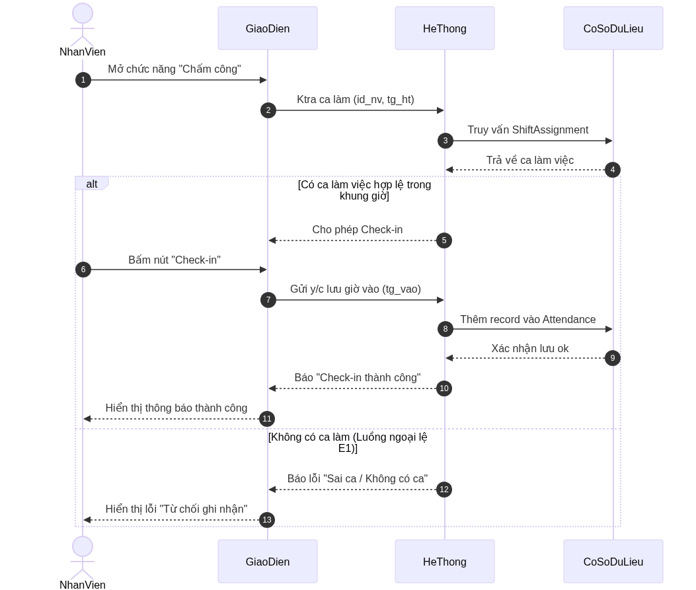

*Biểu đồ** 13*

**Giải thích các biến số:**

id_nv — Mã nhân viên (ID Nhân viên), lấy từ session đăng nhập.

tg_ht — Thời gian hiện tại, dùng để đối chiếu với bảng shift_assignment.

tg_vao — Thời gian Check-in thực tế, tương đương check_in_time trong bảng attendance.

### 7.4. Biểu đồ Hoạt động (Activity Diagram) — Quy trình Onboarding nhân viên mới

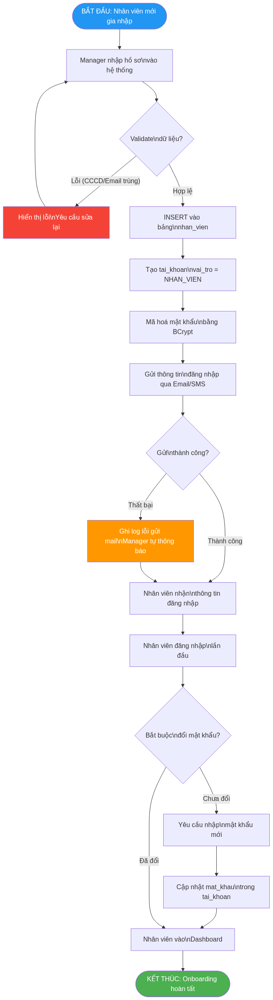

*Biểu đồ** 14*

### 7.5. Mô hình Dữ liệu (ERD) — Phân hệ Nhân sự

Lược đồ CSDL của phân hệ nhân sự được thiết kế tách bạch rõ ràng giữa **hồ sơ nhân sự** (thông tin cứng, ít thay đổi) và **tài khoản hệ thống** (thông tin xác thực, phân quyền):


*Biểu đồ** 15*

***Quyết định thiết kế:** Tách bảng `nhan_vien` và `tai_khoan` thay vì gộp chung nhằm tuân thủ **Nguyên tắc Phân tách mối quan tâm (Separation of Concerns)**. Khi nhân viên nghỉ việc, tài khoản bị `kich_hoat = 0` (không xóa) để bảo toàn toàn bộ lịch sử `audit_log` và dữ liệu chấm công phục vụ kiểm toán.*

### 7.6. Ràng buộc Nghiệp vụ (Business Rules)

| **Mã BR** | **Quy tắc** | **Cơ chế kiểm soát** |
| --- | --- | --- |
| BR-NS-01 | Mỗi nhân viên chỉ có đúng một tài khoản đăng nhập (quan hệ 1-1) | Unique Constraint trên tai_khoan.id_nhan_vien |
| BR-NS-02 | Mật khẩu phải được băm bằng BCrypt trước khi lưu; không lưu plain text | Xử lý tại tầng Service; không bao giờ lưu chuỗi gốc |
| BR-NS-03 | Lần đăng nhập đầu tiên bắt buộc đổi mật khẩu | Cờ buoc_doi_mat_khau = 1; middleware chặn mọi request trừ endpoint đổi mật khẩu |
| BR-NS-04 | Không được xóa vật lý (hard delete) bản ghi nhân viên | Chỉ đặt trang_thai = 'da_nghi_viec' và kich_hoat = 0 (Soft Delete) |
| BR-NS-05 | Mọi thao tác thêm/sửa/xoá nhân viên phải được ghi vào audit_log | Database Trigger AFTER INSERT/UPDATE/DELETE trên bảng nhan_vien và tai_khoan |
| BR-NS-06 | Không thể phân công ca cho nhân viên có tài khoản bị khóa | Trigger kiểm tra tai_khoan.kich_hoat = 1 trước khi INSERT vào shift_assignment |

### 7.7. Kiểm thử Use Case UC07

#### 7.7.1. Test Case cho UC07.1 (Thêm nhân viên)

| **Mã TC** | **Kịch bản** | **Điều kiện đầu vào** | **Kết quả mong đợi** | **Trạng thái** |
| --- | --- | --- | --- | --- |
| TC-UC07-01 | Thêm nhân viên thành công | Dữ liệu hợp lệ, CCCD chưa tồn tại | Tạo bản ghi nhan_vien + tai_khoan; email được gửi | Chờ test |
| TC-UC07-02 | CCCD đã tồn tại trong hệ thống | CCCD trùng với nhân viên khác | Hiển thị lỗi E1; không INSERT bất kỳ bản ghi nào | Chờ test |
| TC-UC07-03 | Email sai định dạng | email = "khong_hop_le" | Highlight lỗi, thông báo E2; không cho phép submit | Chờ test |
| TC-UC07-04 | Lương thấp hơn tối thiểu vùng | luong_gio = 15000 (< 22.500đ) | Hiển thị cảnh báo E3; Manager xác nhận mới lưu | Chờ test |
| TC-UC07-05 | Gửi email thất bại sau khi tạo xong | SMTP server down | Nhân viên vẫn được tạo; ghi log lỗi; không rollback | Chờ test |

#### 7.7.2. Test Case cho UC07.3 (Phân quyền RBAC)

| **Mã TC** | **Kịch bản** | **Điều kiện đầu vào** | **Kết quả mong đợi** | **Trạng thái** |
| --- | --- | --- | --- | --- |
| TC-UC07-06 | CASHIER truy cập chức năng quản lý nhân viên | Vai trò CASHIER gọi API /employees | HTTP 403 Forbidden; ghi audit_log | Chờ test |
| TC-UC07-07 |  | vai_tro = 'CASHIER' cho id_nv = 5 | Cập nhật tai_khoan.vai_tro; quyền hạn thay đổi ngay | Chờ test |
| TC-UC07-08 | Đăng nhập sau khi tài khoản bị khoá | kich_hoat = 0 | HTTP 401; thông báo: _"Tài khoản bị tạm khoá."_ | Chờ test |
| TC-UC07-09 | Xem lịch sử chấm công của người khác (WAITER) | WAITER gọi API chấm công id_nv = 10 | HTTP 403 Forbidden; chỉ được xem bản ghi của chính mình | Chờ test |

### 7.8. Đánh giá và Định hướng mở rộng UC07

**Những điểm mạnh của thiết kế hiện tại:**

Mô hình **Soft Delete** đảm bảo toàn vẹn dữ liệu lịch sử, đặc biệt quan trọng khi kiểm toán tài chính.

Kiến trúc **RBAC** với bảng vai_tro_quyen trung gian cho phép thêm/sửa quyền hạn mà không cần thay đổi mã nguồn.

**BCrypt (12 rounds)** cung cấp bảo vệ mật khẩu đủ mạnh, chịu được brute-force attack với phần cứng hiện đại.

**Audit Log** ở tầng CSDL (trigger) đảm bảo ghi nhận ngay cả khi ứng dụng gặp sự cố.

**Hướng mở rộng trong phiên bản tương lai:**

| **Tính năng** | **Mô tả** | **Độ phức tạp** |
| --- | --- | --- |
| Đăng nhập 2 yếu tố (2FA) | OTP qua SMS/Authenticator app tại mỗi lần đăng nhập | Trung bình |
| Single Sign-On (SSO) | Tích hợp đăng nhập qua Google Workspace cho chuỗi nhiều chi nhánh | Cao |
| Hợp đồng lao động điện tử | Lưu trữ và ký số hợp đồng ngay trong hệ thống | Cao |
| Dashboard phân tích nhân sự | Thống kê tỷ lệ turnover, thâm niên, Biểu đồ cơ cấu nhân sự | Trung bình |

## CHƯƠNG 8: NGHIÊN CỨU CHUYÊN SÂU — USE CASE BÁO CÁO DOANH THU - CHI PHÍ (UC05)

### 8.1. Biểu đồ Use Case

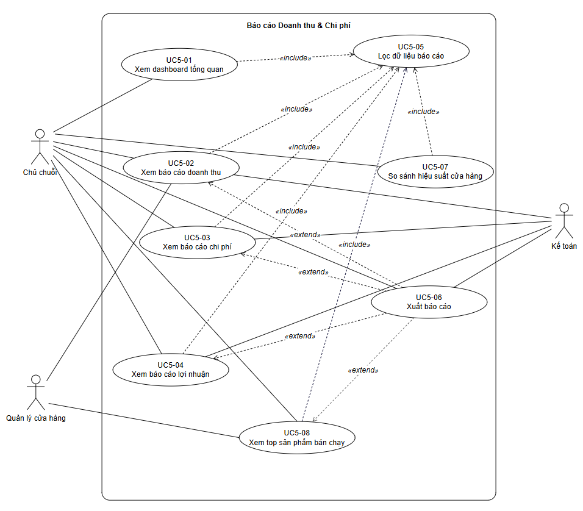

### 8.2. Đặc tả Use Case

8.2.1. Xem dashboard tổng quan

| **Thuộc tính** | **Nội dung** |
| --- | --- |
| Mã UC | UC5-01 |
| Tên UC | Xem Dashboard Tổng quan |
| Actor chính | Chủ chuỗi |
| Actor phụ | Không có |
| Mục tiêu | Cung cấp cho chủ chuỗi cái nhìn tổng quan về tình hình tài chính toàn hệ thống: tổng doanh thu, tổng chi phí, lợi nhuận và top cửa hàng doanh thu cao |
| Điều kiện tiên quyết | Người dùng đã đăng nhập với vai trò Chủ chuỗi |
| Điều kiện hậu nghiệm | Dashboard hiển thị đầy đủ số liệu tổng quan của hệ thống trong kỳ mặc định (tháng hiện tại) |
| Luồng sự kiện chính | 1. Chọn mục Dashboard tổng quan
 2. Hệ thống kiểm tra vai trò người dùng (Chủ chuỗi)
 3. Thu thập dữ liệu doanh thu từ tất cả cửa hàng
 4. Tính toán: tổng doanh thu, tổng chi phí, lợi nhuận (tháng hiện tại)
 5. Xếp hạng top cửa hàng theo doanh thu
 6. Hiển thị dashboard: các thẻ KPI, Biểu đồ xu hướng, bảng top cửa hàng
 7. Xem thông tin dashboard |
| Luồng thay thế | [A1] Không có dữ liệu trong kỳ: Hiển thị thông báo "Chưa có dữ liệu cho kỳ này", các thẻ KPI hiển thị giá trị 0 |
| Luồng ngoại lệ | [E1] Lỗi kết nối cơ sở dữ liệu: Hiển thị thông báo lỗi và đề xuất thử lại sau
 [E2] Timeout truy vấn: Hiển thị thông báo hết thời gian chờ, cho phép làm mới trang |
| Ghi chú | Dashboard mặc định hiển thị dữ liệu tháng hiện tại. Người dùng có thể kết hợp với UC5-05 để lọc theo kỳ khác |

8.2.2. Xem báo cáo doanh thu

8.2.3. Xem báo cáo chi phí

8.2.4. Xem báo cáo lợi nhuận

8.2.5. Lọc dữ liệu báo cáo

8.2.6. Xuất báo cáo

8.2.7. So sánh hiệu suất cửa hàng

8.2.8. Xem top sản phẩm bán chạy

### 8.3. Biểu đồ hoạt động Use Case

## CHƯƠNG 9: NGHIÊN CỨU CHUYÊN SÂU — USE CASE QUẢN LÝ DANH SÁCH CỬA HÀNG (UC06)

### 8.1. Biểu đồ Use Case

### 8.2. Đặc tả Use Case

### 8.3. Biểu đồ hoạt động Use Case

## TÀI LIỆU THAM KHẢO

## KẾT LUẬN

Bài tiểu luận này đã trình bày một cách có hệ thống và toàn diện toàn bộ vòng đời phát triển phần mềm (SDLC) cho Hệ thống Quản lý Quán Café, áp dụng nhất quán các phương pháp luận và công cụ chuẩn mực của ngành Công nghệ phần mềm.

**Tóm tắt thành quả chính:**

| **Chương** | **Giai đoạn SDLC** | **Thành quả chính** |
| --- | --- | --- |
| Chương 1 | Khảo sát & Đặc tả | 12 Yêu cầu chức năng (FR), 6 Yêu cầu phi chức năng (NFR), Ma trận rủi ro |
| Chương 2 | Phân tích & Thiết kế | Class Diagram 5 nhóm lớp, ERD chuẩn 3NF, Sequence/State Diagram, Kiến trúc 3-Tier |
| Chương 3 | Hiện thực & SQA | Tech Stack, Clean Code Pipeline, Tháp kiểm thử, 10+ Test Case, Kế hoạch bảo trì 4 loại |
| Chương 4 | Nghiên cứu UC04 | Đặc tả đầy đủ 5 luồng ngoại lệ, ERD 4 bảng nhân sự, 5 Business Rules, 9 Test Case |

**Bài học rút ra:** Quá trình thực hiện dự án khẳng định một nguyên lý căn bản trong kỹ nghệ phần mềm: _"Đầu tư vào giai đoạn đặc tả và thiết kế tốt sẽ giảm thiểu đáng kể chi phí sửa lỗi ở giai đoạn sau."_ Cụ thể, việc xây dựng Business Rule BR-01 (ngăn ca chồng chéo) bằng Database Trigger thay vì chỉ kiểm tra ở tầng ứng dụng là một quyết định thiết kế có tầm nhìn, đảm bảo toàn vẹn dữ liệu bất kể lỗi từ phía ứng dụng.

**Hướng phát triển tiếp theo:** Hệ thống hiện tại được xây dựng cho mô hình một chi nhánh. Để mở rộng lên quy mô chuỗi (multi-branch), cần nghiên cứu chuyển đổi sang kiến trúc microservices và bổ sung cơ chế đồng bộ dữ liệu phân tán — đây là bài toán nghiên cứu cho học phần Kiến trúc Phần mềm ở các cấp độ cao hơn.

## TÀI LIỆU THAM KHẢO