<center>**HỌC VIỆN CÔNG NGHỆ BƯU CHÍNH VIỄN THÔNG**</center>

<center>**KHOA CÔNG NGHỆ THÔNG TIN 1**</center>


<center>**BÁO CÁO BÀI TẬP LỚN**</center>

<center>**MÔN: NHẬP MÔN CÔNG NGHỆ PHẦN MỀM**</center>

<center>**Đề tài: Khảo Sát, Phân Tích Và Thiết Kế**</center>

<center>**Hệ Thống Quản Lý Quán Café**</center>


**Nhóm học phần:**

**Nhóm bài tập lớn:**

**Giảng viên: Ths. Mai Ngọc Lương**


<center>*Hà Nội, Tháng 04/2026*</center>

[[PAGEBREAK]]

## MỤC LỤC

[[TOC]]

[[PAGEBREAK]]

## LỜI MỞ ĐẦU

Trong bối cảnh chuyển đổi số ngày càng diễn ra mạnh mẽ, việc ứng dụng công nghệ thông tin vào quản lý nghiệp vụ không chỉ là một xu hướng tất yếu mà còn là yếu tố sống còn đối với các doanh nghiệp, đặc biệt là trong lĩnh vực dịch vụ ăn uống (F&B). Quản lý một quán café đòi hỏi sự phối hợp nhịp nhàng giữa nhiều bộ phận: từ khâu tiếp nhận đơn hàng, pha chế, thanh toán cho đến quản trị nhân sự và kiểm soát kho bãi. Dựa trên nền tảng kiến thức của học phần "Nhập môn Công nghệ phần mềm", bài tiểu luận này trình bày toàn bộ quy trình vòng đời phát triển phần mềm nhằm xây dựng một Hệ thống Quản lý Quán Café toàn diện. Nghiên cứu không chỉ dừng lại ở việc đặc tả yêu cầu mà còn đi sâu vào phân tích, thiết kế kiến trúc và đề xuất các biện pháp đảm bảo chất lượng phần mềm, với trọng tâm phân tích sâu ca sử dụng Quản lý ca làm việc và chấm công.

## MỞ ĐẦU: KẾ HOẠCH QUẢN LÝ DỰ ÁN (SPMP TÓM TẮT)

### Phân Bổ Nhiệm Vụ Nhóm

Nhóm thực hiện phân chia trách nhiệm theo nguyên tắc **phân công theo phân hệ (module-based assignment)** — mỗi thành viên chịu trách nhiệm toàn diện một phân hệ Use Case từ đặc tả đến thiết kế, cài đặt và kiểm thử:

| **Thành viên**       | **Phân hệ phụ trách**                                     | **Các bảng CSDL liên quan**                                                           | **Use Case** |
| -------------------- | --------------------------------------------------------- | ------------------------------------------------------------------------------------- | :----------: |
| **Thành**            | Bán hàng, Đơn hàng, Thanh toán & Hóa đơn, Quản lý bàn     | `hoa_don`, `hoa_don_chi_tiet`, `ban`, `khu_vuc`, `order_item_topping`                 |  UC02, UC03  |
| **Bảo**              | Quản lý menu (sản phẩm) và công thức pha chế              | `do_uong`, `nhom_do_uong`, `topping`, `cong_thuc`, `nguyen_lieu`                      |     UC01     |
| **Nguyễn Quang Đạo** | Quản lý nguyên liệu và tồn kho                            | `nguyen_lieu`, `nhap_kho`, `cong_thuc`, `canh_bao_kho`                                |     UC05     |
| **Nguyễn Viết Tùng** | Usecase quản lý chấm công và nhân sự                      | `nhan_vien`, `tai_khoan`, `shift_template`, `shift`, `shift_assignment`, `attendance` |     UC04     |
| **Hồng Nhung**       | Báo cáo doanh thu / chi phí và quản lý danh sách cửa hàng | `bao_cao_doanh_thu`, `chi_phi`, `danh_sach_cua_hang`, `hoa_don`                       |     UC06     |

---

## MỞ ĐẦU: KẾ HOẠCH QUẢN LÝ DỰ ÁN PHẦN MỀM (SPMP)

### 0.1. Mục đích, Phạm vi và Tầm nhìn Chiến lược

Dự án hướng tới xây dựng một nền tảng quản lý chuỗi café ứng dụng công nghệ **điện toán đám mây** và **trí tuệ nhân tạo (AI)**. Hệ thống không chỉ giải quyết bài toán vận hành cơ bản (POS, thu ngân, kho bãi) mà còn tối ưu hóa nguồn lực nhân sự thông qua phân hệ quản trị ca làm việc thông minh. Bộ sản phẩm bao gồm ba nền tảng tích hợp:

| **Nền tảng** | **Đối tượng** | **Công nghệ** |
| --- | --- | --- |
| Ứng dụng bảng điều khiển trên web | Quản lý cấp cao | React / Next.js, triển khai trên đám mây |
| Phần mềm POS máy tính bảng | Thu ngân | Android tablet, giao thức ESC/POS |
| Ứng dụng di động nhân viên | Nhân viên | Flutter, GPS + nhận diện khuôn mặt |

### 0.2. Kế hoạch Phát triển — Agile CI/CD

Dự án được tổ chức theo mô hình **Agile (Scrum)** kết hợp quy trình **Tích hợp và Triển khai liên tục (CI/CD)**:

**Tích hợp liên tục (CI):** Mã nguồn được hợp nhất tự động sau mỗi yêu cầu hợp nhất, kích hoạt bộ kiểm thử đơn vị và kiểm tra chất lượng mã lệnh (SonarQube). Hệ thống từ chối hợp nhất nếu độ bao phủ kiểm thử của mô-đun tính lương dưới 80%.

**Triển khai liên tục (CD):** Hệ thống được đóng gói dưới dạng **vùng chứa (Docker)** và triển khai lên môi trường đám mây với khả năng **tự động mở rộng** trong giờ cao điểm, bảo đảm hiệu năng không suy giảm khi lưu lượng tăng đột biến.


*Biểu đồ** 1*

### 0.3. Phân Bổ Nhiệm Vụ Nhóm

Nhằm đảm bảo tiến độ và chất lượng, nhóm thực hiện phân chia trách nhiệm theo nguyên tắc **phân công theo phân hệ**; mỗi thành viên chịu trách nhiệm toàn diện từ đặc tả đến thiết kế, cài đặt và kiểm thử cho một phân hệ ca sử dụng tương ứng:

| **Thành viên** | **Phân hệ phụ trách** | **Các bảng CSDL liên quan** | **Ca sử dụng** |
| --- | --- | --- | --- |
| Thành | Bán hàng, Quản lý khách hàng, Quản lý bàn phục vụ | hoa_don, hoa_don_chi_tiet, ban, khu_vuc, order_item_topping | UC1 |
| Tạ Bảo Anh Ngọc | Quản lý menu (sản phẩm) và công thức pha chế | do_uong, nhom_do_uong, topping, cong_thuc, nguyen_lieu | UC2 |
| Nguyễn Quang Đạo | Quản lý nguyên liệu và tồn kho | Cửa hàng, tồn kho, đơn hàng, sản phẩm, công thức, nguyên liệu, chi tiết công thức, giao dịch kho, chi tiết giao dịch kho | UC3 |
| Nguyễn Viết Tùng | Usecase quản lý chấm công và nhân sự | nhan_vien, tai_khoan, shift_template, shift, shift_assignment, attendance | UC4 |
| Ngô Thị Hồng Nhung | Báo cáo doanh thu / chi phí và quản lý danh sách cửa hàng | bao_cao_doanh_thu, chi_phi, danh_sach_cua_hang, hoa_don | UC5 + UC6 |

***Lưu ý****: Mỗi phân hệ UC liên quan đến 3–4 bảng dữ liệu, do đó mức độ phức tạp kỹ thuật của từng phần là tương đương nhau. Việc phân công theo phân hệ giúp tránh xung đột mã nguồn khi làm việc song song trên hệ thống quản lý phiên bản Git.*

**Sơ đồ tổng quan phân công:**

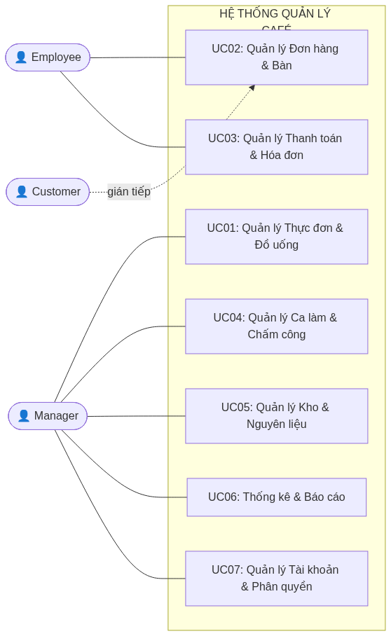

*Biểu đồ** 2*

## CHƯƠNG 1: TỔNG QUAN, KHẢO SÁT VÀ ĐẶC TẢ YÊU CẦU

### 1.1. Khảo sát và Định hình bài toán hiện trạng

#### 1.1.1. Phương pháp và Phạm vi khảo sát

Để thu thập dữ liệu đầu vào cho giai đoạn đặc tả, nhóm nghiên cứu đã triển khai quy trình khảo sát theo chuẩn kỹ nghệ phần mềm, kết hợp đồng thời ba kỹ thuật thu thập yêu cầu:

**Phỏng vấn có cấu trúc:** Tiến hành phỏng vấn sâu với chủ quán và trưởng ca nhằm khai thác các quy trình nghiệp vụ cốt lõi và các điểm nghẽn đang tồn tại.

**Quan sát thực địa:** Theo dõi quy trình xử lý đơn hàng trong ca bận (giờ cao điểm) để ghi nhận các thao tác thủ công dễ phát sinh lỗi.

**Phân tích tài liệu hiện tại:** Nghiên cứu sổ ghi tay chấm công, phiếu thu và danh sách thực đơn để hiểu cách dữ liệu đang được lưu trữ phi số hóa.

#### 1.1.2. Mô tả hiện trạng và các vấn đề tồn tại

Kết quả khảo sát phác họa bức tranh một hệ thống vận hành hoàn toàn thủ công với nhiều khâu dễ phát sinh sai sót. Cụ thể, quy trình từ lúc khách gọi món đến khi hóa đơn được in ra phải qua ít nhất bốn lần truyền đạt thông tin bằng miệng hoặc phiếu viết tay, dẫn đến tỷ lệ sai lệch đơn hàng cao. Bên cạnh đó, việc quản lý ca làm và chấm công được thực hiện bằng sổ nhật ký thủ công khiến quá trình đối soát lương cuối tháng tốn nhiều thời gian và thiếu tính khách quan.

Dưới góc độ phân tích SWOT của hệ thống hiện tại:

|  | **Điểm mạnh (S)** | **Điểm yếu (W)** |
| --- | --- | --- |
| Nội tại | Chi phí vận hành ban đầu thấp; nhân viên quen với quy trình | Dễ sai sót; không có dữ liệu lịch sử để phân tích; khó mở rộng |
|  | Cơ hội (O) | Thách thức (T) |
| Ngoại cảnh | Nhu cầu số hóa F&B ngày càng tăng; chi phí phần cứng POS giảm | Sức cạnh tranh từ các chuỗi café đã có hệ thống số; kỳ vọng trải nghiệm từ khách hàng Gen Z |

#### 1.1.3. Tầm nhìn và Phạm vi dự án

Từ những bất cập được nhận diện, tầm nhìn của dự án được phát biểu như sau: _"Xây dựng một nền tảng quản lý café tập trung, tự động hóa toàn bộ các quy trình vận hành cốt lõi — từ tiếp nhận đơn hàng, quản trị kho bãi đến chấm công nhân sự — nhằm loại bỏ sai sót thủ công, tối ưu hóa nguồn lực và nâng cao trải nghiệm thực khách."_

Phạm vi hệ thống được khoanh vùng rõ ràng: hệ thống phục vụ tối đa cho một chi nhánh café đơn lẻ với quy mô không quá 50 bàn và 20 nhân viên, chạy trên nền tảng Windows 7 trở lên và tích hợp với thiết bị POS chuẩn thị trường.

### 1.2. Xác định Tác nhân và Biểu đồ Ca sử dụng tổng quát

#### 1.2.1. Phân định và Đặc tả chi tiết từng Tác nhân

Hệ thống được thiết kế với cơ chế phân quyền người dùng theo mô hình RBAC, phân cấp thành ba nhóm tác nhân chính:

**a. Cấp Quản lý**

*Đây là tác nhân nắm quyền cao nhất trong hệ thống, chịu trách nhiệm toàn diện về cấu hình và giám sát.*

Các chức năng chính của Quản lý bao gồm: thiết lập danh mục thực đơn và giá bán, quản trị tài khoản người dùng, lập kế hoạch ca làm việc, phê duyệt điều chỉnh lương, giám sát tồn kho theo ngưỡng cảnh báo, và truy xuất báo cáo doanh thu theo ngày/tháng.

**b. Nhân viên nghiệp vụ**

*Tác nhân trực tiếp tạo ra giá trị dịch vụ, tương tác với hệ thống thường xuyên nhất.*

Nhóm nhân viên được phân vai chuyên biệt:

**Thu ngân:** Tạo, sửa, tính tiền và đóng hóa đơn; tiếp nhận thanh toán đa hình thức (tiền mặt, thẻ, QR).

**Phục vụ:** Cập nhật trạng thái bàn, thêm món vào đơn đang mở, phản hồi yêu cầu của thực khách.

**Pha chế:** Nhận thông báo đơn hàng qua màn hình pha chế (KDS), cập nhật trạng thái sẵn sàng của từng đồ uống.

**c. Khách hàng**

*Tác nhân thụ hưởng kết quả của hệ thống, tương tác gián tiếp.*

Khách hàng không đăng nhập vào hệ thống nhưng là đối tượng trung tâm của toàn bộ nghiệp vụ. Trong các mô hình café hiện đại, khách hàng có thể tương tác trực tiếp thông qua giao diện tự đặt món hoặc mã QR đặt bàn — đây là hướng mở rộng tiềm năng của hệ thống.

**d. Tác nhân AI** _(tác nhân phi người dùng)_

*Tác nhân tự động chạy ngầm, không tương tác trực tiếp với người dùng.*

Đây là thành phần trí tuệ nhân tạo của hệ thống, bao gồm ba mô-đun:

**Bộ máy dự báo nhu cầu:** Phân tích lịch sử bán hàng kết hợp dữ liệu thời tiết để dự báo nhu cầu nguyên liệu, tự động đề xuất phiếu nhập kho — giảm thiểu lãng phí thực phẩm.

**Bộ tối ưu lịch làm việc:** Đề xuất lịch làm việc tối ưu dựa trên dự báo lưu lượng khách hàng theo ngày/khung giờ.

**Bộ phân tích hành vi khách hàng:** Phân cụm hành vi mua hàng (K-Means) để cá nhân hóa chương trình khuyến mãi và gợi ý bán thêm cho từng nhóm khách hàng thân thiết.

#### 1.2.2. Biểu đồ Ca sử dụng tổng quát (mô tả văn bản)

Biểu đồ ca sử dụng tổng quát thể hiện phạm vi hệ thống và các tương tác giữa tác nhân với các ca sử dụng:


*Biểu đồ** 3*

### 1.3. Đặc tả Yêu cầu Chức năng

Yêu cầu chức năng được thu thập, phân loại và đánh mã theo chuẩn IEEE 830, đảm bảo tính truy vết (traceability) từ yêu cầu đến thiết kế:

| **Mã YC** | **Phân hệ** | **Mô tả yêu cầu** | **Mức độ ưu tiên** |
| --- | --- | --- | --- |
| FR-01 | Đơn hàng | Nhân viên có thể tạo mới, sửa đổi và hủy đơn hàng trên bàn đang hoạt động | Cao |
| FR-02 | Đơn hàng | Hệ thống tự động gửi thông báo cho khu vực pha chế khi có đơn mới | Cao |
| FR-03 | Bàn | Trạng thái bàn cập nhật theo thời gian thực, không cần làm mới trang | Cao |
| FR-04 | Thanh toán | Hỗ trợ tối thiểu 3 hình thức thanh toán: tiền mặt, thẻ và QR Pay | Trung bình |
| FR-05 | Thanh toán | Hóa đơn có thể xuất ra máy in nhiệt theo định dạng chuẩn | Cao |
| FR-06 | Kho | Tự động cập nhật tồn kho khi đơn hàng được xác nhận, theo công thức Recipe | Cao |
| FR-07 | Kho | Cảnh báo khi tồn kho nguyên liệu xuống dưới ngưỡng tối thiểu định trước | Trung bình |
| FR-08 | Nhân sự | Quản lý tạo và phân công ca làm cho từng nhân viên theo ngày/tuần | Cao |
| FR-09 | Nhân sự | Nhân viên thực hiện vào ca và kết thúc ca, hệ thống ghi nhận giờ làm thực tế | Cao |
| FR-10 | Nhân sự | Hệ thống tính lương theo 2 loại ca cố định: ca sáng và ca tối; áp dụng hệ số riêng cho ngày thường, cuối tuần và ngày lễ | Cao |
| FR-11 | Báo cáo | Tổng hợp và trực quan hóa doanh thu theo ngày, tuần, tháng | Trung bình |
| FR-12 | Báo cáo | Thống kê top 10 mặt hàng bán chạy nhất trong kỳ được chọn | Thấp |
| FR-13 | AI — Kho | Module AI dự báo nhu cầu nguyên liệu dựa trên lịch sử bán hàng và yếu tố thời tiết, tự động tạo đề xuất phiếu nhập | Trung bình |
| FR-14 | AI — Nhân sự | Module AI tự động đề xuất lịch phân ca dựa trên dự báo lưu lượng khách hàng theo ngày/giờ | Trung bình |
| FR-15 | Chấm công | Ứng dụng di động hỗ trợ chấm công bằng định vị theo vùng (GPS) kết hợp xác thực khuôn mặt hoặc ảnh tự chụp, ngăn chặn chấm công hộ | Cao |
| FR-16 | Khách hàng | Hệ thống quản lý khách hàng thân thiết; AI phân cụm hành vi để cá nhân hóa khuyến mãi và gợi ý up-selling | Thấp |

### 1.4. Đặc tả Yêu cầu Phi chức năng

Yêu cầu phi chức năng là các ràng buộc chất lượng hệ thống, không trực tiếp mô tả hành vi mà quy định **cách** hệ thống thực hiện. Chúng được phân tích theo mô hình chất lượng ISO/IEC 25010:

| **Thuộc tính** | **Yêu cầu cụ thể** | **Cách đo lường** |
| --- | --- | --- |
| Hiệu năng | Thời gian phản hồi mọi thao tác nghiệp vụ dưới 3 giây trong điều kiện mạng LAN bình thường | Đo bằng công cụ phân tích hiệu năng khi tải 20 người dùng đồng thời |
| Tính sẵn sàng | Hệ thống hoạt động liên tục; thời gian phục hồi dưới 30 phút khi có sự cố | Theo dõi nhật ký thời gian hoạt động; kịch bản diễn tập phục hồi dữ liệu |
| Bảo mật | Phân quyền RBAC nghiêm ngặt; mật khẩu được băm bằng BCrypt; nhật ký thao tác lưu tối thiểu 90 ngày | Kiểm tra thâm nhập mức cơ bản |
| Tính khả dụng | Nhân viên mới (không có kỹ năng CNTT) có thể thành thạo các chức năng cơ bản sau không quá 2 giờ đào tạo | Kiểm thử người dùng với mẫu 5 nhân viên mới |
| Tính tương thích (Compatibility) | Chạy ổn định trên Windows 7 SP1 trở lên; tương thích với máy in nhiệt chuẩn ESC/POS | Kiểm thử trên 3 cấu hình phần cứng POS phổ biến tại thị trường Việt Nam |
| Khả năng bảo trì | Mã nguồn đạt độ bao phủ kiểm thử từ 70% trở lên; tài liệu hóa đầy đủ tại mọi mô-đun | Đo bằng JaCoCo hoặc công cụ tương đương |

### 1.5. Phân tích rủi ro dự án

Nhằm chủ động kiểm soát các nguy cơ có thể ảnh hưởng đến tiến độ và chất lượng, nhóm thực hiện một phân tích rủi ro sơ bộ theo ma trận Xác suất × Tác động:

| **Rủi ro** | **Xác suất** | **Tác động** | **Biện pháp giảm thiểu** |
| --- | --- | --- | --- |
| Yêu cầu thay đổi giữa chừng (phình phạm vi) | Cao | Cao | Sử dụng đặc tả ca sử dụng làm tài liệu ký kết; áp dụng quy trình quản lý thay đổi |
| Thiếu dữ liệu thực tế để kiểm thử | Trung bình | Trung bình | Sinh dữ liệu mẫu mô phỏng hoạt động thực tế |
| Thành viên nhóm vắng giữa sprint | Thấp | Cao | Phân công chéo nghiệp vụ; tài liệu hóa handover |
| Lỗi tích hợp phần cứng POS | Trung bình | Cao | Kiểm thử thiết bị từ sớm; chuẩn bị driver dự phòng |

## CHƯƠNG 1: TỔNG QUAN HỆ THỐNG VÀ PHÂN CÔNG NHÓM

> **Mục tiêu chương:** Trình bày bức tranh toàn cảnh gồm 6 phân hệ ca sử dụng, tác nhân, yêu cầu chức năng và yêu cầu phi chức năng. Phần này chiếm khoảng 10% báo cáo.

### 1.1. Bối cảnh và Tầm nhìn Dự án

Dự án xây dựng nền tảng quản lý café tích hợp, giải quyết đồng thời bài toán vận hành (POS, thu ngân, kho bãi) và quản trị nhân sự. Bộ sản phẩm gồm ba nền tảng:

| **Nền tảng**               | **Đối tượng**   | **Công nghệ**                     |
| -------------------------- | --------------- | --------------------------------- |
| Ứng dụng bảng điều khiển trên web | Quản lý cấp cao | React / Next.js, triển khai trên đám mây |
| Phần mềm POS máy tính bảng | Thu ngân        | Android tablet, giao thức ESC/POS |
| Ứng dụng di động nhân viên | Nhân viên       | Flutter, GPS + nhận diện khuôn mặt |

---

### 1.2. Biểu đồ Ca sử dụng Tổng quát

Biểu đồ thể hiện phạm vi hệ thống và tương tác giữa tác nhân với 6 ca sử dụng. **UC04 (tô màu tím)** là trọng tâm phân tích chuyên sâu của báo cáo này.

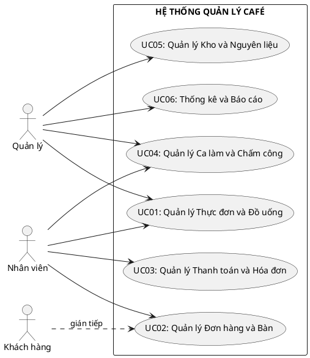

---

### 1.3. Bảng Tóm tắt Chức năng Toàn Hệ thống

|  **UC**  | **Phân hệ**             | **Chức năng cốt lõi**                                                                             | **Người phụ trách**  |       **Mức chi tiết**       |
| :------: | ----------------------- | ------------------------------------------------------------------------------------------------- | -------------------- | :--------------------------: |
|   UC01   | Thực đơn & Đồ uống      | CRUD sản phẩm, nhóm, topping, công thức pha chế                                                   | Bảo                  |           Tóm tắt            |
|   UC02   | Đơn hàng & Bàn          | Tạo/sửa đơn, quản lý trạng thái bàn theo thời gian thực                                            | Thành                |           Tóm tắt            |
|   UC03   | Thanh toán & Hóa đơn    | Xử lý thanh toán đa kênh (tiền mặt/thẻ/QR), in hóa đơn                                            | Thành                |           Tóm tắt            |
|   UC05   | Kho & Nguyên liệu       | Nhập kho, trừ tồn theo công thức pha chế, cảnh báo ngưỡng                                          | Nguyễn Quang Đạo     |           Tóm tắt            |
|   UC06   | Báo cáo & Cửa hàng      | Thống kê doanh thu, top sản phẩm, quản lý chi nhánh                                               | Hồng Nhung           |           Tóm tắt            |
| **UC04** | **Nhân sự & Chấm công** | **Usecase quản lý chấm công và nhân sự: hồ sơ nhân viên, phân ca sáng/tối, chấm công bằng GPS, tính lương theo ca với hệ số cuối tuần/lễ, RBAC** | **Nguyễn Viết Tùng** | **Chuyên sâu (Chương 3)** |

---

### 1.4. Yêu cầu Chức năng

Yêu cầu chức năng được phân loại theo chuẩn **IEEE 830**, đảm bảo tính truy vết từ yêu cầu đến thiết kế:

| **Mã**    | **Phân hệ**   | **Mô tả yêu cầu**                                                                                              | **Ưu tiên** |
| --------- | ------------- | -------------------------------------------------------------------------------------------------------------- | :---------: |
| FR-01     | Đơn hàng      | Nhân viên tạo mới, sửa đổi và hủy đơn hàng trên bàn đang hoạt động                                             |     Cao     |
| FR-02     | Đơn hàng      | Hệ thống tự động thông báo khu vực pha chế khi có đơn mới                                                      |     Cao     |
| FR-03     | Bàn           | Trạng thái bàn cập nhật theo thời gian thực, không cần làm mới trang                                           |     Cao     |
| FR-04     | Thanh toán    | Hỗ trợ tối thiểu 3 hình thức: tiền mặt, thẻ và QR Pay                                                          | Trung bình  |
| FR-05     | Thanh toán    | Hóa đơn xuất ra máy in nhiệt theo định dạng chuẩn ESC/POS                                                      |     Cao     |
| FR-06     | Kho           | Tự động cập nhật tồn kho khi đơn xác nhận, theo công thức Recipe                                               |     Cao     |
| FR-07     | Kho           | Cảnh báo khi tồn kho xuống dưới ngưỡng tối thiểu                                                               | Trung bình  |
| **FR-08** | **Nhân sự**   | **Quản lý tạo và phân công ca làm cho từng nhân viên theo ngày/tuần**                                          |   **Cao**   |
| **FR-09** | **Nhân sự**   | **Nhân viên chấm công vào ca và kết thúc ca, hệ thống ghi nhận giờ làm thực tế**                               |   **Cao**   |
| **FR-10** | **Nhân sự**   | **Tính lương theo 2 loại ca cố định: ca sáng và ca tối; có hệ số riêng cho ngày thường, cuối tuần và ngày lễ** |   **Cao**   |
| **FR-15** | **Chấm công** | **Chấm công bằng định vị GPS theo vùng kết hợp xác thực khuôn mặt, ngăn chấm công hộ**                         |   **Cao**   |
| FR-11     | Báo cáo       | Tổng hợp và trực quan hóa doanh thu theo ngày/tuần/tháng                                                       | Trung bình  |
| FR-12     | Báo cáo       | Thống kê top 10 mặt hàng bán chạy nhất trong kỳ                                                                |    Thấp     |
| FR-13     | AI — Kho      | Module AI dự báo nhu cầu nguyên liệu, tự động tạo đề xuất phiếu nhập                                           |  Kiến nghị  |
| FR-14     | AI — Nhân sự  | Module AI tự động đề xuất lịch phân ca theo dự báo lưu lượng khách                                             |  Kiến nghị  |
| FR-16     | Khách hàng    | Quản lý khách hàng thân thiết; AI cá nhân hóa khuyến mãi                                                       |  Kiến nghị  |

> **Lưu ý:** FR-08, FR-09, FR-10, FR-15 (in đậm) là trọng tâm phân tích của báo cáo, được đặc tả đầy đủ tại Chương 3.

---

### 1.5. Yêu cầu Phi chức năng

Phân tích theo mô hình chất lượng **ISO/IEC 25010**:

| **Thuộc tính**    | **Yêu cầu cụ thể**                                             | **Cách đo lường**       |
| ----------------- | -------------------------------------------------------------- | ----------------------- |
| **Hiệu năng**     | Phản hồi dưới 3 giây trong điều kiện LAN, 20 người dùng đồng thời | Công cụ phân tích hiệu năng |
| **Tính sẵn sàng** | Hoạt động liên tục; thời gian phục hồi dưới 30 phút khi có sự cố | Nhật ký thời gian hoạt động |
| **Bảo mật**       | RBAC nghiêm ngặt; mật khẩu băm bằng BCrypt; nhật ký thao tác lưu ít nhất 90 ngày | Kiểm tra thâm nhập cơ bản |
| **Tính khả dụng** | Nhân viên mới thành thạo chức năng cơ bản sau không quá 2 giờ đào tạo | Kiểm thử người dùng với 5 người |
| **Tương thích**   | Windows 7 SP1+; máy in nhiệt chuẩn ESC/POS                     | Kiểm thử 3 cấu hình POS |
| **Bảo trì**       | Độ bao phủ kiểm thử từ 70% trở lên; tài liệu hóa đầy đủ        | JaCoCo                  |

---

### 1.6. Phân tích Rủi ro Dự án

| **Rủi ro**                                | **Xác suất** | **Tác động** | **Biện pháp giảm thiểu**                                      |
| ----------------------------------------- | :----------: | :----------: | ------------------------------------------------------------- |
| Yêu cầu thay đổi giữa chừng (phình phạm vi) |     Cao      |     Cao      | Đặc tả ca sử dụng làm tài liệu ký kết; quản lý thay đổi |
| Thiếu dữ liệu thực tế để kiểm thử         |  Trung bình  |  Trung bình  | Sinh dữ liệu mẫu mô phỏng thực tế |
| Thành viên nhóm vắng giữa sprint          |     Thấp     |     Cao      | Phân công chéo; tài liệu handover                             |
| Lỗi tích hợp phần cứng POS                |  Trung bình  |     Cao      | Kiểm thử thiết bị sớm; driver dự phòng                        |

---

## CHƯƠNG 2: THIẾT KẾ KIẾN TRÚC VÀ CƠ SỞ DỮ LIỆU

> **Mục tiêu chương:** Trình bày kiến trúc triển khai 3 tầng và lược đồ quan hệ thực thể chi tiết cho nhóm bảng UC04 (Nhân sự). Chiếm khoảng 15% báo cáo.

### 2.1. Kiến trúc Triển khai 3 Tầng

Hệ thống áp dụng kiến trúc **3 lớp** nhằm tách biệt ba mối quan tâm: hiển thị, xử lý nghiệp vụ và lưu trữ dữ liệu:

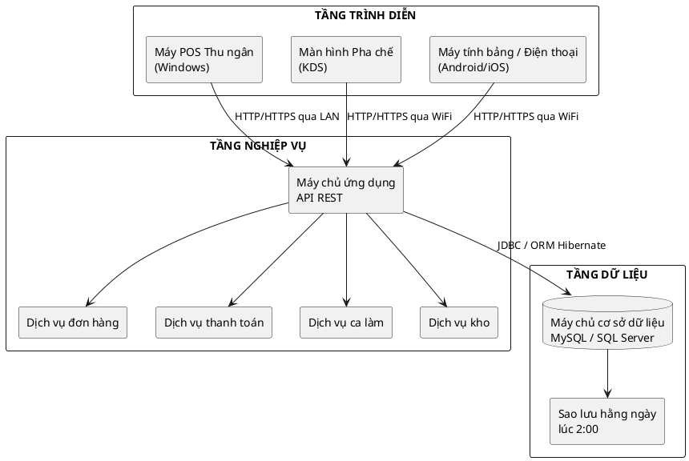


### 2.2. Quyết định Kiến trúc và Đánh đổi

| **Quyết định** | **Lý do lựa chọn** | **Đánh đổi** |
| -------------- | ------------------ | ------------ |
| REST API thay vì kết nối CSDL trực tiếp | Bảo mật cao hơn; tách biệt logic | Tăng độ trễ nhỏ |
| MySQL/SQL Server thay vì NoSQL | ACID cho nghiệp vụ tài chính | Kém linh hoạt khi schema đổi thường xuyên |
| LAN nội bộ (triển khai tại chỗ) | Chi phí thấp; bảo mật dữ liệu | Không truy cập từ xa nếu không có VPN |
| Ứng dụng máy tính trên Windows | Tương thích POS; trình điều khiển máy in ổn định | Khó hỗ trợ đa nền tảng |

**Bảo mật tầng triển khai:**
- **TLS 1.2+:** Mã hóa toàn bộ giao tiếp giữa thiết bị khách và máy chủ API.
- **Tường lửa cơ sở dữ liệu:** Chỉ máy chủ ứng dụng được kết nối tới cơ sở dữ liệu; thiết bị khách không truy cập trực tiếp.
- **Nhật ký thao tác:** Mọi thao tác thêm/sửa/xóa được ghi vào `audit_log` kèm thời điểm và mã nhân viên.

---

### 2.3. Tổng quan Lược đồ CSDL — Nhóm Bảng Toàn Hệ thống

Hệ thống gồm **5 nhóm bảng** tương ứng với 5 phân hệ UC, đều chuẩn hóa 3NF:

| **Nhóm bảng** | **Bảng chính** | **UC** |
|---|---|:---:|
| Thực đơn | `do_uong`, `nhom_do_uong`, `topping`, `cong_thuc` | UC01 |
| Giao dịch | `hoa_don`, `hoa_don_chi_tiet`, `ban`, `khu_vuc` | UC02, UC03 |
| Kho | `nguyen_lieu`, `nhap_kho`, `canh_bao_kho` | UC05 |
| Báo cáo | `bao_cao_doanh_thu`, `chi_phi`, `danh_sach_cua_hang` | UC06 |
| **Nhân sự** *(trọng tâm)* | **`nhan_vien`, `tai_khoan`, `shift_template`, `shift`, `shift_assignment`, `attendance`** | **UC04** |

> **Nguyên tắc chụp ảnh dữ liệu tại thời điểm chốt công:** Mức lương theo ca tại thời điểm chốt công được lưu cố định cùng kỳ tính lương, bảo đảm lịch sử tài chính không đổi khi đơn giá ca được điều chỉnh.

### 2.4. ERD Chi tiết — Nhóm Bảng Nhân sự (UC04)

Nguyên tắc thiết kế cốt lõi của UC04 là **tách biệt hoàn toàn** dữ liệu kế hoạch khỏi dữ liệu thực tế, tương tự mô hình đối chiếu kế hoạch và thực tế phổ biến trong kế toán quản trị:

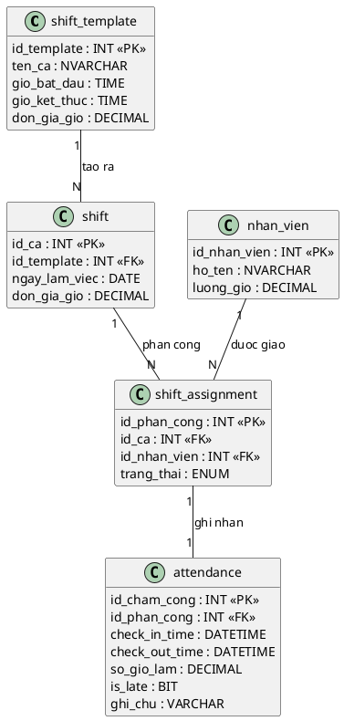

> **Ghi chú thiết kế:** Tách biệt **Kế hoạch** (`shift_template`, `shift`, `shift_assignment`) khỏi **Thực tế** (`attendance`) — cho phép đối soát chênh lệch (đi muộn/về sớm) và kiểm toán lao động minh bạch.

### 2.5. Quy tắc nghiệp vụ tầng CSDL — UC04

| **Mã BR** | **Quy tắc** | **Cơ chế kiểm soát** |
| --------- | ----------- | -------------------- |
| BR-01 | Không thể có 2 ca chồng chéo giờ trong cùng ngày | Trigger kiểm tra overlap khi INSERT vào `shift_assignment` |
| BR-02 | Chỉ kết thúc ca sau khi đã vào ca | `check_out_time` chỉ UPDATE khi `check_in_time IS NOT NULL` |
| BR-03 | Chỉ ca có đủ `check_in_time` và `check_out_time` mới được đưa vào bảng lương | `CASE WHEN` hoặc cờ trạng thái hợp lệ khi tổng hợp lương |
| BR-04 | Giờ làm tối đa 16h/ca; nếu vượt thì đánh dấu xem xét thủ công | `CHECK(so_gio_lam <= 16)` hoặc cờ `needs_review = 1` |
| BR-05 | Mỗi ca phải thuộc đúng 1 trong 2 loại: `sang` hoặc `toi` | Ràng buộc ENUM hoặc kiểm tra hợp lệ tại bảng `shift_template` và `shift` |

---

## CHƯƠNG 2: Xây dựng Biểu đồ lớp thực thể

Biểu đồ Lớp là công cụ mô hình hóa cấu trúc tĩnh (static structure) của hệ thống, thể hiện các lớp đối tượng, thuộc tính, phương thức và mối quan hệ giữa chúng. Các lớp cốt lõi của hệ thống được thiết kế theo nguyên tắc **Separation of Concerns** (Phân tách mối quan tâm):

### 2.1. Phân tích

### 2.2. Đặc tả

| **Tên thực thể** |  | **Mô tả** |
| --- | --- | --- |
| Store |  |  |
| Order |  |  |
| OrderItem |  |  |
| CafeTable |  |  |
| TableSession |  |  |
| Revenue |  |  |
| CostOfGoodSold |  |  |
| Product |  |  |
| Category |  |  |
| ProductVariant |  |  |
| Topping |  |  |
| Ingredient |  |  |
| Recipe |  |  |
| Inventory |  |  |
| InventoryTransaction |  |  |
| Employee |  |  |
| Shift |  |  |
| ShiftTemplate |  |  |
| Attendance |  |  |

**Các mối quan hệ đáng chú ý:**

HoaDon — Ban: Quan hệ **Liên kết (Association)** 1–1 tại một thời điểm (một bàn có tối đa một hóa đơn đang mở).

HoaDon — HoaDonChiTiet — DoUong: Quan hệ **Tổng hợp (Aggregation)** và **Liên kết N-N** được giải quyết qua bảng trung gian.

DoUong — CongThuc — NguyenLieu: Quan hệ **Phụ thuộc (Dependency)** thể hiện công thức pha chế.

TaiKhoan — NhanVien: Quan hệ **Kết hợp (Composition)** — một tài khoản gắn với đúng một nhân viên.

### 2.3. Vẽ Biểu đồ

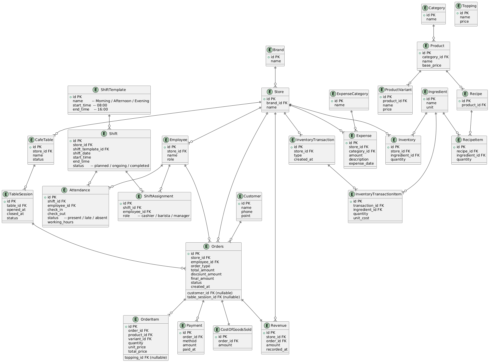

## CHƯƠNG 3: NGHIÊN CỨU CHUYÊN SÂU — UC04: QUẢN LÝ CA LÀM VIỆC, CHẤM CÔNG & PHÂN QUYỀN

> **Trái tim của báo cáo — Chiếm ~50%.** Đặc tả đầy đủ nghiệp vụ UC04 do **Nguyễn Viết Tùng** phụ trách: phân công ca, check-in/out sinh trắc học, tính lương theo 2 ca sáng/tối có hệ số cuối tuần/ngày lễ và phân quyền RBAC.

### 3.1. Biểu đồ Use Case Chi tiết UC04


UC04 được phân rã thành các ca sử dụng con độc lập, có thể được phân công cho các thành viên nhóm khác nhau:

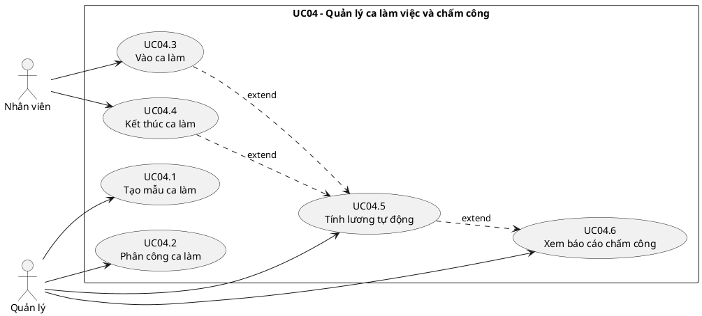

### 3.2. Quản lý Tài khoản, Phân quyền RBAC và Onboarding

> Quyền truy cập hệ thống là tiền điều kiện của mọi luồng nghiệp vụ trong UC06. Phân hệ RBAC được tích hợp trực tiếp vào đây thay vì để riêng.


| **Trường**                          | **Nội dung**                                                                                                   |
| ----------------------------------- | -------------------------------------------------------------------------------------------------------------- |
| **Mã Use Case**                     | UC07.1                                                                                                         |
| **Tên Use Case**                    | Thêm hồ sơ nhân viên mới (Onboarding)                                                                          |
| **Tác nhân chính**                  | Manager                                                                                                         |
| **Tác nhân thứ cấp**                | Hệ thống (System), Nhân viên mới (người nhận tài khoản)                                                        |
| **Điều kiện tiên quyết**            | Manager đã đăng nhập; có quyền `MANAGE_EMPLOYEE`                                                               |
| **Điều kiện kết thúc (thành công)** | Bản ghi `nhan_vien` và `tai_khoan` được tạo; tài khoản ở trạng thái `kich_hoat`; email thông báo được gửi đi  |
| **Điều kiện kết thúc (thất bại)**   | Không có bản ghi nào được tạo; hệ thống hiển thị lỗi cụ thể                                                   |
| **Mức độ ưu tiên**                  | Cao                                                                                                             |

**Luồng sự kiện chính (Main Flow):**

| **Bước** | **Tác nhân** | **Hành động**                                                                                           |
| -------- | ------------ | ------------------------------------------------------------------------------------------------------- |
| 1        | Manager      | Truy cập menu **Nhân sự > Thêm nhân viên**                                                              |
| 2        | Hệ thống     | Hiển thị form nhập: Họ tên, CCCD, SĐT, Email, Ngày sinh, Vị trí công việc, Lương theo giờ              |
| 3        | Manager      | Điền đầy đủ thông tin và nhấn **Lưu**                                                                   |
| 4        | Hệ thống     | Validate dữ liệu đầu vào (kiểm tra CCCD trùng, SĐT định dạng, email hợp lệ)                            |
| 5        | Hệ thống     | `INSERT` bản ghi vào bảng `nhan_vien`                                                                   |
| 6        | Hệ thống     | Tự động tạo `tai_khoan` với `mat_khau` ngẫu nhiên (8 ký tự); gán `vai_tro` mặc định = `NHAN_VIEN`      |
| 7        | Hệ thống     | Gửi email/SMS thông báo thông tin đăng nhập đến nhân viên mới                                           |
| 8        | Hệ thống     | Hiển thị thông báo: _"Thêm nhân viên thành công. Thông tin đăng nhập đã được gửi."_                    |

**Luồng ngoại lệ (Exception Flows):**

| **Mã** | **Điều kiện kích hoạt**                    | **Xử lý**                                                                         |
| ------ | ------------------------------------------ | --------------------------------------------------------------------------------- |
| E1     | CCCD đã tồn tại trong hệ thống             | Hiển thị: _"Nhân viên với CCCD này đã được đăng ký."_ Không INSERT.              |
| E2     | Email không đúng định dạng                 | Highlight trường lỗi, thông báo: _"Email không hợp lệ."_                         |
| E3     | Mức lương ca nhập vào không hợp lệ        | Cảnh báo: _"Mức lương ca chưa phù hợp. Vui lòng kiểm tra lại hoặc xác nhận tiếp tục."_ |
| E4     | Gửi email thất bại                         | Vẫn tạo tài khoản thành công; ghi log lỗi gửi mail; Manager tự thông báo thủ công |

---


| **Trường**               | **Nội dung**                                                                                 |
| ------------------------ | -------------------------------------------------------------------------------------------- |
| **Mã Use Case**          | UC07.2                                                                                       |
| **Tác nhân**             | Manager                                                                                      |
| **Điều kiện tiên quyết** | Nhân viên đã có hồ sơ trong hệ thống (UC07.1 đã thực hiện)                                  |
| **Kết quả**              | Tài khoản được cấp phát, cập nhật hoặc thu hồi đúng với trạng thái thực tế của nhân viên   |

**Luồng sự kiện — Đặt lại mật khẩu:**

| **Bước** | **Hành động**                                                                  |
| -------- | ------------------------------------------------------------------------------ |
| 1        | Manager chọn nhân viên, sau đó chọn **Đặt lại mật khẩu**                     |
| 2        | Hệ thống tạo mật khẩu ngẫu nhiên mới và hash bằng **BCrypt (salt 12 rounds)** |
| 3        | Gửi mật khẩu tạm thời qua SMS/Email                                           |
| 4        | Lần đăng nhập đầu, hệ thống **bắt buộc** nhân viên đổi mật khẩu mới           |

---


Hệ thống phân quyền theo mô hình **Role-Based Access Control (RBAC)**, quản lý 3 cấp độ vai trò:

| **Vai trò (Role)**   | **Mã vai trò**  | **Quyền hạn chính**                                                                  |
| -------------------- | --------------- | ------------------------------------------------------------------------------------ |
| **Quản lý**          | `MANAGER`       | Toàn quyền: CRUD nhân viên, phê duyệt lương, xem báo cáo, cấu hình hệ thống        |
| **Thu ngân**         | `CASHIER`       | Tạo/đóng đơn hàng, xử lý thanh toán, in hóa đơn; xem lịch ca của bản thân          |
| **Nhân viên phục vụ**| `WAITER`        | Cập nhật trạng thái bàn, thêm món vào đơn; chấm công cá nhân                        |

**Ma trận phân quyền chi tiết:**

| **Chức năng**             | MANAGER | CASHIER | WAITER |
| ------------------------- | :-----: | :-----: | :----: |
| Xem danh sách nhân viên   | Co      | Khong   | Khong  |
| Thêm/Sửa nhân viên        | Co      | Khong   | Khong  |
| Phân công ca làm          | Co      | Khong   | Khong  |
| Check-in/Check-out        | Co      | Co      | Co     |
| Xem lịch sử chấm công     | Co      | Co (bản thân) | Co (bản thân) |
| Duyệt điều chỉnh chấm công| Co      | Khong   | Khong  |
| Tạo đơn hàng              | Co      | Co      | Co     |
| Xử lý thanh toán          | Co      | Co      | Khong  |
| Xem báo cáo doanh thu     | Co      | Khong   | Khong  |
| Cấu hình thực đơn         | Co      | Khong   | Khong  |

---


Biểu đồ này mô tả chi tiết giao tiếp giữa các lớp trong kiến trúc phân lớp khi nhân viên thực hiện Check-in, tập trung vào việc **xác thực danh tính** và **kiểm tra phân công ca** trước khi ghi nhận:

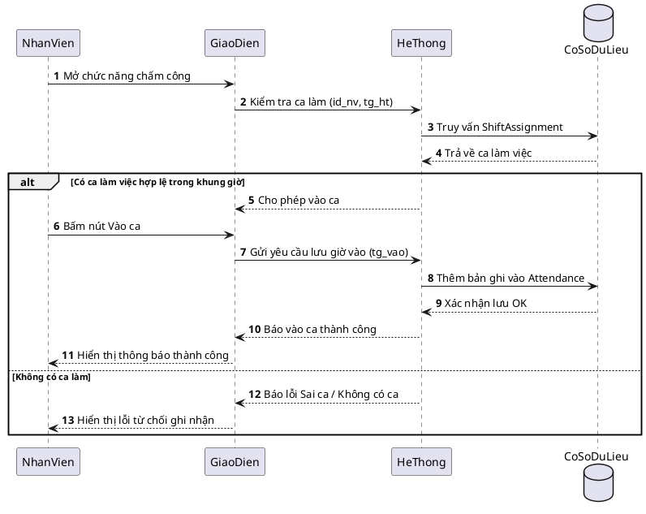

### 3.3. Đặc tả Use Case — Check-in, Check-out và Tính lương


| **Trường**                          | **Nội dung**                                                                                                                             |
| ----------------------------------- | ---------------------------------------------------------------------------------------------------------------------------------------- |
| **Mã Use Case**                     | UC04.3                                                                                                                                   |
| **Tên Use Case**                    | Check-in Ca làm việc                                                                                                                     |
| **Tác nhân chính**                  | Nhân viên (Employee)                                                                                                                     |
| **Tác nhân thứ cấp**                | Hệ thống chấm công                                                                                                                       |
| **Điều kiện tiên quyết**            | Nhân viên đã đăng nhập; tồn tại bản phân công ca (ShiftAssignment) cho nhân viên này trong ngày hôm nay; trạng thái ca là "chưa bắt đầu" |
| **Điều kiện kết thúc (thành công)** | Bản ghi Attendance được tạo với `check_in_time` = thời gian hiện tại; trạng thái phân công chuyển sang "đang làm việc"                   |
| **Điều kiện kết thúc (thất bại)**   | Hệ thống hiển thị thông báo lỗi; trạng thái Attendance không thay đổi                                                                    |

**Luồng sự kiện chính (Main Flow):**

| **Bước** | **Tác nhân** | **Hành động**                                                                      |
| -------- | ------------ | ---------------------------------------------------------------------------------- |
| 1        | Nhân viên    | Mở màn hình Chấm công, chọn "Check-in"                                             |
| 2        | Hệ thống     | Truy vấn `ShiftAssignment` theo `id_nhan_vien` và ngày hiện tại                    |
| 3        | Hệ thống     | Xác nhận tồn tại ca được phân công và ca chưa bắt đầu                              |
| 4        | Hệ thống     | Tạo bản ghi `Attendance` với `check_in_time = NOW()`                               |
| 5        | Hệ thống     | Cập nhật `ShiftAssignment.trang_thai = 'dang_lam'`                                 |
| 6        | Hệ thống     | Hiển thị thông báo: _"Check-in thành công lúc HH:MM. Chúc bạn làm việc hiệu quả!"_ |

**Luồng ngoại lệ (Alternative / Exception Flows):**

| **Mã** | **Điều kiện kích hoạt**                         | **Xử lý**                                                                              |
| ------ | ----------------------------------------------- | -------------------------------------------------------------------------------------- |
| E1     | Không tồn tại ShiftAssignment cho ngày hôm nay  | Hiển thị: _"Bạn không có ca làm việc hôm nay. Liên hệ Quản lý."_                       |
| E2     | Nhân viên đã Check-in trong ca này rồi          | Hiển thị: _"Bạn đã Check-in lúc [giờ]. Không thể Check-in hai lần."_                   |
| E3     | Check-in sớm hơn 30 phút so với giờ bắt đầu ca  | Hiển thị cảnh báo: _"Bạn Check-in sớm. Xác nhận ghi nhận?"_ và chờ nhân viên xác nhận  |
| E4     | Check-in muộn hơn 15 phút so với giờ bắt đầu ca | Ghi nhận Check-in bình thường nhưng đánh dấu `is_late = TRUE` trong bản ghi Attendance |
| E5     | Mất kết nối CSDL khi lưu                        | Thông báo lỗi kỹ thuật; ghi log; không tạo bản ghi Attendance                          |


| **Trường**               | **Nội dung**                                                                            |
| ------------------------ | --------------------------------------------------------------------------------------- |
| **Tác nhân**             | Manager (khởi tạo) / Hệ thống (thực thi)                                                |
| **Điều kiện tiên quyết** | Tồn tại ít nhất một bản ghi Attendance có đủ cặp check-in/check-out trong kỳ tính lương |
| **Kết quả**              | Hệ thống tổng hợp bảng lương cho từng nhân viên theo kỳ                                 |

**Công thức tính lương:**

$$L_{nv} = \sum (N_{sang,thuong} \times R_{sang}) + \sum (N_{toi,thuong} \times R_{toi}) + \sum (N_{cuoi_tuan} \times R_{ca} \times 1.5) + \sum (N_{ngay_le} \times R_{ca} \times 2.0)$$

Trong đó:

- $L_{nv}$: Tổng lương của nhân viên trong kỳ
- $N_{sang,thuong}$: Số ca sáng ngày thường đã hoàn thành trong kỳ
- $N_{toi,thuong}$: Số ca tối ngày thường đã hoàn thành trong kỳ
- $N_{cuoi_tuan}$: Số ca hoàn thành rơi vào Thứ 7 hoặc Chủ nhật
- $N_{ngay_le}$: Số ca hoàn thành trong ngày lễ
- $R_{sang}$: Mức lương cố định cho một ca sáng
- $R_{toi}$: Mức lương cố định cho một ca tối
- $R_{ca}$: Mức lương gốc của ca sáng hoặc ca tối tương ứng

> **Giả định đơn giản hóa:** Hệ thống chỉ quản lý 2 loại ca chuẩn: **ca sáng** và **ca tối**. Không xét ca đêm hay phụ cấp đêm. Tuy nhiên vẫn áp dụng hệ số tăng lương cho **cuối tuần** và **ngày lễ**.

### 3.4. Xử lý Ngoại lệ Thông minh


Khác với các quy tắc cứng nhắc, hệ thống được thiết kế để xử lý **linh hoạt** các tình huống thực tế của nghiệp vụ ngành dịch vụ:

**a. Đổi ca đột xuất (Shift Swapping & Ad-hoc Check-in):**

Khi nhân viên đổi ca mà chưa có lịch trên hệ thống, hệ thống **không từ chối** chấm công. Thay vào đó:

1. Cho phép Check-in bình thường dựa trên xác thực GPS + khuôn mặt
2. Xếp bản ghi `attendance` vào trạng thái `trang_thai = 'cho_phe_duyet'` (Unscheduled Shift)
3. Gửi thông báo tới Quản lý để phê duyệt retroactively
4. Sau khi phê duyệt, tạo `shift_assignment` tương ứng và liên kết lại

> **Nguyên tắc thiết kế:** Hệ thống không được cản trở hoạt động vận hành; mọi ngoại lệ được thu thập để quản lý xử lý sau, không phải từ chối trước.

**b. Xử lý "Quên Check-out":**

Trường hợp nhân viên quên bấm giờ ra, hệ thống **không được phép** gán giờ làm = 0 (vi phạm quyền lợi người lao động theo Bộ Luật Lao động):

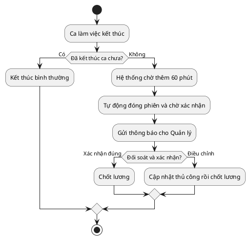


Để ngăn chặn tình trạng **chấm công hộ (Buddy Punching)** — một vấn đề phổ biến trong ngành dịch vụ, ứng dụng di động tích hợp hai lớp bảo vệ:

| **Lớp**              | **Công nghệ**      | **Cơ chế hoạt động**                                                                         |
| -------------------- | ------------------ | -------------------------------------------------------------------------------------------- |
| **Lớp 1: Vị trí**    | GPS Geofencing     | Chỉ cho phép Check-in khi thiết bị nằm trong bán kính ≤ 100m từ tọa độ quán                  |
| **Lớp 2: Danh tính** | FaceID / Selfie AI | Chụp ảnh tại thời điểm Check-in, so sánh với ảnh đăng ký bằng thuật toán nhận diện khuôn mặt |

**Luồng xác thực hai lớp (Two-Factor Authentication Flow):**

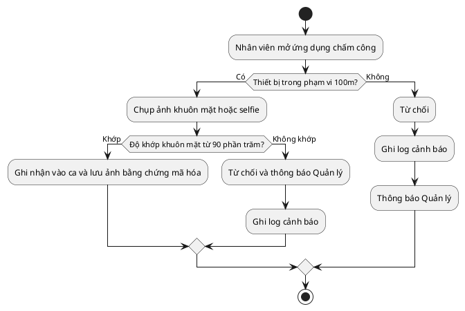

### 3.5. Cơ chế Chấm công Sinh trắc học — Triệt tiêu Chấm công Hộ


Để ngăn chặn tình trạng **chấm công hộ (Buddy Punching)** — một vấn đề phổ biến trong ngành dịch vụ, ứng dụng di động tích hợp hai lớp bảo vệ:

| **Lớp**              | **Công nghệ**      | **Cơ chế hoạt động**                                                                         |
| -------------------- | ------------------ | -------------------------------------------------------------------------------------------- |
| **Lớp 1: Vị trí**    | GPS Geofencing     | Chỉ cho phép Check-in khi thiết bị nằm trong bán kính ≤ 100m từ tọa độ quán                  |
| **Lớp 2: Danh tính** | FaceID / Selfie AI | Chụp ảnh tại thời điểm Check-in, so sánh với ảnh đăng ký bằng thuật toán nhận diện khuôn mặt |

**Luồng xác thực:**

Xem sơ đồ Mermaid ở trên cho cùng luồng xác thực hai lớp.

> **Lưu trữ:** Ảnh selfie được mã hóa và lưu kèm bản ghi `attendance`, giữ tối thiểu 90 ngày để phục vụ kiểm toán nội bộ.


Hệ thống áp dụng **mô hình tính lương gọn nhưng thực tế** cho quán café:

$$S_{total} = (N_{sang} \times R_{sang}) + (N_{toi} \times R_{toi}) + (N_{cuoi_tuan} \times R_{ca} \times 1.5) + (N_{ngay_le} \times R_{ca} \times 2.0)$$

**Quy ước ca làm việc:**

| **Loại ca** | **Khung giờ chuẩn** | **Cách tính lương** |
| ----------- | ------------------- | ------------------- |
| Ca sáng | 06:00 - 12:00 | Cộng `R_sang` khi hoàn thành đủ ca |
| Ca tối | 16:00 - 22:00 | Cộng `R_toi` khi hoàn thành đủ ca |
| Ca cuối tuần | Theo ca sáng hoặc ca tối | Nhân hệ số `1.5` trên đơn giá ca tương ứng |
| Ca ngày lễ | Theo ca sáng hoặc ca tối | Nhân hệ số `2.0` trên đơn giá ca tương ứng |

**Nguyên tắc áp dụng:**

- Chỉ tính lương cho ca có đủ cặp `check-in` và `check-out`
- Nếu quên `check-out`, bản ghi chuyển sang trạng thái chờ quản lý xác nhận trước khi tính lương
- Mức lương theo ca được lưu ngay trong mẫu ca hoặc bản phân công ca
- Hệ số cuối tuần/ngày lễ được cấu hình cố định trong phạm vi hệ thống; không triển khai phụ cấp ca đêm

### 3.6. Tính lương theo 2 ca cố định có hệ số cuối tuần/lễ

Hệ thống không sử dụng payroll engine đa biến đầy đủ. Thay vào đó, lương được tổng hợp theo số ca sáng và ca tối, sau đó áp hệ số nếu ca rơi vào cuối tuần hoặc ngày lễ:

$$S_{total} = (N_{sang} \times R_{sang}) + (N_{toi} \times R_{toi}) + (N_{cuoi_tuan} \times R_{ca} \times 1.5) + (N_{ngay_le} \times R_{ca} \times 2.0)$$

| **Thành phần** | **Ý nghĩa** |
| -------------- | ----------- |
| $N_{sang}$ | Tổng số ca sáng hợp lệ trong kỳ |
| $N_{toi}$ | Tổng số ca tối hợp lệ trong kỳ |
| $N_{cuoi_tuan}$ | Tổng số ca hợp lệ trong cuối tuần |
| $N_{ngay_le}$ | Tổng số ca hợp lệ trong ngày lễ |
| $R_{sang}$ | Mức lương chuẩn cho 1 ca sáng |
| $R_{toi}$ | Mức lương chuẩn cho 1 ca tối |
| Hệ số cuối tuần | `1.5` lần đơn giá ca |
| Hệ số ngày lễ | `2.0` lần đơn giá ca |

**Ví dụ minh họa:**

- Nếu một nhân viên hoàn thành `18` ca sáng ngày thường với mức `120.000đ/ca`, phần lương là `2.160.000đ`
- Nếu cùng kỳ hoàn thành `8` ca tối ngày thường với mức `140.000đ/ca`, phần lương là `1.120.000đ`
- Nếu có thêm `2` ca cuối tuần loại tối, phần tăng là `2 × 140.000 × 1.5 = 420.000đ`
- Nếu có `1` ca ngày lễ loại sáng, phần tăng là `1 × 120.000 × 2.0 = 240.000đ`
- Tổng lương kỳ đó là `3.940.000đ`

---


Nguyên tắc thiết kế cốt lõi của UC04 là **tách biệt hoàn toàn** dữ liệu kế hoạch (Planning) khỏi dữ liệu thực tế (Actual), tương tự mô hình Planning vs. Actuals phổ biến trong kế toán quản trị:


> **Ghi chú thiết kế:** 2 nhóm bảng trên tách biệt hoàn toàn **Kế hoạch** (shift_template, shift, shift_assignment) khỏi **Thực tế** (attendance), giúp dễ đối soát và kiểm toán.


| **Mã BR** | **Quy tắc**                                                          | **Cơ chế kiểm soát**                                                    |
| --------- | -------------------------------------------------------------------- | ----------------------------------------------------------------------- |
| BR-01     | Một nhân viên không thể có 2 ca chồng chéo thời gian trong cùng ngày | Trigger kiểm tra overlap khi INSERT vào `shift_assignment`              |
| BR-02     | Chỉ có thể Check-out sau khi đã Check-in                             | `check_out_time` chỉ được UPDATE khi `check_in_time IS NOT NULL`        |
| BR-03     | Chỉ ca có đủ `check_in_time` và `check_out_time` mới được đưa vào bảng lương | Dùng `CASE WHEN` hoặc cờ trạng thái hợp lệ khi tổng hợp lương |
| BR-04     | Giờ làm tối đa 16 giờ/ca; nếu vượt thì đánh dấu cần xem xét thủ công | Constraint: `CHECK(so_gio_lam <= 16)` hoặc cờ `needs_review = 1`        |
| BR-05     | Mỗi ca phải thuộc đúng 1 trong 2 loại: `sang` hoặc `toi`; nếu rơi vào cuối tuần/ngày lễ thì áp đúng hệ số | Ràng buộc ENUM / validation ngày làm việc và cờ loại ngày |


### 3.7. Business Rules và Ràng buộc Nghiệp vụ


| **Mã BR** | **Quy tắc**                                                          | **Cơ chế kiểm soát**                                                    |
| --------- | -------------------------------------------------------------------- | ----------------------------------------------------------------------- |
| BR-01     | Một nhân viên không thể có 2 ca chồng chéo thời gian trong cùng ngày | Trigger kiểm tra overlap khi INSERT vào `shift_assignment`              |
| BR-02     | Chỉ có thể Check-out sau khi đã Check-in                             | `check_out_time` chỉ được UPDATE khi `check_in_time IS NOT NULL`        |
| BR-03     | Chỉ ca có đủ `check_in_time` và `check_out_time` mới được đưa vào bảng lương | Dùng `CASE WHEN` hoặc cờ trạng thái hợp lệ khi tổng hợp lương |
| BR-04     | Giờ làm tối đa 16 giờ/ca; nếu vượt thì đánh dấu cần xem xét thủ công | Constraint: `CHECK(so_gio_lam <= 16)` hoặc cờ `needs_review = 1`        |
| BR-05     | Mỗi ca phải thuộc đúng 1 trong 2 loại: `sang` hoặc `toi`; nếu rơi vào cuối tuần/ngày lễ thì áp đúng hệ số | Ràng buộc ENUM / validation ngày làm việc và cờ loại ngày |


**Business Rules bổ sung — Quản lý Tài khoản:**


| **Mã BR** | **Quy tắc**                                                              | **Cơ chế kiểm soát**                                                                |
| --------- | ------------------------------------------------------------------------ | ----------------------------------------------------------------------------------- |
| BR-NS-01  | Mỗi nhân viên chỉ có đúng một tài khoản đăng nhập (quan hệ 1-1)         | Unique Constraint trên `tai_khoan.id_nhan_vien`                                     |
| BR-NS-02  | Mật khẩu phải được băm bằng BCrypt trước khi lưu; không lưu plain text  | Xử lý tại tầng Service; không bao giờ lưu chuỗi gốc                                |
| BR-NS-03  | Lần đăng nhập đầu tiên bắt buộc đổi mật khẩu                            | Cờ `buoc_doi_mat_khau = 1`; middleware chặn mọi request trừ endpoint đổi mật khẩu  |
| BR-NS-04  | Không được xóa vật lý (hard delete) bản ghi nhân viên                   | Chỉ đặt `trang_thai = 'da_nghi_viec'` và `kich_hoat = 0` (Soft Delete)             |
| BR-NS-05  | Mọi thao tác thêm/sửa/xoá nhân viên phải được ghi vào `audit_log`       | Database Trigger `AFTER INSERT/UPDATE/DELETE` trên bảng `nhan_vien` và `tai_khoan` |
| BR-NS-06  | Không thể phân công ca cho nhân viên có tài khoản bị khóa               | Trigger kiểm tra `tai_khoan.kich_hoat = 1` trước khi INSERT vào `shift_assignment` |

---


### 3.8. Biểu đồ Tuần tự — Luồng Check-in (Sequence Diagram)


Biểu đồ này mô tả chi tiết giao tiếp giữa các lớp trong kiến trúc phân lớp khi nhân viên thực hiện Check-in, tập trung vào việc **xác thực danh tính** và **kiểm tra phân công ca** trước khi ghi nhận:


**Giải thích các biến số:**

- `id_nv` — Mã nhân viên (ID Nhân viên), lấy từ session đăng nhập.
- `tg_ht` — Thời gian hiện tại, dùng để đối chiếu với bảng `shift_assignment`.
- `tg_vao` — Thời gian Check-in thực tế, tương đương `check_in_time` trong bảng `attendance`.

---


### 3.9. Biểu đồ Hoạt động — Quy trình Chấm công (Activity Diagram)


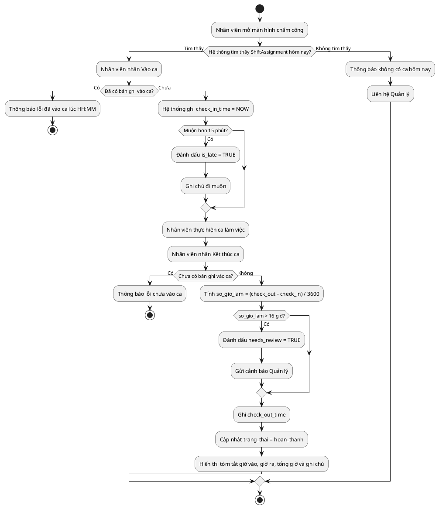

### 3.10. Biểu đồ Hoạt động — Quy trình Onboarding Nhân viên Mới (Activity Diagram)


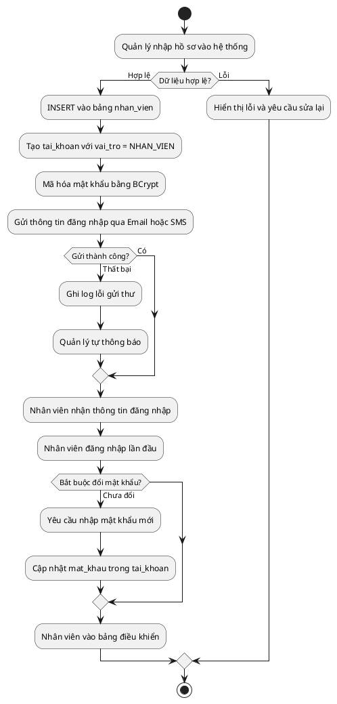

---


---

## CHƯƠNG 3: NGHIÊN CỨU CHUYÊN SÂU — UC04: QUẢN LÝ CA LÀM VIỆC, CHẤM CÔNG & PHÂN QUYỀN

> **Trái tim của báo cáo — Chiếm ~50%.** Đặc tả đầy đủ nghiệp vụ UC04 do **Nguyễn Viết Tùng** phụ trách: phân công ca, check-in/out sinh trắc học, tính lương đơn giản theo 2 ca sáng/tối và phân quyền RBAC.

### 3.1. Biểu đồ Use Case Chi tiết UC04


UC04 được phân rã thành các ca sử dụng con độc lập, có thể được phân công cho các thành viên nhóm khác nhau:


### 3.2. Quản lý Tài khoản, Phân quyền RBAC và Onboarding

> Quyền truy cập hệ thống là tiền điều kiện của mọi luồng nghiệp vụ trong UC06. Phân hệ RBAC được tích hợp trực tiếp vào đây thay vì để riêng.


| **Trường**                          | **Nội dung**                                                                                                   |
| ----------------------------------- | -------------------------------------------------------------------------------------------------------------- |
| **Mã Use Case**                     | UC07.1                                                                                                         |
| **Tên Use Case**                    | Thêm hồ sơ nhân viên mới (Onboarding)                                                                          |
| **Tác nhân chính**                  | Manager                                                                                                         |
| **Tác nhân thứ cấp**                | Hệ thống (System), Nhân viên mới (người nhận tài khoản)                                                        |
| **Điều kiện tiên quyết**            | Manager đã đăng nhập; có quyền `MANAGE_EMPLOYEE`                                                               |
| **Điều kiện kết thúc (thành công)** | Bản ghi `nhan_vien` và `tai_khoan` được tạo; tài khoản ở trạng thái `kich_hoat`; email thông báo được gửi đi  |
| **Điều kiện kết thúc (thất bại)**   | Không có bản ghi nào được tạo; hệ thống hiển thị lỗi cụ thể                                                   |
| **Mức độ ưu tiên**                  | Cao                                                                                                             |

**Luồng sự kiện chính (Main Flow):**

| **Bước** | **Tác nhân** | **Hành động**                                                                                           |
| -------- | ------------ | ------------------------------------------------------------------------------------------------------- |
| 1        | Manager      | Truy cập menu **Nhân sự > Thêm nhân viên**                                                              |
| 2        | Hệ thống     | Hiển thị form nhập: Họ tên, CCCD, SĐT, Email, Ngày sinh, Vị trí công việc, Lương theo giờ              |
| 3        | Manager      | Điền đầy đủ thông tin và nhấn **Lưu**                                                                   |
| 4        | Hệ thống     | Validate dữ liệu đầu vào (kiểm tra CCCD trùng, SĐT định dạng, email hợp lệ)                            |
| 5        | Hệ thống     | `INSERT` bản ghi vào bảng `nhan_vien`                                                                   |
| 6        | Hệ thống     | Tự động tạo `tai_khoan` với `mat_khau` ngẫu nhiên (8 ký tự); gán `vai_tro` mặc định = `NHAN_VIEN`      |
| 7        | Hệ thống     | Gửi email/SMS thông báo thông tin đăng nhập đến nhân viên mới                                           |
| 8        | Hệ thống     | Hiển thị thông báo: _"Thêm nhân viên thành công. Thông tin đăng nhập đã được gửi."_                    |

**Luồng ngoại lệ (Exception Flows):**

| **Mã** | **Điều kiện kích hoạt**                    | **Xử lý**                                                                         |
| ------ | ------------------------------------------ | --------------------------------------------------------------------------------- |
| E1     | CCCD đã tồn tại trong hệ thống             | Hiển thị: _"Nhân viên với CCCD này đã được đăng ký."_ Không INSERT.              |
| E2     | Email không đúng định dạng                 | Highlight trường lỗi, thông báo: _"Email không hợp lệ."_                         |
| E3     | Lương theo giờ < mức lương tối thiểu vùng | Cảnh báo: _"Mức lương thấp hơn quy định (22.500đ/giờ). Xác nhận tiếp tục?"_     |
| E4     | Gửi email thất bại                         | Vẫn tạo tài khoản thành công; ghi log lỗi gửi mail; Manager tự thông báo thủ công |

---


| **Trường**               | **Nội dung**                                                                                 |
| ------------------------ | -------------------------------------------------------------------------------------------- |
| **Mã Use Case**          | UC07.2                                                                                       |
| **Tác nhân**             | Manager                                                                                      |
| **Điều kiện tiên quyết** | Nhân viên đã có hồ sơ trong hệ thống (UC07.1 đã thực hiện)                                  |
| **Kết quả**              | Tài khoản được cấp phát, cập nhật hoặc thu hồi đúng với trạng thái thực tế của nhân viên   |

**Luồng sự kiện — Đặt lại mật khẩu:**

| **Bước** | **Hành động**                                                                  |
| -------- | ------------------------------------------------------------------------------ |
| 1        | Manager chọn nhân viên, sau đó chọn **Đặt lại mật khẩu**                     |
| 2        | Hệ thống tạo mật khẩu ngẫu nhiên mới và hash bằng **BCrypt (salt 12 rounds)** |
| 3        | Gửi mật khẩu tạm thời qua SMS/Email                                           |
| 4        | Lần đăng nhập đầu, hệ thống **bắt buộc** nhân viên đổi mật khẩu mới           |

---


Hệ thống phân quyền theo mô hình **Role-Based Access Control (RBAC)**, quản lý 3 cấp độ vai trò:

| **Vai trò (Role)**   | **Mã vai trò**  | **Quyền hạn chính**                                                                  |
| -------------------- | --------------- | ------------------------------------------------------------------------------------ |
| **Quản lý**          | `MANAGER`       | Toàn quyền: CRUD nhân viên, phê duyệt lương, xem báo cáo, cấu hình hệ thống        |
| **Thu ngân**         | `CASHIER`       | Tạo/đóng đơn hàng, xử lý thanh toán, in hóa đơn; xem lịch ca của bản thân          |
| **Nhân viên phục vụ**| `WAITER`        | Cập nhật trạng thái bàn, thêm món vào đơn; chấm công cá nhân                        |

**Ma trận phân quyền chi tiết:**

| **Chức năng**             | MANAGER | CASHIER | WAITER |
| ------------------------- | :-----: | :-----: | :----: |
| Xem danh sách nhân viên   | Co      | Khong   | Khong  |
| Thêm/Sửa nhân viên        | Co      | Khong   | Khong  |
| Phân công ca làm          | Co      | Khong   | Khong  |
| Check-in/Check-out        | Co      | Co      | Co     |
| Xem lịch sử chấm công     | Co      | Co (bản thân) | Co (bản thân) |
| Duyệt điều chỉnh chấm công| Co      | Khong   | Khong  |
| Tạo đơn hàng              | Co      | Co      | Co     |
| Xử lý thanh toán          | Co      | Co      | Khong  |
| Xem báo cáo doanh thu     | Co      | Khong   | Khong  |
| Cấu hình thực đơn         | Co      | Khong   | Khong  |

---


Biểu đồ này mô tả chi tiết giao tiếp giữa các lớp trong kiến trúc phân lớp khi nhân viên thực hiện Check-in, tập trung vào việc **xác thực danh tính** và **kiểm tra phân công ca** trước khi ghi nhận:


### 3.3. Đặc tả Use Case — Check-in, Check-out và Tính lương


| **Trường**                          | **Nội dung**                                                                                                                             |
| ----------------------------------- | ---------------------------------------------------------------------------------------------------------------------------------------- |
| **Mã Use Case**                     | UC04.3                                                                                                                                   |
| **Tên Use Case**                    | Check-in Ca làm việc                                                                                                                     |
| **Tác nhân chính**                  | Nhân viên (Employee)                                                                                                                     |
| **Tác nhân thứ cấp**                | Hệ thống chấm công                                                                                                                       |
| **Điều kiện tiên quyết**            | Nhân viên đã đăng nhập; tồn tại bản phân công ca (ShiftAssignment) cho nhân viên này trong ngày hôm nay; trạng thái ca là "chưa bắt đầu" |
| **Điều kiện kết thúc (thành công)** | Bản ghi Attendance được tạo với `check_in_time` = thời gian hiện tại; trạng thái phân công chuyển sang "đang làm việc"                   |
| **Điều kiện kết thúc (thất bại)**   | Hệ thống hiển thị thông báo lỗi; trạng thái Attendance không thay đổi                                                                    |

**Luồng sự kiện chính (Main Flow):**

| **Bước** | **Tác nhân** | **Hành động**                                                                      |
| -------- | ------------ | ---------------------------------------------------------------------------------- |
| 1        | Nhân viên    | Mở màn hình Chấm công, chọn "Check-in"                                             |
| 2        | Hệ thống     | Truy vấn `ShiftAssignment` theo `id_nhan_vien` và ngày hiện tại                    |
| 3        | Hệ thống     | Xác nhận tồn tại ca được phân công và ca chưa bắt đầu                              |
| 4        | Hệ thống     | Tạo bản ghi `Attendance` với `check_in_time = NOW()`                               |
| 5        | Hệ thống     | Cập nhật `ShiftAssignment.trang_thai = 'dang_lam'`                                 |
| 6        | Hệ thống     | Hiển thị thông báo: _"Check-in thành công lúc HH:MM. Chúc bạn làm việc hiệu quả!"_ |

**Luồng ngoại lệ (Alternative / Exception Flows):**

| **Mã** | **Điều kiện kích hoạt**                         | **Xử lý**                                                                              |
| ------ | ----------------------------------------------- | -------------------------------------------------------------------------------------- |
| E1     | Không tồn tại ShiftAssignment cho ngày hôm nay  | Hiển thị: _"Bạn không có ca làm việc hôm nay. Liên hệ Quản lý."_                       |
| E2     | Nhân viên đã Check-in trong ca này rồi          | Hiển thị: _"Bạn đã Check-in lúc [giờ]. Không thể Check-in hai lần."_                   |
| E3     | Check-in sớm hơn 30 phút so với giờ bắt đầu ca  | Hiển thị cảnh báo: _"Bạn Check-in sớm. Xác nhận ghi nhận?"_ và chờ nhân viên xác nhận  |
| E4     | Check-in muộn hơn 15 phút so với giờ bắt đầu ca | Ghi nhận Check-in bình thường nhưng đánh dấu `is_late = TRUE` trong bản ghi Attendance |
| E5     | Mất kết nối CSDL khi lưu                        | Thông báo lỗi kỹ thuật; ghi log; không tạo bản ghi Attendance                          |


| **Trường**               | **Nội dung**                                                                            |
| ------------------------ | --------------------------------------------------------------------------------------- |
| **Tác nhân**             | Manager (khởi tạo) / Hệ thống (thực thi)                                                |
| **Điều kiện tiên quyết** | Tồn tại ít nhất một bản ghi Attendance có đủ cặp check-in/check-out trong kỳ tính lương |
| **Kết quả**              | Hệ thống tổng hợp bảng lương cho từng nhân viên theo kỳ                                 |

**Công thức tính lương đơn giản:**

$$L_{nv} = (N_{sang} \times R_{sang}) + (N_{toi} \times R_{toi})$$

Trong đó:

- $L_{nv}$: Tổng lương của nhân viên trong kỳ
- $N_{sang}$: Số ca sáng đã hoàn thành trong kỳ
- $N_{toi}$: Số ca tối đã hoàn thành trong kỳ
- $R_{sang}$: Mức lương cố định cho một ca sáng
- $R_{toi}$: Mức lương cố định cho một ca tối

### 3.4. Xử lý Ngoại lệ Thông minh


Khác với các quy tắc cứng nhắc, hệ thống được thiết kế để xử lý **linh hoạt** các tình huống thực tế của nghiệp vụ ngành dịch vụ:

**a. Đổi ca đột xuất (Shift Swapping & Ad-hoc Check-in):**

Khi nhân viên đổi ca mà chưa có lịch trên hệ thống, hệ thống **không từ chối** chấm công. Thay vào đó:

1. Cho phép Check-in bình thường dựa trên xác thực GPS + khuôn mặt
2. Xếp bản ghi `attendance` vào trạng thái `trang_thai = 'cho_phe_duyet'` (Unscheduled Shift)
3. Gửi thông báo tới Quản lý để phê duyệt retroactively
4. Sau khi phê duyệt, tạo `shift_assignment` tương ứng và liên kết lại

> **Nguyên tắc thiết kế:** Hệ thống không được cản trở hoạt động vận hành; mọi ngoại lệ được thu thập để quản lý xử lý sau, không phải từ chối trước.

**b. Xử lý "Quên Check-out":**

Trường hợp nhân viên quên bấm giờ ra, hệ thống **không được phép** gán giờ làm = 0 (vi phạm quyền lợi người lao động theo Bộ Luật Lao động):


Để ngăn chặn tình trạng **chấm công hộ (Buddy Punching)** — một vấn đề phổ biến trong ngành dịch vụ, ứng dụng di động tích hợp hai lớp bảo vệ:

| **Lớp**              | **Công nghệ**      | **Cơ chế hoạt động**                                                                         |
| -------------------- | ------------------ | -------------------------------------------------------------------------------------------- |
| **Lớp 1: Vị trí**    | GPS Geofencing     | Chỉ cho phép Check-in khi thiết bị nằm trong bán kính ≤ 100m từ tọa độ quán                  |
| **Lớp 2: Danh tính** | FaceID / Selfie AI | Chụp ảnh tại thời điểm Check-in, so sánh với ảnh đăng ký bằng thuật toán nhận diện khuôn mặt |

**Luồng xác thực hai lớp (Two-Factor Authentication Flow):**


### 3.5. Cơ chế Chấm công Sinh trắc học — Triệt tiêu Chấm công Hộ


Để ngăn chặn tình trạng **chấm công hộ (Buddy Punching)** — một vấn đề phổ biến trong ngành dịch vụ, ứng dụng di động tích hợp hai lớp bảo vệ:

| **Lớp**              | **Công nghệ**      | **Cơ chế hoạt động**                                                                         |
| -------------------- | ------------------ | -------------------------------------------------------------------------------------------- |
| **Lớp 1: Vị trí**    | GPS Geofencing     | Chỉ cho phép Check-in khi thiết bị nằm trong bán kính ≤ 100m từ tọa độ quán                  |
| **Lớp 2: Danh tính** | FaceID / Selfie AI | Chụp ảnh tại thời điểm Check-in, so sánh với ảnh đăng ký bằng thuật toán nhận diện khuôn mặt |

**Luồng xác thực:**

Xem sơ đồ Mermaid ở trên cho cùng luồng xác thực hai lớp.

> **Lưu trữ:** Ảnh selfie được mã hóa và lưu kèm bản ghi `attendance`, giữ tối thiểu 90 ngày để phục vụ kiểm toán nội bộ.


Hệ thống áp dụng **mô hình tính lương tối giản** với 2 loại ca cố định: sáng và tối.

### 3.6. Tính lương theo 2 ca cố định


$$S_{total} = (N_{sang} \times R_{sang}) + (N_{toi} \times R_{toi})$$

---


Nguyên tắc thiết kế cốt lõi của UC04 là **tách biệt hoàn toàn** dữ liệu kế hoạch (Planning) khỏi dữ liệu thực tế (Actual), tương tự mô hình Planning vs. Actuals phổ biến trong kế toán quản trị:


> **Ghi chú thiết kế:** 2 nhóm bảng trên tách biệt hoàn toàn **Kế hoạch** (shift_template, shift, shift_assignment) khỏi **Thực tế** (attendance), giúp dễ đối soát và kiểm toán.


| **Mã BR** | **Quy tắc**                                                          | **Cơ chế kiểm soát**                                                    |
| --------- | -------------------------------------------------------------------- | ----------------------------------------------------------------------- |
| BR-01     | Một nhân viên không thể có 2 ca chồng chéo thời gian trong cùng ngày | Trigger kiểm tra overlap khi INSERT vào `shift_assignment`              |
| BR-02     | Chỉ có thể Check-out sau khi đã Check-in                             | `check_out_time` chỉ được UPDATE khi `check_in_time IS NOT NULL`        |
| BR-03     | Chỉ ca có đủ `check_in_time` và `check_out_time` mới được đưa vào bảng lương | Dùng `CASE WHEN` hoặc cờ trạng thái hợp lệ khi tổng hợp lương |
| BR-04     | Giờ làm tối đa 16 giờ/ca; nếu vượt thì đánh dấu cần xem xét thủ công | Constraint: `CHECK(so_gio_lam <= 16)` hoặc cờ `needs_review = 1`        |
| BR-05     | Mỗi ca phải thuộc đúng 1 trong 2 loại: `sang` hoặc `toi`             | Ràng buộc ENUM / validation tại bảng `shift_template` và `shift` |


### 3.7. Business Rules và Ràng buộc Nghiệp vụ


| **Mã BR** | **Quy tắc**                                                          | **Cơ chế kiểm soát**                                                    |
| --------- | -------------------------------------------------------------------- | ----------------------------------------------------------------------- |
| BR-01     | Một nhân viên không thể có 2 ca chồng chéo thời gian trong cùng ngày | Trigger kiểm tra overlap khi INSERT vào `shift_assignment`              |
| BR-02     | Chỉ có thể Check-out sau khi đã Check-in                             | `check_out_time` chỉ được UPDATE khi `check_in_time IS NOT NULL`        |
| BR-03     | Chỉ ca có đủ `check_in_time` và `check_out_time` mới được đưa vào bảng lương | Dùng `CASE WHEN` hoặc cờ trạng thái hợp lệ khi tổng hợp lương |
| BR-04     | Giờ làm tối đa 16 giờ/ca; nếu vượt thì đánh dấu cần xem xét thủ công | Constraint: `CHECK(so_gio_lam <= 16)` hoặc cờ `needs_review = 1`        |
| BR-05     | Mỗi ca phải thuộc đúng 1 trong 2 loại: `sang` hoặc `toi`             | Ràng buộc ENUM / validation tại bảng `shift_template` và `shift` |


**Business Rules bổ sung — Quản lý Tài khoản:**


| **Mã BR** | **Quy tắc**                                                              | **Cơ chế kiểm soát**                                                                |
| --------- | ------------------------------------------------------------------------ | ----------------------------------------------------------------------------------- |
| BR-NS-01  | Mỗi nhân viên chỉ có đúng một tài khoản đăng nhập (quan hệ 1-1)         | Unique Constraint trên `tai_khoan.id_nhan_vien`                                     |
| BR-NS-02  | Mật khẩu phải được băm bằng BCrypt trước khi lưu; không lưu plain text  | Xử lý tại tầng Service; không bao giờ lưu chuỗi gốc                                |
| BR-NS-03  | Lần đăng nhập đầu tiên bắt buộc đổi mật khẩu                            | Cờ `buoc_doi_mat_khau = 1`; middleware chặn mọi request trừ endpoint đổi mật khẩu  |
| BR-NS-04  | Không được xóa vật lý (hard delete) bản ghi nhân viên                   | Chỉ đặt `trang_thai = 'da_nghi_viec'` và `kich_hoat = 0` (Soft Delete)             |
| BR-NS-05  | Mọi thao tác thêm/sửa/xoá nhân viên phải được ghi vào `audit_log`       | Database Trigger `AFTER INSERT/UPDATE/DELETE` trên bảng `nhan_vien` và `tai_khoan` |
| BR-NS-06  | Không thể phân công ca cho nhân viên có tài khoản bị khóa               | Trigger kiểm tra `tai_khoan.kich_hoat = 1` trước khi INSERT vào `shift_assignment` |

---


### 3.8. Biểu đồ Tuần tự — Luồng Check-in (Sequence Diagram)


Biểu đồ này mô tả chi tiết giao tiếp giữa các lớp trong kiến trúc phân lớp khi nhân viên thực hiện Check-in, tập trung vào việc **xác thực danh tính** và **kiểm tra phân công ca** trước khi ghi nhận:


**Giải thích các biến số:**

- `id_nv` — Mã nhân viên (ID Nhân viên), lấy từ session đăng nhập.
- `tg_ht` — Thời gian hiện tại, dùng để đối chiếu với bảng `shift_assignment`.
- `tg_vao` — Thời gian Check-in thực tế, tương đương `check_in_time` trong bảng `attendance`.

---


### 3.9. Biểu đồ Hoạt động — Quy trình Chấm công (Activity Diagram)


### 3.10. Biểu đồ Hoạt động — Quy trình Onboarding Nhân viên Mới (Activity Diagram)


---


---

## CHƯƠNG 3: NGHIÊN CỨU CHUYÊN SÂU — USE CASE BÁN HÀNG (UC01)

### 3.1. Biểu đồ UC chi tiết

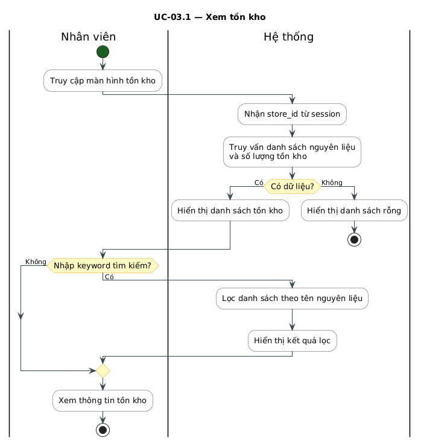

### 3.2. Đặc tả UC

#### 3.2.1. Thông tin chung

#### 3.2.2. Tiền điều kiện

Hệ thống hoạt động bình thường

Nhân viên đã đăng nhập

Menu chức năng tạo đơn hàng đã được cấu hình

Tồn kho đã được cập nhật

#### 3.2.3. Hậu điều kiện

**Thành công:**

Đơn hàng được hoàn tất

Thanh toán thành công

Tồn kho bị khấu trừ

Doanh thu và chi phí được ghi nhận

**Thất bại:**

Đơn hàng bị hủy

Không thay đổi tồn kho

Không ghi nhận doanh thu và chi phí

#### 3.2.4. Luồng chính

Thu ngân (Cashier) hoặc bồi bàn (Waitor) tạo đơn hàng

Người lên đơn chọn loại đơn: đặt tại chỗ (dine-in) hoặc mang về (takeaway) hoặc delivery (giao hàng)

Nếu đặt giao hàng => lên đơn vận chuyển giao cho khách hàng, nếu đặt tại chỗ => chọn bàn

Người lên đơn thêm sản phẩm theo yêu cầu khách hàng

Người lên đơn chọn size / variant theo yêu cầu khách hàng

Người lên đơn thêm topping (nếu có) theo yêu cầu khách hàng

Lặp lại bước 4–6 cho đến khi hoàn tất

Người lên đơn chọn thanh toán (checkout)

Hệ thống tính toán nguyên liệu cần dùng

Hệ thống kiểm tra tồn kho

Nếu đủ tồn kho => tiếp tục

Hệ thống trừ tồn kho (deduct inventory)

Khách hàng thực hiện thanh toán, người lên đơn thực hiện kiểm tra

Nếu thanh toán thành công => tiếp tục

Hệ thống ghi nhận doanh thu và chi phí

Nhân viên thực hiện pha chế => chuyển trạng thái đơn hàng thành Đang xử lý

Nhân viên giao đồ uống cho khách (tại bàn/ giao hàng) => chuyển trạng thái đơn hàng thành Hoàn tất

#### 3.2.5. Luồng thay thế

**A1 - Hết hàng**

Tại bước 10

Nếu tồn kho không đủ:

Hệ thống thông báo "Không đủ nguyên liệu"

Kết thúc use case

**A2 - Thanh toán thất bại**

Tại bước 14

Nếu thanh toán thất bại:

Hệ thống hủy đơn hàng

Không trừ kho (hoặc rollback)

Kết thúc use case

**A3 - Khách không ngồi bàn**

Tại bước 2

Bỏ qua bước chọn bàn

**A4 - Khách chọn giao hàng**

Tại bước 2

Lên đơn vận chuyển giao cho khách

**A5 - Khách chọn giao hàng**

Tại bước 2

Khách yêu cầu đăng ký thành viên để tích điểm, đổi điểm => tạo thông tin khách hàng và gán vào đơn hàng

#### 3.2.6. Quy tắc nghiệp vụ

BR1: Không cho phép bán khi tồn kho không đủ

BR2: Kiểm tra tồn kho phải thực hiện trong 1 giao dịch

BR3: Doanh thu và chi phí chỉ ghi nhận khi thanh toán thành công

BR4: Đặt đồ uống tại chỗ phải gắn với bàn

BR5: Giá sản phẩm được snapshot tại thời điểm order

#### 3.2.7. Yêu cầu phi chức năng

Thời gian phản hồi của các thao tác < 2s

Hỗ trợ xử lý nhiều đơn hàng cùng lúc

### 3.3. Biểu đồ luồng hoạt động


## CHƯƠNG 4: HIỆN THỰC HÓA VÀ ĐẢM BẢO CHẤT LƯỢNG (SQA)

> **Mục tiêu chương:** Chứng minh hệ thống vận hành được và không có lỗi nghiêm trọng. Tập trung vào giao diện và các ca kiểm thử của phân hệ Nhân sự/Chấm công. Chiếm khoảng 25%.

### 4.1. Ngăn xếp Công nghệ và Tiêu chuẩn Lập trình

| **Tầng**               | **Công nghệ**       | **Lý do lựa chọn**                                                    |
| ---------------------- | ------------------- | --------------------------------------------------------------------- |
| **Giao diện máy tính** | Java Swing / JavaFX | Chạy ổn định trên Windows; dễ tích hợp máy in nhiệt ESC/POS           |
| **API phía máy chủ**   | Java Spring Boot    | Hệ sinh thái trưởng thành; dễ xây dựng API REST; tích hợp tốt với ORM |
| **ORM**                | Hibernate / JPA     | Giảm mã SQL lặp lại; dễ chuyển đổi CSDL khi cần                       |
| **Cơ sở dữ liệu**      | MySQL 8.0           | Miễn phí; hiệu năng tốt với quy mô nhỏ-vừa; hỗ trợ ACID đầy đủ        |
| **Công cụ biên dịch**  | Maven               | Quản lý phụ thuộc chuẩn hóa; dễ tích hợp CI/CD                        |

Toàn bộ mã nguồn tuân thủ **hướng dẫn định dạng mã Java của Google**, được kiểm soát qua các công cụ tự động:

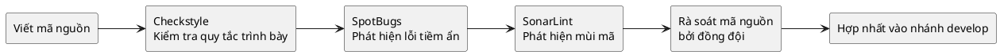

**Các quy tắc viết mã sạch được áp dụng:**

- **Đặt tên có ý nghĩa:** Không dùng tên biến đơn lẻ (`x`, `temp`); tên phương thức phải là động từ mô tả hành động (`tinhTongTien()`, `layDanhSachBanTrong()`).
- **Hàm làm một việc (Single Responsibility):** Mỗi phương thức không dài hơn 20 dòng và chỉ giải quyết một vấn đề duy nhất.
- **Không có mã chết:** Xóa toàn bộ đoạn mã bị chú thích bỏ và hàm không được gọi trước khi hợp nhất.
- **Xử lý ngoại lệ rõ ràng:** Bắt `Exception` cụ thể, không dùng `catch(Exception e) {}` rỗng.

Mỗi tính năng được phát triển trên một nhánh `feature/` riêng biệt và phải trải qua ít nhất **1 lượt rà soát** từ thành viên khác trước khi hợp nhất vào nhánh `develop`. Danh sách kiểm tra gồm:

- [ ] Logic nghiệp vụ đúng với đặc tả ca sử dụng
- [ ] Không có lỗ hổng SQL Injection (dùng PreparedStatement)
- [ ] Có xử lý trường hợp null/empty đầu vào
- [ ] Có kiểm thử đơn vị cho logic phức tạp (tính tiền, tính lương)
- [ ] Tuân thủ quy ước lập trình

---

### 4.2. Thiết kế Giao diện — Màn hình Nhân sự và Chấm công

#### 4.2.1. Màn hình Đăng nhập

> **Màn hình Đăng nhập:** Giao diện tối giản gồm hai trường nhập liệu (_Tên đăng nhập_ và _Mật khẩu_) cùng nút _ĐĂNG NHẬP_. Hệ thống áp dụng cơ chế **khóa tài khoản tạm thời 5 phút** sau 3 lần sai liên tiếp và **bắt buộc đổi mật khẩu** ở lần đăng nhập đầu tiên.

_Sau 3 lần đăng nhập sai: tài khoản bị khoá tạm 5 phút. Lần đầu đăng nhập bắt buộc đổi mật khẩu._

#### 4.2.2. Màn hình Bảng điều khiển Nhân viên — Chấm công

> **Màn hình Bảng điều khiển Nhân viên:** Giao diện tập trung hiển thị thông tin ca làm việc hiện hành, trạng thái xác thực vị trí (GPS) và hai nút thao tác cốt lõi: **VÀO CA** và **KẾT THÚC CA**. Phần nửa dưới màn hình hiển thị bảng thống kê lịch làm việc chi tiết trong tuần (ngày, ca, trạng thái đi muộn/đúng giờ) và tổng hợp số giờ công cùng lương ước tính của tháng, hỗ trợ nhân viên chủ động theo dõi hiệu suất cá nhân.

#### 4.2.3. Màn hình Quản lý Nhân viên (dành cho Quản lý)

> **Màn hình Quản lý Nhân viên:** Giao diện quản trị trung tâm phân quyền riêng cho Quản lý. Màn hình cung cấp thanh công cụ để thêm mới nhân viên, tìm kiếm và xuất báo cáo. Dữ liệu được trình bày dưới dạng bảng lưới gồm mã định danh, họ tên, vai trò RBAC, trạng thái nhân sự (đang làm/nghỉ phép), cùng cột thao tác cho phép Quản lý nhanh chóng cập nhật thông tin hoặc khóa tài khoản hệ thống khi cần thiết.

### 4.3. Mô hình Tháp Kiểm thử và Chiến lược SQA

**Chiến lược tháp kiểm thử tự động** được dự án áp dụng thông qua việc phân lớp kiểm thử thành 4 cấp độ từ thấp lên cao. Mục tiêu cốt lõi là tối ưu hóa chi phí phát triển và tăng tốc độ phát hiện lỗi sớm trong chu kỳ:

1. **Kiểm thử đơn vị — Tỷ trọng khoảng 70%:** Tầng nền tảng chiếm tỷ lệ lớn nhất trong cấu trúc kiểm thử. Mục đích là cô lập và kiểm chứng tính đúng đắn của từng hàm, phương thức riêng lẻ.
2. **Kiểm thử tích hợp — Tỷ trọng khoảng 20%:** Tập trung đánh giá sự tương tác và tính toàn vẹn của luồng truyền tải dữ liệu giữa các mô-đun độc lập.
3. **Kiểm thử hệ thống — Tỷ trọng khoảng 8%:** Đánh giá toàn bộ luồng nghiệp vụ từ đầu đến cuối. Các kịch bản được chạy trên môi trường giả lập có cấu hình tương đương môi trường thực tế.
4. **Kiểm thử chấp nhận — Tỷ trọng khoảng 2%:** Cấp độ kiểm chứng cuối cùng do chính người dùng cuối hoặc đại diện khách hàng thực hiện để nghiệm thu sản phẩm.

### 4.4. Ca kiểm thử — UC04: Vào ca / Kết thúc ca

#### 4.4.1. Ca kiểm thử cho UC04.3 (Vào ca)

| **Mã TC**  | **Kịch bản**                 | **Điều kiện đầu vào**                                       | **Kết quả mong đợi**                                       | **Trạng thái** |
| ---------- | ---------------------------- | ----------------------------------------------------------- | ---------------------------------------------------------- | -------------- |
| TC-UC04-01 | Vào ca thành công (đúng giờ) | Có ShiftAssignment hôm nay; chưa chấm công vào ca; đúng giờ | Tạo Attendance; thông báo thành công                       | Chờ kiểm thử   |
| TC-UC04-02 | Vào ca thành công (đến sớm)  | Sớm hơn 30 phút                                             | Hỏi xác nhận, sau đó tạo Attendance khi nhân viên đồng ý   | Chờ kiểm thử   |
| TC-UC04-03 | Vào ca muộn                  | Muộn hơn 15 phút                                            | Tạo Attendance;`is_late = TRUE`; thông báo có ghi chú muộn | Chờ kiểm thử   |
| TC-UC04-04 | Vào ca khi không có ca       | Không có ShiftAssignment hôm nay                            | Thông báo lỗi E1; không tạo Attendance                     | Chờ kiểm thử   |
| TC-UC04-05 | Vào ca lần 2 trong cùng ca   | Đã có Attendance với check_in_time                          | Thông báo lỗi E2; không ghi đè                             | Chờ kiểm thử   |

#### 4.4.2. Ca kiểm thử cho UC04.5 (Tính lương)

| **Mã TC**  | **Kịch bản**                     | **Dữ liệu đầu vào**                                                                    | **Kết quả mong đợi**                                                    |
| ---------- | -------------------------------- | -------------------------------------------------------------------------------------- | ----------------------------------------------------------------------- |
| TC-UC04-06 | Tính lương 1 ca sáng ngày thường | Hoàn thành 1 ca sáng,`R_sang = 120.000đ`                                               | Lương = 120.000đ                                                        |
| TC-UC04-07 | Tính lương 1 ca tối cuối tuần    | Hoàn thành 1 ca tối cuối tuần,`R_toi = 140.000đ`                                       | Lương = 140.000 × 1.5 = 210.000đ                                        |
| TC-UC04-08 | Ca chưa check-out                | check_out_time = NULL                                                                  | Chưa đưa vào bảng lương, chờ quản lý xác nhận                           |
| TC-UC04-09 | Tổng hợp cả tháng                | 18 ca sáng ngày thường + 8 ca tối ngày thường + 2 ca tối cuối tuần + 1 ca sáng ngày lễ | L = 18×120.000 + 8×140.000 + 2×140.000×1.5 + 1×120.000×2.0 = 3.940.000đ |

### 4.5. Ca kiểm thử — Phân quyền RBAC

| **Mã TC**  | **Kịch bản**                                        | **Điều kiện đầu vào**                                             | **Kết quả mong đợi**                                    | **Trạng thái** |
| ---------- | --------------------------------------------------- | ----------------------------------------------------------------- | ------------------------------------------------------- | -------------- |
| TC-RBAC-01 | Thêm nhân viên, thư điện tử sai định dạng           | `email = "khong_hop_le"`                                          | Tô nổi bật lỗi E2; không cho gửi biểu mẫu               | Chờ kiểm thử   |
| TC-RBAC-02 | Mức lương ca nhập không hợp lệ                      | Mức lương ca sáng hoặc ca tối nhỏ hơn cấu hình tối thiểu của quán | Cảnh báo E3; Quản lý xác nhận mới lưu                   | Chờ kiểm thử   |
| TC-RBAC-03 | Gửi thư điện tử thất bại sau khi tạo                | Máy chủ SMTP ngừng hoạt động                                      | Nhân viên vẫn được tạo; ghi nhật ký lỗi; không hoàn tác | Chờ kiểm thử   |
| TC-RBAC-04 | Thu ngân truy cập quản lý nhân viên                 | `CASHIER` gọi API `/employees`                                    | HTTP 403; ghi `audit_log`                               | Chờ kiểm thử   |
| TC-RBAC-05 | Quản lý nâng quyền nhân viên phục vụ thành thu ngân | `vai_tro = 'CASHIER'` cho `id_nv = 5`                             | Cập nhật `tai_khoan.vai_tro`; quyền thay đổi ngay       | Chờ kiểm thử   |
| TC-RBAC-06 | Đăng nhập khi tài khoản bị khóa                     | `kich_hoat = 0`                                                   | HTTP 401; thông báo*"Tài khoản bị tạm khóa."*           | Chờ kiểm thử   |
| TC-RBAC-07 | Nhân viên phục vụ xem chấm công người khác          | WAITER gọi API `attendance?id_nv=10`                              | HTTP 403; chỉ xem bản ghi của mình                      | Chờ kiểm thử   |

---

### 4.6. Kế hoạch SQA và Bảo trì (Maintenance Plan)

SQA không chỉ là kiểm thử — đây là một **quy trình xuyên suốt** toàn bộ SDLC nhằm phòng ngừa lỗi từ sớm. Các hoạt động SQA chính:

| **Hoạt động SQA**                   | **Thời điểm**                     | **Công cụ/Phương pháp**       |
| ----------------------------------- | --------------------------------- | ----------------------------- |
| Rà soát đặc tả ca sử dụng           | Cuối giai đoạn Đặc tả             | Duyệt nội dung với giảng viên |
| Rà soát thiết kế ERD và biểu đồ lớp | Cuối giai đoạn Thiết kế           | Rà soát chéo nội bộ           |
| Phân tích tĩnh mã nguồn             | Liên tục trong quá trình viết mã  | SonarLint, Checkstyle         |
| Kiểm thử đơn vị                     | Song song với giai đoạn hiện thực | JUnit 5, Mockito              |
| Kiểm thử tích hợp                   | Sau khi ghép mô-đun               | Postman (API), JUnit          |
| Kiểm thử hệ thống                   | Trước khi bàn giao                | Kiểm thử tay theo kịch bản    |
| Kiểm thử chấp nhận của người dùng   | Giai đoạn bàn giao                | Người dùng cuối thực hiện     |

Sau khi hệ thống được triển khai, giai đoạn bảo trì chiếm đến **~60-70% tổng chi phí vòng đời** của phần mềm (theo nghiên cứu của Pigoski, 1996). Do đó, kế hoạch bảo trì được lập chi tiết theo bốn loại hình:

| **Loại bảo trì** | **Mục tiêu**                                    | **Ví dụ cụ thể trong dự án**                               | **Tần suất**               |
| ---------------- | ----------------------------------------------- | ---------------------------------------------------------- | -------------------------- |
| **Sửa lỗi**      | Khắc phục các lỗi được phát hiện sau triển khai | Sửa lỗi tính sai tiền thừa khi thanh toán bằng tiền mặt    | Ngay khi phát hiện         |
| **Hoàn thiện**   | Nâng cấp, thêm tính năng mới theo nhu cầu       | Thêm phương thức thanh toán Momo/ZaloPay                   | Theo sprint (2-4 tuần/lần) |
| **Thích nghi**   | Cập nhật để tương thích với môi trường mới      | Nâng cấp lên Windows 11; cập nhật MySQL từ 8.0 lên 8.4     | Khi môi trường thay đổi    |
| **Phòng ngừa**   | Tái cấu trúc để giảm nợ kỹ thuật                | Tách lớp `HoaDonService` quá lớn thành các dịch vụ nhỏ hơn | Mỗi quý                    |

**Quy trình theo dõi và xử lý lỗi sau triển khai:**

Quy trình xử lý lỗi được thực hiện tuần tự qua **6 bước**:

1. **Phát hiện lỗi** — Người dùng hoặc tester ghi nhận lỗi
2. **Ghi nhận** — Tạo vấn đề trên GitHub Issues kèm mô tả, ảnh chụp màn hình
3. **Phân loại** — Đánh giá mức độ: _Nghiêm trọng_ / _Lớn_ / _Nhỏ_
4. **Phân công xử lý** — Giao cho thành viên phụ trách, sửa trên nhánh `hotfix/`
5. **Rà soát và kiểm thử lại** — Rà soát chéo và chạy kiểm thử đơn vị trước khi hợp nhất
6. **Hợp nhất và đóng vấn đề** — Triển khai và đóng vấn đề trên GitHub

---

## CHƯƠNG 4: NGHIÊN CỨU CHUYÊN SÂU — USE CASE QUẢN LÝ MENU VÀ CÔNG THỨC (UC02)

## CHƯƠNG 5: NGHIÊN CỨU CHUYÊN SÂU — USE CASE QUẢN LÝ NGUYÊN LIỆU VÀ TỒN KHO (UC03)

Chương này đi sâu vào mô tả và phân tích thiết kế một use case sử dụng cụ thể: **UC03 — Quản lý Nguyên liệu và Tồn kho**. Use case này cho phép nhân viên theo dõi, nhập, xuất, điều chỉnh và xem lịch sử tồn kho nguyên liệu.

**5.1. Biểu đồ Use Case**

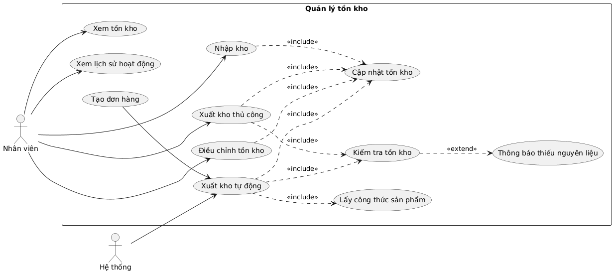

**5.2. Đặc tả Use Case**

#### 5.2.1. Xem tồn kho

| **Trường** | **Nội dung** |
| --- | --- |
| Mã Use Case | UC03.1 |
| Tên Use Case | Xem tồn kho |
| Tác nhân chính | Nhân viên |
| Tác nhân thứ cấp | Hệ thống |
| Điều kiện tiên quyết | - Nhân viên đã đăng nhập thành công <br> - Cửa hàng đã tồn tại trong hệ thống <br> - Nhân viên có quyền xem tồn kho |
| Điều kiện kết thúc | Danh sách tồn kho được hiển thị |
| Luồng chính | - Nhân viên truy cập màn hình tồn kho <br> - Hệ thống nhận mã cửa hàng (store_id) <br> - Hệ thống truy vấn danh sách nguyên liệu và số lượng tồn kho <br> - Hiển thị danh sách |
| Luồng thay thế |  |
| Luồng ngoại lệ | - |

#### 5.2.2. Nhập kho

#### 5.2.3. Xuất kho thủ công

#### 5.2.4. Xuất kho tự động

#### 5.2.5. Điều chỉnh tồn kho

#### 5.2.6. Xem lịch sử hoạt động

**5.3. Biểu đồ hoạt động Use Case**

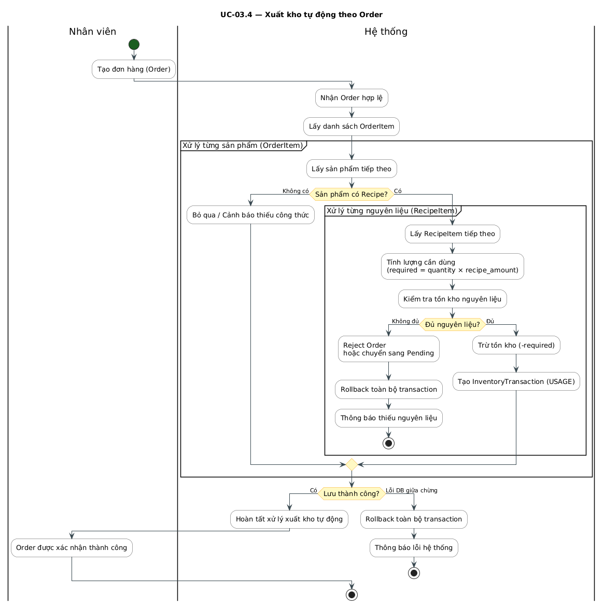

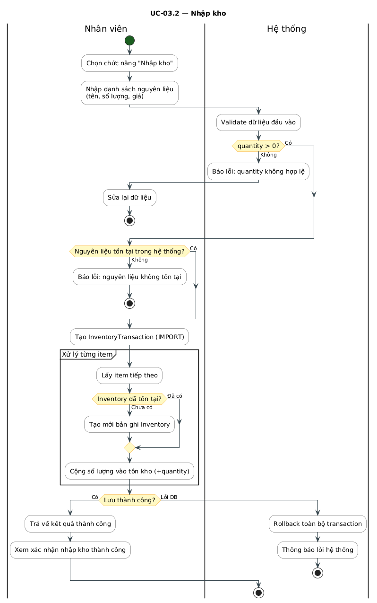


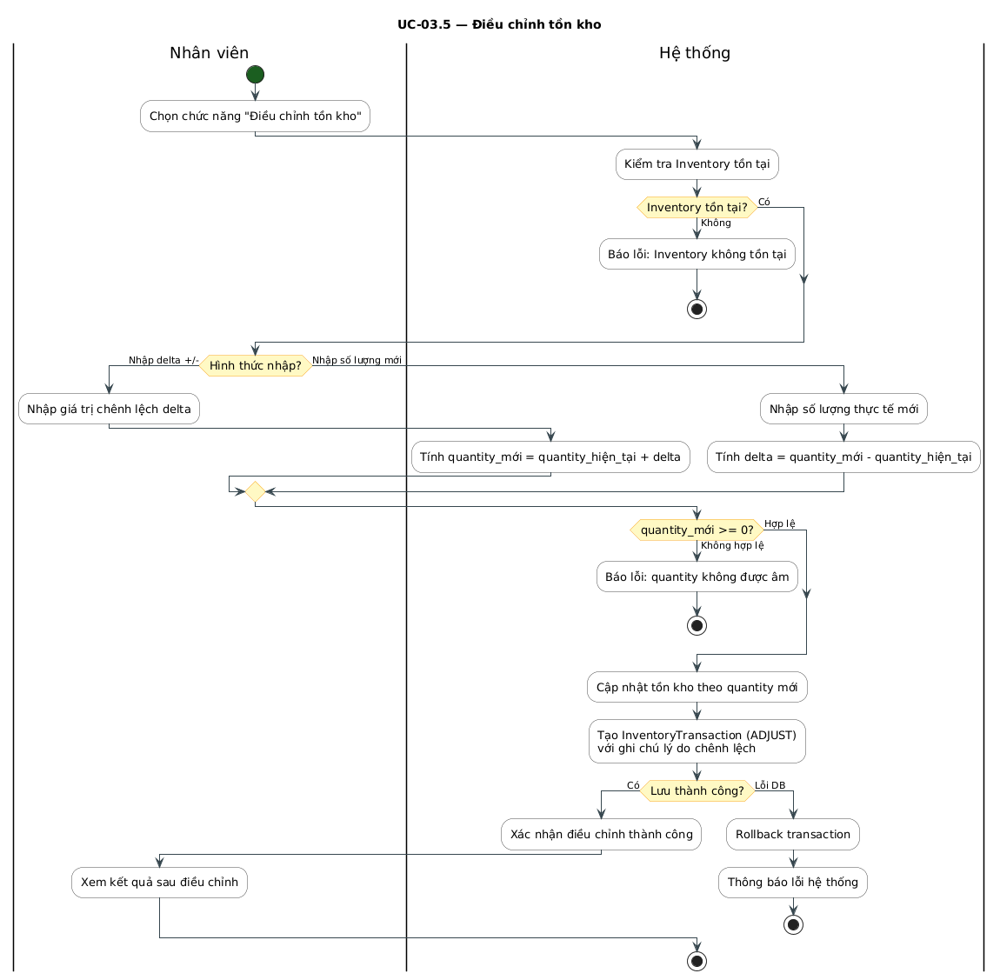

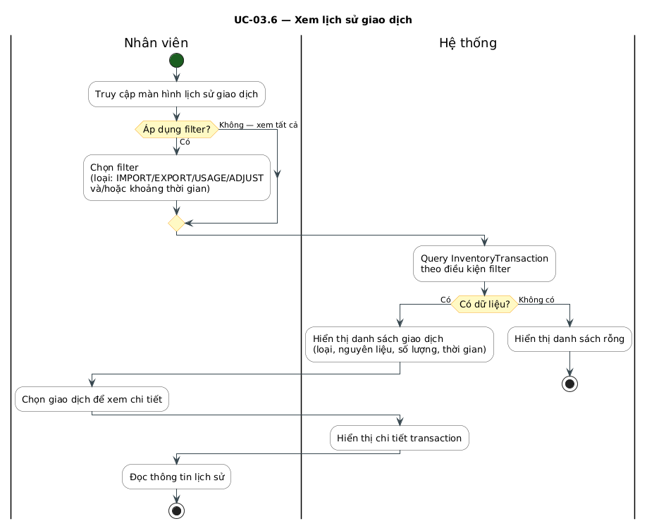

## CHƯƠNG 6: NGHIÊN CỨU CHUYÊN SÂU — CA SỬ DỤNG QUẢN LÝ CA LÀM VIỆC VÀ CHẤM CÔNG (UC04)

Chương này đi sâu vào phân tích và thiết kế **UC04 — Quản lý Ca làm việc và Chấm công**. Đây là phân hệ hạt nhân trong quản trị nhân sự, có tính phức tạp cao do phải xử lý đồng thời nhiều ràng buộc thời gian, dữ liệu và quyền truy cập. Phân tích chuyên sâu UC04 minh họa cho toàn bộ vòng đời thiết kế ca sử dụng từ đặc tả đến thiết kế dữ liệu và kiểm thử.

### 6.1. Biểu đồ Ca sử dụng chi tiết UC04

#### 6.1.1. Phân định các ca sử dụng con

UC04 được phân rã thành các ca sử dụng con độc lập, có thể được phân công cho các thành viên nhóm khác nhau:

```plantuml
@startuml
left to right direction
actor "Quản lý" as Manager
actor "Nhân viên" as Employee

rectangle "UC04 - Quản lý ca làm việc và chấm công" {
  usecase "UC04.1: Tạo mẫu ca" as UC041
  usecase "UC04.2: Phân công ca" as UC042
  usecase "UC04.3: Vào ca làm" as UC043
  usecase "UC04.4: Kết thúc ca làm" as UC044
  usecase "UC04.5: Tính lương tự động" as UC045
  usecase "UC04.6: Xem báo cáo" as UC046
}

Manager --> UC041
Manager --> UC042
Manager --> UC045
Manager --> UC046
Employee --> UC043
Employee --> UC044

UC043 ..> UC042 : include
UC044 ..> UC042 : include
UC043 ..> UC045 : extend
UC044 ..> UC045 : extend
UC045 ..> UC046 : extend
@enduml
```

### 6.2. Đặc tả Ca sử dụng

#### 6.2.1. Đặc tả UC04.3 — Nhân viên Vào ca làm

| **Trường**                      | **Nội dung**                                                                                            |
| ------------------------------- | ------------------------------------------------------------------------------------------------------- |
| Mã ca sử dụng                   | UC04.3                                                                                                  |
| Tên ca sử dụng                  | Vào ca làm việc                                                                                         |
| Tác nhân chính                  | Nhân viên                                                                                               |
| Tác nhân thứ cấp                | Hệ thống chấm công                                                                                      |
| Điều kiện tiên quyết            | Nhân viên đã đăng nhập; tồn tại bản phân công ca (ShiftAssignment) cho nhân viên này trong ngày hôm nay |
| Điều kiện kết thúc (thành công) | Bản ghi Attendance được tạo với check_in = thời gian hiện tại; status = 'present' hoặc 'late'           |
| Điều kiện kết thúc (thất bại)   | Hệ thống hiển thị thông báo lỗi; không tạo bản ghi Attendance                                           |

**Luồng sự kiện chính (Main Flow):**

| **Bước** | **Tác nhân** | **Hành động**                                                                   |
| -------- | ------------ | ------------------------------------------------------------------------------- |
| 1        | Nhân viên    | Mở màn hình Chấm công, chọn "Vào ca"                                            |
| 2        | Hệ thống     | Truy vấn ShiftAssignment theo employee_id và ngày hiện tại                      |
| 3        | Hệ thống     | Xác nhận tồn tại ca được phân công và chưa có check_in                          |
| 4        | Hệ thống     | Tạo bản ghi Attendance với check_in = NOW()                                     |
| 5        | Hệ thống     | Cập nhật Attendance.status = 'present'                                          |
| 6        | Hệ thống     | Hiển thị thông báo:_"Vào ca thành công lúc HH:MM. Chúc bạn làm việc hiệu quả!"_ |

**Luồng ngoại lệ (Exception Flows):**

| **Mã** | **Điều kiện kích hoạt**                         | **Xử lý**                                                          |
| ------ | ----------------------------------------------- | ------------------------------------------------------------------ |
| E1     | Không tồn tại ShiftAssignment cho ngày hôm nay  | Hiển thị:_"Bạn không có ca làm việc hôm nay. Liên hệ Quản lý."_    |
| E2     | Nhân viên đã vào ca (check_in đã tồn tại)       | Hiển thị:_"Bạn đã vào ca lúc [giờ]. Không thể ghi nhận hai lần."_  |
| E3     | Vào ca sớm hơn 30 phút so với Shift.start_time  | Hiển thị cảnh báo vào ca sớm; cho phép nhân viên xác nhận tiếp tục |
| E4     | Vào ca muộn hơn 15 phút so với Shift.start_time | Ghi nhận bình thường nhưng đặt Attendance.status = 'late'          |
| E5     | Mất kết nối CSDL khi lưu                        | Thông báo lỗi kỹ thuật; ghi log; không tạo bản ghi Attendance      |

#### 6.2.2. Đặc tả UC04.5 — Tính lương tự động

| **Trường**           | **Nội dung**                                                                        |
| -------------------- | ----------------------------------------------------------------------------------- |
| Mã ca sử dụng        | UC04.5                                                                              |
| Tác nhân             | Quản lý (khởi tạo) / Hệ thống (thực thi)                                            |
| Điều kiện tiên quyết | Tồn tại ít nhất một bản ghi Attendance có đủ check_in/check_out trong kỳ tính lương |
| Kết quả              | Hệ thống tổng hợp bảng lương cho từng nhân viên theo kỳ                             |

**Công thức tính lương:**

$$
S_{total} = (N_{sang} \times R_{sang}) + (N_{toi} \times R_{toi}) + (N_{cuoi\_tuan} \times R_{ca} \times 1.5) + (N_{ngay\_le} \times R_{ca} \times 2.0)
$$

| **Loại ca**           | **Khung giờ (start_time – end_time)** | **Cách tính**                      |
| --------------------- | ------------------------------------- | ---------------------------------- |
| Ca sáng (ngày thường) | 06:00 – 14:00                         | Cộng `R_sang` khi hoàn thành đủ ca |
| Ca tối (ngày thường)  | 14:00 – 22:00                         | Cộng `R_toi` khi hoàn thành đủ ca  |
| Ca cuối tuần          | Theo loại ca tương ứng                | Nhân hệ số `1.5` trên đơn giá ca   |
| Ca ngày lễ            | Theo loại ca tương ứng                | Nhân hệ số `2.0` trên đơn giá ca   |

#### 6.2.3. Xử lý Ngoại lệ — Quên kết thúc ca

Trường hợp nhân viên quên bấm giờ ra, hệ thống **không được phép** gán working_hours = 0 (vi phạm quyền lợi người lao động). Thay vào đó:

```plantuml
@startuml
start
:Hệ thống phát hiện bản ghi Attendance chưa có check_out;
:Đánh dấu Attendance.status = 'absent' tạm thời;
:Gửi thông báo cho Quản lý xem xét;
if (Quản lý xác nhận giờ ra?) then (Có)
  :Cập nhật check_out theo xác nhận;
  :Tính working_hours = check_out - check_in;
  :Đưa vào bảng lương kỳ hiện tại;
else (Không)
  :Giữ bản ghi ở trạng thái chờ xử lý;
endif
stop
@enduml
```

### 6.3. Mô hình Dữ liệu — Phân hệ Ca làm việc

#### 6.3.1. Lược đồ 4 bảng — Tách biệt Kế hoạch và Thực tế

Nguyên tắc thiết kế cốt lõi của UC04 là **tách biệt hoàn toàn** dữ liệu kế hoạch (ShiftTemplate, Shift, ShiftAssignment) khỏi dữ liệu thực tế (Attendance). Lược đồ bám sát ERD tổng thể, tên tham số theo tiếng Anh:

```plantuml
@startuml

entity ShiftTemplate {
  +id PK
  name
  start_time
  end_time
}

entity Shift {
  +id PK
  store_id FK
  shift_template_id FK
  shift_date
  start_time
  end_time
  status
}

entity ShiftAssignment {
  +id PK
  shift_id FK
  employee_id FK
  role
}

entity Attendance {
  +id PK
  shift_id FK
  employee_id FK
  check_in
  check_out
  status
  working_hours
}

entity Employee {
  +id PK
  store_id FK
  name
  role
}

ShiftTemplate ||--o{ Shift
Shift ||--o{ ShiftAssignment
Shift ||--o{ Attendance
Employee ||--o{ ShiftAssignment
Employee ||--o{ Attendance

@enduml
```

_Ghi chú: **ShiftTemplate** lưu mẫu ca tái sử dụng; **Shift** là ca thực tế theo ngày; **ShiftAssignment** là kế hoạch phân công; **Attendance** ghi thực tế check_in, check_out và working_hours._

#### 6.3.2. Các Quy tắc Nghiệp vụ cho UC04

| **Mã BR** | **Quy tắc**                                                            | **Cơ chế kiểm soát**                                        |
| --------- | ---------------------------------------------------------------------- | ----------------------------------------------------------- |
| BR-01     | Một nhân viên không thể có 2 ca chồng chéo thời gian trong cùng ngày   | Kiểm tra overlap khi INSERT vào ShiftAssignment             |
| BR-02     | Chỉ có thể ghi check_out sau khi đã có check_in                        | check_out chỉ được UPDATE khi check_in IS NOT NULL          |
| BR-03     | Chỉ Attendance có đủ check_in và check_out mới được đưa vào bảng lương | Lọc theo điều kiện check_out IS NOT NULL khi tổng hợp lương |
| BR-04     | working_hours tối đa 16 giờ/ca; nếu vượt thì đánh dấu cần xem xét      | Kiểm tra working_hours <= 16; nếu vượt gửi cảnh báo Quản lý |
| BR-05     | status của Attendance chỉ nhận: present / late / absent                | Ràng buộc ENUM trên cột Attendance.status                   |

### 6.4. Biểu đồ Hoạt động — Quy trình Chấm công toàn luồng

```plantuml
@startuml
start
:Nhân viên mở màn hình chấm công;
if (Tìm thấy ShiftAssignment hôm nay?) then (Có)
  :Nhân viên nhấn Vào ca;
  if (Đã có bản ghi check_in?) then (Có)
    :Thông báo lỗi đã vào ca;
    stop
  else (Chưa)
    :Hệ thống ghi check_in = NOW;
    if (Muộn hơn 15 phút?) then (Có)
      :Đặt status = late;
    else (Không)
      :Đặt status = present;
    endif
    :Nhân viên thực hiện ca làm việc;
    :Nhân viên nhấn Kết thúc ca;
    :Tính working_hours = check_out - check_in;
    if (working_hours lớn hơn 16 giờ?) then (Có)
      :Gửi cảnh báo Quản lý xem xét;
    endif
    :Ghi check_out và cập nhật hoàn thành;
    :Hiển thị tóm tắt giờ vào, giờ ra, tổng giờ;
  endif
else (Không)
  :Thông báo không có ca hôm nay;
endif
stop
@enduml
```

## CHƯƠNG 7: NGHIÊN CỨU CHUYÊN SÂU — CA SỬ DỤNG QUẢN LÝ NHÂN SỰ (UC07)

Chương này phân tích chuyên sâu **UC07 — Quản lý Tài khoản và Phân quyền Nhân sự**, bao gồm toàn bộ vòng đời quản lý hồ sơ nhân viên: từ tuyển dụng và tiếp nhận nhân sự, phân quyền hệ thống, đến chấm dứt hợp đồng. Đây là phân hệ nền tảng vì mọi UC khác đều phụ thuộc vào danh tính và quyền hạn được định nghĩa tại đây.

### 7.1. Biểu đồ Ca sử dụng chi tiết UC07

#### 7.1.1. Phân định các ca sử dụng con

UC07 được phân rã thành các ca sử dụng con gắn với vòng đời nhân viên:

```plantuml
@startuml
left to right direction
actor "Quản lý" as Manager
actor "Nhân viên" as Employee

rectangle "UC07 - Quản lý tài khoản và phân quyền nhân sự" {
  usecase "UC07.1: Thêm hồ sơ nhân viên" as UC071
  usecase "UC07.2: Cấp và quản lý tài khoản" as UC072
  usecase "UC07.3: Phân quyền theo vai trò" as UC073
  usecase "UC07.4: Khóa hoặc thu hồi tài khoản" as UC074
  usecase "UC07.5: Đặt lại mật khẩu" as UC075
  usecase "UC07.6: Xem danh sách nhân viên" as UC076
}

Manager --> UC071
Manager --> UC072
Manager --> UC073
Manager --> UC074
Manager --> UC075
Manager --> UC076
Employee --> UC075

UC071 ..> UC072 : include
UC071 ..> UC073 : include
UC074 ..> UC072 : extend
UC075 ..> UC072 : extend
@enduml
```

### 7.2. Đặc tả Ca sử dụng

#### 7.2.1. Đặc tả UC07.1 — Thêm hồ sơ nhân viên mới

| **Trường** | **Nội dung** |
| --- | --- |
| Mã ca sử dụng | UC07.1 |
| Tên ca sử dụng | Thêm hồ sơ nhân viên mới |
| Tác nhân chính | Quản lý |
| Tác nhân thứ cấp | Hệ thống, Nhân viên mới (người nhận tài khoản) |
| Điều kiện tiên quyết | Quản lý đã đăng nhập; có quyền MANAGER |
| Điều kiện kết thúc (thành công) | Bản ghi Employee được tạo; tài khoản ở trạng thái hoạt động; thông báo đăng nhập được gửi |
| Điều kiện kết thúc (thất bại) | Không có bản ghi nào được tạo; hệ thống hiển thị lỗi cụ thể |
| Mức độ ưu tiên | Cao |

**Luồng sự kiện chính:**

| **Bước** | **Tác nhân** | **Hành động** |
| --- | --- | --- |
| 1 | Quản lý | Truy cập menu **Nhân sự > Thêm nhân viên** |
| 2 | Hệ thống | Hiển thị form nhập: name, phone, email, ngày sinh, store_id, role |
| 3 | Quản lý | Điền đầy đủ thông tin và nhấn Lưu |
| 4 | Hệ thống | Kiểm tra dữ liệu đầu vào (phone trùng, email định dạng, role hợp lệ) |
| 5 | Hệ thống | INSERT bản ghi vào bảng Employee |
| 6 | Hệ thống | Tự động tạo tài khoản với mật khẩu tạm thời; gán role mặc định |
| 7 | Hệ thống | Gửi email/SMS thông báo thông tin đăng nhập đến nhân viên mới |
| 8 | Hệ thống | Hiển thị thông báo: _"Thêm nhân viên thành công. Thông tin đăng nhập đã được gửi."_ |

**Luồng ngoại lệ:**

| **Mã** | **Điều kiện kích hoạt** | **Xử lý** |
| --- | --- | --- |
| E1 | Số điện thoại đã tồn tại trong hệ thống | Hiển thị: _"Nhân viên với số điện thoại này đã được đăng ký."_ Không INSERT. |
| E2 | Email không đúng định dạng | Highlight trường lỗi, thông báo: _"Email không hợp lệ."_ |
| E3 | store_id không tồn tại | Cảnh báo: _"Cửa hàng không hợp lệ. Vui lòng chọn lại."_ |
| E4 | Gửi thông báo thất bại | Vẫn tạo Employee thành công; ghi log lỗi; Quản lý tự thông báo thủ công |

#### 7.2.2. Đặc tả UC07.2 — Cấp và Quản lý tài khoản đăng nhập

| **Trường** | **Nội dung** |
| --- | --- |
| Mã ca sử dụng | UC07.2 |
| Tác nhân | Quản lý |
| Điều kiện tiên quyết | Nhân viên đã có hồ sơ trong hệ thống (UC07.1 đã thực hiện) |
| Kết quả | Tài khoản được cấp phát, cập nhật hoặc thu hồi đúng với trạng thái thực tế của nhân viên |

**Luồng sự kiện — Đặt lại mật khẩu:**

| **Bước** | **Hành động** |
| --- | --- |
| 1 | Quản lý chọn nhân viên, sau đó chọn Đặt lại mật khẩu |
| 2 | Hệ thống tạo mật khẩu ngẫu nhiên mới và băm trước khi lưu |
| 3 | Gửi mật khẩu tạm thời qua SMS/Email |
| 4 | Lần đăng nhập đầu, hệ thống bắt buộc nhân viên đổi mật khẩu mới |

#### 7.2.3. Đặc tả UC07.3 — Phân quyền theo vai trò (role)

Hệ thống phân quyền theo trường `role` trong thực thể **Employee**, với 3 vai trò chính:

| **Vai trò (role)** | **Quyền hạn chính** |
| --- | --- |
| manager | Toàn quyền: quản lý Employee, phê duyệt lương, xem Revenue, cấu hình hệ thống |
| cashier | Tạo/đóng Orders, xử lý Payment, in hóa đơn; xem lịch ca bản thân |
| barista | Cập nhật trạng thái đơn, thêm món vào Orders; chấm công cá nhân (Attendance) |

**Ma trận phân quyền chi tiết:**

| **Chức năng** | **manager** | **cashier** | **barista** |
| --- | --- | --- | --- |
| Xem danh sách Employee | Có | Không | Không |
| Thêm/Sửa Employee | Có | Không | Không |
| Phân công ca (ShiftAssignment) | Có | Không | Không |
| Vào ca/Kết thúc ca (Attendance) | Có | Có | Có |
| Xem lịch sử Attendance | Có | Có (bản thân) | Có (bản thân) |
| Duyệt điều chỉnh Attendance | Có | Không | Không |
| Tạo Orders | Có | Có | Có |
| Xử lý Payment | Có | Có | Không |
| Xem Revenue | Có | Không | Không |
| Cấu hình Product/Menu | Có | Không | Không |

### 7.3. Biểu đồ Tuần tự — Luồng Vào ca của Nhân viên

Biểu đồ này mô tả chi tiết giao tiếp giữa các lớp khi nhân viên thực hiện vào ca — tập trung vào việc xác thực và kiểm tra ShiftAssignment trước khi ghi Attendance:

```plantuml
@startuml
autonumber
actor NhanVien as NV
participant GiaoDien as GD
participant HeThong as HT
database CoSoDuLieu as DB

NV -> GD : Mở chức năng chấm công
GD -> HT : Kiểm tra ca làm (employee_id, ngày hôm nay)
HT -> DB : Truy vấn ShiftAssignment
DB --> HT : Trả về bản ghi ShiftAssignment

alt Có ca hợp lệ
  HT --> GD : Cho phép vào ca
  NV -> GD : Bấm nút Vào ca
  GD -> HT : Gửi yêu cầu ghi check_in
  HT -> DB : INSERT bản ghi Attendance (check_in = NOW)
  DB --> HT : Xác nhận lưu OK
  HT --> GD : Báo vào ca thành công
  GD --> NV : Hiển thị thông báo thành công
else Không có ca hoặc ca không hợp lệ
  HT --> GD : Báo lỗi không tìm thấy ca
  GD --> NV : Hiển thị lỗi từ chối ghi nhận
end
@enduml
```

**Giải thích các tham số:**

- `employee_id` — Mã nhân viên, lấy từ session đăng nhập.
- `check_in` — Thời gian vào ca thực tế, ghi vào Attendance.check_in.

### 7.4. Biểu đồ Hoạt động — Quy trình tiếp nhận nhân viên mới

```plantuml
@startuml
start
:Quản lý nhập hồ sơ nhân viên vào hệ thống;
if (Dữ liệu hợp lệ?) then (Có)
  :INSERT bản ghi vào Employee;
  :Tạo tài khoản đăng nhập với mật khẩu tạm thời;
  :Gán role mặc định theo vị trí;
  :Gửi thông tin đăng nhập qua Email hoặc SMS;
  if (Gửi thông báo thành công?) then (Có)
  else (Không)
    :Ghi log lỗi gửi thông báo;
  endif
  :Nhân viên nhận thông tin và đăng nhập lần đầu;
  if (Đã đổi mật khẩu tạm thời?) then (Rồi)
  else (Chưa)
    :Yêu cầu đặt mật khẩu mới;
    :Cập nhật mật khẩu trong hệ thống;
  endif
  :Nhân viên vào màn hình chính;
else (Không)
  :Hiển thị lỗi và yêu cầu sửa;
endif
stop
@enduml
```

### 7.5. Mô hình Dữ liệu — Phân hệ Nhân sự

Lược đồ CSDL của phân hệ nhân sự bám sát ERD tổng thể. Tên tham số theo tiếng Anh để đồng bộ với toàn hệ thống:

```plantuml
@startuml

entity Brand {
  +id PK
  name
}

entity Store {
  +id PK
  brand_id FK
  name
}

entity Employee {
  +id PK
  store_id FK
  name
  role
}

entity ShiftAssignment {
  +id PK
  shift_id FK
  employee_id FK
  role
}

entity Attendance {
  +id PK
  shift_id FK
  employee_id FK
  check_in
  check_out
  status
  working_hours
}

Brand ||--o{ Store
Store ||--o{ Employee
Employee ||--o{ ShiftAssignment
Employee ||--o{ Attendance

@enduml
```

*Quyết định thiết kế: Trường `role` trong **Employee** là nguồn kiểm soát phân quyền trực tiếp (manager / cashier / barista). Khi nhân viên nghỉ việc, bản ghi Employee không bị xóa vật lý — chỉ đánh dấu trạng thái để bảo toàn toàn bộ lịch sử Attendance và phục vụ kiểm toán.*

### 7.6. Ràng buộc Nghiệp vụ

| **Mã BR** | **Quy tắc** | **Cơ chế kiểm soát** |
| --- | --- | --- |
| BR-NS-01 | Mỗi Employee chỉ có đúng một tài khoản đăng nhập (quan hệ 1-1) | Unique Constraint trên cột employee_id của bảng tài khoản |
| BR-NS-02 | Mật khẩu phải được băm trước khi lưu; không lưu dạng văn bản gốc | Xử lý tại tầng dịch vụ |
| BR-NS-03 | Lần đăng nhập đầu tiên bắt buộc đổi mật khẩu | Cờ buộc đổi mật khẩu; chặn mọi yêu cầu trừ endpoint đổi mật khẩu |
| BR-NS-04 | Không được xóa vật lý bản ghi Employee | Chỉ đánh dấu trạng thái vô hiệu (soft delete) |
| BR-NS-05 | Mọi thao tác thêm/sửa Employee phải được ghi nhật ký | Trigger AFTER INSERT/UPDATE trên bảng Employee |
| BR-NS-06 | Không thể tạo ShiftAssignment cho Employee đã bị vô hiệu hóa | Trigger kiểm tra trạng thái Employee trước khi INSERT ShiftAssignment |


### 7.8. Đánh giá và Định hướng mở rộng UC07

**Những điểm mạnh của thiết kế hiện tại:**

Trường `role` trực tiếp trong **Employee** đơn giản hóa việc kiểm tra quyền hạn, phù hợp quy mô quán cafe.

Cơ chế **vô hiệu hóa mềm** đảm bảo toàn vẹn dữ liệu lịch sử, đặc biệt quan trọng khi kiểm toán.

Nhật ký thao tác ở tầng CSDL (trigger) đảm bảo ghi nhận ngay cả khi ứng dụng gặp sự cố.

**Hướng mở rộng trong phiên bản tương lai:**

| **Tính năng** | **Mô tả** | **Độ phức tạp** |
| --- | --- | --- |
| Đăng nhập 2 yếu tố (2FA) | OTP qua SMS hoặc ứng dụng xác thực tại mỗi lần đăng nhập | Trung bình |
| Đăng nhập một lần (SSO) | Tích hợp đăng nhập qua Google Workspace cho chuỗi nhiều chi nhánh | Cao |
| Hợp đồng lao động điện tử | Lưu trữ và ký số hợp đồng ngay trong hệ thống | Cao |
| Dashboard phân tích nhân sự | Thống kê tỷ lệ nghỉ việc, thâm niên, cơ cấu nhân sự | Trung bình |

## CHƯƠNG 8: NGHIÊN CỨU CHUYÊN SÂU — CA SỬ DỤNG BÁO CÁO DOANH THU - CHI PHÍ (UC05)

### 8.1. Biểu đồ Ca sử dụng

```plantuml
@startuml
left to right direction
actor "Chủ chuỗi" as Owner
actor "Kế toán" as Accountant
actor "Quản lý cửa hàng" as StoreManager

rectangle "UC05 - Báo cáo doanh thu và chi phí" {
  usecase "UC5-01: Xem bảng điều khiển tổng quan" as UC501
  usecase "UC5-02: Xem báo cáo doanh thu" as UC502
  usecase "UC5-03: Xem báo cáo chi phí" as UC503
  usecase "UC5-04: Xem báo cáo lợi nhuận" as UC504
  usecase "UC5-05: Lọc dữ liệu báo cáo" as UC505
  usecase "UC5-06: Xuất báo cáo" as UC506
  usecase "UC5-07: So sánh hiệu suất cửa hàng" as UC507
  usecase "UC5-08: Xem top sản phẩm bán chạy" as UC508
}

Owner --> UC501
Owner --> UC502
Owner --> UC503
Owner --> UC504
Owner --> UC507
Owner --> UC508
Accountant --> UC502
Accountant --> UC503
Accountant --> UC504
Accountant --> UC506
StoreManager --> UC503
StoreManager --> UC508

UC501 ..> UC505 : include
UC502 ..> UC505 : include
UC503 ..> UC505 : include
UC504 ..> UC505 : include
UC507 ..> UC505 : include
UC502 ..> UC506 : extend
UC503 ..> UC506 : extend
UC504 ..> UC506 : extend
UC506 ..> UC508 : extend
@enduml
```

### 8.2. Đặc tả Ca sử dụng

8.2.1. Xem bảng điều khiển tổng quan

| **Thuộc tính** | **Nội dung** |
| --- | --- |
| Mã UC | UC5-01 |
| Tên UC | Xem bảng điều khiển tổng quan |
| Tác nhân chính | Chủ chuỗi |
| Tác nhân phụ | Không có |
| Mục tiêu | Cung cấp cho chủ chuỗi cái nhìn tổng quan về tình hình tài chính toàn hệ thống: tổng doanh thu, tổng chi phí, lợi nhuận và top cửa hàng doanh thu cao |
| Điều kiện tiên quyết | Người dùng đã đăng nhập với vai trò Chủ chuỗi |
| Điều kiện hậu nghiệm | Bảng điều khiển hiển thị đầy đủ số liệu tổng quan của hệ thống trong kỳ mặc định (tháng hiện tại) |
| Luồng sự kiện chính | 1. Chọn mục bảng điều khiển tổng quan
 2. Hệ thống kiểm tra vai trò người dùng (Chủ chuỗi)
 3. Thu thập dữ liệu doanh thu từ tất cả cửa hàng
 4. Tính toán: tổng doanh thu, tổng chi phí, lợi nhuận (tháng hiện tại)
 5. Xếp hạng top cửa hàng theo doanh thu
 6. Hiển thị bảng điều khiển: các thẻ KPI, biểu đồ xu hướng, bảng top cửa hàng
 7. Xem thông tin tổng quan |
| Luồng thay thế | [A1] Không có dữ liệu trong kỳ: Hiển thị thông báo "Chưa có dữ liệu cho kỳ này", các thẻ KPI hiển thị giá trị 0 |
| Luồng ngoại lệ | [E1] Lỗi kết nối cơ sở dữ liệu: Hiển thị thông báo lỗi và đề xuất thử lại sau
 [E2] Timeout truy vấn: Hiển thị thông báo hết thời gian chờ, cho phép làm mới trang |
| Ghi chú | Bảng điều khiển mặc định hiển thị dữ liệu tháng hiện tại. Người dùng có thể kết hợp với UC5-05 để lọc theo kỳ khác |

8.2.2. Xem báo cáo doanh thu

8.2.3. Xem báo cáo chi phí

8.2.4. Xem báo cáo lợi nhuận

8.2.5. Lọc dữ liệu báo cáo

8.2.6. Xuất báo cáo

8.2.7. So sánh hiệu suất cửa hàng

8.2.8. Xem top sản phẩm bán chạy

### 8.3. Biểu đồ hoạt động ca sử dụng

## CHƯƠNG 9: NGHIÊN CỨU CHUYÊN SÂU — USE CASE QUẢN LÝ DANH SÁCH CỬA HÀNG (UC06)

### 8.1. Biểu đồ Use Case

### 8.2. Đặc tả Use Case

### 8.3. Biểu đồ hoạt động Use Case

## TÀI LIỆU THAM KHẢO

## KẾT LUẬN

Bài tiểu luận này đã trình bày một cách có hệ thống và toàn diện toàn bộ vòng đời phát triển phần mềm (SDLC) cho Hệ thống Quản lý Quán Café, áp dụng nhất quán các phương pháp luận và công cụ chuẩn mực của ngành Công nghệ phần mềm.

**Tóm tắt thành quả chính:**

| **Chương** | **Giai đoạn SDLC** | **Thành quả chính** |
| --- | --- | --- |
| Chương 1 | Khảo sát & Đặc tả | 12 Yêu cầu chức năng (FR), 6 Yêu cầu phi chức năng (NFR), Ma trận rủi ro |
| Chương 2 | Phân tích & Thiết kế | Biểu đồ lớp của 5 nhóm lớp, ERD chuẩn 3NF, biểu đồ tuần tự/trạng thái, kiến trúc 3 tầng |
| Chương 3 | Hiện thực & SQA | Ngăn xếp công nghệ, quy trình viết mã sạch, tháp kiểm thử, hơn 10 ca kiểm thử, kế hoạch bảo trì 4 loại |
| Chương 4 | Nghiên cứu UC04 | Đặc tả đầy đủ 5 luồng ngoại lệ, ERD 4 bảng nhân sự, 5 quy tắc nghiệp vụ, 9 ca kiểm thử |

**Bài học rút ra:** Quá trình thực hiện dự án khẳng định một nguyên lý căn bản trong kỹ nghệ phần mềm: _"Đầu tư vào giai đoạn đặc tả và thiết kế tốt sẽ giảm thiểu đáng kể chi phí sửa lỗi ở giai đoạn sau."_ Cụ thể, việc xây dựng quy tắc nghiệp vụ BR-01 (ngăn ca chồng chéo) bằng bộ kích hoạt ở cơ sở dữ liệu thay vì chỉ kiểm tra ở tầng ứng dụng là một quyết định thiết kế có tầm nhìn, bảo đảm toàn vẹn dữ liệu bất kể lỗi từ phía ứng dụng.

**Hướng phát triển tiếp theo:** Hệ thống hiện tại được xây dựng cho mô hình một chi nhánh. Để mở rộng lên quy mô chuỗi nhiều chi nhánh, cần nghiên cứu chuyển đổi sang kiến trúc vi dịch vụ và bổ sung cơ chế đồng bộ dữ liệu phân tán — đây là bài toán nghiên cứu cho học phần Kiến trúc Phần mềm ở các cấp độ cao hơn.

## TÀI LIỆU THAM KHẢO