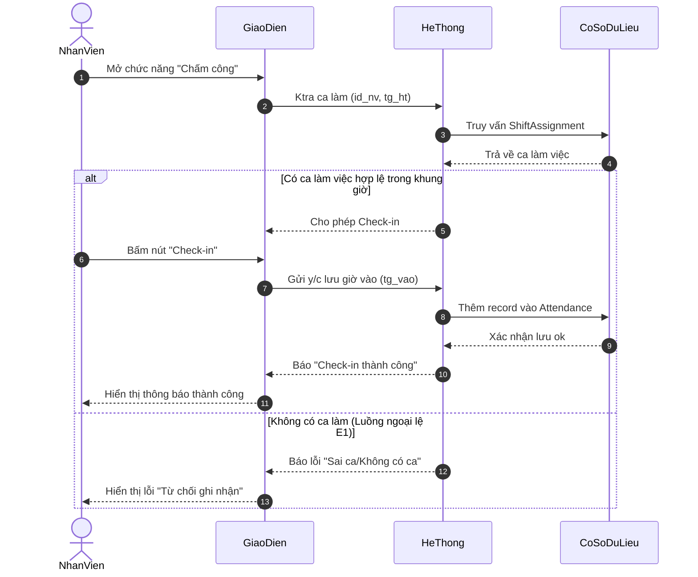

# Biểu đồ Tuần tự (Sequence Diagram) - Use Case Check-in

Dưới đây là biểu đồ tuần tự cho luồng Check-in, được thiết kế theo đúng đặc tả Use Case mà bạn đã cung cấp.

## Giải thích các biến (Variables)
- `id_nv`: Mã nhân viên (ID Nhân viên).
- `tg_ht`: Thời gian hiện tại (Thời điểm mở app để kiểm tra).
- `tg_vao`: Thời gian Check-in thực tế.

## Ý tưởng thiết kế (Design Ideas)
1. **Kiểm tra trước khi hành động:** Hệ thống chủ động kiểm tra xem nhân viên có lịch làm việc (`ShiftAssignment`) vào thời gian hiện tại (`tg_ht`) hay không trước khi hiển thị nút bấm. Điều này giúp ngăn chặn dữ liệu rác và chặn ngay luồng ngoại lệ E1.
2. **Luồng chính (Basic Flow):** Tương ứng với các bước từ 5 đến 7 trong biểu đồ, khi nhân viên bấm Check-in, hệ thống sẽ lưu `tg_vao` (tương đương `check_in_time`) vào bảng `Attendance` trong cơ sở dữ liệu (`DB`).
3. **Tính tối giản:** Các đối tượng tham gia được nhóm thành Giao diện, Hệ thống và CSDL giúp sơ đồ rõ ràng, dễ hiểu khi đưa vào báo cáo môn học.
