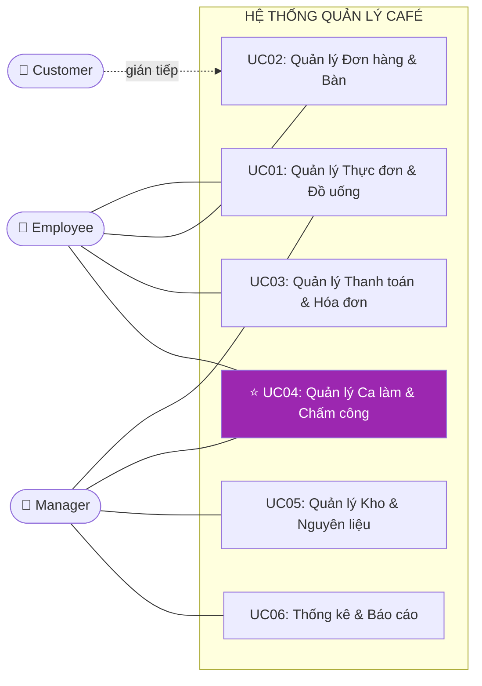

## CHƯƠNG 1: TỔNG QUAN HỆ THỐNG VÀ PHÂN CÔNG NHÓM

> **Mục tiêu chương:** Trình bày bức tranh toàn cảnh — 6 phân hệ Use Case, tác nhân, yêu cầu chức năng và phi chức năng. Phần này chiếm ~10% báo cáo.

### 1.1. Bối cảnh và Tầm nhìn Dự án

Dự án xây dựng nền tảng quản lý café tích hợp, giải quyết đồng thời bài toán vận hành (POS, thu ngân, kho bãi) và quản trị nhân sự. Bộ sản phẩm gồm ba nền tảng:

| **Nền tảng**               | **Đối tượng**   | **Công nghệ**                     |
| -------------------------- | --------------- | --------------------------------- |
| Ứng dụng Web Dashboard     | Quản lý cấp cao | React / Next.js, Cloud-hosted     |
| Phần mềm POS máy tính bảng | Thu ngân        | Android tablet, giao thức ESC/POS |
| Ứng dụng di động nhân viên | Nhân viên       | Flutter, GPS + FaceID             |

---

### 1.2. Biểu đồ Use Case Tổng quát

Biểu đồ thể hiện phạm vi hệ thống và tương tác giữa tác nhân với 6 ca sử dụng. **UC04 (tô màu tím)** là trọng tâm phân tích chuyên sâu của báo cáo này.

---

### 1.3. Bảng Tóm tắt Chức năng Toàn Hệ thống

| **UC** | **Phân hệ** | **Chức năng cốt lõi** | **Người phụ trách** | **Mức chi tiết** |
|:------:|-------------|----------------------|---------------------|:----------------:|
| UC01 | Thực đơn & Đồ uống | CRUD sản phẩm, nhóm, topping, công thức pha chế | Bảo | Tóm tắt |
| UC02 | Đơn hàng & Bàn | Tạo/sửa đơn, quản lý trạng thái bàn real-time | Thành | Tóm tắt |
| UC03 | Thanh toán & Hóa đơn | Xử lý thanh toán đa kênh (tiền mặt/thẻ/QR), in hóa đơn | Thành | Tóm tắt |
| UC05 | Kho & Nguyên liệu | Nhập kho, trừ tồn theo công thức Recipe, cảnh báo ngưỡng | Nguyễn Quang Đạo | Tóm tắt |
| UC06 | Báo cáo & Cửa hàng | Thống kê doanh thu, top sản phẩm, quản lý chi nhánh | Hồng Nhung | Tóm tắt |
| **UC04** | **Nhân sự & Chấm công** | **Hồ sơ NV, phân ca, GPS check-in/out, tính lương NĐ38, RBAC** | **Nguyễn Viết Tùng** | **⭐ Chuyên sâu (Chương 3)** |

---

### 1.4. Yêu cầu Chức năng (Functional Requirements)

Yêu cầu chức năng được phân loại theo chuẩn **IEEE 830**, đảm bảo tính truy vết từ yêu cầu đến thiết kế:

| **Mã** | **Phân hệ** | **Mô tả yêu cầu** | **Ưu tiên** |
| ------ | ----------- | ----------------- | :---------: |
| FR-01 | Đơn hàng | Nhân viên tạo mới, sửa đổi và hủy đơn hàng trên bàn đang hoạt động | Cao |
| FR-02 | Đơn hàng | Hệ thống tự động thông báo khu vực pha chế khi có đơn mới | Cao |
| FR-03 | Bàn | Trạng thái bàn cập nhật theo thời gian thực, không cần làm mới trang | Cao |
| FR-04 | Thanh toán | Hỗ trợ tối thiểu 3 hình thức: tiền mặt, thẻ và QR Pay | Trung bình |
| FR-05 | Thanh toán | Hóa đơn xuất ra máy in nhiệt theo định dạng chuẩn ESC/POS | Cao |
| FR-06 | Kho | Tự động cập nhật tồn kho khi đơn xác nhận, theo công thức Recipe | Cao |
| FR-07 | Kho | Cảnh báo khi tồn kho xuống dưới ngưỡng tối thiểu | Trung bình |
| **FR-08** | **Nhân sự** | **Quản lý tạo và phân công ca làm cho từng nhân viên theo ngày/tuần** | **Cao** |
| **FR-09** | **Nhân sự** | **Nhân viên Check-in/Check-out, hệ thống ghi nhận giờ làm thực tế** | **Cao** |
| **FR-10** | **Nhân sự** | **Tính lương đa biến theo NĐ 38/2022: giờ hành chính, tăng ca (×1.5/2.0/3.0), ca đêm (+30%)** | **Cao** |
| **FR-15** | **Chấm công** | **Chấm công bằng GPS Geofencing + xác thực khuôn mặt, ngăn chấm công hộ** | **Cao** |
| FR-11 | Báo cáo | Tổng hợp và trực quan hóa doanh thu theo ngày/tuần/tháng | Trung bình |
| FR-12 | Báo cáo | Thống kê top 10 mặt hàng bán chạy nhất trong kỳ | Thấp |
| FR-13 | AI — Kho | Module AI dự báo nhu cầu nguyên liệu, tự động tạo đề xuất phiếu nhập | Kiến nghị |
| FR-14 | AI — Nhân sự | Module AI tự động đề xuất lịch phân ca theo dự báo lưu lượng khách | Kiến nghị |
| FR-16 | Khách hàng | Quản lý khách hàng thân thiết; AI cá nhân hóa khuyến mãi | Kiến nghị |

> **Lưu ý:** FR-08, FR-09, FR-10, FR-15 (in đậm) là trọng tâm phân tích của báo cáo, được đặc tả đầy đủ tại Chương 3.

---

### 1.5. Yêu cầu Phi chức năng (Non-Functional Requirements)

Phân tích theo mô hình chất lượng **ISO/IEC 25010**:

| **Thuộc tính** | **Yêu cầu cụ thể** | **Cách đo lường** |
| -------------- | ------------------ | ----------------- |
| **Hiệu năng** | Phản hồi < 3 giây trong điều kiện LAN, 20 người dùng đồng thời | Profiling tool |
| **Tính sẵn sàng** | 24/7; RTO < 30 phút khi có sự cố | Uptime log |
| **Bảo mật** | RBAC nghiêm ngặt; BCrypt hash; Audit Log ≥ 90 ngày | Penetration Test cơ bản |
| **Tính khả dụng** | Nhân viên mới thành thạo chức năng cơ bản sau ≤ 2 giờ đào tạo | User Testing 5 người |
| **Tương thích** | Windows 7 SP1+; máy in nhiệt chuẩn ESC/POS | Kiểm thử 3 cấu hình POS |
| **Bảo trì** | Code Coverage ≥ 70%; tài liệu hóa đầy đủ | JaCoCo |

---

### 1.6. Phân tích Rủi ro Dự án

| **Rủi ro** | **Xác suất** | **Tác động** | **Biện pháp giảm thiểu** |
| ---------- | :----------: | :----------: | ------------------------ |
| Yêu cầu thay đổi giữa chừng (Scope Creep) | Cao | Cao | Use Case Specification làm tài liệu ký kết; Change Management |
| Thiếu dữ liệu thực tế để kiểm thử | Trung bình | Trung bình | Sinh Seed Data mô phỏng thực tế |
| Thành viên nhóm vắng giữa sprint | Thấp | Cao | Phân công chéo; tài liệu handover |
| Lỗi tích hợp phần cứng POS | Trung bình | Cao | Kiểm thử thiết bị sớm; driver dự phòng |

---
