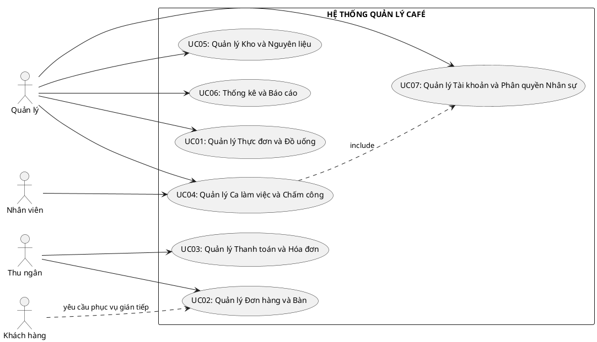

## CHƯƠNG 1: TỔNG QUAN HỆ THỐNG VÀ PHÂN CÔNG NHÓM

> **Mục tiêu chương:** Trình bày kết quả khảo sát hiện trạng, actor, yêu cầu chức năng, yêu cầu phi
> chức năng và biểu đồ ca sử dụng tổng quát của toàn hệ thống. Đây là phần tổng quan chung của cả
> nhóm trước khi đi vào các chương chuyên sâu.

### 1.1. Khảo sát và Định hình Bài toán Hiện trạng

#### 1.1.1. Phương pháp và Phạm vi Khảo sát

Để thu thập dữ liệu đầu vào cho giai đoạn đặc tả, nhóm nghiên cứu sử dụng kết hợp ba kỹ thuật:

- **Phỏng vấn có cấu trúc:** trao đổi với người quản lý và trưởng ca để làm rõ quy trình bán hàng,
  kiểm kho và chấm công.
- **Quan sát thực địa:** theo dõi luồng xử lý đơn hàng trong giờ cao điểm nhằm nhận diện các bước
  thủ công dễ phát sinh lỗi.
- **Phân tích tài liệu hiện có:** đối chiếu sổ ghi tay, bảng chấm công, phiếu thu và danh sách thực
  đơn để hiểu cách dữ liệu đang được lưu trữ trước khi số hóa.

Phạm vi khảo sát tập trung vào mô hình quán café quy mô nhỏ đến vừa, có các nghiệp vụ phổ biến như
bán tại quán, thanh toán tại quầy, quản lý nguyên liệu cơ bản và quản lý nhân sự theo ca.

#### 1.1.2. Mô tả Hiện trạng và Các Vấn đề Tồn tại

Kết quả khảo sát cho thấy nhiều quy trình vận hành vẫn đang dựa trên giấy tờ, tin nhắn hoặc ghi nhớ
thủ công. Từ khi khách gọi món đến khi hoàn tất thanh toán, thông tin phải đi qua nhiều bước truyền
đạt bằng miệng hoặc ghi chép trung gian, khiến đơn hàng dễ sai, khó kiểm tra lịch sử và khó truy vết
trách nhiệm khi xảy ra nhầm lẫn.

Ở mảng kho và nguyên liệu, việc theo dõi mức tiêu hao chưa gắn chặt với từng đơn hàng, dẫn đến chênh
lệch giữa số liệu tồn kho thực tế và số liệu ghi sổ. Ở mảng nhân sự, lịch làm và chấm công thủ công
khiến quá trình đối soát giờ công, kiểm tra đi muộn hoặc tính lương theo ca mất nhiều thời gian,
đồng thời dễ phát sinh tranh cãi.

Có thể tóm tắt hiện trạng theo phân tích SWOT như sau:

|            | **Điểm mạnh (S)**                                                   | **Điểm yếu (W)**                                                                         |
| ---------- | ------------------------------------------------------------------- | ---------------------------------------------------------------------------------------- |
| Nội tại    | Quy trình quen thuộc với nhân viên; chi phí triển khai ban đầu thấp | Dễ sai sót, khó đối soát, thiếu dữ liệu lịch sử, khó mở rộng                             |
|            | **Cơ hội (O)**                                                      | **Thách thức (T)**                                                                       |
| Ngoại cảnh | Nhu cầu số hóa F&B tăng; thiết bị POS ngày càng phổ biến            | Cạnh tranh từ các chuỗi đã số hóa; khách hàng kỳ vọng trải nghiệm nhanh và chính xác hơn |

#### 1.1.3. Tầm nhìn và Phạm vi Dự án

Từ các bất cập trên, nhóm xác định tầm nhìn của dự án là xây dựng một **hệ thống quản lý quán café
tập trung**, hỗ trợ đồng bộ các nghiệp vụ cốt lõi gồm bán hàng, thực đơn, kho, báo cáo và nhân sự
theo ca. Mục tiêu chính là giảm sai sót thủ công, tăng độ chính xác dữ liệu và nâng cao khả năng
kiểm soát vận hành của người quản lý.

Phạm vi hiện tại của hệ thống được giới hạn ở mức phù hợp với học phần: phục vụ một cửa hàng hoặc
một chi nhánh café đơn lẻ, tập trung vào các nghiệp vụ vận hành nội bộ, chưa mở rộng sang tích điểm
khách hàng, giao hàng tự động hoặc các mô-đun AI chuyên sâu.

### 1.2. Phân tích và Xác định Actor

Hệ thống quản lý café phục vụ nhiều vai trò khác nhau. Mỗi actor có mục tiêu sử dụng, phạm vi quyền
hạn và điểm tiếp xúc riêng với hệ thống:

| **Actor**                   | **Mô tả**                                                                     | **Mục tiêu chính khi sử dụng hệ thống**                                   |
| --------------------------- | ----------------------------------------------------------------------------- | ------------------------------------------------------------------------- |
| Quản lý                     | Người điều hành chi nhánh hoặc cửa hàng                                       | Quản lý thực đơn, nhân sự, phân ca, kho, doanh thu và cấu hình vận hành   |
| Thu ngân                    | Nhân viên trực tiếp tiếp nhận và xử lý giao dịch bán hàng                     | Tạo đơn, cập nhật bàn, áp dụng món/topping, thanh toán và in hóa đơn      |
| Nhân viên phục vụ / pha chế | Nhân sự làm việc theo ca tại cửa hàng                                         | Nhận đơn, theo dõi công việc theo ca, vào ca và kết thúc ca               |
| Khách hàng                  | Người mua sản phẩm, tác động gián tiếp đến hệ thống thông qua yêu cầu phục vụ | Đặt món, thanh toán, nhận hóa đơn và trải nghiệm phục vụ nhanh, chính xác |

Việc xác định rõ actor giúp nhóm phân biệt đâu là yêu cầu của người dùng cuối và đâu là yêu cầu quản
trị nội bộ, từ đó tránh thiết kế các chức năng bị trùng vai trò hoặc vượt quyền sử dụng thực tế.

### 1.3. Yêu cầu Chức năng

Từ nhu cầu thực tế của quán café và phạm vi đề tài mà nhóm đã xác định, hệ thống phải đáp ứng các
yêu cầu chức năng cốt lõi sau. Các yêu cầu này được xây dựng để bao quát đầy đủ các phân hệ bán
hàng, thực đơn, kho, báo cáo và nhân sự, đồng thời làm cơ sở cho biểu đồ use case tổng quát và các
chương nghiên cứu chuyên sâu.

| **Mã** | **Nhóm chức năng**       | **Đặc tả yêu cầu chức năng**                                                                                                          | **Actor chính**     | **Ưu tiên** |
| ------ | ------------------------ | ------------------------------------------------------------------------------------------------------------------------------------- | ------------------- | :---------: |
| FR-01  | Quản lý thực đơn         | Hệ thống cho phép quản lý thêm, sửa, ẩn hoặc cập nhật thông tin đồ uống, nhóm món, topping và giá bán.                                | Quản lý             |     Cao     |
| FR-02  | Quản lý công thức        | Hệ thống cho phép khai báo công thức pha chế và định lượng nguyên liệu cho từng món uống để làm căn cứ trừ kho.                       | Quản lý             |     Cao     |
| FR-03  | Quản lý đơn hàng         | Hệ thống cho phép thu ngân tạo đơn hàng mới, cập nhật món, số lượng, ghi chú và trạng thái phục vụ trong quá trình bán hàng.          | Thu ngân            |     Cao     |
| FR-04  | Quản lý bàn              | Hệ thống phải theo dõi trạng thái bàn theo thời gian thực như bàn trống, đang phục vụ, chờ thanh toán hoặc đã hoàn tất.               | Thu ngân            |     Cao     |
| FR-05  | Phục vụ và pha chế       | Khi đơn hàng được xác nhận, hệ thống phải chuyển thông tin món và yêu cầu liên quan đến bộ phận phục vụ hoặc pha chế để tránh bỏ sót. | Thu ngân, Nhân viên |     Cao     |
| FR-06  | Thanh toán               | Hệ thống cho phép thanh toán đơn hàng bằng các hình thức phổ biến như tiền mặt, chuyển khoản hoặc mã QR.                              | Thu ngân            |     Cao     |
| FR-07  | Hóa đơn                  | Sau khi thanh toán, hệ thống phải tạo và in hóa đơn cho khách hàng, đồng thời lưu lại lịch sử giao dịch để đối soát.                  | Thu ngân            |     Cao     |
| FR-08  | Quản lý kho              | Hệ thống cho phép quản lý nhập kho, xuất kho, điều chỉnh số lượng và theo dõi tình trạng tồn kho nguyên liệu.                         | Quản lý             |     Cao     |
| FR-09  | Tự động cập nhật tồn kho | Hệ thống phải tự động trừ nguyên liệu theo công thức pha chế khi đơn hàng được hoàn tất.                                              | Hệ thống            |     Cao     |
| FR-10  | Cảnh báo nguyên liệu     | Hệ thống phải cảnh báo khi số lượng nguyên liệu xuống dưới mức tồn tối thiểu để quản lý kịp thời bổ sung.                             | Quản lý             | Trung bình  |
| FR-11  | Quản lý ca làm việc      | Hệ thống cho phép tạo mẫu ca, lập lịch làm việc và phân công ca cho nhân viên theo ngày hoặc theo tuần.                               | Quản lý             |     Cao     |
| FR-12  | Chấm công                | Hệ thống cho phép nhân viên vào ca, kết thúc ca và ghi nhận thời gian làm việc thực tế trong từng ca làm.                             | Nhân viên           |     Cao     |
| FR-13  | Quản lý hồ sơ nhân sự    | Hệ thống cho phép quản lý thêm mới, cập nhật, theo dõi danh sách và trạng thái làm việc của nhân viên.                                | Quản lý             |     Cao     |
| FR-14  | Tài khoản và phân quyền  | Hệ thống phải hỗ trợ cấp tài khoản đăng nhập, khóa tài khoản, đặt lại mật khẩu và phân quyền theo vai trò sử dụng.                    | Quản lý             |     Cao     |
| FR-15  | Tính lương theo ca       | Hệ thống phải hỗ trợ tổng hợp dữ liệu chấm công và tính lương theo loại ca, số buổi làm và thời gian làm việc thực tế.                | Quản lý             |     Cao     |
| FR-16  | Báo cáo thống kê         | Hệ thống phải cung cấp báo cáo doanh thu, chi phí, tình hình hoạt động cửa hàng và các chỉ số phục vụ quản lý ra quyết định.          | Quản lý             | Trung bình  |

Nhìn chung, các yêu cầu chức năng trên phản ánh đúng mục tiêu của đề tài là xây dựng một hệ thống
quản lý quán café có khả năng hỗ trợ vận hành hằng ngày và kiểm soát quản trị nội bộ trên cùng một
nền tảng dữ liệu thống nhất.

### 1.4. Yêu cầu Phi chức năng

Phân tích theo mô hình chất lượng **ISO/IEC 25010**:

| **Thuộc tính**        | **Yêu cầu cụ thể**                                                                                            | **Cách đo lường**                              |
| --------------------- | ------------------------------------------------------------------------------------------------------------- | ---------------------------------------------- |
| Hiệu năng             | Thao tác tạo đơn, chấm công và truy vấn danh sách chính phải phản hồi trong thời gian ngắn trong giờ cao điểm | Kiểm thử hiệu năng với dữ liệu mô phỏng        |
| Tính sẵn sàng         | Hệ thống phải hoạt động ổn định trong ca làm việc của cửa hàng và có cơ chế sao lưu dữ liệu                   | Theo dõi nhật ký vận hành                      |
| Bảo mật               | Dữ liệu tài khoản, phân quyền và chấm công phải được kiểm soát theo vai trò; mật khẩu không lưu dạng thô      | Kiểm tra phân quyền và chính sách lưu mật khẩu |
| Tính khả dụng         | Giao diện phải đơn giản để nhân viên mới có thể sử dụng sau thời gian hướng dẫn ngắn                          | Kiểm thử thao tác với người dùng đại diện      |
| Tính toàn vẹn dữ liệu | Dữ liệu đơn hàng, kho, ca làm và chấm công phải nhất quán, tránh trùng lặp hoặc mất liên kết                  | Ràng buộc khóa và kiểm thử luồng nghiệp vụ     |
| Bảo trì               | Hệ thống được tổ chức theo các phân hệ rõ ràng để dễ mở rộng và sửa lỗi                                       | Đánh giá cấu trúc mô-đun và tài liệu hóa       |

### 1.5. Biểu đồ Ca sử dụng Tổng quát

Biểu đồ sau mô tả phạm vi toàn hệ thống và mối quan hệ giữa các actor với các ca sử dụng chính:

### 1.6. Bảng Tóm tắt Chức năng Toàn Hệ thống

|     **UC**      | **Phân hệ**                        | **Chức năng cốt lõi**                                                                               | **Người phụ trách**  |      **Mức chi tiết**       |
| :-------------: | ---------------------------------- | --------------------------------------------------------------------------------------------------- | -------------------- | :-------------------------: |
|      UC01       | Thực đơn & Đồ uống                 | Quản lý sản phẩm, nhóm món, topping và công thức pha chế                                            | Bảo                  |           Tóm tắt           |
|      UC02       | Đơn hàng & Bàn                     | Tạo đơn, cập nhật trạng thái bàn và điều phối phục vụ                                               | Thành                |           Tóm tắt           |
|      UC03       | Thanh toán & Hóa đơn               | Xử lý thanh toán và in hóa đơn                                                                      | Thành                |           Tóm tắt           |
|      UC05       | Kho & Nguyên liệu                  | Nhập kho, xuất kho theo công thức và cảnh báo tồn tối thiểu                                         | Nguyễn Quang Đạo     |           Tóm tắt           |
|      UC06       | Báo cáo & Cửa hàng                 | Thống kê doanh thu, chi phí và tình hình hoạt động cửa hàng                                         | Hồng Nhung           |           Tóm tắt           |
| **UC04 + UC07** | **Nhân sự, tài khoản & chấm công** | **Quản lý ca làm việc, chấm công, hồ sơ nhân viên, tài khoản đăng nhập và phân quyền theo vai trò** | **Nguyễn Viết Tùng** | **Chuyên sâu (Chương 6-7)** |

> **Lưu ý:** Phần chuyên sâu của nhóm tập trung vào khối nghiệp vụ nhân sự, gồm `UC04` và `UC07`,
> được đặc tả chi tiết tại `Chương 6` và `Chương 7`.

### 1.7. Phân tích Rủi ro Dự án

| **Rủi ro**                                               | **Xác suất** | **Tác động** | **Biện pháp giảm thiểu**                                                   |
| -------------------------------------------------------- | :----------: | :----------: | -------------------------------------------------------------------------- |
| Yêu cầu thay đổi giữa chừng                              |     Cao      |     Cao      | Chốt phạm vi bằng đặc tả use case và duyệt lại trước khi ghép báo cáo      |
| Thiếu dữ liệu mô phỏng để kiểm thử                       |  Trung bình  |  Trung bình  | Chuẩn bị bộ dữ liệu mẫu đủ cho các phân hệ bán hàng, kho và nhân sự        |
| Nội dung các thành viên bị lệch format                   |  Trung bình  |     Cao      | Thống nhất cấu trúc: UC chi tiết, đặc tả UC, biểu đồ hoạt động             |
| Trùng lặp hoặc mâu thuẫn giữa phần chung và phần cá nhân |  Trung bình  |     Cao      | Soát lại mã UC, actor, thực thể và tên chương trước khi xuất bản cuối cùng |
