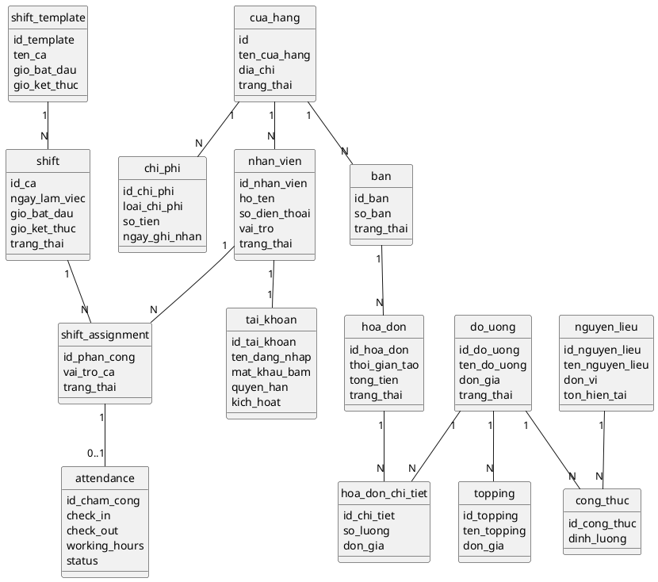
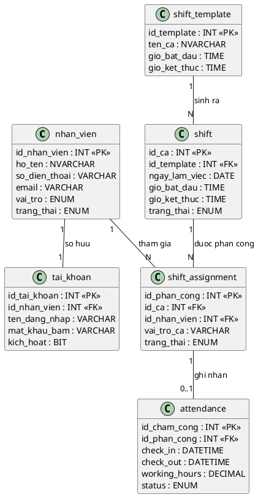

## CHƯƠNG 2: THIẾT KẾ KIẾN TRÚC VÀ CƠ SỞ DỮ LIỆU

> **Mục tiêu chương:** Trình bày biểu đồ lớp thực thể chung của hệ thống, mô tả các thực thể chính,
> làm rõ các quan hệ đáng chú ý và nhấn mạnh nhóm thực thể nhân sự là trọng tâm được phân tích sâu ở
> các chương sau.

### 2.1. Nguyên tắc Xây dựng Mô hình Thực thể

Biểu đồ lớp thực thể của hệ thống được xây dựng theo ba nguyên tắc:

- Mỗi thực thể phải đại diện cho một đối tượng nghiệp vụ có ý nghĩa trong vận hành quán café.
- Quan hệ giữa các thực thể phải phản ánh đúng luồng dữ liệu thực tế giữa bán hàng, kho, nhân sự và
  báo cáo.
- Nhóm thực thể chung chỉ mô tả mức khái quát để nhìn được toàn hệ thống; các nhóm trọng tâm sẽ được
  phân tích sâu hơn ở phần chuyên sâu.

### 2.2. Phân tích Các Nhóm Thực thể Cốt lõi

Từ khảo sát nghiệp vụ, nhóm xác định các thực thể của hệ thống tập trung quanh năm cụm chính:

| **Nhóm nghiệp vụ**           | **Thực thể tiêu biểu**                                      | **Vai trò trong hệ thống**                        |
| ---------------------------- | ----------------------------------------------------------- | ------------------------------------------------- |
| Cửa hàng và tổ chức vận hành | `cua_hang`, `nhan_vien`, `tai_khoan`                        | Quản lý tổ chức, người dùng và phân quyền         |
| Bán hàng tại quầy            | `ban`, `hoa_don`, `hoa_don_chi_tiet`                        | Ghi nhận giao dịch bán hàng và trạng thái phục vụ |
| Thực đơn và cấu hình món     | `do_uong`, `topping`, `cong_thuc`                           | Xác định món bán, thành phần và định lượng        |
| Kho và nguyên liệu           | `nguyen_lieu` cùng các bảng nhập/xuất kho                   | Theo dõi tồn kho và tiêu hao theo món             |
| Nhân sự theo ca              | `shift_template`, `shift`, `shift_assignment`, `attendance` | Quản lý lịch làm, phân công và chấm công thực tế  |

Trong mô hình cũ của nhóm, các thực thể từng được gọi bằng cả tiếng Anh và tiếng Việt như `Store`,
`Order`, `OrderItem`, `CafeTable`, `Employee`, `Shift`, `Attendance`... Ở phiên bản hiện tại, nhóm
thống nhất dùng tên nghiệp vụ Việt hóa hoặc tên bảng triển khai gần với dữ liệu thực tế để tăng khả
năng truy vết giữa báo cáo và mô hình dữ liệu.

### 2.3. Biểu đồ Lớp Thực thể Tổng quát

Biểu đồ sau mô tả các thực thể chính và quan hệ cốt lõi trong toàn hệ thống:

### 2.4. Mô tả Các Thực thể Chính

| **Thực thể**       | **Thuộc tính chính**                              | **Vai trò / phương thức nghiệp vụ điển hình**                        |
| ------------------ | ------------------------------------------------- | -------------------------------------------------------------------- |
| `cua_hang`         | id, tên, địa chỉ, trạng thái                      | quản lý thông tin chi nhánh, làm nút liên kết cho nhân sự và chi phí |
| `nhan_vien`        | id, họ tên, số điện thoại, vai trò                | thêm mới nhân viên, cập nhật hồ sơ, vô hiệu hóa nhân sự              |
| `tai_khoan`        | tên đăng nhập, mật khẩu băm, quyền hạn, kích hoạt | cấp tài khoản, khóa tài khoản, đặt lại mật khẩu                      |
| `shift_template`   | tên ca, giờ bắt đầu, giờ kết thúc                 | tạo mẫu ca dùng lại nhiều lần                                        |
| `shift`            | ngày làm việc, thời gian thực tế, trạng thái      | sinh ca cụ thể từ mẫu ca                                             |
| `shift_assignment` | id ca, id nhân viên, vai trò ca                   | phân công nhân viên vào ca làm                                       |
| `attendance`       | check_in, check_out, working_hours, status        | ghi nhận vào ca, kết thúc ca, đối soát giờ công                      |
| `do_uong`          | tên món, đơn giá, trạng thái                      | quản lý thực đơn và giá bán                                          |
| `topping`          | tên topping, đơn giá                              | bổ sung thành phần cho món                                           |
| `nguyen_lieu`      | tên nguyên liệu, đơn vị, tồn hiện tại             | theo dõi mức tồn và tiêu hao                                         |
| `cong_thuc`        | mã đồ uống, mã nguyên liệu, định lượng            | quy định mức tiêu hao nguyên liệu theo món                           |
| `ban`              | số bàn, trạng thái                                | kiểm soát trạng thái bàn phục vụ                                     |
| `hoa_don`          | thời gian tạo, tổng tiền, trạng thái              | tạo đơn, thanh toán, kết thúc giao dịch                              |
| `hoa_don_chi_tiet` | số lượng, đơn giá                                 | lưu từng món trong hóa đơn                                           |
| `chi_phi`          | loại chi phí, số tiền, ngày ghi nhận              | tổng hợp chi phí vận hành phục vụ báo cáo                            |

### 2.5. Các Mối quan hệ Đáng chú ý trong Mô hình

Một số quan hệ trong hệ thống có ý nghĩa nghiệp vụ đặc biệt và cần được giải thích rõ:

- **`hoa_don` — `ban`:** Quan hệ liên kết gắn giao dịch với không gian phục vụ. Tại một thời điểm,
  một bàn chỉ nên gắn với một hóa đơn đang mở.
- **`hoa_don` — `hoa_don_chi_tiet` — `do_uong`:** Quan hệ tổng hợp và triển khai dữ liệu nhiều món
  trong một đơn hàng thông qua bảng chi tiết.
- **`do_uong` — `cong_thuc` — `nguyen_lieu`:** Quan hệ phụ thuộc thể hiện mỗi món tiêu hao một hay
  nhiều nguyên liệu theo định lượng xác định.
- **`tai_khoan` — `nhan_vien`:** Quan hệ kết hợp chặt, vì tài khoản đăng nhập chỉ có ý nghĩa khi gắn
  với đúng một nhân viên cụ thể.
- **`shift_template` — `shift` — `shift_assignment` — `attendance`:** Chuỗi quan hệ phản ánh tiến
  trình từ thiết kế kế hoạch ca đến ghi nhận thực tế giờ công.

### 2.6. Kiến trúc Dữ liệu Theo Nhóm Phân hệ

Hệ thống gồm 5 nhóm bảng lớn, tương ứng với các nhóm nghiệp vụ chính:

| **Nhóm bảng**      | **Bảng chính**                                                                        | **Use Case liên quan** |
| ------------------ | ------------------------------------------------------------------------------------- | :--------------------: |
| Thực đơn           | `do_uong`, `topping`, `cong_thuc`, `nguyen_lieu`                                      |          UC01          |
| Giao dịch bán hàng | `ban`, `hoa_don`, `hoa_don_chi_tiet`                                                  |       UC02, UC03       |
| Kho                | `nguyen_lieu`, các bảng nhập/xuất kho, cảnh báo tồn                                   |          UC05          |
| Báo cáo            | `chi_phi`, bảng tổng hợp doanh thu, dữ liệu cửa hàng                                  |          UC06          |
| Nhân sự            | `nhan_vien`, `tai_khoan`, `shift_template`, `shift`, `shift_assignment`, `attendance` |       UC04, UC07       |

### 2.7. ERD Chi tiết — Nhóm Thực thể Nhân sự (UC04 + UC07)

Trong phạm vi báo cáo này, nhóm thực thể nhân sự được chọn làm trọng tâm vì vừa có dữ liệu định
danh, vừa có dữ liệu kế hoạch ca làm và dữ liệu thực tế chấm công. Đây cũng là nơi tập trung nhiều
ràng buộc nghiệp vụ nhất.

> **Ghi chú thiết kế:** Dữ liệu **kế hoạch** (`shift_template`, `shift`, `shift_assignment`) được
> tách khỏi dữ liệu **thực tế** (`attendance`). Cách tách này giúp đối chiếu việc phân công với giờ
> làm thực tế, xử lý đi muộn, thiếu check-out và phục vụ tính lương minh bạch.

### 2.8. Quy tắc Nghiệp vụ ở Tầng Dữ liệu

| **Mã BR** | **Quy tắc**                                                                       | **Cơ chế kiểm soát**                               |
| --------- | --------------------------------------------------------------------------------- | -------------------------------------------------- |
| BR-01     | Một nhân viên không thể được phân vào hai ca chồng chéo trong cùng ngày           | Kiểm tra overlap khi tạo `shift_assignment`        |
| BR-02     | Chỉ được ghi `check_out` sau khi đã có `check_in`                                 | Điều kiện kiểm tra khi cập nhật `attendance`       |
| BR-03     | Tài khoản bị vô hiệu hóa không được tiếp tục nhận ca mới                          | Kiểm tra `tai_khoan.kich_hoat` trước khi phân công |
| BR-04     | Chỉ bản ghi chấm công đủ `check_in` và `check_out` mới được dùng để tổng hợp công | Lọc dữ liệu hợp lệ trước khi tính lương            |
| BR-05     | Thực thể `tai_khoan` phải gắn duy nhất với một `nhan_vien`                        | Ràng buộc 1-1 và khóa ngoại duy nhất               |
