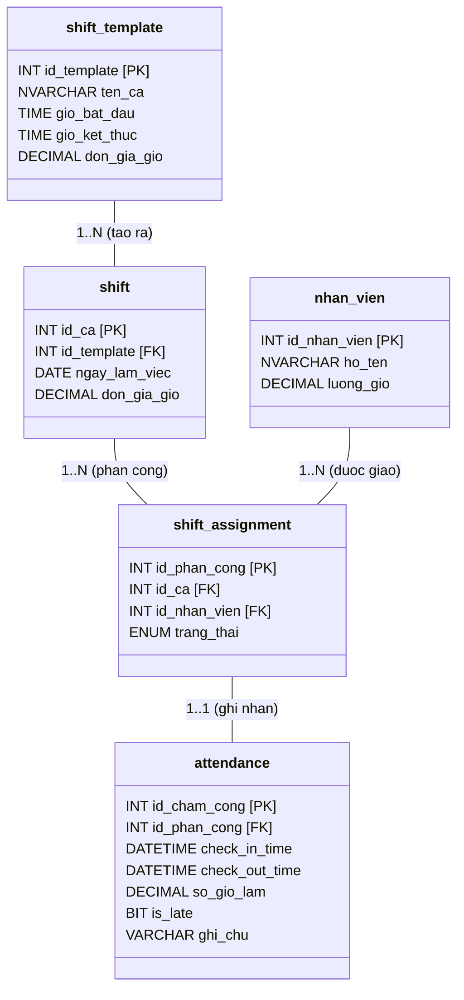

## CHƯƠNG 2: THIẾT KẾ KIẾN TRÚC VÀ CƠ SỞ DỮ LIỆU

> **Mục tiêu chương:** Trình bày kiến trúc triển khai 3 tầng và ERD chi tiết nhóm bảng UC04 (Nhân sự). Chiếm ~15% báo cáo.

### 2.1. Kiến trúc Triển khai 3 Tầng (Three-Tier Architecture)

Hệ thống áp dụng kiến trúc **3 lớp (Three-Tier Architecture)** nhằm tách biệt ba mối quan tâm: Hiển thị, Xử lý nghiệp vụ và Lưu trữ dữ liệu:

```mermaid
graph TD
    subgraph 🖥️ TẦNG TRÌNH DIỄN - Presentation Tier
        POS["Máy POS Thu ngân\n(Windows)"]
        KDS["Màn hình Pha chế\n(KDS)"]
        MOB["Máy tính bảng / Điện thoại\n(Android/iOS)"]
    end

    subgraph ⚙️ TẦNG NGHIỆP VỤ - Business Logic Tier
        API["APPLICATION SERVER\nREST API"]
        OS["Order Service"]
        PS["Payment Service"]
        SS["Shift Service"]
        IS["Inventory Service"]
        API --- OS
        API --- PS
        API --- SS
        API --- IS
    end

    subgraph 🗄️ TẦNG DỮ LIỆU - Data Tier
        DB[("DATABASE SERVER\nMySQL / SQL Server")]
        BK["📅 Backup hàng ngày 2:00 AM"]
        DB --- BK
    end

    POS -- "HTTP/HTTPS LAN" --> API
    KDS -- "HTTP/HTTPS WiFi" --> API
    MOB -- "HTTP/HTTPS WiFi" --> API
    API -- "JDBC / ORM Hibernate" --> DB
```


### 2.2. Quyết định Kiến trúc và Đánh đổi (Trade-offs)

| **Quyết định** | **Lý do lựa chọn** | **Đánh đổi** |
| -------------- | ------------------ | ------------ |
| REST API thay vì kết nối CSDL trực tiếp | Bảo mật cao hơn; tách biệt logic | Tăng độ trễ nhỏ |
| MySQL/SQL Server thay vì NoSQL | ACID cho nghiệp vụ tài chính | Kém linh hoạt khi schema đổi thường xuyên |
| LAN nội bộ (On-premise) | Chi phí thấp; bảo mật dữ liệu | Không truy cập từ xa nếu không có VPN |
| Windows Desktop App | Tương thích POS; driver máy in ổn định | Khó multi-platform |

**Bảo mật tầng triển khai:**
- **TLS 1.2+:** Mã hóa toàn bộ giao tiếp Client ↔ API Server.
- **Database Firewall:** Chỉ Application Server kết nối được Database; Client không truy cập trực tiếp.
- **Audit Log:** Mọi thao tác thêm/sửa/xóa ghi vào `audit_log` với timestamp và mã nhân viên.

---

### 2.3. Tổng quan Lược đồ CSDL — Nhóm Bảng Toàn Hệ thống

Hệ thống gồm **5 nhóm bảng** tương ứng với 5 phân hệ UC, đều chuẩn hóa 3NF:

| **Nhóm bảng** | **Bảng chính** | **UC** |
|---|---|:---:|
| Thực đơn | `do_uong`, `nhom_do_uong`, `topping`, `cong_thuc` | UC01 |
| Giao dịch | `hoa_don`, `hoa_don_chi_tiet`, `ban`, `khu_vuc` | UC02, UC03 |
| Kho | `nguyen_lieu`, `nhap_kho`, `canh_bao_kho` | UC05 |
| Báo cáo | `bao_cao_doanh_thu`, `chi_phi`, `danh_sach_cua_hang` | UC06 |
| **Nhân sự** *(trọng tâm)* | **`nhan_vien`, `tai_khoan`, `shift_template`, `shift`, `shift_assignment`, `attendance`** | **UC04** |

> **Nguyên tắc Snapshot:** Mức lương theo ca tại thời điểm chốt công được lưu cố định cùng kỳ tính lương — đảm bảo lịch sử tài chính không đổi khi đơn giá ca được điều chỉnh.

### 2.4. ERD Chi tiết — Nhóm Bảng Nhân sự (UC04)

Nguyên tắc thiết kế cốt lõi của UC04 là **tách biệt hoàn toàn** dữ liệu kế hoạch (Planning) khỏi dữ liệu thực tế (Actual), tương tự mô hình Planning vs. Actuals phổ biến trong kế toán quản trị:



> **Ghi chú thiết kế:** Tách biệt **Kế hoạch** (`shift_template`, `shift`, `shift_assignment`) khỏi **Thực tế** (`attendance`) — cho phép đối soát chênh lệch (đi muộn/về sớm) và kiểm toán lao động minh bạch.

### 2.5. Business Rules tầng CSDL — UC04

| **Mã BR** | **Quy tắc** | **Cơ chế kiểm soát** |
| --------- | ----------- | -------------------- |
| BR-01 | Không thể có 2 ca chồng chéo giờ trong cùng ngày | Trigger kiểm tra overlap khi INSERT vào `shift_assignment` |
| BR-02 | Chỉ Check-out sau khi đã Check-in | `check_out_time` chỉ UPDATE khi `check_in_time IS NOT NULL` |
| BR-03 | Chỉ ca có đủ `check_in_time` và `check_out_time` mới được đưa vào bảng lương | `CASE WHEN` hoặc cờ trạng thái hợp lệ khi tổng hợp lương |
| BR-04 | Giờ làm tối đa 16h/ca; nếu vượt → đánh dấu xem xét thủ công | `CHECK(so_gio_lam <= 16)` hoặc cờ `needs_review = 1` |
| BR-05 | Mỗi ca phải thuộc đúng 1 trong 2 loại: `sang` hoặc `toi` | Ràng buộc ENUM / validation tại bảng `shift_template` và `shift` |

---
