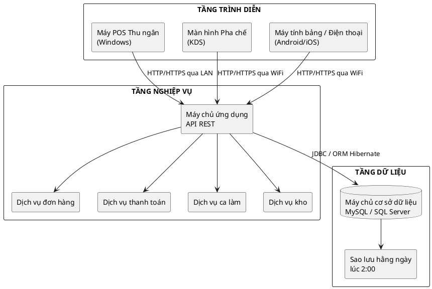
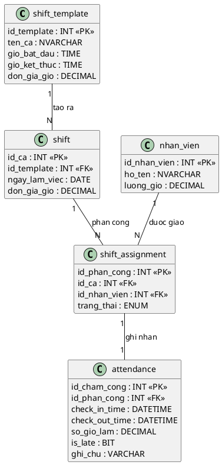

## CHƯƠNG 2: THIẾT KẾ KIẾN TRÚC VÀ CƠ SỞ DỮ LIỆU

> **Mục tiêu chương:** Trình bày kiến trúc triển khai 3 tầng và lược đồ quan hệ thực thể chi tiết cho nhóm bảng UC04 (Nhân sự). Chiếm khoảng 15% báo cáo.

### 2.1. Kiến trúc Triển khai 3 Tầng

Hệ thống áp dụng kiến trúc **3 lớp** nhằm tách biệt ba mối quan tâm: hiển thị, xử lý nghiệp vụ và lưu trữ dữ liệu:

### 2.2. Quyết định Kiến trúc và Đánh đổi

| **Quyết định** | **Lý do lựa chọn** | **Đánh đổi** |
| -------------- | ------------------ | ------------ |
| REST API thay vì kết nối CSDL trực tiếp | Bảo mật cao hơn; tách biệt logic | Tăng độ trễ nhỏ |
| MySQL/SQL Server thay vì NoSQL | ACID cho nghiệp vụ tài chính | Kém linh hoạt khi schema đổi thường xuyên |
| LAN nội bộ (triển khai tại chỗ) | Chi phí thấp; bảo mật dữ liệu | Không truy cập từ xa nếu không có VPN |
| Ứng dụng máy tính trên Windows | Tương thích POS; trình điều khiển máy in ổn định | Khó hỗ trợ đa nền tảng |

**Bảo mật tầng triển khai:**
- **TLS 1.2+:** Mã hóa toàn bộ giao tiếp giữa thiết bị khách và máy chủ API.
- **Tường lửa cơ sở dữ liệu:** Chỉ máy chủ ứng dụng được kết nối tới cơ sở dữ liệu; thiết bị khách không truy cập trực tiếp.
- **Nhật ký thao tác:** Mọi thao tác thêm/sửa/xóa được ghi vào `audit_log` kèm thời điểm và mã nhân viên.

---

### 2.3. Tổng quan Lược đồ CSDL — Nhóm Bảng Toàn Hệ thống

Hệ thống gồm **5 nhóm bảng** tương ứng với 5 phân hệ UC, đều chuẩn hóa 3NF:

| **Nhóm bảng** | **Bảng chính** | **UC** |
|---|---|:---:|
| Thực đơn | `do_uong`, `nhom_do_uong`, `topping`, `cong_thuc` | UC01 |
| Giao dịch | `hoa_don`, `hoa_don_chi_tiet`, `ban`, `khu_vuc` | UC02, UC03 |
| Kho | `nguyen_lieu`, `nhap_kho`, `canh_bao_kho` | UC05 |
| Báo cáo | `bao_cao_doanh_thu`, `chi_phi`, `danh_sach_cua_hang` | UC06 |
| **Nhân sự** *(trọng tâm)* | **`nhan_vien`, `tai_khoan`, `shift_template`, `shift`, `shift_assignment`, `attendance`** | **UC04** |

> **Nguyên tắc chụp ảnh dữ liệu tại thời điểm chốt công:** Mức lương theo ca tại thời điểm chốt công được lưu cố định cùng kỳ tính lương, bảo đảm lịch sử tài chính không đổi khi đơn giá ca được điều chỉnh.

### 2.4. ERD Chi tiết — Nhóm Bảng Nhân sự (UC04)

Nguyên tắc thiết kế cốt lõi của UC04 là **tách biệt hoàn toàn** dữ liệu kế hoạch khỏi dữ liệu thực tế, tương tự mô hình đối chiếu kế hoạch và thực tế phổ biến trong kế toán quản trị:

> **Ghi chú thiết kế:** Tách biệt **Kế hoạch** (`shift_template`, `shift`, `shift_assignment`) khỏi **Thực tế** (`attendance`) — cho phép đối soát chênh lệch (đi muộn/về sớm) và kiểm toán lao động minh bạch.

### 2.5. Quy tắc nghiệp vụ tầng CSDL — UC04

| **Mã BR** | **Quy tắc** | **Cơ chế kiểm soát** |
| --------- | ----------- | -------------------- |
| BR-01 | Không thể có 2 ca chồng chéo giờ trong cùng ngày | Trigger kiểm tra overlap khi INSERT vào `shift_assignment` |
| BR-02 | Chỉ kết thúc ca sau khi đã vào ca | `check_out_time` chỉ UPDATE khi `check_in_time IS NOT NULL` |
| BR-03 | Chỉ ca có đủ `check_in_time` và `check_out_time` mới được đưa vào bảng lương | `CASE WHEN` hoặc cờ trạng thái hợp lệ khi tổng hợp lương |
| BR-04 | Giờ làm tối đa 16h/ca; nếu vượt thì đánh dấu xem xét thủ công | `CHECK(so_gio_lam <= 16)` hoặc cờ `needs_review = 1` |
| BR-05 | Mỗi ca phải thuộc đúng 1 trong 2 loại: `sang` hoặc `toi` | Ràng buộc ENUM hoặc kiểm tra hợp lệ tại bảng `shift_template` và `shift` |

---
