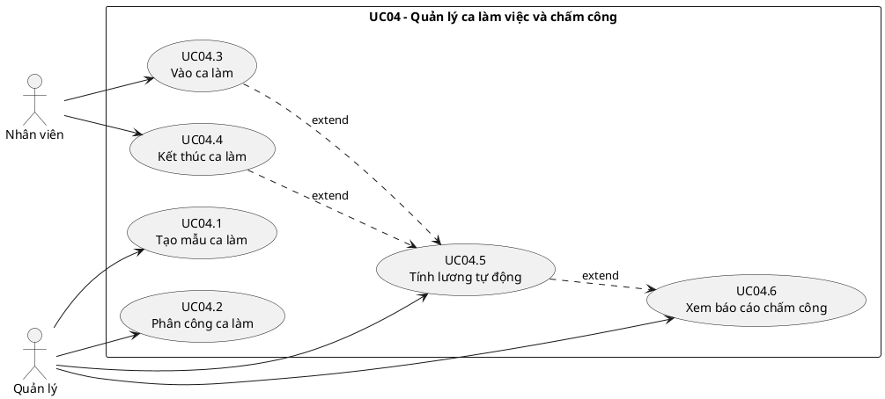
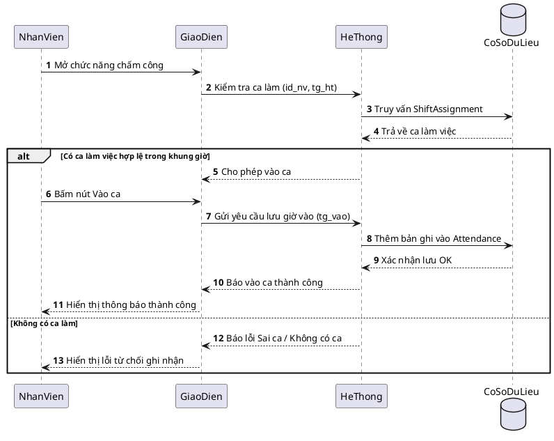
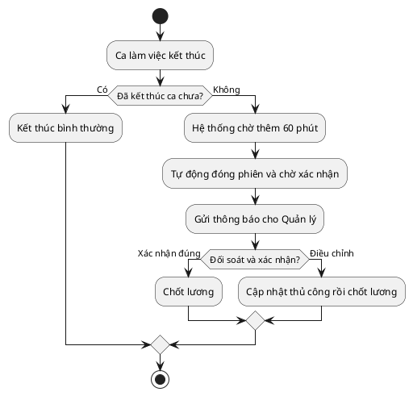
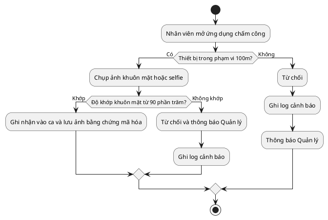
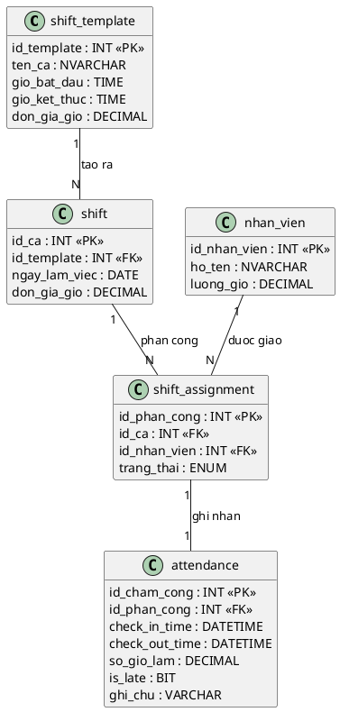
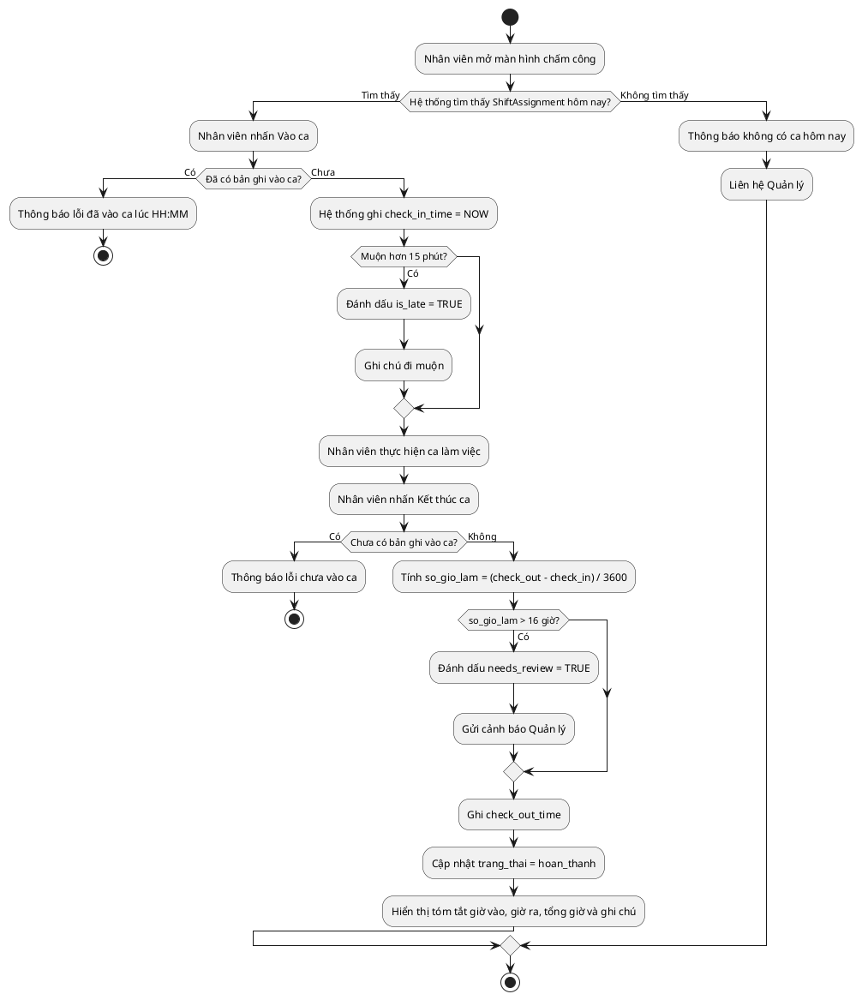
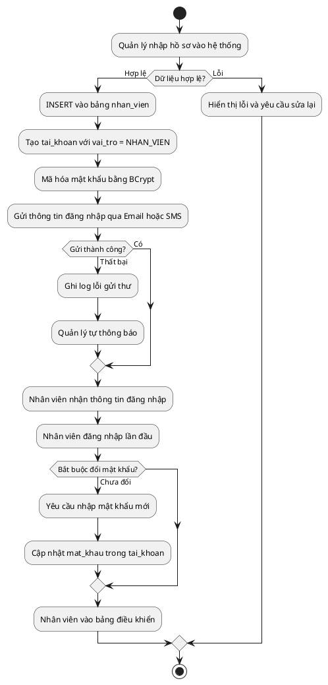

## CHƯƠNG 3: NGHIÊN CỨU CHUYÊN SÂU — UC04: QUẢN LÝ CA LÀM VIỆC, CHẤM CÔNG & PHÂN QUYỀN

> **Trái tim của báo cáo — Chiếm ~50%.** Đặc tả đầy đủ nghiệp vụ UC04 do **Nguyễn Viết Tùng** phụ trách: phân công ca, check-in/out sinh trắc học, tính lương đơn giản theo 2 ca sáng/tối và phân quyền RBAC.

### 3.1. Biểu đồ Use Case Chi tiết UC04

UC04 được phân rã thành các ca sử dụng con độc lập, có thể được phân công cho các thành viên nhóm khác nhau:

### 3.2. Quản lý Tài khoản, Phân quyền RBAC và Onboarding

> Quyền truy cập hệ thống là tiền điều kiện của mọi luồng nghiệp vụ trong UC06. Phân hệ RBAC được tích hợp trực tiếp vào đây thay vì để riêng.

| **Trường**                          | **Nội dung**                                                                                                   |
| ----------------------------------- | -------------------------------------------------------------------------------------------------------------- |
| **Mã Use Case**                     | UC07.1                                                                                                         |
| **Tên Use Case**                    | Thêm hồ sơ nhân viên mới (Onboarding)                                                                          |
| **Tác nhân chính**                  | Manager                                                                                                         |
| **Tác nhân thứ cấp**                | Hệ thống (System), Nhân viên mới (người nhận tài khoản)                                                        |
| **Điều kiện tiên quyết**            | Manager đã đăng nhập; có quyền `MANAGE_EMPLOYEE`                                                               |
| **Điều kiện kết thúc (thành công)** | Bản ghi `nhan_vien` và `tai_khoan` được tạo; tài khoản ở trạng thái `kich_hoat`; email thông báo được gửi đi  |
| **Điều kiện kết thúc (thất bại)**   | Không có bản ghi nào được tạo; hệ thống hiển thị lỗi cụ thể                                                   |
| **Mức độ ưu tiên**                  | Cao                                                                                                             |

**Luồng sự kiện chính (Main Flow):**

| **Bước** | **Tác nhân** | **Hành động**                                                                                           |
| -------- | ------------ | ------------------------------------------------------------------------------------------------------- |
| 1        | Manager      | Truy cập menu **Nhân sự > Thêm nhân viên**                                                              |
| 2        | Hệ thống     | Hiển thị form nhập: Họ tên, CCCD, SĐT, Email, Ngày sinh, Vị trí công việc, Lương theo giờ              |
| 3        | Manager      | Điền đầy đủ thông tin và nhấn **Lưu**                                                                   |
| 4        | Hệ thống     | Validate dữ liệu đầu vào (kiểm tra CCCD trùng, SĐT định dạng, email hợp lệ)                            |
| 5        | Hệ thống     | `INSERT` bản ghi vào bảng `nhan_vien`                                                                   |
| 6        | Hệ thống     | Tự động tạo `tai_khoan` với `mat_khau` ngẫu nhiên (8 ký tự); gán `vai_tro` mặc định = `NHAN_VIEN`      |
| 7        | Hệ thống     | Gửi email/SMS thông báo thông tin đăng nhập đến nhân viên mới                                           |
| 8        | Hệ thống     | Hiển thị thông báo: _"Thêm nhân viên thành công. Thông tin đăng nhập đã được gửi."_                    |

**Luồng ngoại lệ (Exception Flows):**

| **Mã** | **Điều kiện kích hoạt**                    | **Xử lý**                                                                         |
| ------ | ------------------------------------------ | --------------------------------------------------------------------------------- |
| E1     | CCCD đã tồn tại trong hệ thống             | Hiển thị: _"Nhân viên với CCCD này đã được đăng ký."_ Không INSERT.              |
| E2     | Email không đúng định dạng                 | Highlight trường lỗi, thông báo: _"Email không hợp lệ."_                         |
| E3     | Lương theo giờ < mức lương tối thiểu vùng | Cảnh báo: _"Mức lương thấp hơn quy định (22.500đ/giờ). Xác nhận tiếp tục?"_     |
| E4     | Gửi email thất bại                         | Vẫn tạo tài khoản thành công; ghi log lỗi gửi mail; Manager tự thông báo thủ công |

---

| **Trường**               | **Nội dung**                                                                                 |
| ------------------------ | -------------------------------------------------------------------------------------------- |
| **Mã Use Case**          | UC07.2                                                                                       |
| **Tác nhân**             | Manager                                                                                      |
| **Điều kiện tiên quyết** | Nhân viên đã có hồ sơ trong hệ thống (UC07.1 đã thực hiện)                                  |
| **Kết quả**              | Tài khoản được cấp phát, cập nhật hoặc thu hồi đúng với trạng thái thực tế của nhân viên   |

**Luồng sự kiện — Đặt lại mật khẩu:**

| **Bước** | **Hành động**                                                                  |
| -------- | ------------------------------------------------------------------------------ |
| 1        | Manager chọn nhân viên, sau đó chọn **Đặt lại mật khẩu**                     |
| 2        | Hệ thống tạo mật khẩu ngẫu nhiên mới và hash bằng **BCrypt (salt 12 rounds)** |
| 3        | Gửi mật khẩu tạm thời qua SMS/Email                                           |
| 4        | Lần đăng nhập đầu, hệ thống **bắt buộc** nhân viên đổi mật khẩu mới           |

---

Hệ thống phân quyền theo mô hình **Role-Based Access Control (RBAC)**, quản lý 3 cấp độ vai trò:

| **Vai trò (Role)**   | **Mã vai trò**  | **Quyền hạn chính**                                                                  |
| -------------------- | --------------- | ------------------------------------------------------------------------------------ |
| **Quản lý**          | `MANAGER`       | Toàn quyền: CRUD nhân viên, phê duyệt lương, xem báo cáo, cấu hình hệ thống        |
| **Thu ngân**         | `CASHIER`       | Tạo/đóng đơn hàng, xử lý thanh toán, in hóa đơn; xem lịch ca của bản thân          |
| **Nhân viên phục vụ**| `WAITER`        | Cập nhật trạng thái bàn, thêm món vào đơn; chấm công cá nhân                        |

**Ma trận phân quyền chi tiết:**

| **Chức năng**             | MANAGER | CASHIER | WAITER |
| ------------------------- | :-----: | :-----: | :----: |
| Xem danh sách nhân viên   | Co      | Khong   | Khong  |
| Thêm/Sửa nhân viên        | Co      | Khong   | Khong  |
| Phân công ca làm          | Co      | Khong   | Khong  |
| Check-in/Check-out        | Co      | Co      | Co     |
| Xem lịch sử chấm công     | Co      | Co (bản thân) | Co (bản thân) |
| Duyệt điều chỉnh chấm công| Co      | Khong   | Khong  |
| Tạo đơn hàng              | Co      | Co      | Co     |
| Xử lý thanh toán          | Co      | Co      | Khong  |
| Xem báo cáo doanh thu     | Co      | Khong   | Khong  |
| Cấu hình thực đơn         | Co      | Khong   | Khong  |

---

Biểu đồ này mô tả chi tiết giao tiếp giữa các lớp trong kiến trúc phân lớp khi nhân viên thực hiện Check-in, tập trung vào việc **xác thực danh tính** và **kiểm tra phân công ca** trước khi ghi nhận:

### 3.3. Đặc tả Use Case — Check-in, Check-out và Tính lương

| **Trường**                          | **Nội dung**                                                                                                                             |
| ----------------------------------- | ---------------------------------------------------------------------------------------------------------------------------------------- |
| **Mã Use Case**                     | UC04.3                                                                                                                                   |
| **Tên Use Case**                    | Check-in Ca làm việc                                                                                                                     |
| **Tác nhân chính**                  | Nhân viên (Employee)                                                                                                                     |
| **Tác nhân thứ cấp**                | Hệ thống chấm công                                                                                                                       |
| **Điều kiện tiên quyết**            | Nhân viên đã đăng nhập; tồn tại bản phân công ca (ShiftAssignment) cho nhân viên này trong ngày hôm nay; trạng thái ca là "chưa bắt đầu" |
| **Điều kiện kết thúc (thành công)** | Bản ghi Attendance được tạo với `check_in_time` = thời gian hiện tại; trạng thái phân công chuyển sang "đang làm việc"                   |
| **Điều kiện kết thúc (thất bại)**   | Hệ thống hiển thị thông báo lỗi; trạng thái Attendance không thay đổi                                                                    |

**Luồng sự kiện chính (Main Flow):**

| **Bước** | **Tác nhân** | **Hành động**                                                                      |
| -------- | ------------ | ---------------------------------------------------------------------------------- |
| 1        | Nhân viên    | Mở màn hình Chấm công, chọn "Check-in"                                             |
| 2        | Hệ thống     | Truy vấn `ShiftAssignment` theo `id_nhan_vien` và ngày hiện tại                    |
| 3        | Hệ thống     | Xác nhận tồn tại ca được phân công và ca chưa bắt đầu                              |
| 4        | Hệ thống     | Tạo bản ghi `Attendance` với `check_in_time = NOW()`                               |
| 5        | Hệ thống     | Cập nhật `ShiftAssignment.trang_thai = 'dang_lam'`                                 |
| 6        | Hệ thống     | Hiển thị thông báo: _"Check-in thành công lúc HH:MM. Chúc bạn làm việc hiệu quả!"_ |

**Luồng ngoại lệ (Alternative / Exception Flows):**

| **Mã** | **Điều kiện kích hoạt**                         | **Xử lý**                                                                              |
| ------ | ----------------------------------------------- | -------------------------------------------------------------------------------------- |
| E1     | Không tồn tại ShiftAssignment cho ngày hôm nay  | Hiển thị: _"Bạn không có ca làm việc hôm nay. Liên hệ Quản lý."_                       |
| E2     | Nhân viên đã Check-in trong ca này rồi          | Hiển thị: _"Bạn đã Check-in lúc [giờ]. Không thể Check-in hai lần."_                   |
| E3     | Check-in sớm hơn 30 phút so với giờ bắt đầu ca  | Hiển thị cảnh báo: _"Bạn Check-in sớm. Xác nhận ghi nhận?"_ và chờ nhân viên xác nhận  |
| E4     | Check-in muộn hơn 15 phút so với giờ bắt đầu ca | Ghi nhận Check-in bình thường nhưng đánh dấu `is_late = TRUE` trong bản ghi Attendance |
| E5     | Mất kết nối CSDL khi lưu                        | Thông báo lỗi kỹ thuật; ghi log; không tạo bản ghi Attendance                          |

| **Trường**               | **Nội dung**                                                                            |
| ------------------------ | --------------------------------------------------------------------------------------- |
| **Tác nhân**             | Manager (khởi tạo) / Hệ thống (thực thi)                                                |
| **Điều kiện tiên quyết** | Tồn tại ít nhất một bản ghi Attendance có đủ cặp check-in/check-out trong kỳ tính lương |
| **Kết quả**              | Hệ thống tổng hợp bảng lương cho từng nhân viên theo kỳ                                 |

**Công thức tính lương đơn giản:**

$$L_{nv} = (N_{sang} \times R_{sang}) + (N_{toi} \times R_{toi})$$

Trong đó:

- $L_{nv}$: Tổng lương của nhân viên trong kỳ
- $N_{sang}$: Số ca sáng đã hoàn thành trong kỳ
- $N_{toi}$: Số ca tối đã hoàn thành trong kỳ
- $R_{sang}$: Mức lương cố định cho một ca sáng
- $R_{toi}$: Mức lương cố định cho một ca tối

### 3.4. Xử lý Ngoại lệ Thông minh

Khác với các quy tắc cứng nhắc, hệ thống được thiết kế để xử lý **linh hoạt** các tình huống thực tế của nghiệp vụ ngành dịch vụ:

**a. Đổi ca đột xuất (Shift Swapping & Ad-hoc Check-in):**

Khi nhân viên đổi ca mà chưa có lịch trên hệ thống, hệ thống **không từ chối** chấm công. Thay vào đó:

1. Cho phép Check-in bình thường dựa trên xác thực GPS + khuôn mặt
2. Xếp bản ghi `attendance` vào trạng thái `trang_thai = 'cho_phe_duyet'` (Unscheduled Shift)
3. Gửi thông báo tới Quản lý để phê duyệt retroactively
4. Sau khi phê duyệt, tạo `shift_assignment` tương ứng và liên kết lại

> **Nguyên tắc thiết kế:** Hệ thống không được cản trở hoạt động vận hành; mọi ngoại lệ được thu thập để quản lý xử lý sau, không phải từ chối trước.

**b. Xử lý "Quên Check-out":**

Trường hợp nhân viên quên bấm giờ ra, hệ thống **không được phép** gán giờ làm = 0 (vi phạm quyền lợi người lao động theo Bộ Luật Lao động):

Để ngăn chặn tình trạng **chấm công hộ (Buddy Punching)** — một vấn đề phổ biến trong ngành dịch vụ, ứng dụng di động tích hợp hai lớp bảo vệ:

| **Lớp**              | **Công nghệ**      | **Cơ chế hoạt động**                                                                         |
| -------------------- | ------------------ | -------------------------------------------------------------------------------------------- |
| **Lớp 1: Vị trí**    | GPS Geofencing     | Chỉ cho phép Check-in khi thiết bị nằm trong bán kính ≤ 100m từ tọa độ quán                  |
| **Lớp 2: Danh tính** | FaceID / Selfie AI | Chụp ảnh tại thời điểm Check-in, so sánh với ảnh đăng ký bằng thuật toán nhận diện khuôn mặt |

**Luồng xác thực hai lớp (Two-Factor Authentication Flow):**

### 3.5. Cơ chế Chấm công Sinh trắc học — Triệt tiêu Chấm công Hộ

Để ngăn chặn tình trạng **chấm công hộ (Buddy Punching)** — một vấn đề phổ biến trong ngành dịch vụ, ứng dụng di động tích hợp hai lớp bảo vệ:

| **Lớp**              | **Công nghệ**      | **Cơ chế hoạt động**                                                                         |
| -------------------- | ------------------ | -------------------------------------------------------------------------------------------- |
| **Lớp 1: Vị trí**    | GPS Geofencing     | Chỉ cho phép Check-in khi thiết bị nằm trong bán kính ≤ 100m từ tọa độ quán                  |
| **Lớp 2: Danh tính** | FaceID / Selfie AI | Chụp ảnh tại thời điểm Check-in, so sánh với ảnh đăng ký bằng thuật toán nhận diện khuôn mặt |

**Luồng xác thực:**

Xem sơ đồ Mermaid ở trên cho cùng luồng xác thực hai lớp.

> **Lưu trữ:** Ảnh selfie được mã hóa và lưu kèm bản ghi `attendance`, giữ tối thiểu 90 ngày để phục vụ kiểm toán nội bộ.

Hệ thống áp dụng **mô hình tính lương tối giản** với 2 loại ca cố định: sáng và tối.

### 3.6. Tính lương theo 2 ca cố định

$$S_{total} = (N_{sang} \times R_{sang}) + (N_{toi} \times R_{toi})$$

---

Nguyên tắc thiết kế cốt lõi của UC04 là **tách biệt hoàn toàn** dữ liệu kế hoạch (Planning) khỏi dữ liệu thực tế (Actual), tương tự mô hình Planning vs. Actuals phổ biến trong kế toán quản trị:

> **Ghi chú thiết kế:** 2 nhóm bảng trên tách biệt hoàn toàn **Kế hoạch** (shift_template, shift, shift_assignment) khỏi **Thực tế** (attendance), giúp dễ đối soát và kiểm toán.

| **Mã BR** | **Quy tắc**                                                          | **Cơ chế kiểm soát**                                                    |
| --------- | -------------------------------------------------------------------- | ----------------------------------------------------------------------- |
| BR-01     | Một nhân viên không thể có 2 ca chồng chéo thời gian trong cùng ngày | Trigger kiểm tra overlap khi INSERT vào `shift_assignment`              |
| BR-02     | Chỉ có thể Check-out sau khi đã Check-in                             | `check_out_time` chỉ được UPDATE khi `check_in_time IS NOT NULL`        |
| BR-03     | Chỉ ca có đủ `check_in_time` và `check_out_time` mới được đưa vào bảng lương | Dùng `CASE WHEN` hoặc cờ trạng thái hợp lệ khi tổng hợp lương |
| BR-04     | Giờ làm tối đa 16 giờ/ca; nếu vượt thì đánh dấu cần xem xét thủ công | Constraint: `CHECK(so_gio_lam <= 16)` hoặc cờ `needs_review = 1`        |
| BR-05     | Mỗi ca phải thuộc đúng 1 trong 2 loại: `sang` hoặc `toi`             | Ràng buộc ENUM / validation tại bảng `shift_template` và `shift` |

### 3.7. Business Rules và Ràng buộc Nghiệp vụ

| **Mã BR** | **Quy tắc**                                                          | **Cơ chế kiểm soát**                                                    |
| --------- | -------------------------------------------------------------------- | ----------------------------------------------------------------------- |
| BR-01     | Một nhân viên không thể có 2 ca chồng chéo thời gian trong cùng ngày | Trigger kiểm tra overlap khi INSERT vào `shift_assignment`              |
| BR-02     | Chỉ có thể Check-out sau khi đã Check-in                             | `check_out_time` chỉ được UPDATE khi `check_in_time IS NOT NULL`        |
| BR-03     | Chỉ ca có đủ `check_in_time` và `check_out_time` mới được đưa vào bảng lương | Dùng `CASE WHEN` hoặc cờ trạng thái hợp lệ khi tổng hợp lương |
| BR-04     | Giờ làm tối đa 16 giờ/ca; nếu vượt thì đánh dấu cần xem xét thủ công | Constraint: `CHECK(so_gio_lam <= 16)` hoặc cờ `needs_review = 1`        |
| BR-05     | Mỗi ca phải thuộc đúng 1 trong 2 loại: `sang` hoặc `toi`             | Ràng buộc ENUM / validation tại bảng `shift_template` và `shift` |

**Business Rules bổ sung — Quản lý Tài khoản:**

| **Mã BR** | **Quy tắc**                                                              | **Cơ chế kiểm soát**                                                                |
| --------- | ------------------------------------------------------------------------ | ----------------------------------------------------------------------------------- |
| BR-NS-01  | Mỗi nhân viên chỉ có đúng một tài khoản đăng nhập (quan hệ 1-1)         | Unique Constraint trên `tai_khoan.id_nhan_vien`                                     |
| BR-NS-02  | Mật khẩu phải được băm bằng BCrypt trước khi lưu; không lưu plain text  | Xử lý tại tầng Service; không bao giờ lưu chuỗi gốc                                |
| BR-NS-03  | Lần đăng nhập đầu tiên bắt buộc đổi mật khẩu                            | Cờ `buoc_doi_mat_khau = 1`; middleware chặn mọi request trừ endpoint đổi mật khẩu  |
| BR-NS-04  | Không được xóa vật lý (hard delete) bản ghi nhân viên                   | Chỉ đặt `trang_thai = 'da_nghi_viec'` và `kich_hoat = 0` (Soft Delete)             |
| BR-NS-05  | Mọi thao tác thêm/sửa/xoá nhân viên phải được ghi vào `audit_log`       | Database Trigger `AFTER INSERT/UPDATE/DELETE` trên bảng `nhan_vien` và `tai_khoan` |
| BR-NS-06  | Không thể phân công ca cho nhân viên có tài khoản bị khóa               | Trigger kiểm tra `tai_khoan.kich_hoat = 1` trước khi INSERT vào `shift_assignment` |

---

### 3.8. Biểu đồ Tuần tự — Luồng Check-in (Sequence Diagram)

Biểu đồ này mô tả chi tiết giao tiếp giữa các lớp trong kiến trúc phân lớp khi nhân viên thực hiện Check-in, tập trung vào việc **xác thực danh tính** và **kiểm tra phân công ca** trước khi ghi nhận:

**Giải thích các biến số:**

- `id_nv` — Mã nhân viên (ID Nhân viên), lấy từ session đăng nhập.
- `tg_ht` — Thời gian hiện tại, dùng để đối chiếu với bảng `shift_assignment`.
- `tg_vao` — Thời gian Check-in thực tế, tương đương `check_in_time` trong bảng `attendance`.

---

### 3.9. Biểu đồ Hoạt động — Quy trình Chấm công (Activity Diagram)

### 3.10. Biểu đồ Hoạt động — Quy trình Onboarding Nhân viên Mới (Activity Diagram)

---

---
