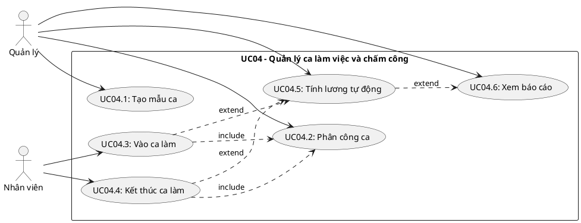
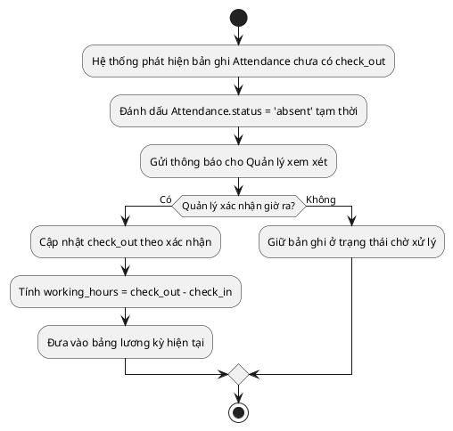
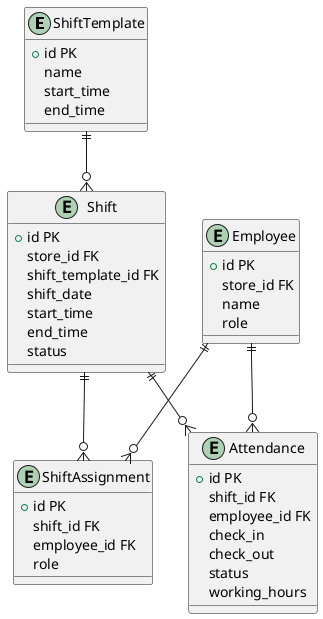
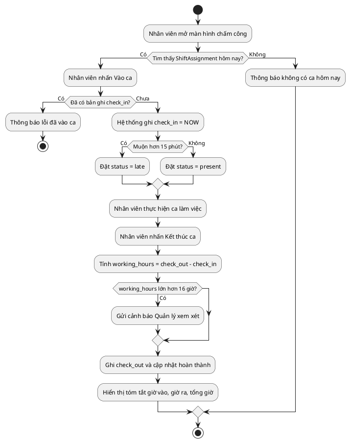

## CHƯƠNG 6: NGHIÊN CỨU CHUYÊN SÂU — CA SỬ DỤNG QUẢN LÝ CA LÀM VIỆC VÀ CHẤM CÔNG (UC04)

Chương này đi sâu vào phân tích và thiết kế **UC04 — Quản lý Ca làm việc và Chấm công**. Đây là phân hệ hạt nhân trong quản trị nhân sự, có tính phức tạp cao do phải xử lý đồng thời nhiều ràng buộc thời gian, dữ liệu và quyền truy cập. Phân tích chuyên sâu UC04 minh họa cho toàn bộ vòng đời thiết kế ca sử dụng từ đặc tả đến thiết kế dữ liệu và kiểm thử.

### 6.1. Biểu đồ Ca sử dụng chi tiết UC04

#### 6.1.1. Phân định các ca sử dụng con

UC04 được phân rã thành các ca sử dụng con độc lập, có thể được phân công cho các thành viên nhóm khác nhau:

### 6.2. Đặc tả Ca sử dụng

#### 6.2.1. Đặc tả UC04.3 — Nhân viên Vào ca làm

| **Trường**                      | **Nội dung**                                                                                            |
| ------------------------------- | ------------------------------------------------------------------------------------------------------- |
| Mã ca sử dụng                   | UC04.3                                                                                                  |
| Tên ca sử dụng                  | Vào ca làm việc                                                                                         |
| Tác nhân chính                  | Nhân viên                                                                                               |
| Tác nhân thứ cấp                | Hệ thống chấm công                                                                                      |
| Điều kiện tiên quyết            | Nhân viên đã đăng nhập; tồn tại bản phân công ca (ShiftAssignment) cho nhân viên này trong ngày hôm nay |
| Điều kiện kết thúc (thành công) | Bản ghi Attendance được tạo với check_in = thời gian hiện tại; status = 'present' hoặc 'late'           |
| Điều kiện kết thúc (thất bại)   | Hệ thống hiển thị thông báo lỗi; không tạo bản ghi Attendance                                           |

**Luồng sự kiện chính (Main Flow):**

| **Bước** | **Tác nhân** | **Hành động**                                                                   |
| -------- | ------------ | ------------------------------------------------------------------------------- |
| 1        | Nhân viên    | Mở màn hình Chấm công, chọn "Vào ca"                                            |
| 2        | Hệ thống     | Truy vấn ShiftAssignment theo employee_id và ngày hiện tại                      |
| 3        | Hệ thống     | Xác nhận tồn tại ca được phân công và chưa có check_in                          |
| 4        | Hệ thống     | Tạo bản ghi Attendance với check_in = NOW()                                     |
| 5        | Hệ thống     | Cập nhật Attendance.status = 'present'                                          |
| 6        | Hệ thống     | Hiển thị thông báo:_"Vào ca thành công lúc HH:MM. Chúc bạn làm việc hiệu quả!"_ |

**Luồng ngoại lệ (Exception Flows):**

| **Mã** | **Điều kiện kích hoạt**                         | **Xử lý**                                                          |
| ------ | ----------------------------------------------- | ------------------------------------------------------------------ |
| E1     | Không tồn tại ShiftAssignment cho ngày hôm nay  | Hiển thị:_"Bạn không có ca làm việc hôm nay. Liên hệ Quản lý."_    |
| E2     | Nhân viên đã vào ca (check_in đã tồn tại)       | Hiển thị:_"Bạn đã vào ca lúc [giờ]. Không thể ghi nhận hai lần."_  |
| E3     | Vào ca sớm hơn 30 phút so với Shift.start_time  | Hiển thị cảnh báo vào ca sớm; cho phép nhân viên xác nhận tiếp tục |
| E4     | Vào ca muộn hơn 15 phút so với Shift.start_time | Ghi nhận bình thường nhưng đặt Attendance.status = 'late'          |
| E5     | Mất kết nối CSDL khi lưu                        | Thông báo lỗi kỹ thuật; ghi log; không tạo bản ghi Attendance      |

#### 6.2.2. Đặc tả UC04.5 — Tính lương tự động

| **Trường**           | **Nội dung**                                                                        |
| -------------------- | ----------------------------------------------------------------------------------- |
| Mã ca sử dụng        | UC04.5                                                                              |
| Tác nhân             | Quản lý (khởi tạo) / Hệ thống (thực thi)                                            |
| Điều kiện tiên quyết | Tồn tại ít nhất một bản ghi Attendance có đủ check_in/check_out trong kỳ tính lương |
| Kết quả              | Hệ thống tổng hợp bảng lương cho từng nhân viên theo kỳ                             |

**Công thức tính lương:**

$$
S_{total} = (N_{sang} \times R_{sang}) + (N_{toi} \times R_{toi}) + (N_{cuoi\_tuan} \times R_{ca} \times 1.5) + (N_{ngay\_le} \times R_{ca} \times 2.0)
$$

| **Loại ca**           | **Khung giờ (start_time – end_time)** | **Cách tính**                      |
| --------------------- | ------------------------------------- | ---------------------------------- |
| Ca sáng (ngày thường) | 06:00 – 14:00                         | Cộng `R_sang` khi hoàn thành đủ ca |
| Ca tối (ngày thường)  | 14:00 – 22:00                         | Cộng `R_toi` khi hoàn thành đủ ca  |
| Ca cuối tuần          | Theo loại ca tương ứng                | Nhân hệ số `1.5` trên đơn giá ca   |
| Ca ngày lễ            | Theo loại ca tương ứng                | Nhân hệ số `2.0` trên đơn giá ca   |

#### 6.2.3. Xử lý Ngoại lệ — Quên kết thúc ca

Trường hợp nhân viên quên bấm giờ ra, hệ thống **không được phép** gán working_hours = 0 (vi phạm quyền lợi người lao động). Thay vào đó:

### 6.3. Mô hình Dữ liệu — Phân hệ Ca làm việc

#### 6.3.1. Lược đồ 4 bảng — Tách biệt Kế hoạch và Thực tế

Nguyên tắc thiết kế cốt lõi của UC04 là **tách biệt hoàn toàn** dữ liệu kế hoạch (ShiftTemplate, Shift, ShiftAssignment) khỏi dữ liệu thực tế (Attendance). Lược đồ bám sát ERD tổng thể, tên tham số theo tiếng Anh:

_Ghi chú: **ShiftTemplate** lưu mẫu ca tái sử dụng; **Shift** là ca thực tế theo ngày; **ShiftAssignment** là kế hoạch phân công; **Attendance** ghi thực tế check_in, check_out và working_hours._

#### 6.3.2. Các Quy tắc Nghiệp vụ cho UC04

| **Mã BR** | **Quy tắc**                                                            | **Cơ chế kiểm soát**                                        |
| --------- | ---------------------------------------------------------------------- | ----------------------------------------------------------- |
| BR-01     | Một nhân viên không thể có 2 ca chồng chéo thời gian trong cùng ngày   | Kiểm tra overlap khi INSERT vào ShiftAssignment             |
| BR-02     | Chỉ có thể ghi check_out sau khi đã có check_in                        | check_out chỉ được UPDATE khi check_in IS NOT NULL          |
| BR-03     | Chỉ Attendance có đủ check_in và check_out mới được đưa vào bảng lương | Lọc theo điều kiện check_out IS NOT NULL khi tổng hợp lương |
| BR-04     | working_hours tối đa 16 giờ/ca; nếu vượt thì đánh dấu cần xem xét      | Kiểm tra working_hours <= 16; nếu vượt gửi cảnh báo Quản lý |
| BR-05     | status của Attendance chỉ nhận: present / late / absent                | Ràng buộc ENUM trên cột Attendance.status                   |

### 6.4. Biểu đồ Hoạt động — Quy trình Chấm công toàn luồng

