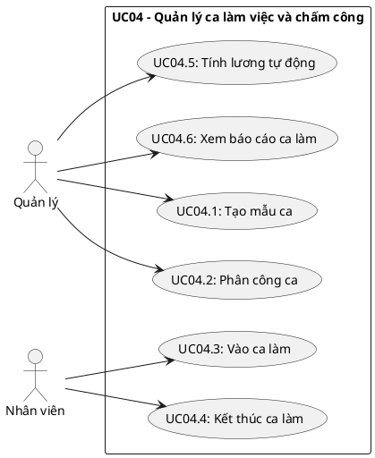
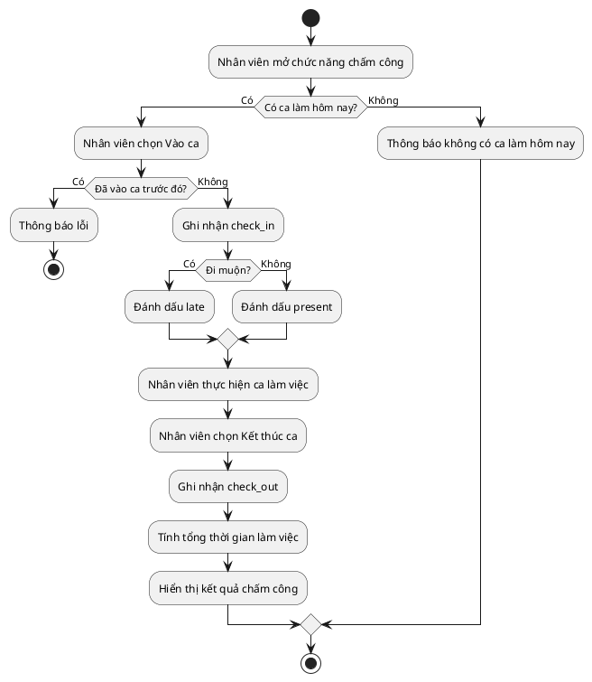

## CHƯƠNG 6: NGHIÊN CỨU CHUYÊN SÂU — CA SỬ DỤNG QUẢN LÝ CA LÀM VIỆC VÀ CHẤM CÔNG (UC04)

Chương này trình bày chuyên sâu **UC04 - Quản lý Ca làm việc và Chấm công**. Nội dung tập trung vào
các chức năng chính gồm phân công ca, vào ca, kết thúc ca và tổng hợp lương, phù hợp với yêu cầu
phân tích use case của môn học.

### 6.1. Biểu đồ Ca sử dụng chi tiết UC04

UC04 được phân rã thành các ca sử dụng con sau:

### 6.2. Đặc tả Ca sử dụng

#### 6.2.1. Đặc tả UC04.3 — Nhân viên Vào ca làm

| **Trường**                      | **Nội dung**                                                        |
| ------------------------------- | ------------------------------------------------------------------- |
| Mã ca sử dụng                   | UC04.3                                                              |
| Tên ca sử dụng                  | Vào ca làm việc                                                     |
| Tác nhân chính                  | Nhân viên                                                           |
| Tác nhân thứ cấp                | Hệ thống chấm công                                                  |
| Điều kiện tiên quyết            | Nhân viên đã đăng nhập và đã được phân công ca trong ngày           |
| Điều kiện kết thúc (thành công) | Hệ thống ghi nhận thời gian vào ca và cập nhật trạng thái chấm công |
| Điều kiện kết thúc (thất bại)   | Hệ thống thông báo lỗi và không tạo bản ghi chấm công               |

**Luồng sự kiện chính:**

| **Bước** | **Tác nhân** | **Hành động**                                          |
| -------- | ------------ | ------------------------------------------------------ |
| 1        | Nhân viên    | Mở chức năng chấm công và chọn**Vào ca**               |
| 2        | Hệ thống     | Kiểm tra ca làm đã được phân công trong ngày           |
| 3        | Hệ thống     | Xác nhận nhân viên chưa vào ca trước đó                |
| 4        | Hệ thống     | Ghi nhận thời gian `check_in`                          |
| 5        | Hệ thống     | Cập nhật trạng thái chấm công là `present` hoặc `late` |
| 6        | Hệ thống     | Thông báo vào ca thành công                            |

**Luồng ngoại lệ:**

| **Mã** | **Điều kiện kích hoạt**           | **Xử lý**                                           |
| ------ | --------------------------------- | --------------------------------------------------- |
| E1     | Không có ca làm trong ngày        | Thông báo cho nhân viên và từ chối ghi nhận         |
| E2     | Đã có bản ghi vào ca trước đó     | Thông báo đã vào ca và không ghi nhận lần hai       |
| E3     | Vào ca sớm hơn thời gian cho phép | Hiển thị cảnh báo và yêu cầu xác nhận lại           |
| E4     | Vào ca muộn hơn 15 phút           | Vẫn ghi nhận nhưng đánh dấu trạng thái đi muộn      |
| E5     | Lỗi lưu dữ liệu                   | Thông báo lỗi kỹ thuật, không tạo bản ghi chấm công |

#### 6.2.2. Đặc tả UC04.5 — Tính lương tự động

| **Trường**           | **Nội dung**                                    |
| -------------------- | ----------------------------------------------- |
| Mã ca sử dụng        | UC04.5                                          |
| Tên ca sử dụng       | Tính lương tự động                              |
| Tác nhân chính       | Quản lý                                         |
| Tác nhân thứ cấp     | Hệ thống                                        |
| Điều kiện tiên quyết | Đã có dữ liệu chấm công đầy đủ trong kỳ lương   |
| Điều kiện kết thúc   | Hệ thống tổng hợp tiền lương cho từng nhân viên |

**Luồng sự kiện chính:**

| **Bước** | **Tác nhân** | **Hành động**                                       |
| -------- | ------------ | --------------------------------------------------- |
| 1        | Quản lý      | Chọn chức năng tính lương theo kỳ                   |
| 2        | Hệ thống     | Tổng hợp dữ liệu vào ca, kết thúc ca và số buổi làm |
| 3        | Hệ thống     | Áp dụng đơn giá theo từng loại ca                   |
| 4        | Hệ thống     | Tính tổng lương của từng nhân viên                  |
| 5        | Hệ thống     | Hiển thị bảng lương để quản lý kiểm tra             |

**Nguyên tắc tính lương:**

$$
S_{total} = (N_{sang} \times R_{sang}) + (N_{toi} \times R_{toi}) + (N_{cuoi\_tuan} \times R_{ca} \times 1.5) + (N_{ngay\_le} \times R_{ca} \times 2.0)
$$

| **Loại ca**  | **Khung giờ**          | **Cách tính**             |
| ------------ | ---------------------- | ------------------------- |
| Ca sáng      | 06:00 - 14:00          | Tính theo đơn giá ca sáng |
| Ca tối       | 14:00 - 22:00          | Tính theo đơn giá ca tối  |
| Ca cuối tuần | Theo ca được phân công | Nhân hệ số 1.5            |
| Ca ngày lễ   | Theo ca được phân công | Nhân hệ số 2.0            |

#### 6.2.3. Ghi chú ngoại lệ

Trường hợp nhân viên quên kết thúc ca, hệ thống không tự ý xóa dữ liệu hoặc tính lương bằng 0. Bản
ghi sẽ được chuyển sang trạng thái chờ xử lý để quản lý kiểm tra và xác nhận lại giờ ra thực tế.

### 6.3. Biểu đồ Hoạt động — Quy trình Chấm công

