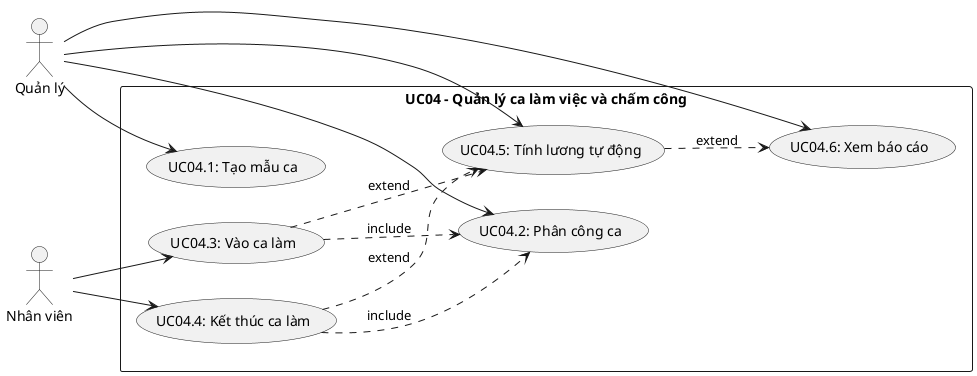
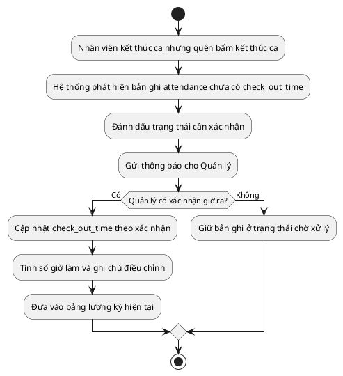
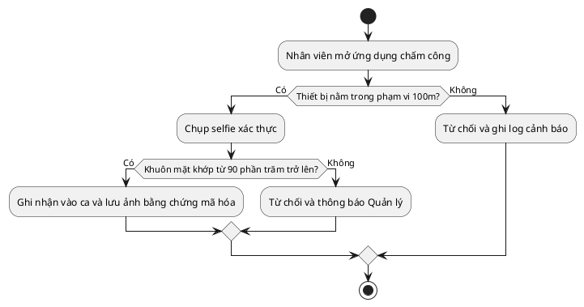
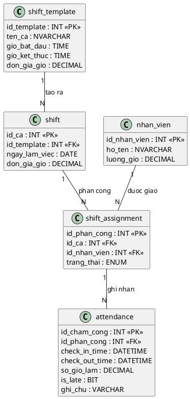
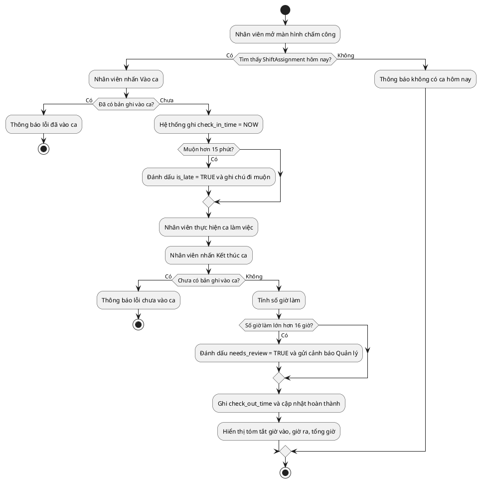

## CHƯƠNG 6: NGHIÊN CỨU CHUYÊN SÂU — CA SỬ DỤNG QUẢN LÝ CA LÀM VIỆC VÀ CHẤM CÔNG (UC04)

Chương này đi sâu vào phân tích và thiết kế một ca sử dụng cụ thể: **UC04 — Quản lý Ca làm việc và Chấm công**. Đây là phân hệ hạt nhân trong quản trị nhân sự, có tính phức tạp cao do phải xử lý đồng thời nhiều ràng buộc thời gian, dữ liệu và quyền truy cập. Phân tích chuyên sâu UC04 minh họa cho toàn bộ vòng đời thiết kế ca sử dụng từ đặc tả đến thiết kế dữ liệu và kiểm thử.

### 6.1. Biểu đồ Ca sử dụng chi tiết UC04

#### 6.1.1. Phân định các ca sử dụng con

UC04 được phân rã thành các ca sử dụng con độc lập, có thể được phân công cho các thành viên nhóm khác nhau:

### 6.2. Đặc tả Ca sử dụng

#### 6.2.1. Đặc tả UC04.3 — Nhân viên Vào ca làm

| **Trường** | **Nội dung** |
| --- | --- |
| Mã ca sử dụng | UC04.3 |
| Tên ca sử dụng | Vào ca làm việc |
| Tác nhân chính | Nhân viên |
| Tác nhân thứ cấp | Hệ thống chấm công |
| Điều kiện tiên quyết | Nhân viên đã đăng nhập; tồn tại bản phân công ca (ShiftAssignment) cho nhân viên này trong ngày hôm nay; trạng thái ca là "chưa bắt đầu" |
| Điều kiện kết thúc (thành công) | Bản ghi Attendance được tạo với check_in_time = thời gian hiện tại; trạng thái phân công chuyển sang "đang làm việc" |
| Điều kiện kết thúc (thất bại) | Hệ thống hiển thị thông báo lỗi; trạng thái Attendance không thay đổi |

**Luồng sự kiện chính (Main Flow):**

| **Bước** | **Tác nhân** | **Hành động** |
| --- | --- | --- |
| 1 | Nhân viên | Mở màn hình Chấm công, chọn "Vào ca" |
| 2 | Hệ thống | Truy vấn ShiftAssignment theo id_nhan_vien và ngày hiện tại |
| 3 | Hệ thống | Xác nhận tồn tại ca được phân công và ca chưa bắt đầu |
| 4 | Hệ thống | Tạo bản ghi Attendance với check_in_time = NOW() |
| 5 | Hệ thống | Cập nhật ShiftAssignment.trang_thai = 'dang_lam' |
| 6 | Hệ thống | Hiển thị thông báo: _"Vào ca thành công lúc HH:MM. Chúc bạn làm việc hiệu quả!"_ |

**Luồng ngoại lệ (Alternative / Exception Flows):**

| **Mã** | **Điều kiện kích hoạt** | **Xử lý** |
| --- | --- | --- |
| E1 | Không tồn tại ShiftAssignment cho ngày hôm nay | Hiển thị: _"Bạn không có ca làm việc hôm nay. Liên hệ Quản lý."_ |
| E2 | Nhân viên đã vào ca này rồi | Hiển thị: _"Bạn đã vào ca lúc [giờ]. Không thể ghi nhận hai lần."_ |
| E3 | Vào ca sớm hơn 30 phút so với giờ bắt đầu ca | Hiển thị cảnh báo vào ca sớm; cho phép nhân viên xác nhận tiếp tục ghi nhận |
| E4 | Vào ca muộn hơn 15 phút so với giờ bắt đầu ca | Ghi nhận vào ca bình thường nhưng đánh dấu is_late = TRUE trong bản ghi Attendance |
| E5 | Mất kết nối CSDL khi lưu | Thông báo lỗi kỹ thuật; ghi log; không tạo bản ghi Attendance |

#### 6.2.2. Đặc tả UC04.5 — Tính lương tự động

| **Trường** | **Nội dung** |
| --- | --- |
| Tác nhân | Quản lý (khởi tạo) / Hệ thống (thực thi) |
| Điều kiện tiên quyết | Tồn tại ít nhất một bản ghi Attendance có đủ cặp check-in/check-out trong kỳ tính lương |
| Kết quả | Hệ thống tổng hợp bảng lương cho từng nhân viên theo kỳ |

**Công thức tính lương:**

$$L_{nv} = \sum (N_{sang,thuong} \times R_{sang}) + \sum (N_{toi,thuong} \times R_{toi}) + \sum (N_{cuoi_tuan} \times R_{ca} \times 1.5) + \sum (N_{ngay_le} \times R_{ca} \times 2.0)$$

Trong đó:

$L_{nv}$: Tổng lương của nhân viên trong kỳ

$N_{sang,thuong}$: Số ca sáng ngày thường đã hoàn thành trong kỳ

$N_{toi,thuong}$: Số ca tối ngày thường đã hoàn thành trong kỳ

$N_{cuoi_tuan}$: Số ca hoàn thành vào cuối tuần

$N_{ngay_le}$: Số ca hoàn thành vào ngày lễ

$R_{sang}$: Mức lương cố định cho một ca sáng

$R_{toi}$: Mức lương cố định cho một ca tối

$R_{ca}$: Mức lương gốc của ca sáng hoặc ca tối tương ứng

### 6.2.3. Xử lý Ngoại lệ Thông minh — Đổi ca đột xuất và Quên kết thúc ca

Khác với các quy tắc cứng nhắc, hệ thống được thiết kế để xử lý **linh hoạt** các tình huống thực tế của nghiệp vụ ngành dịch vụ:

**a. Đổi ca đột xuất:**

Khi nhân viên đổi ca mà chưa có lịch trên hệ thống, hệ thống **không từ chối** chấm công. Thay vào đó:

- Cho phép vào ca bình thường dựa trên xác thực GPS và khuôn mặt
- Xếp bản ghi `attendance` vào trạng thái `trang_thai = 'cho_phe_duyet'`
- Gửi thông báo tới Quản lý để phê duyệt bổ sung
- Sau khi phê duyệt, tạo `shift_assignment` tương ứng và liên kết lại

***Nguyên tắc thiết kế:** Hệ thống không được cản trở hoạt động vận hành; mọi ngoại lệ được thu thập để quản lý xử lý sau, không phải từ chối trước.*

**b. Xử lý "Quên kết thúc ca":**

Trường hợp nhân viên quên bấm giờ ra, hệ thống **không được phép** gán giờ làm = 0 (vi phạm quyền lợi người lao động theo Bộ Luật Lao động):

### 6.2.4. Cơ chế Chấm công Sinh trắc học — Triệt tiêu Chấm công Hộ

Để ngăn chặn tình trạng **chấm công hộ (Buddy Punching)** — một vấn đề phổ biến trong ngành dịch vụ, ứng dụng di động tích hợp hai lớp bảo vệ:

| **Lớp** | **Công nghệ** | **Cơ chế hoạt động** |
| --- | --- | --- |
| Lớp 1: Vị trí | Định vị GPS theo vùng | Chỉ cho phép vào ca khi thiết bị nằm trong bán kính ≤ 100m từ tọa độ quán |
| Lớp 2: Danh tính | Nhận diện khuôn mặt hoặc ảnh tự chụp | Chụp ảnh tại thời điểm vào ca, so sánh với ảnh đăng ký bằng thuật toán nhận diện khuôn mặt |

**Luồng xác thực:**

***Lưu trữ:** Ảnh selfie được mã hóa và lưu kèm bản ghi `attendance`, giữ tối thiểu 90 ngày để phục vụ kiểm toán nội bộ.*

### 6.2.5. Tính lương theo 2 ca cố định có hệ số cuối tuần/lễ

Hệ thống áp dụng mô hình tính lương gọn nhưng thực tế: chỉ có 2 ca sáng/tối, nhưng vẫn cộng hệ số cho cuối tuần và ngày lễ.

$$S_{total} = (N_{sang} \times R_{sang}) + (N_{toi} \times R_{toi}) + (N_{cuoi_tuan} \times R_{ca} \times 1.5) + (N_{ngay_le} \times R_{ca} \times 2.0)$$

| **Loại ca** | **Khung giờ chuẩn** | **Cách tính lương** |
| --- | --- | --- |
| Ca sáng | 06:00 - 12:00 | Cộng `R_sang` khi hoàn thành đủ ca |
| Ca tối | 16:00 - 22:00 | Cộng `R_toi` khi hoàn thành đủ ca |
| Ca cuối tuần | Theo ca sáng hoặc ca tối | Nhân hệ số `1.5` trên đơn giá ca tương ứng |
| Ca ngày lễ | Theo ca sáng hoặc ca tối | Nhân hệ số `2.0` trên đơn giá ca tương ứng |

#### 6.3.1. Lược đồ 4 bảng — Tách biệt Kế hoạch và Thực tế

Nguyên tắc thiết kế cốt lõi của UC04 là **tách biệt hoàn toàn** dữ liệu kế hoạch (Planning) khỏi dữ liệu thực tế (Actual), tương tự mô hình Planning vs. Actuals phổ biến trong kế toán quản trị:

***Ghi chú thiết kế:** 2 nhóm bảng trên tách biệt hoàn toàn **Kế hoạch** (shift_template, shift, shift_assignment) khỏi **Thực tế** (attendance), giúp dễ đối soát và kiểm toán.*

#### 6.3.2. Các Quy tắc Nghiệp vụ cho UC04

| **Mã BR** | **Quy tắc** | **Cơ chế kiểm soát** |
| --- | --- | --- |
| BR-01 | Một nhân viên không thể có 2 ca chồng chéo thời gian trong cùng ngày | Trigger kiểm tra overlap khi INSERT vào shift_assignment |
| BR-02 | Chỉ có thể kết thúc ca sau khi đã vào ca | check_out_time chỉ được UPDATE khi check_in_time IS NOT NULL |
| BR-03 | Chỉ ca có đủ check_in_time và check_out_time mới được đưa vào bảng lương | Dùng CASE WHEN hoặc cờ trạng thái hợp lệ khi tổng hợp lương |
| BR-04 | Giờ làm tối đa 16 giờ/ca; nếu vượt thì đánh dấu cần xem xét thủ công | Constraint: CHECK(so_gio_lam <= 16) hoặc cờ needs_review = 1 |
| BR-05 | Mỗi ca phải thuộc đúng 1 trong 2 loại: sang hoặc toi; nếu rơi vào cuối tuần/ngày lễ thì áp đúng hệ số | Ràng buộc ENUM / validation ngày làm việc và cờ loại ngày |

### 6.4. Biểu đồ Hoạt động — Quy trình Chấm công toàn luồng

### 6.5. Kiểm thử Ca sử dụng UC04

#### 6.5.1. Ca kiểm thử cho UC04.3 (Vào ca)

| **Mã TC** | **Kịch bản** | **Điều kiện đầu vào** | **Kết quả mong đợi** | **Trạng thái** |
| --- | --- | --- | --- | --- |
| TC-UC04-01 | Vào ca thành công (đúng giờ) | Có ShiftAssignment hôm nay; chưa vào ca; đúng giờ | Tạo Attendance; thông báo thành công | Chờ kiểm thử |
| TC-UC04-02 | Vào ca thành công (đến sớm) | Sớm hơn 30 phút | Hiển thị cảnh báo vào ca sớm; nhân viên xác nhận và hệ thống vẫn ghi nhận | Chờ kiểm thử |
| TC-UC04-03 | Vào ca muộn | Muộn hơn 15 phút | Tạo Attendance; is_late = TRUE; thông báo có ghi chú muộn | Chờ kiểm thử |
| TC-UC04-04 | Vào ca khi không có ca | Không có ShiftAssignment hôm nay | Thông báo lỗi E1; không tạo Attendance | Chờ kiểm thử |
| TC-UC04-05 | Vào ca lần 2 trong cùng ca | Đã có Attendance với check_in_time | Thông báo lỗi E2; không ghi đè | Chờ kiểm thử |

#### 6.5.2. Ca kiểm thử cho UC04.5 (Tính lương)

| **Mã TC** | **Kịch bản** | **Dữ liệu đầu vào** | **Kết quả mong đợi** |
| --- | --- | --- | --- |
| TC-UC04-06 | Tính lương 1 ca sáng ngày thường | Hoàn thành 1 ca sáng, `R_sang = 120.000đ` | Lương = 120.000đ |
| TC-UC04-07 | Tính lương 1 ca tối cuối tuần | Hoàn thành 1 ca tối cuối tuần, `R_toi = 140.000đ` | Lương = 140.000 × 1.5 = 210.000đ |
| TC-UC04-08 | Ca chưa check-out | check_out_time = NULL | Chưa đưa vào bảng lương, chờ quản lý xác nhận |
| TC-UC04-09 | Tổng hợp cả tháng | 18 ca sáng ngày thường + 8 ca tối ngày thường + 2 ca tối cuối tuần + 1 ca sáng ngày lễ | L = 18×120.000 + 8×140.000 + 2×140.000×1.5 + 1×120.000×2.0 = 3.940.000đ |

### 6.6. Đánh giá và Định hướng mở rộng UC04

**Những điểm mạnh của thiết kế hiện tại:**

Kiến trúc **4 bảng phân tách kế hoạch/thực tế** đảm bảo tính toàn vẹn dữ liệu và dễ đối soát.

Luồng ngoại lệ được xử lý tường minh, không để hệ thống ở trạng thái không xác định.

Các quy tắc nghiệp vụ được mã hóa thành Trigger và Constraint ở tầng CSDL, tránh phụ thuộc hoàn toàn vào tầng ứng dụng.

**Hướng mở rộng trong phiên bản tương lai:**

| **Tính năng** | **Mô tả** | **Độ phức tạp** |
| --- | --- | --- |
| Chấm công bằng QR Code | Nhân viên quét QR được tạo theo ca làm, giới hạn địa điểm | Trung bình |
| Tích hợp xử lý lương tự động | Xuất file Excel bảng lương và gửi email thông báo | Thấp |
| Phân tích chuyên cần | Bảng điều khiển thống kê tỷ lệ đi muộn, vắng mặt theo tháng | Cao |
| Phê duyệt tăng ca cuối tuần/lễ | Cho phép Quản lý xác nhận ca đặc biệt trước khi chốt lương | Trung bình |
