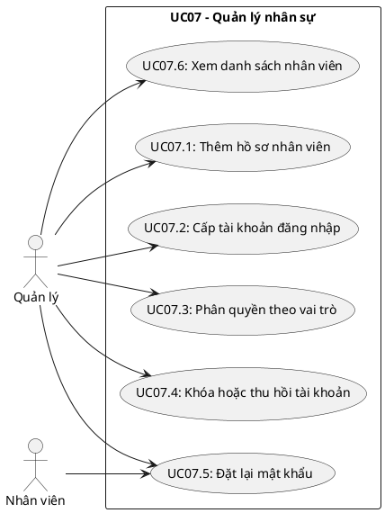
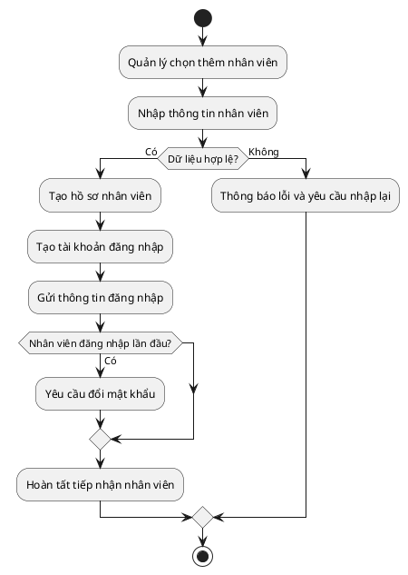

## CHƯƠNG 7: NGHIÊN CỨU CHUYÊN SÂU — CA SỬ DỤNG QUẢN LÝ NHÂN SỰ (UC07)

Chương này phân tích chuyên sâu **UC07 - Quản lý Nhân sự**, tập trung vào các nghiệp vụ chính gồm
thêm hồ sơ nhân viên, cấp tài khoản và phân quyền sử dụng hệ thống. Nội dung được trình bày theo
đúng hướng phân tích use case, tránh đi quá sâu vào thiết kế kỹ thuật triển khai.

### 7.1. Biểu đồ Ca sử dụng chi tiết UC07

UC07 được phân rã thành các ca sử dụng con sau:

### 7.2. Đặc tả Ca sử dụng

#### 7.2.1. Đặc tả UC07.1 — Thêm hồ sơ nhân viên mới

| **Trường**                      | **Nội dung**                                         |
| ------------------------------- | ---------------------------------------------------- |
| Mã ca sử dụng                   | UC07.1                                               |
| Tên ca sử dụng                  | Thêm hồ sơ nhân viên mới                             |
| Tác nhân chính                  | Quản lý                                              |
| Tác nhân thứ cấp                | Hệ thống                                             |
| Điều kiện tiên quyết            | Quản lý đã đăng nhập và có quyền quản lý nhân sự     |
| Điều kiện kết thúc (thành công) | Hồ sơ nhân viên mới được tạo trong hệ thống          |
| Điều kiện kết thúc (thất bại)   | Hệ thống không lưu dữ liệu và hiển thị lỗi tương ứng |

**Luồng sự kiện chính:**

| **Bước** | **Tác nhân** | **Hành động**                                     |
| -------- | ------------ | ------------------------------------------------- |
| 1        | Quản lý      | Chọn chức năng **Thêm nhân viên**                 |
| 2        | Hệ thống     | Hiển thị biểu mẫu nhập thông tin                  |
| 3        | Quản lý      | Nhập đầy đủ thông tin cá nhân và vị trí công việc |
| 4        | Hệ thống     | Kiểm tra tính hợp lệ của dữ liệu                  |
| 5        | Hệ thống     | Tạo hồ sơ nhân viên mới                           |
| 6        | Hệ thống     | Thông báo thêm nhân viên thành công               |

**Luồng ngoại lệ:**

| **Mã** | **Điều kiện kích hoạt**         | **Xử lý**                                   |
| ------ | ------------------------------- | ------------------------------------------- |
| E1     | Số điện thoại đã tồn tại        | Thông báo trùng dữ liệu và yêu cầu nhập lại |
| E2     | Email không đúng định dạng      | Hiển thị lỗi tại trường email               |
| E3     | Chưa nhập đủ thông tin bắt buộc | Không cho lưu và yêu cầu bổ sung            |

#### 7.2.2. Đặc tả UC07.2 — Cấp tài khoản đăng nhập

| **Trường**           | **Nội dung**                                      |
| -------------------- | ------------------------------------------------- |
| Mã ca sử dụng        | UC07.2                                            |
| Tên ca sử dụng       | Cấp tài khoản đăng nhập                           |
| Tác nhân chính       | Quản lý                                           |
| Tác nhân thứ cấp     | Hệ thống                                          |
| Điều kiện tiên quyết | Nhân viên đã có hồ sơ trong hệ thống              |
| Điều kiện kết thúc   | Tài khoản đăng nhập được tạo và gắn với nhân viên |

**Luồng sự kiện chính:**

| **Bước** | **Tác nhân** | **Hành động**                                 |
| -------- | ------------ | --------------------------------------------- |
| 1        | Quản lý      | Chọn nhân viên cần cấp tài khoản              |
| 2        | Hệ thống     | Hiển thị thông tin tài khoản cần tạo          |
| 3        | Quản lý      | Xác nhận tạo tài khoản                        |
| 4        | Hệ thống     | Sinh tên đăng nhập và mật khẩu tạm thời       |
| 5        | Hệ thống     | Gửi thông tin đăng nhập cho nhân viên         |
| 6        | Hệ thống     | Yêu cầu đổi mật khẩu ở lần đăng nhập đầu tiên |

#### 7.2.3. Phân quyền theo vai trò

Hệ thống áp dụng phân quyền theo vai trò để bảo đảm mỗi nhóm người dùng chỉ truy cập đúng chức năng
được giao.

| **Vai trò**               | **Quyền hạn chính**                                           |
| ------------------------- | ------------------------------------------------------------- |
| Quản lý                   | Quản lý nhân sự, phân công ca, xem báo cáo, cấu hình hệ thống |
| Thu ngân                  | Lập đơn hàng, thanh toán, xem lịch làm việc của bản thân      |
| Nhân viên phục vụ/pha chế | Cập nhật trạng thái công việc, chấm công, xem lịch cá nhân    |

### 7.3. Biểu đồ Hoạt động — Quy trình tiếp nhận nhân viên mới

