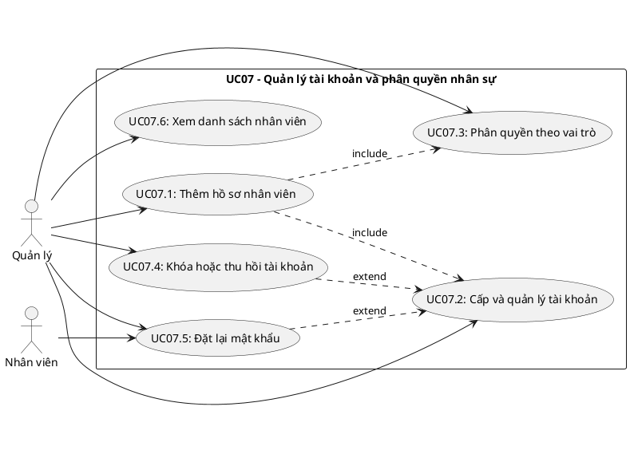
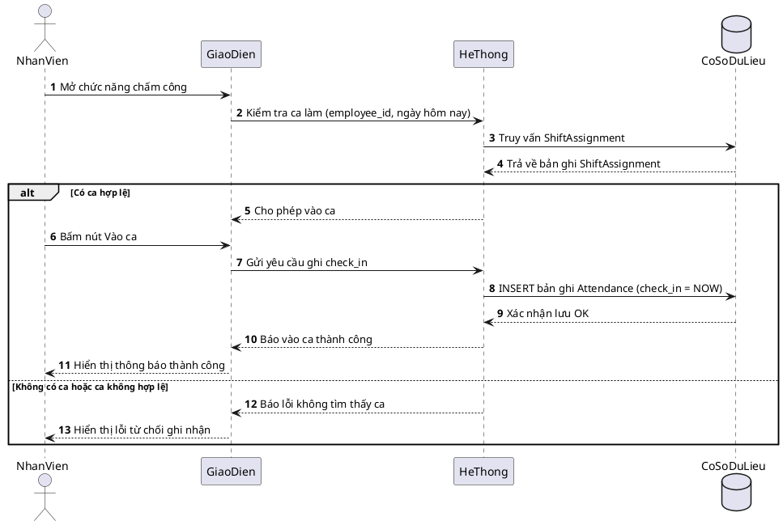
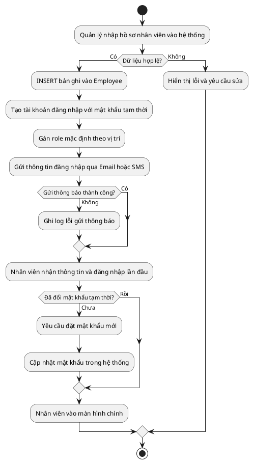
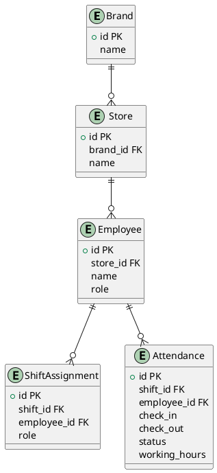

## CHƯƠNG 7: NGHIÊN CỨU CHUYÊN SÂU — CA SỬ DỤNG QUẢN LÝ NHÂN SỰ (UC07)

Chương này phân tích chuyên sâu **UC07 — Quản lý Tài khoản và Phân quyền Nhân sự**, bao gồm toàn bộ vòng đời quản lý hồ sơ nhân viên: từ tuyển dụng và tiếp nhận nhân sự, phân quyền hệ thống, đến chấm dứt hợp đồng. Đây là phân hệ nền tảng vì mọi UC khác đều phụ thuộc vào danh tính và quyền hạn được định nghĩa tại đây.

### 7.1. Biểu đồ Ca sử dụng chi tiết UC07

#### 7.1.1. Phân định các ca sử dụng con

UC07 được phân rã thành các ca sử dụng con gắn với vòng đời nhân viên:

### 7.2. Đặc tả Ca sử dụng

#### 7.2.1. Đặc tả UC07.1 — Thêm hồ sơ nhân viên mới

| **Trường** | **Nội dung** |
| --- | --- |
| Mã ca sử dụng | UC07.1 |
| Tên ca sử dụng | Thêm hồ sơ nhân viên mới |
| Tác nhân chính | Quản lý |
| Tác nhân thứ cấp | Hệ thống, Nhân viên mới (người nhận tài khoản) |
| Điều kiện tiên quyết | Quản lý đã đăng nhập; có quyền MANAGER |
| Điều kiện kết thúc (thành công) | Bản ghi Employee được tạo; tài khoản ở trạng thái hoạt động; thông báo đăng nhập được gửi |
| Điều kiện kết thúc (thất bại) | Không có bản ghi nào được tạo; hệ thống hiển thị lỗi cụ thể |
| Mức độ ưu tiên | Cao |

**Luồng sự kiện chính:**

| **Bước** | **Tác nhân** | **Hành động** |
| --- | --- | --- |
| 1 | Quản lý | Truy cập menu **Nhân sự > Thêm nhân viên** |
| 2 | Hệ thống | Hiển thị form nhập: name, phone, email, ngày sinh, store_id, role |
| 3 | Quản lý | Điền đầy đủ thông tin và nhấn Lưu |
| 4 | Hệ thống | Kiểm tra dữ liệu đầu vào (phone trùng, email định dạng, role hợp lệ) |
| 5 | Hệ thống | INSERT bản ghi vào bảng Employee |
| 6 | Hệ thống | Tự động tạo tài khoản với mật khẩu tạm thời; gán role mặc định |
| 7 | Hệ thống | Gửi email/SMS thông báo thông tin đăng nhập đến nhân viên mới |
| 8 | Hệ thống | Hiển thị thông báo: _"Thêm nhân viên thành công. Thông tin đăng nhập đã được gửi."_ |

**Luồng ngoại lệ:**

| **Mã** | **Điều kiện kích hoạt** | **Xử lý** |
| --- | --- | --- |
| E1 | Số điện thoại đã tồn tại trong hệ thống | Hiển thị: _"Nhân viên với số điện thoại này đã được đăng ký."_ Không INSERT. |
| E2 | Email không đúng định dạng | Highlight trường lỗi, thông báo: _"Email không hợp lệ."_ |
| E3 | store_id không tồn tại | Cảnh báo: _"Cửa hàng không hợp lệ. Vui lòng chọn lại."_ |
| E4 | Gửi thông báo thất bại | Vẫn tạo Employee thành công; ghi log lỗi; Quản lý tự thông báo thủ công |

#### 7.2.2. Đặc tả UC07.2 — Cấp và Quản lý tài khoản đăng nhập

| **Trường** | **Nội dung** |
| --- | --- |
| Mã ca sử dụng | UC07.2 |
| Tác nhân | Quản lý |
| Điều kiện tiên quyết | Nhân viên đã có hồ sơ trong hệ thống (UC07.1 đã thực hiện) |
| Kết quả | Tài khoản được cấp phát, cập nhật hoặc thu hồi đúng với trạng thái thực tế của nhân viên |

**Luồng sự kiện — Đặt lại mật khẩu:**

| **Bước** | **Hành động** |
| --- | --- |
| 1 | Quản lý chọn nhân viên, sau đó chọn Đặt lại mật khẩu |
| 2 | Hệ thống tạo mật khẩu ngẫu nhiên mới và băm trước khi lưu |
| 3 | Gửi mật khẩu tạm thời qua SMS/Email |
| 4 | Lần đăng nhập đầu, hệ thống bắt buộc nhân viên đổi mật khẩu mới |

#### 7.2.3. Đặc tả UC07.3 — Phân quyền theo vai trò (role)

Hệ thống phân quyền theo trường `role` trong thực thể **Employee**, với 3 vai trò chính:

| **Vai trò (role)** | **Quyền hạn chính** |
| --- | --- |
| manager | Toàn quyền: quản lý Employee, phê duyệt lương, xem Revenue, cấu hình hệ thống |
| cashier | Tạo/đóng Orders, xử lý Payment, in hóa đơn; xem lịch ca bản thân |
| barista | Cập nhật trạng thái đơn, thêm món vào Orders; chấm công cá nhân (Attendance) |

**Ma trận phân quyền chi tiết:**

| **Chức năng** | **manager** | **cashier** | **barista** |
| --- | --- | --- | --- |
| Xem danh sách Employee | Có | Không | Không |
| Thêm/Sửa Employee | Có | Không | Không |
| Phân công ca (ShiftAssignment) | Có | Không | Không |
| Vào ca/Kết thúc ca (Attendance) | Có | Có | Có |
| Xem lịch sử Attendance | Có | Có (bản thân) | Có (bản thân) |
| Duyệt điều chỉnh Attendance | Có | Không | Không |
| Tạo Orders | Có | Có | Có |
| Xử lý Payment | Có | Có | Không |
| Xem Revenue | Có | Không | Không |
| Cấu hình Product/Menu | Có | Không | Không |

### 7.3. Biểu đồ Tuần tự — Luồng Vào ca của Nhân viên

Biểu đồ này mô tả chi tiết giao tiếp giữa các lớp khi nhân viên thực hiện vào ca — tập trung vào việc xác thực và kiểm tra ShiftAssignment trước khi ghi Attendance:

**Giải thích các tham số:**

- `employee_id` — Mã nhân viên, lấy từ session đăng nhập.
- `check_in` — Thời gian vào ca thực tế, ghi vào Attendance.check_in.

### 7.4. Biểu đồ Hoạt động — Quy trình tiếp nhận nhân viên mới

### 7.5. Mô hình Dữ liệu — Phân hệ Nhân sự

Lược đồ CSDL của phân hệ nhân sự bám sát ERD tổng thể. Tên tham số theo tiếng Anh để đồng bộ với toàn hệ thống:

*Quyết định thiết kế: Trường `role` trong **Employee** là nguồn kiểm soát phân quyền trực tiếp (manager / cashier / barista). Khi nhân viên nghỉ việc, bản ghi Employee không bị xóa vật lý — chỉ đánh dấu trạng thái để bảo toàn toàn bộ lịch sử Attendance và phục vụ kiểm toán.*

### 7.6. Ràng buộc Nghiệp vụ

| **Mã BR** | **Quy tắc** | **Cơ chế kiểm soát** |
| --- | --- | --- |
| BR-NS-01 | Mỗi Employee chỉ có đúng một tài khoản đăng nhập (quan hệ 1-1) | Unique Constraint trên cột employee_id của bảng tài khoản |
| BR-NS-02 | Mật khẩu phải được băm trước khi lưu; không lưu dạng văn bản gốc | Xử lý tại tầng dịch vụ |
| BR-NS-03 | Lần đăng nhập đầu tiên bắt buộc đổi mật khẩu | Cờ buộc đổi mật khẩu; chặn mọi yêu cầu trừ endpoint đổi mật khẩu |
| BR-NS-04 | Không được xóa vật lý bản ghi Employee | Chỉ đánh dấu trạng thái vô hiệu (soft delete) |
| BR-NS-05 | Mọi thao tác thêm/sửa Employee phải được ghi nhật ký | Trigger AFTER INSERT/UPDATE trên bảng Employee |
| BR-NS-06 | Không thể tạo ShiftAssignment cho Employee đã bị vô hiệu hóa | Trigger kiểm tra trạng thái Employee trước khi INSERT ShiftAssignment |

### 7.8. Đánh giá và Định hướng mở rộng UC07

**Những điểm mạnh của thiết kế hiện tại:**

Trường `role` trực tiếp trong **Employee** đơn giản hóa việc kiểm tra quyền hạn, phù hợp quy mô quán cafe.

Cơ chế **vô hiệu hóa mềm** đảm bảo toàn vẹn dữ liệu lịch sử, đặc biệt quan trọng khi kiểm toán.

Nhật ký thao tác ở tầng CSDL (trigger) đảm bảo ghi nhận ngay cả khi ứng dụng gặp sự cố.

**Hướng mở rộng trong phiên bản tương lai:**

| **Tính năng** | **Mô tả** | **Độ phức tạp** |
| --- | --- | --- |
| Đăng nhập 2 yếu tố (2FA) | OTP qua SMS hoặc ứng dụng xác thực tại mỗi lần đăng nhập | Trung bình |
| Đăng nhập một lần (SSO) | Tích hợp đăng nhập qua Google Workspace cho chuỗi nhiều chi nhánh | Cao |
| Hợp đồng lao động điện tử | Lưu trữ và ký số hợp đồng ngay trong hệ thống | Cao |
| Dashboard phân tích nhân sự | Thống kê tỷ lệ nghỉ việc, thâm niên, cơ cấu nhân sự | Trung bình |
