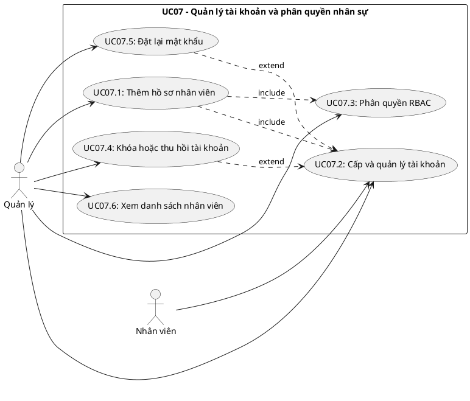
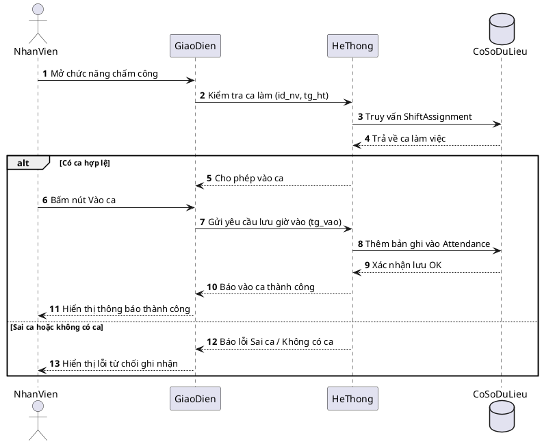
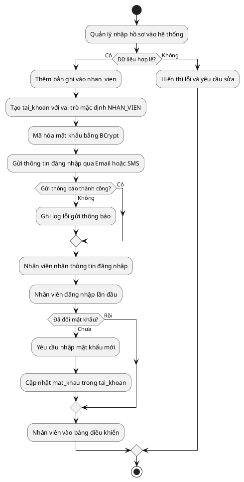
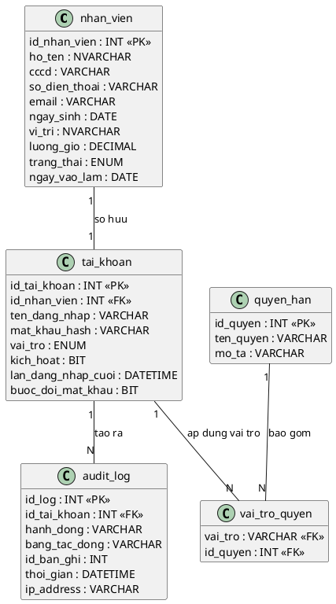

## CHƯƠNG 7: NGHIÊN CỨU CHUYÊN SÂU — CA SỬ DỤNG QUẢN LÝ NHÂN SỰ (UC07)

Chương này phân tích chuyên sâu **UC07 — Quản lý Tài khoản và Phân quyền Nhân sự**, bao gồm toàn bộ vòng đời quản lý hồ sơ nhân viên: từ tuyển dụng và tiếp nhận nhân sự, phân quyền hệ thống, đến chấm dứt hợp đồng. Đây là phân hệ nền tảng vì mọi UC khác đều phụ thuộc vào danh tính và quyền hạn được định nghĩa tại đây.

### 7.1. Biểu đồ Ca sử dụng chi tiết UC07

#### 7.1.1. Phân định các ca sử dụng con

UC07 được phân rã thành các ca sử dụng con gắn với vòng đời nhân viên:

### 7.2. Đặc tả Ca sử dụng

#### 7.2.1. Đặc tả UC07.1 — Thêm hồ sơ nhân viên mới

| **Trường** | **Nội dung** |
| --- | --- |
| Mã ca sử dụng | UC07.1 |
| Tên ca sử dụng | Thêm hồ sơ nhân viên mới |
| Tác nhân chính | Quản lý |
| Tác nhân thứ cấp | Hệ thống, Nhân viên mới (người nhận tài khoản) |
| Điều kiện tiên quyết | Quản lý đã đăng nhập; có quyền MANAGE_EMPLOYEE |
| Điều kiện kết thúc (thành công) | Bản ghi nhan_vien và tai_khoan được tạo; tài khoản ở trạng thái kich_hoat; email thông báo được gửi đi |
| Điều kiện kết thúc (thất bại) | Không có bản ghi nào được tạo; hệ thống hiển thị lỗi cụ thể |
| Mức độ ưu tiên | Cao |

**Luồng sự kiện chính:**

| **Bước** | **Tác nhân** | **Hành động** |
| --- | --- | --- |
| 1 | Quản lý | Truy cập menu **Nhân sự > Thêm nhân viên** |
| 2 | Hệ thống | Hiển thị form nhập: Họ tên, CCCD, SĐT, Email, Ngày sinh, Vị trí công việc, Lương theo giờ |
| 3 | Quản lý | Điền đầy đủ thông tin và nhấn Lưu |
| 4 | Hệ thống | Validate dữ liệu đầu vào (kiểm tra CCCD trùng, SĐT định dạng, email hợp lệ) |
| 5 | Hệ thống | INSERT bản ghi vào bảng nhan_vien |
| 6 | Hệ thống | Tự động tạo tai_khoan với mat_khau ngẫu nhiên (8 ký tự); gán vai_tro mặc định = NHAN_VIEN |
| 7 | Hệ thống | Gửi email/SMS thông báo thông tin đăng nhập đến nhân viên mới |
| 8 | Hệ thống | Hiển thị thông báo: _"Thêm nhân viên thành công. Thông tin đăng nhập đã được gửi."_ |

**Luồng ngoại lệ (Exception Flows):**

| **Mã** | **Điều kiện kích hoạt** | **Xử lý** |
| --- | --- | --- |
| E1 | CCCD đã tồn tại trong hệ thống | Hiển thị: _"Nhân viên với CCCD này đã được đăng ký."_ Không INSERT. |
| E2 | Email không đúng định dạng | Highlight trường lỗi, thông báo: _"Email không hợp lệ."_ |
| E3 | Mức lương ca nhập vào không hợp lệ | Cảnh báo: _"Mức lương ca chưa phù hợp. Vui lòng kiểm tra lại hoặc xác nhận tiếp tục."_ |
| E4 | Gửi thư điện tử thất bại | Vẫn tạo tài khoản thành công; ghi nhật ký lỗi gửi thư; Quản lý tự thông báo thủ công |

#### 7.2.2. Đặc tả UC07.2 — Cấp và Quản lý tài khoản đăng nhập

| **Trường** | **Nội dung** |
| --- | --- |
| Mã ca sử dụng | UC07.2 |
| Tác nhân | Quản lý |
| Điều kiện tiên quyết | Nhân viên đã có hồ sơ trong hệ thống (UC07.1 đã thực hiện) |
| Kết quả | Tài khoản được cấp phát, cập nhật hoặc thu hồi đúng với trạng thái thực tế của nhân viên |

**Luồng sự kiện — Đặt lại mật khẩu:**

| **Bước** | **Hành động** |
| --- | --- |
| 1 | Quản lý chọn nhân viên, sau đó chọn Đặt lại mật khẩu |
| 2 | Hệ thống tạo mật khẩu ngẫu nhiên mới và hash bằng BCrypt (salt 12 rounds) |
| 3 | Gửi mật khẩu tạm thời qua SMS/Email |
| 4 | Lần đăng nhập đầu, hệ thống bắt buộc nhân viên đổi mật khẩu mới |

#### 7.2.3. Đặc tả UC07.3 — Phân quyền RBAC

Hệ thống phân quyền theo mô hình **Role-Based Access Control (RBAC)**, quản lý 3 cấp độ vai trò:

| **Vai trò (Role)** | **Mã vai trò** | **Quyền hạn chính** |
| --- | --- | --- |
| Quản lý | MANAGER | Toàn quyền: CRUD nhân viên, phê duyệt lương, xem báo cáo, cấu hình hệ thống |
| Thu ngân | CASHIER | Tạo/đóng đơn hàng, xử lý thanh toán, in hóa đơn; xem lịch ca của bản thân |
| Nhân viên phục vụ | WAITER | Cập nhật trạng thái bàn, thêm món vào đơn; chấm công cá nhân |

**Ma trận phân quyền chi tiết:**

| **Chức năng** | **MANAGER** | **CASHIER** | **WAITER** |
| --- | --- | --- | --- |
| Xem danh sách nhân viên | Có | Không | Không |
| Thêm/Sửa nhân viên | Có | Không | Không |
| Phân công ca làm | Có | Không | Không |
| Vào ca/Kết thúc ca | Có | Có | Có |
| Xem lịch sử chấm công | Có | Có (bản thân) | Có (bản thân) |
| Duyệt điều chỉnh chấm công | Có | Không | Không |
| Tạo đơn hàng | Có | Có | Có |
| Xử lý thanh toán | Có | Có | Không |
| Xem báo cáo doanh thu | Có | Không | Không |
| Cấu hình thực đơn | Có | Không | Không |

### 7.3. Biểu đồ Tuần tự — Luồng Vào ca của Nhân viên

Biểu đồ này mô tả chi tiết giao tiếp giữa các lớp trong kiến trúc phân lớp khi nhân viên thực hiện vào ca, tập trung vào việc **xác thực danh tính** và **kiểm tra phân công ca** trước khi ghi nhận:

**Giải thích các biến số:**

id_nv — Mã nhân viên (ID Nhân viên), lấy từ session đăng nhập.

tg_ht — Thời gian hiện tại, dùng để đối chiếu với bảng shift_assignment.

tg_vao — Thời gian vào ca thực tế, tương đương check_in_time trong bảng attendance.

### 7.4. Biểu đồ Hoạt động — Quy trình tiếp nhận nhân viên mới

### 7.5. Mô hình Dữ liệu (ERD) — Phân hệ Nhân sự

Lược đồ CSDL của phân hệ nhân sự được thiết kế tách bạch rõ ràng giữa **hồ sơ nhân sự** (thông tin cứng, ít thay đổi) và **tài khoản hệ thống** (thông tin xác thực, phân quyền):

***Quyết định thiết kế:** Tách bảng `nhan_vien` và `tai_khoan` thay vì gộp chung nhằm tuân thủ **Nguyên tắc Phân tách mối quan tâm (Separation of Concerns)**. Khi nhân viên nghỉ việc, tài khoản bị `kich_hoat = 0` (không xóa) để bảo toàn toàn bộ lịch sử `audit_log` và dữ liệu chấm công phục vụ kiểm toán.*

### 7.6. Ràng buộc Nghiệp vụ

| **Mã BR** | **Quy tắc** | **Cơ chế kiểm soát** |
| --- | --- | --- |
| BR-NS-01 | Mỗi nhân viên chỉ có đúng một tài khoản đăng nhập (quan hệ 1-1) | Unique Constraint trên tai_khoan.id_nhan_vien |
| BR-NS-02 | Mật khẩu phải được băm bằng BCrypt trước khi lưu; không lưu dạng văn bản gốc | Xử lý tại tầng dịch vụ; không bao giờ lưu chuỗi gốc |
| BR-NS-03 | Lần đăng nhập đầu tiên bắt buộc đổi mật khẩu | Cờ buoc_doi_mat_khau = 1; lớp trung gian chặn mọi yêu cầu trừ điểm cuối đổi mật khẩu |
| BR-NS-04 | Không được xóa vật lý bản ghi nhân viên | Chỉ đặt trang_thai = 'da_nghi_viec' và kich_hoat = 0 (vô hiệu hóa mềm) |
| BR-NS-05 | Mọi thao tác thêm/sửa/xoá nhân viên phải được ghi vào audit_log | Bộ kích hoạt cơ sở dữ liệu AFTER INSERT/UPDATE/DELETE trên bảng nhan_vien và tai_khoan |
| BR-NS-06 | Không thể phân công ca cho nhân viên có tài khoản bị khóa | Trigger kiểm tra tai_khoan.kich_hoat = 1 trước khi INSERT vào shift_assignment |

### 7.7. Kiểm thử Ca sử dụng UC07

#### 7.7.1. Ca kiểm thử cho UC07.1 (Thêm nhân viên)

| **Mã TC** | **Kịch bản** | **Điều kiện đầu vào** | **Kết quả mong đợi** | **Trạng thái** |
| --- | --- | --- | --- | --- |
| TC-UC07-01 | Thêm nhân viên thành công | Dữ liệu hợp lệ, CCCD chưa tồn tại | Tạo bản ghi nhan_vien + tai_khoan; email được gửi | Chờ test |
| TC-UC07-02 | CCCD đã tồn tại trong hệ thống | CCCD trùng với nhân viên khác | Hiển thị lỗi E1; không INSERT bất kỳ bản ghi nào | Chờ test |
| TC-UC07-03 | Email sai định dạng | email = "khong_hop_le" | Highlight lỗi, thông báo E2; không cho phép submit | Chờ test |
| TC-UC07-04 | Mức lương ca nhập không hợp lệ | Mức lương ca sáng hoặc ca tối nhỏ hơn cấu hình tối thiểu của quán | Hiển thị cảnh báo E3; Quản lý xác nhận mới lưu | Chờ kiểm thử |
| TC-UC07-05 | Gửi thư điện tử thất bại sau khi tạo xong | Máy chủ SMTP ngừng hoạt động | Nhân viên vẫn được tạo; ghi nhật ký lỗi; không hoàn tác | Chờ kiểm thử |

#### 7.7.2. Ca kiểm thử cho UC07.3 (Phân quyền RBAC)

| **Mã TC** | **Kịch bản** | **Điều kiện đầu vào** | **Kết quả mong đợi** | **Trạng thái** |
| --- | --- | --- | --- | --- |
| TC-UC07-06 | Thu ngân truy cập chức năng quản lý nhân viên | Vai trò CASHIER gọi API /employees | HTTP 403; ghi audit_log | Chờ kiểm thử |
| TC-UC07-07 | Quản lý nâng quyền nhân viên phục vụ thành thu ngân | vai_tro = 'CASHIER' cho id_nv = 5 | Cập nhật tai_khoan.vai_tro; quyền hạn thay đổi ngay | Chờ kiểm thử |
| TC-UC07-08 | Đăng nhập sau khi tài khoản bị khóa | kich_hoat = 0 | HTTP 401; thông báo: _"Tài khoản bị tạm khóa."_ | Chờ kiểm thử |
| TC-UC07-09 | Xem lịch sử chấm công của người khác (nhân viên phục vụ) | WAITER gọi API chấm công id_nv = 10 | HTTP 403; chỉ được xem bản ghi của chính mình | Chờ kiểm thử |

### 7.8. Đánh giá và Định hướng mở rộng UC07

**Những điểm mạnh của thiết kế hiện tại:**

Mô hình **vô hiệu hóa mềm** đảm bảo toàn vẹn dữ liệu lịch sử, đặc biệt quan trọng khi kiểm toán tài chính.

Kiến trúc **RBAC** với bảng vai_tro_quyen trung gian cho phép thêm/sửa quyền hạn mà không cần thay đổi mã nguồn.

**BCrypt (12 rounds)** cung cấp bảo vệ mật khẩu đủ mạnh, chịu được brute-force attack với phần cứng hiện đại.

**Nhật ký thao tác** ở tầng CSDL (trigger) bảo đảm ghi nhận ngay cả khi ứng dụng gặp sự cố.

**Hướng mở rộng trong phiên bản tương lai:**

| **Tính năng** | **Mô tả** | **Độ phức tạp** |
| --- | --- | --- |
| Đăng nhập 2 yếu tố (2FA) | OTP qua SMS hoặc ứng dụng xác thực tại mỗi lần đăng nhập | Trung bình |
| Đăng nhập một lần (SSO) | Tích hợp đăng nhập qua Google Workspace cho chuỗi nhiều chi nhánh | Cao |
| Hợp đồng lao động điện tử | Lưu trữ và ký số hợp đồng ngay trong hệ thống | Cao |
| Bảng điều khiển phân tích nhân sự | Thống kê tỷ lệ nghỉ việc, thâm niên, biểu đồ cơ cấu nhân sự | Trung bình |
