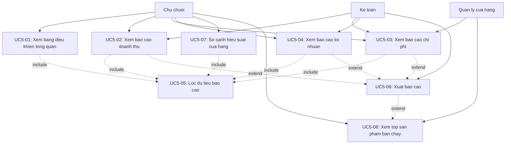

## CHƯƠNG 8: NGHIÊN CỨU CHUYÊN SÂU — CA SỬ DỤNG BÁO CÁO DOANH THU - CHI PHÍ (UC05)

### 8.1. Biểu đồ Ca sử dụng

### 8.2. Đặc tả Ca sử dụng

8.2.1. Xem bảng điều khiển tổng quan

| **Thuộc tính** | **Nội dung** |
| --- | --- |
| Mã UC | UC5-01 |
| Tên UC | Xem bảng điều khiển tổng quan |
| Tác nhân chính | Chủ chuỗi |
| Tác nhân phụ | Không có |
| Mục tiêu | Cung cấp cho chủ chuỗi cái nhìn tổng quan về tình hình tài chính toàn hệ thống: tổng doanh thu, tổng chi phí, lợi nhuận và top cửa hàng doanh thu cao |
| Điều kiện tiên quyết | Người dùng đã đăng nhập với vai trò Chủ chuỗi |
| Điều kiện hậu nghiệm | Bảng điều khiển hiển thị đầy đủ số liệu tổng quan của hệ thống trong kỳ mặc định (tháng hiện tại) |
| Luồng sự kiện chính | 1. Chọn mục bảng điều khiển tổng quan
 2. Hệ thống kiểm tra vai trò người dùng (Chủ chuỗi)
 3. Thu thập dữ liệu doanh thu từ tất cả cửa hàng
 4. Tính toán: tổng doanh thu, tổng chi phí, lợi nhuận (tháng hiện tại)
 5. Xếp hạng top cửa hàng theo doanh thu
 6. Hiển thị bảng điều khiển: các thẻ KPI, biểu đồ xu hướng, bảng top cửa hàng
 7. Xem thông tin tổng quan |
| Luồng thay thế | [A1] Không có dữ liệu trong kỳ: Hiển thị thông báo "Chưa có dữ liệu cho kỳ này", các thẻ KPI hiển thị giá trị 0 |
| Luồng ngoại lệ | [E1] Lỗi kết nối cơ sở dữ liệu: Hiển thị thông báo lỗi và đề xuất thử lại sau
 [E2] Timeout truy vấn: Hiển thị thông báo hết thời gian chờ, cho phép làm mới trang |
| Ghi chú | Bảng điều khiển mặc định hiển thị dữ liệu tháng hiện tại. Người dùng có thể kết hợp với UC5-05 để lọc theo kỳ khác |

8.2.2. Xem báo cáo doanh thu

8.2.3. Xem báo cáo chi phí

8.2.4. Xem báo cáo lợi nhuận

8.2.5. Lọc dữ liệu báo cáo

8.2.6. Xuất báo cáo

8.2.7. So sánh hiệu suất cửa hàng

8.2.8. Xem top sản phẩm bán chạy

### 8.3. Biểu đồ hoạt động ca sử dụng
