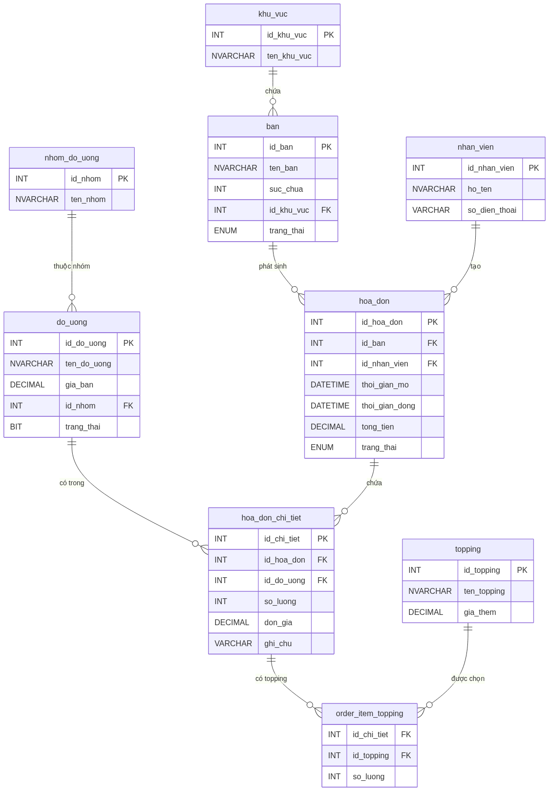

**HỌC VIỆN CÔNG NGHỆ BƯU CHÍNH VIỄN THÔNG**

**KHOA CÔNG NGHỆ THÔNG TIN 1**

**BÁO CÁO BÀI TẬP LỚN**

**MÔN: NHẬP MÔN CÔNG NGHỆ PHẦN MỀM**

**Đề tài: Khảo Sát, Phân Tích Và Thiết Kế**

**Hệ Thống Quản Lý Quán Café**

**Nhóm học phần:**

**Nhóm bài tập lớn:**

**Giảng viên: Ths. Mai Ngọc Lương**

*Hà Nội, Tháng 04/2026*

[[PAGEBREAK]]
