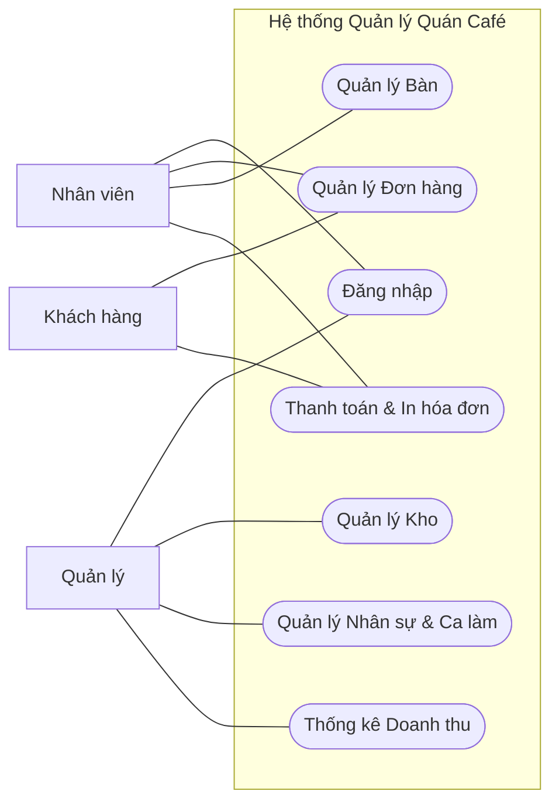

```mermaid
graph LR
subgraph "Hệ thống Quản lý Quán Café"
UC1([Đăng nhập])
UC2([Quản lý Đơn hàng])
UC3([Quản lý Bàn])
UC4([Thanh toán & In hóa đơn])
UC5([Quản lý Kho])
UC6([Quản lý Nhân sự & Ca làm])
UC7([Thống kê Doanh thu])
end
M[Quản lý] --- UC1 & UC5 & UC6 & UC7
E[Nhân viên] --- UC1 & UC2 & UC3 & UC4
C[Khách hàng] --- UC2 & UC4

```
